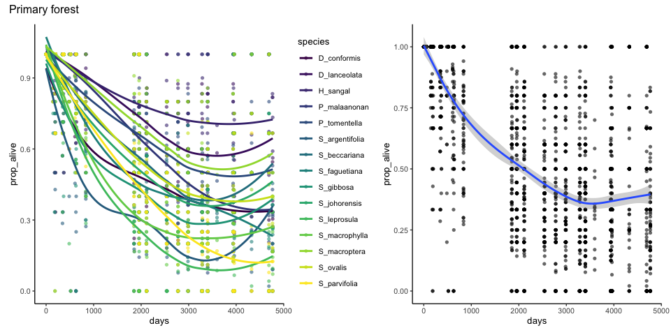
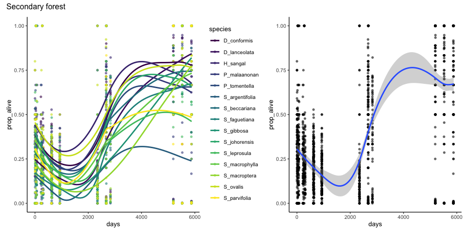
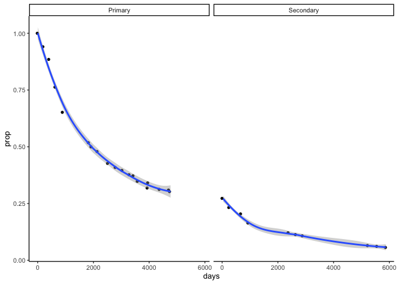
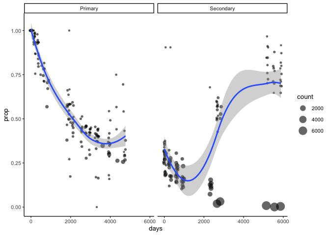
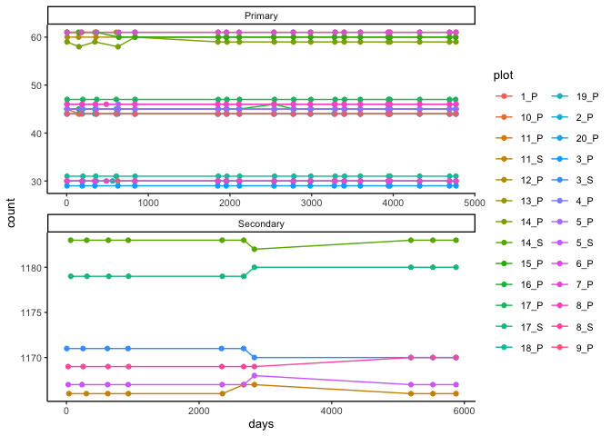
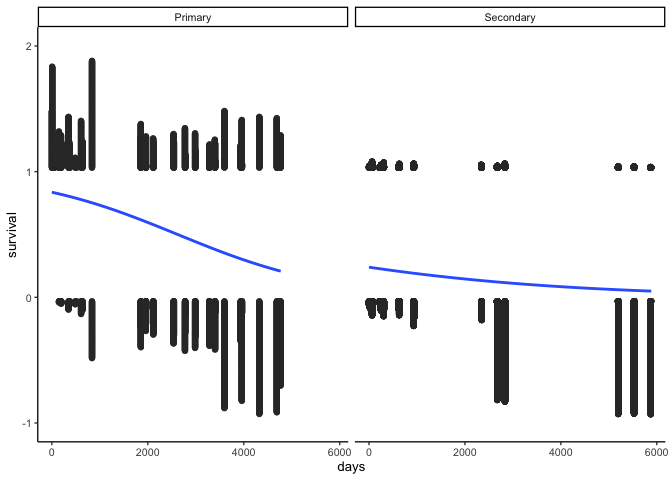
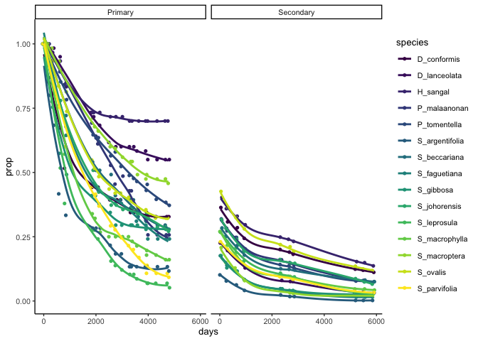
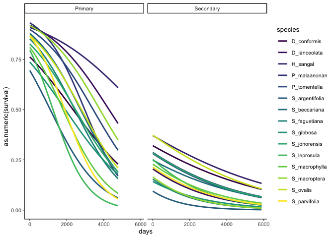
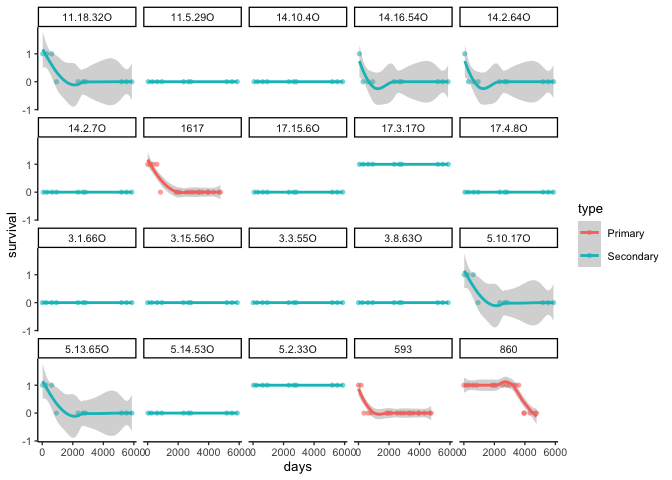

# Plotting survival
eleanorjackson
2024-07-08

Andy: *We discussed growth the other day but we need to do the mortality
analysis alongside as one informs the other.*

*I said I did not think a repeated measures binary GLMM was possible but
I did a web search and in principle it should be. We need to look back
at the issues Ryan met.*

*In both cases brms may help (and can be run in basic form with lmer
code so no more work)*

*Again, simple graphs may be a good way to start for survival over time
for the different species in the two forest types*

*We are interested in:*

- *Sp diffs*
- *Forest diffs*
- *Any interactions (species preferences for one forest type)*

I’m going to try plotting some survival curves using Ryan’s clean data.

``` r
library("tidyverse")
library("here")
library("patchwork")
library("janitor")
library("lubridate")
library("brms")
```

``` r
ryan_data <-
  read_csv(
  here::here("docs", 
             "r-veryard", 
             "data", 
             "combined_sbe_danum_data.csv")
  ) %>% 
  clean_names() 
```

    Rows: 87478 Columns: 29
    ── Column specification ────────────────────────────────────────────────────────
    Delimiter: ","
    chr   (6): type, plot, tree_id, species, missing, cohort
    dbl  (22): census, survival, log_diam_mean, log_dbh_mean, canopy_open_percen...
    date  (1): survey_date

    ℹ Use `spec()` to retrieve the full column specification for this data.
    ℹ Specify the column types or set `show_col_types = FALSE` to quiet this message.

``` r
glimpse(ryan_data)
```

    Rows: 87,478
    Columns: 29
    $ type                    <chr> "Secondary", "Secondary", "Secondary", "Second…
    $ plot                    <chr> "3_S", "3_S", "3_S", "3_S", "3_S", "3_S", "3_S…
    $ tree_id                 <chr> "3.1.1O", "3.1.1O", "3.1.1O", "3.1.1O", "3.1.1…
    $ species                 <chr> "D_lanceolata", "D_lanceolata", "D_lanceolata"…
    $ census                  <dbl> 1, 2, 3, 4, 5, 6, 7, 8, 9, 10, 1, 2, 3, 4, 5, …
    $ survey_date             <date> 2004-01-29, 2004-09-30, 2005-10-01, 2006-08-0…
    $ survival                <dbl> 0, 0, 0, 0, 0, 0, 0, 0, 0, 0, 0, 0, 0, 0, 0, 0…
    $ log_diam_mean           <dbl> NA, NA, NA, NA, NA, NA, NA, NA, NA, NA, NA, NA…
    $ log_dbh_mean            <dbl> NA, NA, NA, NA, NA, NA, NA, NA, NA, NA, NA, NA…
    $ canopy_open_percent     <dbl> NA, NA, NA, NA, NA, NA, NA, NA, NA, NA, NA, NA…
    $ dbh_mean                <dbl> NA, NA, NA, NA, NA, NA, NA, NA, NA, NA, NA, NA…
    $ diam_mean               <dbl> NA, NA, NA, NA, NA, NA, NA, NA, NA, NA, NA, NA…
    $ diam_1                  <dbl> NA, NA, NA, NA, NA, NA, NA, NA, NA, NA, NA, NA…
    $ diam_2                  <dbl> NA, NA, NA, NA, NA, NA, NA, NA, NA, NA, NA, NA…
    $ dbh_1                   <dbl> NA, NA, NA, NA, NA, NA, NA, NA, NA, NA, NA, NA…
    $ dbh_2                   <dbl> NA, NA, NA, NA, NA, NA, NA, NA, NA, NA, NA, NA…
    $ height_apex             <dbl> NA, NA, NA, NA, NA, NA, NA, NA, NA, NA, NA, NA…
    $ fifteen_n_per_mil       <dbl> NA, NA, NA, NA, NA, NA, NA, NA, NA, NA, 1.6530…
    $ total_p_mg_g            <dbl> NA, NA, NA, NA, NA, NA, NA, NA, NA, NA, 1.145,…
    $ leaf_thickness_mm_mean  <dbl> NA, NA, NA, NA, NA, NA, NA, NA, NA, NA, 0.2033…
    $ dry_weight_g_mean       <dbl> NA, NA, NA, NA, NA, NA, NA, NA, NA, NA, 0.5668…
    $ wd_b                    <dbl> NA, NA, NA, NA, NA, NA, NA, NA, NA, NA, 0.5655…
    $ sla_mm2_mg_mean         <dbl> NA, NA, NA, NA, NA, NA, NA, NA, NA, NA, 10.633…
    $ missing                 <chr> "N", "N", "N", "N", "N", "Y", "Y", "Y", "Y", "…
    $ years_since             <dbl> 0.0000000, 0.6707734, 1.6728268, 2.5270363, 6.…
    $ log_canopy_open_percent <dbl> NA, NA, NA, NA, NA, NA, NA, NA, NA, NA, NA, NA…
    $ cohort                  <chr> "Secondary_O", "Secondary_O", "Secondary_O", "…
    $ years_since_no0         <dbl> 0.2409309, 0.6707734, 1.6728268, 2.5270363, 6.…
    $ log_years_since_no0     <dbl> -1.4232452, -0.3993238, 0.5145149, 0.9270472, …

Creating a `days` variable - days since first survey, which will be
different for the primary and secondary forest types.

``` r
min_date_primary <-
  ryan_data %>% 
  filter(type == "Primary") %>% 
  summarise(min_date = min(survey_date)) %>% 
  pluck(1,1)

min_date_secondary <-
  ryan_data %>% 
  filter(type == "Secondary") %>% 
  summarise(min_date = min(survey_date)) %>% 
  pluck(1,1)

ryan_data <-
  ryan_data %>% 
  mutate(days =
    case_when(type == "Primary" ~ difftime(survey_date, min_date_primary),
              type == "Secondary" ~ difftime(survey_date, min_date_secondary))
    ) %>% 
  mutate(days = time_length(days, unit = "days"))
```

``` r
sp_survival_data <-
  ryan_data %>% 
  group_by(type, species, census, days) %>% 
  summarise(prop_alive = mean(survival, na.omit = TRUE),
            count = n())
```

    `summarise()` has grouped output by 'type', 'species', 'census'. You can
    override using the `.groups` argument.

## Plotting by species

``` r
sp_survival_data %>% 
  filter(type == "Primary") %>% 
  ggplot(aes(x = days, y = prop_alive, group = species,
             colour = species, fill = species)) +
  geom_point(alpha = 0.6, shape = 16) +
  geom_smooth(se = FALSE) +
  scale_colour_viridis_d() +
  scale_fill_viridis_d() +
  
  sp_survival_data %>% 
  filter(type == "Primary") %>% 
  ggplot(aes(x = days, y = prop_alive)) +
  geom_point(alpha = 0.6, shape = 16) +
  geom_smooth() +
  
  plot_annotation(title = "Primary forest")
```

    `geom_smooth()` using method = 'loess' and formula = 'y ~ x'
    `geom_smooth()` using method = 'gam' and formula = 'y ~ s(x, bs = "cs")'



``` r
sp_survival_data %>% 
  filter(type == "Secondary") %>% 
  ggplot(aes(x = days, y = prop_alive, group = species,
             colour = species, fill = species)) +
  geom_point(alpha = 0.6, shape = 16) +
  geom_smooth(se = FALSE) +
  scale_colour_viridis_d() +
  
  sp_survival_data %>% 
  filter(type == "Secondary") %>% 
  ggplot(aes(x = days, y = prop_alive)) +
  geom_point(alpha = 0.6, shape = 16) +
  geom_smooth() +
  
  plot_annotation(title = "Secondary forest")
```

    `geom_smooth()` using method = 'loess' and formula = 'y ~ x'
    `geom_smooth()` using method = 'gam' and formula = 'y ~ s(x, bs = "cs")'



Looks strange.. is this because I’m plotting by days? Try plotting by
census.

``` r
prop_type_census <-
  ryan_data %>% 
  group_by(type, census) %>% 
  summarise(prop = mean(survival, na.omit = TRUE),
            count = n(),
            days = mean(days))
```

    `summarise()` has grouped output by 'type'. You can override using the
    `.groups` argument.

``` r
prop_type_census %>% 
  ggplot(aes(x = days, y = prop)) +
  geom_jitter(shape = 16, width = 50) +
  geom_smooth() +
  facet_wrap(~type)
```

    `geom_smooth()` using method = 'loess' and formula = 'y ~ x'



This looks more like I expected.

Perhaps there sampling is uneven across days - `geom_smooth` isn’t
taking sample size into account.

Try plotting with size of points equal to number of observations.

``` r
prop_type_days <-
  ryan_data %>% 
  group_by(type, census, days) %>% 
  summarise(prop = mean(survival, na.omit = TRUE),
            count = n())
```

    `summarise()` has grouped output by 'type', 'census'. You can override using
    the `.groups` argument.

``` r
prop_type_days %>% 
  arrange(count) %>% 
  glimpse()
```

    Rows: 273
    Columns: 5
    Groups: type, census [29]
    $ type   <chr> "Primary", "Primary", "Primary", "Primary", "Primary", "Primary…
    $ census <dbl> 1, 1, 1, 1, 1, 1, 1, 1, 10, 4, 8, 12, 15, 1, 2, 2, 4, 7, 7, 18,…
    $ days   <dbl> 5, 6, 7, 42, 62, 41, 59, 60, 5881, 628, 2115, 3284, 3940, 40, 1…
    $ prop   <dbl> 1.0000000, 1.0000000, 1.0000000, 1.0000000, 1.0000000, 1.000000…
    $ count  <int> 1, 1, 2, 2, 2, 4, 4, 7, 12, 14, 14, 14, 14, 15, 15, 15, 15, 15,…

``` r
prop_type_days %>% 
  ggplot(aes(x = days, y = prop)) +
  geom_jitter(aes(size = count),
              alpha = 0.6, shape = 16, width = 50) +
  geom_smooth() +
  facet_wrap(~type)
```

    `geom_smooth()` using method = 'loess' and formula = 'y ~ x'



Ok, so for the secondary forest there are many days where few
measurements were taken.

The number of observations per plot should remain constant across each
census if dead individuals are recorded as NA.

``` r
ryan_data %>% 
  group_by(plot, census, type) %>% 
  summarise(count = n(), days = mean(days)) %>% 
  ggplot(aes(x = days, y = count, colour = plot)) +
  geom_point() +
  geom_path() +
  facet_wrap(~ type, scales = "free", ncol = 1) 
```

    `summarise()` has grouped output by 'plot', 'census'. You can override using
    the `.groups` argument.



At census seven in the secondary forest many plots gain or loose some
observations, seedlings added or lost?

Most of the primary forest plots remain stable.

Try plotting with a binomial `geom_smooth`.

``` r
p <- ggplot() +
  geom_smooth(data = ryan_data, aes(x = days, y = survival), 
              method = "glm", method.args = list(family = "binomial")) +
  facet_wrap(~type)

p +
  ggdist::geom_dots(data = ryan_data, 
                    aes(y = as.numeric(survival), x = days, 
                        side = ifelse(survival == 0, "bottom", "top")), 
                    color = "grey20", binwidth = 150, overflow = "compress", 
                    shape = 16, alpha = 0.6) 
```

    `geom_smooth()` using formula = 'y ~ x'



and per species plots again

``` r
prop_type_sp <-
  ryan_data %>% 
  group_by(type, census, species) %>% 
  summarise(prop = mean(survival, na.omit = TRUE),
            count = n(),
            days = mean(days))
```

    `summarise()` has grouped output by 'type', 'census'. You can override using
    the `.groups` argument.

``` r
prop_type_sp %>% 
  ggplot(aes(x = days, y = prop, colour = species)) +
  geom_jitter(shape = 16, width = 50) +
  geom_smooth(se = FALSE) +
  facet_wrap(~type) +
  scale_colour_viridis_d() 
```

    `geom_smooth()` using method = 'loess' and formula = 'y ~ x'



``` r
ryan_data %>%  
  ggplot() +
  geom_smooth(aes(as.numeric(survival), x = days, colour = species), se = FALSE,
              method = "glm", method.args = list(family = "binomial")) +
  facet_wrap(~type) +
  scale_colour_viridis_d() 
```

    `geom_smooth()` using formula = 'y ~ x'



Try some plots at the individual tree level.

``` r
ryan_data %>% 
  group_by(tree_id) %>% 
  nest() %>% 
  ungroup() %>% 
  sample_n(20) %>% 
  unnest(cols = data) %>% 
  ggplot(aes(x = days, y = survival, colour = type)) +
  geom_point(alpha = 0.6, shape = 16) +
  geom_smooth() +
  facet_wrap(~tree_id) 
```

    `geom_smooth()` using method = 'loess' and formula = 'y ~ x'



There seem to be many seedlings in the secondary forest that are dead at
day zero.

If we had the planting date we could add a record at that date where all
seedlings were alive.

Could just adjust by removing seedlings dead at day zero, but would it
still be comparable to the primary forest seedlings?
