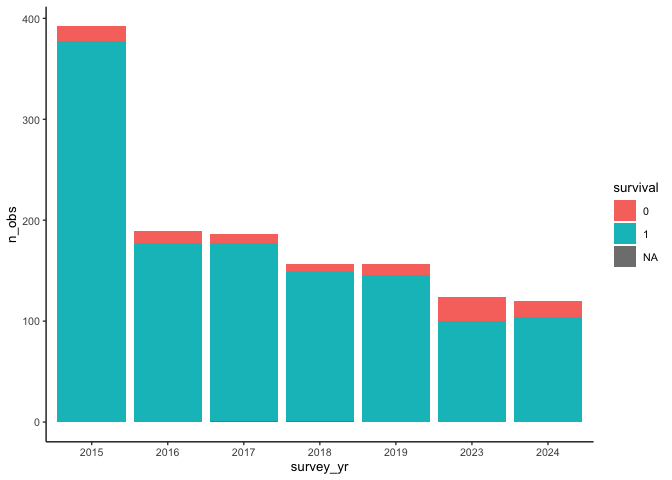

# Data, first look
eleanorjackson
2024-07-02

In this notebook I’m going to take a first look at the Danum Gaps data.
Currently we’ve got 3 versions of the data:

- some census-level excel files from Andy (which I think are raw data)
- the data published by Mikey [on
  Zenodo](https://zenodo.org/records/10701333) to accompany [his
  publication](https://doi.org/10.1038/s43247-024-01335-5)
- the cleaned data that Ryan used for his thesis [published on
  OSF](https://osf.io/cfb69/?view_only=812168fc288d4ffb89e7eec3dada01c1)

Do these data match up? Can we add newly collected data to Ryan’s
dataset?

``` r
library("tidyverse")
library("here")
library("patchwork")
library("janitor")
```

Reading in the `DanumGaps_Data_*` files from Andy. There are 8 files:
2015, 2015_plus, 2016, 2017, 2018, 2019, 2023 and 2024. Are these just
the “intensive” plots? We should be able to add to the 2024 data this
August.

``` r
file_names <-
  as.list(dir(path = here::here("data", "raw"),
              pattern = "DanumGaps_Data_*", 
              full.names = TRUE))

data_list <-
  lapply(X = file_names, 
         FUN = readxl::read_excel,
         range = readxl::cell_cols("A:K"),
         na = c("", "NA"),
         col_types = c("date", 
                       "text",
                       "text",
                       "text",
                       "text",
                       "numeric",
                       "numeric",
                       "numeric",
                       "numeric",
                       "numeric",
                       "text") )

names(data_list) <-
  lapply(file_names, basename)

andy_data <-
  bind_rows(data_list, .id = 'df') %>%
  clean_names() %>% 
  mutate(across(canopy:plant_no, as.factor))

rm(data_list)
```

``` r
glimpse(andy_data)
```

    Rows: 1,356
    Columns: 12
    $ df          <chr> "DanumGaps_Data_2015_plus.xlsx", "DanumGaps_Data_2015_plus…
    $ survey_date <dttm> 2015-09-15, 2015-09-15, 2015-09-15, 2015-09-15, 2015-09-1…
    $ canopy      <fct> U, U, U, U, U, U, U, G, G, G, G, G, G, G, G, G, G, G, G, U…
    $ block       <fct> 1, 1, 1, 1, 1, 1, 1, 1, 1, 1, 1, 1, 1, 1, 1, 1, 1, 1, 1, 2…
    $ subplot     <fct> A, A, A, A, A, A, A, A, A, A, A, A, A, A, A, A, A, A, A, A…
    $ plant_no    <fct> 7, 5, 2, 6, 15, 8, 23, 5, 17, 6, 13, 4, 14, 16, 1, 9, 19, …
    $ survival    <dbl> 1, 1, 1, 1, 1, 1, 1, 1, 0, 1, 1, 1, 1, 1, 1, 1, 1, 1, 1, 1…
    $ diam1       <dbl> 13.5, 20.7, 10.5, 19.5, 31.0, 28.9, 10.8, NA, NA, NA, NA, …
    $ diam2       <dbl> 11.9, 20.9, 9.7, 19.3, 29.4, 28.2, 10.8, 137.0, 79.0, 61.0…
    $ dbh_1       <dbl> NA, 12.6, NA, 17.6, 20.4, 17.6, 6.9, NA, NA, NA, NA, 10.1,…
    $ dbh_2       <dbl> NA, 14.0, NA, 17.3, 21.5, 18.3, 6.7, 112.0, 75.0, 51.0, 89…
    $ comments    <chr> NA, NA, NA, NA, NA, NA, NA, NA, "standing dead", NA, NA, N…

``` r
summary(andy_data)
```

          df             survey_date                     canopy       block    
     Length:1356        Min.   :2015-09-08 00:00:00.00   G:1325   16     :159  
     Class :character   1st Qu.:2015-09-11 00:00:00.00   U:  31   10     :117  
     Mode  :character   Median :2017-09-09 00:00:00.00            17     :113  
                        Mean   :2018-05-17 06:48:50.97            2      :112  
                        3rd Qu.:2019-09-09 00:00:00.00            5      :107  
                        Max.   :2024-05-06 00:00:00.00            1      : 98  
                                                                  (Other):650  
     subplot     plant_no      survival          diam1            diam2       
     A:1340   6      : 84   Min.   :0.0000   Min.   :  4.10   Min.   :  4.00  
     B:  16   8      : 84   1st Qu.:1.0000   1st Qu.: 19.20   1st Qu.: 17.00  
              19     : 78   Median :1.0000   Median : 29.30   Median : 26.20  
              13     : 74   Mean   :0.9291   Mean   : 44.59   Mean   : 35.95  
              5      : 71   3rd Qu.:1.0000   3rd Qu.: 46.10   3rd Qu.: 37.35  
              (Other):962   Max.   :1.0000   Max.   :351.00   Max.   :260.00  
              NA's   :  3   NA's   :2        NA's   :361      NA's   :673     
         dbh_1            dbh_2          comments        
     Min.   :  1.90   Min.   :  1.10   Length:1356       
     1st Qu.: 15.60   1st Qu.: 13.10   Class :character  
     Median : 27.40   Median : 20.70   Mode  :character  
     Mean   : 48.69   Mean   : 30.35                     
     3rd Qu.: 54.00   3rd Qu.: 33.00                     
     Max.   :443.00   Max.   :245.00                     
     NA's   :261      NA's   :711                        

``` r
andy_data %>% 
  mutate(survey_yr = as.ordered(readr::parse_number(df))) %>%
  filter(canopy == "G") %>% 
  mutate(survival = as.factor(survival)) %>% 
  group_by(survey_yr, survival) %>% 
  summarise(n_obs = n()) %>% 
  ggplot(aes(x = survey_yr, y = n_obs, fill = survival)) +
  geom_col() 
```

    `summarise()` has grouped output by 'survey_yr'. You can override using the
    `.groups` argument.



I think there were two rounds of censusing in 2015, which is why the
number of observations doubles.

Taking a look at the data from [Mikey on
Zenodo](https://doi.org/10.5281/zenodo.10701333). I don’t think this is
all the data that’s been collected but may allow us to link plant ID’s
to species.

``` r
read_tsv(
  here::here("data", "raw", "download_zenodo", "DataGrowthSurvivalClean.txt")
  ) %>% 
  clean_names() -> mikey_data
```

    Rows: 28150 Columns: 34
    ── Column specification ────────────────────────────────────────────────────────
    Delimiter: "\t"
    chr (10): pid, Survey.date, Canopy, Subplot, Genus, Species, Sp, rain, treat...
    dbl (24): Block, Day, Year, Census, Plot, Subplot.no, Plant.id, Diam1, Diam2...

    ℹ Use `spec()` to retrieve the full column specification for this data.
    ℹ Specify the column types or set `show_col_types = FALSE` to quiet this message.

``` r
glimpse(mikey_data)
```

    Rows: 28,150
    Columns: 34
    $ block       <dbl> 1, 1, 1, 1, 1, 1, 1, 1, 1, 1, 1, 1, 1, 1, 1, 1, 1, 1, 1, 1…
    $ pid         <chr> "1U", "1U", "1U", "1U", "1U", "1U", "1U", "1U", "1U", "1U"…
    $ survey_date <chr> "7/11/2004", "17/05/2005", "18/10/2005", "27/07/2006", "20…
    $ day         <dbl> 38298, 38489, 38643, 38925, 39133, 40147, 40415, 40841, 41…
    $ year        <dbl> 2004, 2005, 2005, 2006, 2007, 2009, 2010, 2011, 2012, 2013…
    $ census      <dbl> 1, 2, 3, 4, 5, 6, 8, 9, 10, 11, 12, 13, 15, 19, 1, 2, 3, 4…
    $ canopy      <chr> "U", "U", "U", "U", "U", "U", "U", "U", "U", "U", "U", "U"…
    $ plot        <dbl> 1, 1, 1, 1, 1, 1, 1, 1, 1, 1, 1, 1, 1, 1, 1, 1, 1, 1, 1, 1…
    $ subplot     <chr> "A", "A", "A", "A", "A", "A", "A", "A", "A", "A", "A", "A"…
    $ subplot_no  <dbl> 1, 1, 1, 1, 1, 1, 1, 1, 1, 1, 1, 1, 1, 1, 1, 1, 1, 1, 1, 1…
    $ genus       <chr> "Dipterocarpus", "Dipterocarpus", "Dipterocarpus", "Dipter…
    $ species     <chr> "conformis", "conformis", "conformis", "conformis", "confo…
    $ sp          <chr> "Dip.con", "Dip.con", "Dip.con", "Dip.con", "Dip.con", "Di…
    $ plant_id    <dbl> 1, 1, 1, 1, 1, 1, 1, 1, 1, 1, 1, 1, 1, 1, 2, 2, 2, 2, 2, 2…
    $ diam1       <dbl> 3.50, 3.00, 3.92, 3.00, NA, NA, NA, NA, NA, NA, NA, NA, NA…
    $ diam2       <dbl> 3.50, 3.20, 3.54, 3.20, NA, NA, NA, NA, NA, NA, NA, NA, NA…
    $ dbh_1       <dbl> NA, NA, NA, NA, NA, NA, NA, NA, NA, NA, NA, NA, NA, NA, NA…
    $ dbh_2       <dbl> NA, NA, NA, NA, NA, NA, NA, NA, NA, NA, NA, NA, NA, NA, NA…
    $ height_apex <dbl> 29.0, 27.1, 29.0, NA, NA, NA, NA, NA, NA, NA, NA, NA, NA, …
    $ diam        <dbl> 1.252763, 1.131402, 1.316408, 1.131402, NA, NA, NA, NA, NA…
    $ dbh         <dbl> NA, NA, NA, NA, NA, NA, NA, NA, NA, NA, NA, NA, NA, NA, NA…
    $ light       <dbl> 6.75, 6.75, 6.75, 6.75, 6.75, 6.75, 6.75, 6.75, 6.75, 6.75…
    $ deficit     <dbl> -16.31935, -44.95484, -65.68710, -18.14516, -27.41290, -53…
    $ zero        <dbl> 14, 90, 83, 159, 117, 594, 132, 260, 145, 112, 150, 71, 24…
    $ dry         <dbl> 7, 10, 9, 7, 9, 13, 10, 6, 4, 11, 7, 9, 14, 9, 7, 10, 9, 7…
    $ excess      <dbl> 16.95806, 37.64516, 20.89677, 77.30968, 27.00000, 60.07097…
    $ sun         <dbl> NA, NA, NA, NA, NA, 5.224142, 5.571271, 4.709959, 4.622146…
    $ rain        <chr> "Wet", "Wet", "Dry", "Wet", "Wet", "Dry", "Drought", "Wet"…
    $ treat       <chr> "Everwet", "Everwet", "Everwet", "Everwet", "Everwet", "Ev…
    $ surv        <dbl> 1, 1, 1, 1, 0, NA, NA, NA, NA, NA, NA, NA, NA, NA, 1, 1, 1…
    $ rgr         <dbl> NA, -0.23207881, 0.43878887, -0.23962229, NA, NA, NA, NA, …
    $ elev        <dbl> 231.818, 231.818, 231.818, 231.818, 231.818, 231.818, 231.…
    $ slp         <dbl> 56.29514, 56.29514, 56.29514, 56.29514, 56.29514, 56.29514…
    $ topo        <chr> "Lowland", "Lowland", "Lowland", "Lowland", "Lowland", "Lo…

So, this data spans 2004 - 2017, and perhaps it includes more of the
plots?

``` r
n_distinct(mikey_data$plant_id)
```

    [1] 2000

``` r
n_distinct(andy_data$plant_no)
```

    [1] 36

Yep ok, Mikey’s data includes observations from 2,000 seedlings and
Andy’s data covers 36 seedlings. Is that right? Doesn’t seem like many.

Let’s check out the `plant_id` and `plant_no` variables to see if they
are actually unique plant IDs or not.

``` r
mikey_data %>% 
  group_by(block, canopy, plot, subplot,
           genus, species) %>% 
  summarise(n()) %>% 
  glimpse()
```

    `summarise()` has grouped output by 'block', 'canopy', 'plot', 'subplot',
    'genus'. You can override using the `.groups` argument.

    Rows: 1,932
    Columns: 7
    Groups: block, canopy, plot, subplot, genus [479]
    $ block   <dbl> 1, 1, 1, 1, 1, 1, 1, 1, 1, 1, 1, 1, 1, 1, 1, 1, 1, 1, 1, 1, 1,…
    $ canopy  <chr> "G", "G", "G", "G", "G", "G", "G", "G", "G", "G", "G", "G", "G…
    $ plot    <dbl> 2, 2, 2, 2, 2, 2, 2, 2, 2, 2, 2, 2, 2, 2, 2, 2, 2, 2, 2, 2, 2,…
    $ subplot <chr> "A", "A", "A", "A", "A", "A", "A", "A", "A", "A", "A", "A", "A…
    $ genus   <chr> "Dipterocarpus", "Drybalanops", "Drybalanops", "Durian", "Hope…
    $ species <chr> "conformis", "beccarii", "lanceolata", "graveolens", "sangal",…
    $ `n()`   <int> 16, 16, 16, 16, 16, 16, 16, 16, 16, 16, 16, 16, 16, 16, 16, 16…

There are 1,932 unique seedlings when using block-canopy-plot-subplot as
a unique identifier.

``` r
mikey_data %>% 
  group_by(block, canopy, plot, subplot,
           genus, species, plant_id) %>% 
  summarise(n(), .groups = "drop") %>% 
  count()
```

    # A tibble: 1 × 1
          n
      <int>
    1  2017

``` r
n_distinct(mikey_data$plant_id)
```

    [1] 2000

`plant_id` is supposed to be a unique ID for individual seedlings. When
we include `plant_id` in our block-canopy-plot-subplot ID we get 2,017
counts, although there are 2,000 distinct `plant_id` values.. :thinking:

I think the subplots might have different species abundances. They
should have 25 seedlings each, but could be one of 26 different species.

``` r
mikey_data %>% 
  group_by(block, canopy, plot, subplot) %>% 
  summarise(n_sp = n_distinct(species), 
            .groups = "drop") %>% 
  count(n_sp, name = "n_subplots")
```

    # A tibble: 4 × 2
       n_sp n_subplots
      <int>      <int>
    1    22          3
    2    23         16
    3    24         27
    4    25         34

Yep, this lines up!

Now taking a look at Andy’s data. We are missing the `plot` variable
that’s in Mikey’s data.

``` r
andy_data %>% 
  group_by(block, canopy, subplot,
           plant_no) %>% 
  summarise(n()) %>% 
  glimpse()
```

    `summarise()` has grouped output by 'block', 'canopy', 'subplot'. You can
    override using the `.groups` argument.

    Rows: 284
    Columns: 5
    Groups: block, canopy, subplot [22]
    $ block    <fct> 1, 1, 1, 1, 1, 1, 1, 1, 1, 1, 1, 1, 1, 1, 1, 1, 1, 1, 1, 1, 1…
    $ canopy   <fct> G, G, G, G, G, G, G, G, G, G, G, G, G, U, U, U, U, U, U, U, G…
    $ subplot  <fct> A, A, A, A, A, A, A, A, A, A, A, A, A, A, A, A, A, A, A, A, A…
    $ plant_no <fct> 1, 13, 14, 16, 17, 19, 2, 4, 5, 6, 8, 9, NA, 15, 2, 23, 5, 6,…
    $ `n()`    <int> 8, 8, 8, 8, 3, 8, 8, 8, 8, 8, 5, 8, 3, 1, 1, 1, 1, 1, 1, 1, 6…

I think that in this data `plant_no` is only unique at the subplot
level. There is a max of 8 observations per row, which makes sense - one
for each round of censusing. There are 284 unique rows which sounds like
a more sensible number of seedlings. But what species are they?

There is also the cleaned data that Ryan has made [available on
OSF](http://bit.ly/3TKgKOo).

``` r
read_csv(
  here::here("docs", 
             "r-veryard", 
             "data", 
             "combined_sbe_danum_data.csv")
  ) %>% 
  clean_names() -> ryan_data
```

    Rows: 87478 Columns: 29
    ── Column specification ────────────────────────────────────────────────────────
    Delimiter: ","
    chr   (6): type, plot, tree_id, species, missing, cohort
    dbl  (22): census, survival, log_diam_mean, log_dbh_mean, canopy_open_percen...
    date  (1): survey_date

    ℹ Use `spec()` to retrieve the full column specification for this data.
    ℹ Specify the column types or set `show_col_types = FALSE` to quiet this message.

``` r
glimpse(ryan_data)
```

    Rows: 87,478
    Columns: 29
    $ type                    <chr> "Secondary", "Secondary", "Secondary", "Second…
    $ plot                    <chr> "3_S", "3_S", "3_S", "3_S", "3_S", "3_S", "3_S…
    $ tree_id                 <chr> "3.1.1O", "3.1.1O", "3.1.1O", "3.1.1O", "3.1.1…
    $ species                 <chr> "D_lanceolata", "D_lanceolata", "D_lanceolata"…
    $ census                  <dbl> 1, 2, 3, 4, 5, 6, 7, 8, 9, 10, 1, 2, 3, 4, 5, …
    $ survey_date             <date> 2004-01-29, 2004-09-30, 2005-10-01, 2006-08-0…
    $ survival                <dbl> 0, 0, 0, 0, 0, 0, 0, 0, 0, 0, 0, 0, 0, 0, 0, 0…
    $ log_diam_mean           <dbl> NA, NA, NA, NA, NA, NA, NA, NA, NA, NA, NA, NA…
    $ log_dbh_mean            <dbl> NA, NA, NA, NA, NA, NA, NA, NA, NA, NA, NA, NA…
    $ canopy_open_percent     <dbl> NA, NA, NA, NA, NA, NA, NA, NA, NA, NA, NA, NA…
    $ dbh_mean                <dbl> NA, NA, NA, NA, NA, NA, NA, NA, NA, NA, NA, NA…
    $ diam_mean               <dbl> NA, NA, NA, NA, NA, NA, NA, NA, NA, NA, NA, NA…
    $ diam_1                  <dbl> NA, NA, NA, NA, NA, NA, NA, NA, NA, NA, NA, NA…
    $ diam_2                  <dbl> NA, NA, NA, NA, NA, NA, NA, NA, NA, NA, NA, NA…
    $ dbh_1                   <dbl> NA, NA, NA, NA, NA, NA, NA, NA, NA, NA, NA, NA…
    $ dbh_2                   <dbl> NA, NA, NA, NA, NA, NA, NA, NA, NA, NA, NA, NA…
    $ height_apex             <dbl> NA, NA, NA, NA, NA, NA, NA, NA, NA, NA, NA, NA…
    $ fifteen_n_per_mil       <dbl> NA, NA, NA, NA, NA, NA, NA, NA, NA, NA, 1.6530…
    $ total_p_mg_g            <dbl> NA, NA, NA, NA, NA, NA, NA, NA, NA, NA, 1.145,…
    $ leaf_thickness_mm_mean  <dbl> NA, NA, NA, NA, NA, NA, NA, NA, NA, NA, 0.2033…
    $ dry_weight_g_mean       <dbl> NA, NA, NA, NA, NA, NA, NA, NA, NA, NA, 0.5668…
    $ wd_b                    <dbl> NA, NA, NA, NA, NA, NA, NA, NA, NA, NA, 0.5655…
    $ sla_mm2_mg_mean         <dbl> NA, NA, NA, NA, NA, NA, NA, NA, NA, NA, 10.633…
    $ missing                 <chr> "N", "N", "N", "N", "N", "Y", "Y", "Y", "Y", "…
    $ years_since             <dbl> 0.0000000, 0.6707734, 1.6728268, 2.5270363, 6.…
    $ log_canopy_open_percent <dbl> NA, NA, NA, NA, NA, NA, NA, NA, NA, NA, NA, NA…
    $ cohort                  <chr> "Secondary_O", "Secondary_O", "Secondary_O", "…
    $ years_since_no0         <dbl> 0.2409309, 0.6707734, 1.6728268, 2.5270363, 6.…
    $ log_years_since_no0     <dbl> -1.4232452, -0.3993238, 0.5145149, 0.9270472, …

Here it looks like `tree_id` is a combination of `plot`, `cohort` and
perhaps a subplot level plant ID?

I’m just interested in the Danum plots at the moment.

``` r
ryan_data %>% 
  filter(type == "Primary") -> ryan_data_danum

n_distinct(ryan_data_danum$tree_id) 
```

    [1] 910

``` r
ryan_data_danum %>% 
  mutate(year = year(survey_date)) %>% 
  group_by(year) %>% 
  summarise(n())
```

    # A tibble: 13 × 2
        year `n()`
       <dbl> <int>
     1  2004   890
     2  2005  1816
     3  2006   900
     4  2007   902
     5  2009   901
     6  2010  1802
     7  2011   902
     8  2012   901
     9  2013  1802
    10  2014  1802
    11  2015  1802
    12  2016   901
    13  2017  1802

Ryan’s data covers 2004 to 2017 - that’s the same time span as Mikey’s
data. 2005, 2010, 2013, 2014, 2015 and 2017 have approx double the
number of observations, were two censuses done in those years?

I think we are going to need the raw data and scripts that Ryan used to
create his `combined_sbe_danum_data.csv` file.
