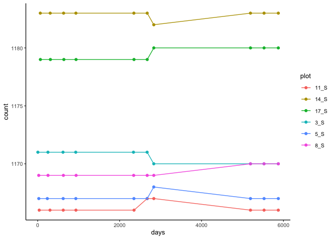
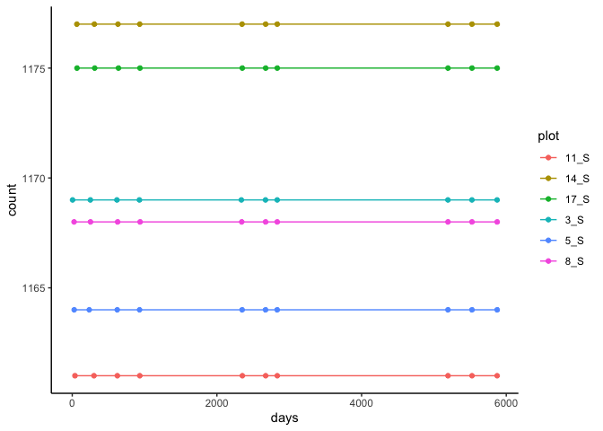

# QC of Ryan’s data
Francisco Navarro Rosales
2024-07-10

In [2024-06-04_plotting-survival.md](2024-06-04_plotting-survival.md) we
noticed that the number of observations per plot didn’t remain constant
across each census in the secondary forest.

This is a further investigation!

``` r
library("tidyverse")
library("here")
library("janitor")
library("lubridate")
```

Upload data

``` r
ryan_data <-
  read_csv(
  here::here("docs", 
             "r-veryard", 
             "data", 
             "combined_sbe_danum_data.csv")
  ) %>% 
  clean_names() 
```

    Rows: 87478 Columns: 29
    ── Column specification ────────────────────────────────────────────────────────
    Delimiter: ","
    chr   (6): type, plot, tree_id, species, missing, cohort
    dbl  (22): census, survival, log_diam_mean, log_dbh_mean, canopy_open_percen...
    date  (1): survey_date

    ℹ Use `spec()` to retrieve the full column specification for this data.
    ℹ Specify the column types or set `show_col_types = FALSE` to quiet this message.

``` r
glimpse(ryan_data)
```

    Rows: 87,478
    Columns: 29
    $ type                    <chr> "Secondary", "Secondary", "Secondary", "Second…
    $ plot                    <chr> "3_S", "3_S", "3_S", "3_S", "3_S", "3_S", "3_S…
    $ tree_id                 <chr> "3.1.1O", "3.1.1O", "3.1.1O", "3.1.1O", "3.1.1…
    $ species                 <chr> "D_lanceolata", "D_lanceolata", "D_lanceolata"…
    $ census                  <dbl> 1, 2, 3, 4, 5, 6, 7, 8, 9, 10, 1, 2, 3, 4, 5, …
    $ survey_date             <date> 2004-01-29, 2004-09-30, 2005-10-01, 2006-08-0…
    $ survival                <dbl> 0, 0, 0, 0, 0, 0, 0, 0, 0, 0, 0, 0, 0, 0, 0, 0…
    $ log_diam_mean           <dbl> NA, NA, NA, NA, NA, NA, NA, NA, NA, NA, NA, NA…
    $ log_dbh_mean            <dbl> NA, NA, NA, NA, NA, NA, NA, NA, NA, NA, NA, NA…
    $ canopy_open_percent     <dbl> NA, NA, NA, NA, NA, NA, NA, NA, NA, NA, NA, NA…
    $ dbh_mean                <dbl> NA, NA, NA, NA, NA, NA, NA, NA, NA, NA, NA, NA…
    $ diam_mean               <dbl> NA, NA, NA, NA, NA, NA, NA, NA, NA, NA, NA, NA…
    $ diam_1                  <dbl> NA, NA, NA, NA, NA, NA, NA, NA, NA, NA, NA, NA…
    $ diam_2                  <dbl> NA, NA, NA, NA, NA, NA, NA, NA, NA, NA, NA, NA…
    $ dbh_1                   <dbl> NA, NA, NA, NA, NA, NA, NA, NA, NA, NA, NA, NA…
    $ dbh_2                   <dbl> NA, NA, NA, NA, NA, NA, NA, NA, NA, NA, NA, NA…
    $ height_apex             <dbl> NA, NA, NA, NA, NA, NA, NA, NA, NA, NA, NA, NA…
    $ fifteen_n_per_mil       <dbl> NA, NA, NA, NA, NA, NA, NA, NA, NA, NA, 1.6530…
    $ total_p_mg_g            <dbl> NA, NA, NA, NA, NA, NA, NA, NA, NA, NA, 1.145,…
    $ leaf_thickness_mm_mean  <dbl> NA, NA, NA, NA, NA, NA, NA, NA, NA, NA, 0.2033…
    $ dry_weight_g_mean       <dbl> NA, NA, NA, NA, NA, NA, NA, NA, NA, NA, 0.5668…
    $ wd_b                    <dbl> NA, NA, NA, NA, NA, NA, NA, NA, NA, NA, 0.5655…
    $ sla_mm2_mg_mean         <dbl> NA, NA, NA, NA, NA, NA, NA, NA, NA, NA, 10.633…
    $ missing                 <chr> "N", "N", "N", "N", "N", "Y", "Y", "Y", "Y", "…
    $ years_since             <dbl> 0.0000000, 0.6707734, 1.6728268, 2.5270363, 6.…
    $ log_canopy_open_percent <dbl> NA, NA, NA, NA, NA, NA, NA, NA, NA, NA, NA, NA…
    $ cohort                  <chr> "Secondary_O", "Secondary_O", "Secondary_O", "…
    $ years_since_no0         <dbl> 0.2409309, 0.6707734, 1.6728268, 2.5270363, 6.…
    $ log_years_since_no0     <dbl> -1.4232452, -0.3993238, 0.5145149, 0.9270472, …

Creating a `days` variable - days since first survey

``` r
min_date_primary <-
  ryan_data %>% 
  filter(type == "Primary") %>% 
  summarise(min_date = min(survey_date)) %>% 
  pluck(1,1)

min_date_secondary <-
  ryan_data %>% 
  filter(type == "Secondary") %>% 
  summarise(min_date = min(survey_date)) %>% 
  pluck(1,1)

ryan_data <-
  ryan_data %>% 
  mutate(days =
    case_when(type == "Primary" ~ difftime(survey_date, min_date_primary),
              type == "Secondary" ~ difftime(survey_date, min_date_secondary))
    ) %>% 
  mutate(days = time_length(days, unit = "days"))
```

Filter for secondary forest type (SBE)

``` r
data_secondary <- filter(ryan_data, type =="Secondary")
```

Plot record abundance across time

``` r
data_secondary %>% 
  group_by(plot, census) %>% 
  summarise(count = n(), days = mean(days)) %>% 
  ggplot(aes(x = days, y = count, colour = plot)) +
  geom_point() +
  geom_path() 
```

    `summarise()` has grouped output by 'plot'. You can override using the
    `.groups` argument.



WEIRD: Lets flag issues

``` r
# Step A: Select tree_ids with multiple plot values
tree_id_multiple_plots <- data_secondary %>%
  group_by(tree_id) %>%
  summarize(n_plots = n_distinct(plot)) %>%
  filter(n_plots > 1) %>%
  mutate(has_multiple_plots = "Yes")

# Step B: Select tree_ids with multiple species values
tree_id_multiple_species <- data_secondary %>%
  group_by(tree_id) %>%
  summarize(n_species = n_distinct(species)) %>%
  filter(n_species > 1) %>%
  mutate(has_multiple_species = "Yes")

# Step C: Select tree_ids containing 'QO' or 'NAO'
tree_id_with_QO_NAO <- data_secondary %>%
  filter(str_detect(tree_id, "QO|NAO")) %>%
  distinct() %>%
  mutate(has_QO_NAO = "Yes") %>%
  select(tree_id, has_QO_NAO)

# Combine into a final summary dataset
tree_id_summary <- full_join(tree_id_multiple_plots, tree_id_multiple_species, by = "tree_id") %>%
  full_join(tree_id_with_QO_NAO, by = "tree_id") %>%
  mutate(
    has_multiple_plots = ifelse(is.na(has_multiple_plots), "No", has_multiple_plots),
    has_multiple_species = ifelse(is.na(has_multiple_species), "No", has_multiple_species),
    has_QO_NAO = ifelse(is.na(has_QO_NAO), "No", has_QO_NAO)
  ) %>%
  select(tree_id, has_multiple_plots, has_multiple_species, has_QO_NAO)

# Remove these tree_ids from the original data_secondary dataset
data_secondary_filtered <- data_secondary %>%
  anti_join(tree_id_summary, by = "tree_id")

# Plot this filtered dataset, issues are removed
data_secondary_filtered %>% 
  group_by(plot, census) %>% 
  summarise(count = n(), 
            days = mean(days))%>% 
  ggplot(aes(x = days, y = count, colour = plot)) +
  geom_point() + geom_path() + theme_classic()
```

    `summarise()` has grouped output by 'plot'. You can override using the
    `.groups` argument.


