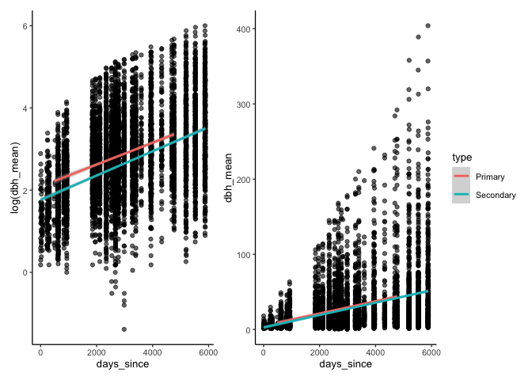
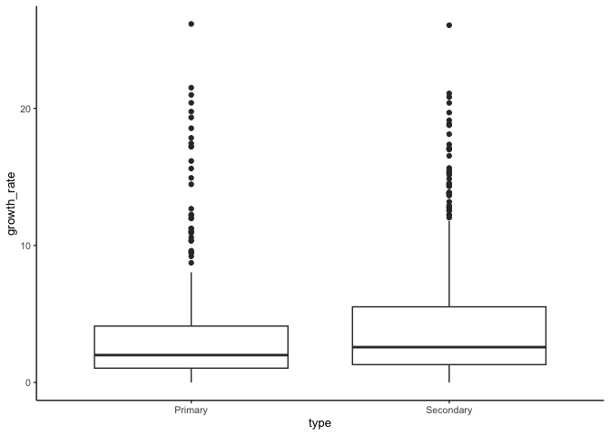
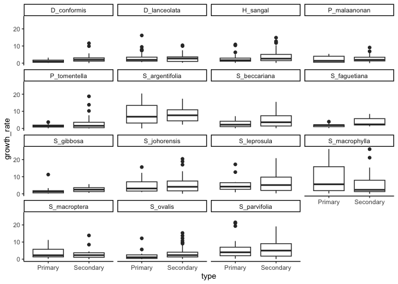
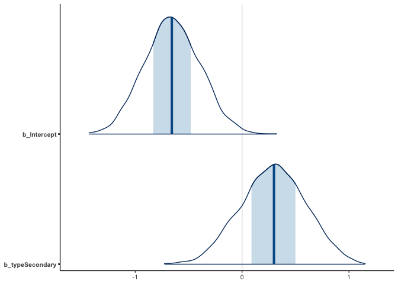
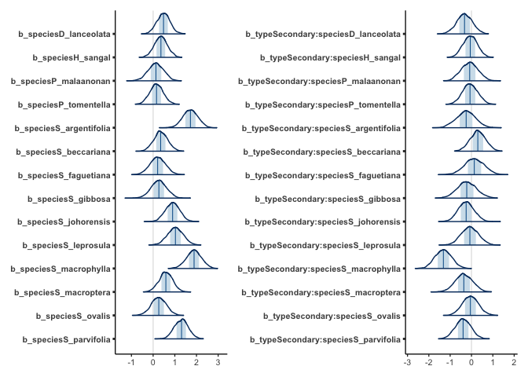

# Modelling growth
eleanorjackson
2024-07-26

Whilst I’m waiting for the raw data, I thought I’d try fitting a few
models to Ryan’s cleaned data.

``` r
library("tidyverse")
library("here")
library("patchwork")
library("janitor")
library("lubridate")
library("brms")
```

``` r
read_csv(
  here::here("docs", 
             "r-veryard", 
             "data", 
             "combined_sbe_danum_data.csv")
  ) %>% 
  clean_names() -> ryan_data
```

    Rows: 87478 Columns: 29
    ── Column specification ────────────────────────────────────────────────────────
    Delimiter: ","
    chr   (6): type, plot, tree_id, species, missing, cohort
    dbl  (22): census, survival, log_diam_mean, log_dbh_mean, canopy_open_percen...
    date  (1): survey_date

    ℹ Use `spec()` to retrieve the full column specification for this data.
    ℹ Specify the column types or set `show_col_types = FALSE` to quiet this message.

``` r
glimpse(ryan_data)
```

    Rows: 87,478
    Columns: 29
    $ type                    <chr> "Secondary", "Secondary", "Secondary", "Second…
    $ plot                    <chr> "3_S", "3_S", "3_S", "3_S", "3_S", "3_S", "3_S…
    $ tree_id                 <chr> "3.1.1O", "3.1.1O", "3.1.1O", "3.1.1O", "3.1.1…
    $ species                 <chr> "D_lanceolata", "D_lanceolata", "D_lanceolata"…
    $ census                  <dbl> 1, 2, 3, 4, 5, 6, 7, 8, 9, 10, 1, 2, 3, 4, 5, …
    $ survey_date             <date> 2004-01-29, 2004-09-30, 2005-10-01, 2006-08-0…
    $ survival                <dbl> 0, 0, 0, 0, 0, 0, 0, 0, 0, 0, 0, 0, 0, 0, 0, 0…
    $ log_diam_mean           <dbl> NA, NA, NA, NA, NA, NA, NA, NA, NA, NA, NA, NA…
    $ log_dbh_mean            <dbl> NA, NA, NA, NA, NA, NA, NA, NA, NA, NA, NA, NA…
    $ canopy_open_percent     <dbl> NA, NA, NA, NA, NA, NA, NA, NA, NA, NA, NA, NA…
    $ dbh_mean                <dbl> NA, NA, NA, NA, NA, NA, NA, NA, NA, NA, NA, NA…
    $ diam_mean               <dbl> NA, NA, NA, NA, NA, NA, NA, NA, NA, NA, NA, NA…
    $ diam_1                  <dbl> NA, NA, NA, NA, NA, NA, NA, NA, NA, NA, NA, NA…
    $ diam_2                  <dbl> NA, NA, NA, NA, NA, NA, NA, NA, NA, NA, NA, NA…
    $ dbh_1                   <dbl> NA, NA, NA, NA, NA, NA, NA, NA, NA, NA, NA, NA…
    $ dbh_2                   <dbl> NA, NA, NA, NA, NA, NA, NA, NA, NA, NA, NA, NA…
    $ height_apex             <dbl> NA, NA, NA, NA, NA, NA, NA, NA, NA, NA, NA, NA…
    $ fifteen_n_per_mil       <dbl> NA, NA, NA, NA, NA, NA, NA, NA, NA, NA, 1.6530…
    $ total_p_mg_g            <dbl> NA, NA, NA, NA, NA, NA, NA, NA, NA, NA, 1.145,…
    $ leaf_thickness_mm_mean  <dbl> NA, NA, NA, NA, NA, NA, NA, NA, NA, NA, 0.2033…
    $ dry_weight_g_mean       <dbl> NA, NA, NA, NA, NA, NA, NA, NA, NA, NA, 0.5668…
    $ wd_b                    <dbl> NA, NA, NA, NA, NA, NA, NA, NA, NA, NA, 0.5655…
    $ sla_mm2_mg_mean         <dbl> NA, NA, NA, NA, NA, NA, NA, NA, NA, NA, 10.633…
    $ missing                 <chr> "N", "N", "N", "N", "N", "Y", "Y", "Y", "Y", "…
    $ years_since             <dbl> 0.0000000, 0.6707734, 1.6728268, 2.5270363, 6.…
    $ log_canopy_open_percent <dbl> NA, NA, NA, NA, NA, NA, NA, NA, NA, NA, NA, NA…
    $ cohort                  <chr> "Secondary_O", "Secondary_O", "Secondary_O", "…
    $ years_since_no0         <dbl> 0.2409309, 0.6707734, 1.6728268, 2.5270363, 6.…
    $ log_years_since_no0     <dbl> -1.4232452, -0.3993238, 0.5145149, 0.9270472, …

Let’s create a days-since-start variable. I’m not sure when the first
measurements were taken, at the same time as planting out in the field,
or in the first survey weeks/months later?

Maybe it would be good to have the germination dates for each
individual, then we could model by age - might allow us to tease out or
account for the differences induced by different planting dates.

``` r
min_date_primary <-
  ryan_data %>% 
  filter(type == "Primary") %>% 
  summarise(min_date = min(survey_date)) %>% 
  pluck(1,1)

min_date_secondary <-
  ryan_data %>% 
  filter(type == "Secondary") %>% 
  summarise(min_date = min(survey_date)) %>% 
  pluck(1,1)

ryan_data <-
  ryan_data %>% 
  mutate(days_since =
    case_when(type == "Primary" ~ difftime(survey_date, min_date_primary),
              type == "Secondary" ~ difftime(survey_date, min_date_secondary))
    ) %>% 
  mutate(days_since = time_length(days_since, unit = "days"))
```

``` r
ryan_data %>% 
  ggplot(aes(x = days_since, y = log(dbh_mean))) +
  geom_point(alpha = 0.6) +
  geom_smooth(aes(colour = type),
              method = "glm", method.args = list(family = "gaussian")) +
  
  ryan_data %>% 
  ggplot(aes(x = days_since, y = dbh_mean)) +
  geom_point(alpha = 0.6) +
  geom_smooth(aes(colour = type),
              method = "glm", method.args = list(family = "gaussian")) +
  
  patchwork::plot_layout(guides = "collect")
```

    `geom_smooth()` using formula = 'y ~ x'

    Warning: Removed 81675 rows containing non-finite outside the scale range
    (`stat_smooth()`).

    Warning: Removed 81675 rows containing missing values or values outside the scale range
    (`geom_point()`).

    `geom_smooth()` using formula = 'y ~ x'

    Warning: Removed 81675 rows containing non-finite outside the scale range
    (`stat_smooth()`).
    Removed 81675 rows containing missing values or values outside the scale range
    (`geom_point()`).



I had a quick look at some other papers that model tree growth and it
seems that many of them just model rate of growth.

Let’s try modelling tree growth rate (in mm per year)?

Growth rate =

DBH at time 1 - DBH at time 2 / (difference in days / 365.25)

``` r
first <- 
  ryan_data %>% 
  drop_na(dbh_mean) %>% 
  group_by(type, plot, tree_id, species) %>% 
  slice_min(days_since, n = 1) %>% 
  ungroup()

last <- 
  ryan_data %>% 
  drop_na(dbh_mean) %>% 
  group_by(type, plot, tree_id, species) %>% 
  slice_max(days_since, n = 1) %>% 
  ungroup()

growth_data <- 
  bind_rows(first, last) %>% 
  group_by(type, plot, tree_id, species) %>% 
  summarise(growth = max(dbh_mean) - min(dbh_mean),
            time = max(days_since) - min(days_since)) %>% 
  mutate(growth_rate = growth / (time / 365.25) ) %>% 
  drop_na(growth_rate)
```

    `summarise()` has grouped output by 'type', 'plot', 'tree_id'. You can override
    using the `.groups` argument.

``` r
growth_data %>% 
  ggplot(aes(x = type, y = growth_rate)) +
  geom_boxplot()
```



``` r
growth_data %>% 
  ggplot(aes(x = type, y = growth_rate)) +
  geom_boxplot() +
  facet_wrap(~ species)
```



Try a quick `lmer`

``` r
m1 <- 
  lme4::lmer(
  formula = "growth_rate ~ type * species + (1 | plot)",
  data = growth_data
)

summary(m1)
```

    Linear mixed model fit by REML ['lmerMod']
    Formula: growth_rate ~ type * species + (1 | plot)
       Data: growth_data

    REML criterion at convergence: 5266.4

    Scaled residuals: 
        Min      1Q  Median      3Q     Max 
    -2.3276 -0.6052 -0.1889  0.3247  5.5672 

    Random effects:
     Groups   Name        Variance Std.Dev.
     plot     (Intercept)  1.114   1.056   
     Residual             14.880   3.857   
    Number of obs: 959, groups:  plot, 26

    Fixed effects:
                                        Estimate Std. Error t value
    (Intercept)                           1.1999     1.1052   1.086
    typeSecondary                         1.2042     1.2781   0.942
    speciesD_lanceolata                   2.0047     1.2851   1.560
    speciesH_sangal                       1.5135     1.2704   1.191
    speciesP_malaanonan                   0.5266     1.5290   0.344
    speciesP_tomentella                   0.6493     1.3096   0.496
    speciesS_argentifolia                 7.2574     1.4713   4.933
    speciesS_beccariana                   1.4931     1.3576   1.100
    speciesS_faguetiana                   0.8948     1.4969   0.598
    speciesS_gibbosa                      1.0976     1.4903   0.736
    speciesS_johorensis                   3.7633     1.4104   2.668
    speciesS_leprosula                    4.3133     1.5550   2.774
    speciesS_macrophylla                  7.9400     1.4782   5.371
    speciesS_macroptera                   2.4603     1.3356   1.842
    speciesS_ovalis                       1.1003     1.4525   0.758
    speciesS_parvifolia                   5.4927     1.3700   4.009
    typeSecondary:speciesD_lanceolata    -1.3683     1.5405  -0.888
    typeSecondary:speciesH_sangal        -0.2341     1.4077  -0.166
    typeSecondary:speciesP_malaanonan    -0.3420     1.6866  -0.203
    typeSecondary:speciesP_tomentella    -0.2394     1.4946  -0.160
    typeSecondary:speciesS_argentifolia  -1.0747     1.9077  -0.563
    typeSecondary:speciesS_beccariana     1.2588     1.5477   0.813
    typeSecondary:speciesS_faguetiana     0.5789     1.9265   0.300
    typeSecondary:speciesS_gibbosa       -0.9189     1.9231  -0.478
    typeSecondary:speciesS_johorensis    -1.0161     1.5756  -0.645
    typeSecondary:speciesS_leprosula     -0.2855     1.7229  -0.166
    typeSecondary:speciesS_macrophylla   -5.5496     1.6482  -3.367
    typeSecondary:speciesS_macroptera    -1.4699     1.7555  -0.837
    typeSecondary:speciesS_ovalis        -0.2095     1.5948  -0.131
    typeSecondary:speciesS_parvifolia    -1.6154     1.5586  -1.036


    Correlation matrix not shown by default, as p = 30 > 12.
    Use print(x, correlation=TRUE)  or
        vcov(x)        if you need it

Let’s include an interaction between forest type and species.

``` r
m3 <-
  brm(data = growth_data, 
      family = gaussian,
      scale(growth_rate) ~ type * species + (1 | plot),
      iter = 2000, warmup = 1000, chains = 4, cores = 4,
      seed = 123)
```

``` r
m3
```

    Warning: There were 1 divergent transitions after warmup. Increasing
    adapt_delta above 0.8 may help. See
    http://mc-stan.org/misc/warnings.html#divergent-transitions-after-warmup

     Family: gaussian 
      Links: mu = identity; sigma = identity 
    Formula: scale(growth_rate) ~ type * species + (1 | plot) 
       Data: growth_data (Number of observations: 959) 
      Draws: 4 chains, each with iter = 2000; warmup = 1000; thin = 1;
             total post-warmup draws = 4000

    Multilevel Hyperparameters:
    ~plot (Number of levels: 26) 
                  Estimate Est.Error l-95% CI u-95% CI Rhat Bulk_ESS Tail_ESS
    sd(Intercept)     0.26      0.08     0.09     0.44 1.01     1099     1413

    Regression Coefficients:
                                        Estimate Est.Error l-95% CI u-95% CI Rhat
    Intercept                              -0.65      0.26    -1.15    -0.14 1.00
    typeSecondary                           0.29      0.30    -0.30     0.87 1.00
    speciesD_lanceolata                     0.48      0.30    -0.11     1.08 1.00
    speciesH_sangal                         0.36      0.30    -0.23     0.95 1.00
    speciesP_malaanonan                     0.13      0.36    -0.60     0.80 1.00
    speciesP_tomentella                     0.16      0.31    -0.43     0.77 1.00
    speciesS_argentifolia                   1.72      0.34     1.04     2.38 1.00
    speciesS_beccariana                     0.35      0.32    -0.27     0.99 1.00
    speciesS_faguetiana                     0.21      0.36    -0.48     0.91 1.00
    speciesS_gibbosa                        0.26      0.36    -0.44     0.96 1.00
    speciesS_johorensis                     0.90      0.33     0.27     1.53 1.00
    speciesS_leprosula                      1.03      0.36     0.33     1.72 1.00
    speciesS_macrophylla                    1.88      0.35     1.19     2.55 1.01
    speciesS_macroptera                     0.59      0.31    -0.04     1.20 1.00
    speciesS_ovalis                         0.26      0.34    -0.42     0.93 1.00
    speciesS_parvifolia                     1.30      0.32     0.69     1.92 1.00
    typeSecondary:speciesD_lanceolata      -0.32      0.36    -1.05     0.39 1.00
    typeSecondary:speciesH_sangal          -0.06      0.33    -0.69     0.59 1.00
    typeSecondary:speciesP_malaanonan      -0.08      0.39    -0.82     0.68 1.00
    typeSecondary:speciesP_tomentella      -0.06      0.35    -0.74     0.63 1.00
    typeSecondary:speciesS_argentifolia    -0.26      0.45    -1.13     0.61 1.00
    typeSecondary:speciesS_beccariana       0.30      0.36    -0.43     1.00 1.00
    typeSecondary:speciesS_faguetiana       0.14      0.45    -0.75     1.01 1.00
    typeSecondary:speciesS_gibbosa         -0.21      0.45    -1.09     0.68 1.00
    typeSecondary:speciesS_johorensis      -0.25      0.37    -0.95     0.48 1.00
    typeSecondary:speciesS_leprosula       -0.07      0.40    -0.85     0.71 1.00
    typeSecondary:speciesS_macrophylla     -1.32      0.38    -2.04    -0.55 1.00
    typeSecondary:speciesS_macroptera      -0.35      0.41    -1.16     0.44 1.00
    typeSecondary:speciesS_ovalis          -0.05      0.38    -0.78     0.71 1.00
    typeSecondary:speciesS_parvifolia      -0.39      0.36    -1.09     0.33 1.00
                                        Bulk_ESS Tail_ESS
    Intercept                                467      879
    typeSecondary                            507     1086
    speciesD_lanceolata                      574     1428
    speciesH_sangal                          541     1139
    speciesP_malaanonan                      688     1786
    speciesP_tomentella                      600     1260
    speciesS_argentifolia                    713     1440
    speciesS_beccariana                      611     1562
    speciesS_faguetiana                      767     1873
    speciesS_gibbosa                         759     1579
    speciesS_johorensis                      636     1628
    speciesS_leprosula                       734     1486
    speciesS_macrophylla                     633     1379
    speciesS_macroptera                      586     1216
    speciesS_ovalis                          682     1810
    speciesS_parvifolia                      613     1471
    typeSecondary:speciesD_lanceolata        682     1276
    typeSecondary:speciesH_sangal            528     1214
    typeSecondary:speciesP_malaanonan        733     1534
    typeSecondary:speciesP_tomentella        625     1563
    typeSecondary:speciesS_argentifolia      915     1546
    typeSecondary:speciesS_beccariana        660     1566
    typeSecondary:speciesS_faguetiana        914     1938
    typeSecondary:speciesS_gibbosa          1057     2154
    typeSecondary:speciesS_johorensis        656     1631
    typeSecondary:speciesS_leprosula         671     1738
    typeSecondary:speciesS_macrophylla       648     1528
    typeSecondary:speciesS_macroptera        804     1956
    typeSecondary:speciesS_ovalis            653     1818
    typeSecondary:speciesS_parvifolia        644     1364

    Further Distributional Parameters:
          Estimate Est.Error l-95% CI u-95% CI Rhat Bulk_ESS Tail_ESS
    sigma     0.91      0.02     0.87     0.96 1.00     5530     3017

    Draws were sampled using sampling(NUTS). For each parameter, Bulk_ESS
    and Tail_ESS are effective sample size measures, and Rhat is the potential
    scale reduction factor on split chains (at convergence, Rhat = 1).

Plotting the posterior estimates

``` r
bayesplot::mcmc_areas(m3, pars = c("b_Intercept", "b_typeSecondary") )
```



``` r
bayesplot::mcmc_areas(m3, regex_pars = "b_species") +
  bayesplot::mcmc_areas(m3, regex_pars = "b_typeSecondary:species") 
```



This seems promising.

Seedlings grew slower in the primary forest compared to the secondary
forest. Species grow differently in the different forest types, see *S.
macrophylla*.

If we do want to model growth specifically (rather than rate of growth),
I started reading [Applied Longitudinal Data Analysis: Modeling Change
and Event
Occurrence](https://solo.bodleian.ox.ac.uk/permalink/44OXF_INST/101jqdh/cdi_proquest_miscellaneous_37690487)
and Chapter 5 looked like it could be helpful. They talk about how
measurement collection is often not evenly spaced and how individuals
can be different ages at the start of an experiment. Thankfully, there
is a {brms} and {tidyverse} translation of the book [avalible
here.](https://bookdown.org/content/4253/)
