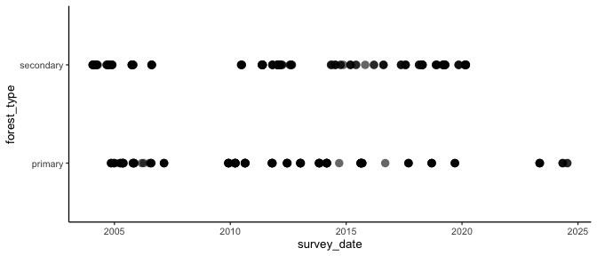
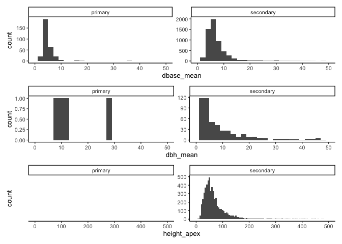
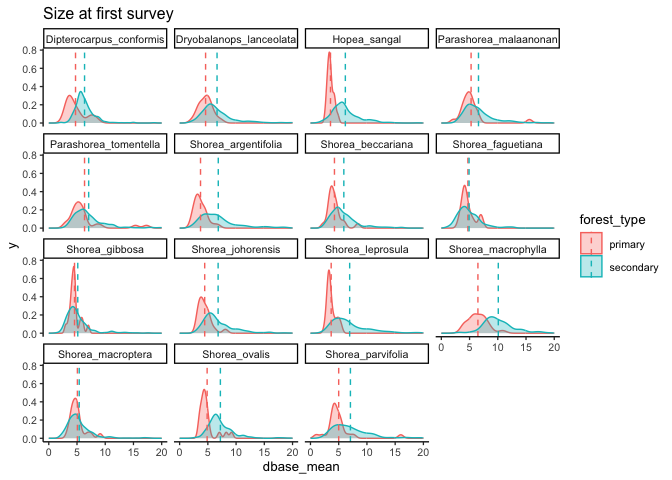
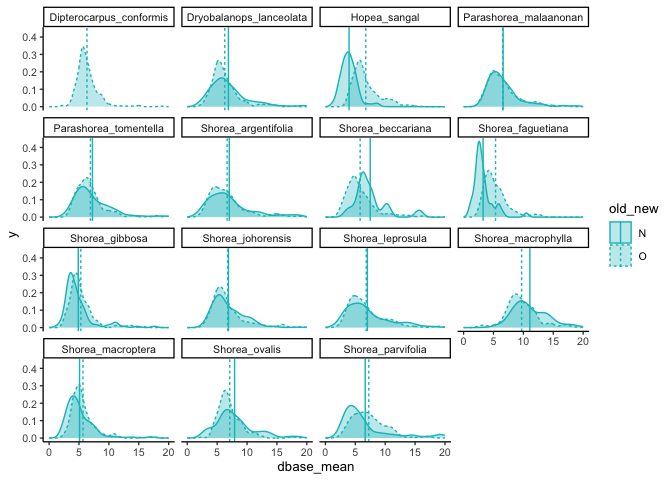
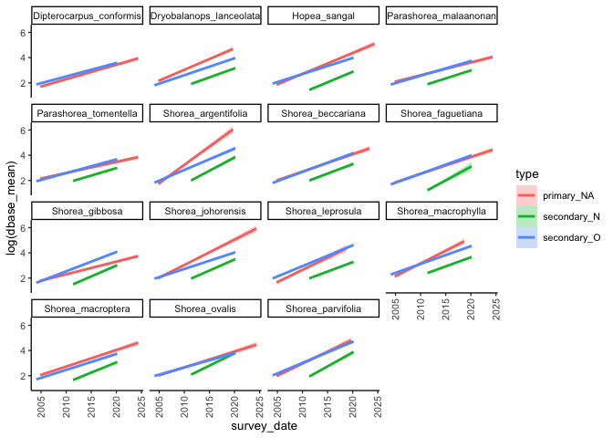
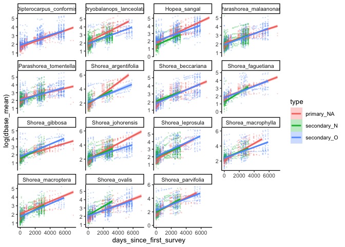

# Investigating size at planting/first survey
eleanorjackson
2024-08-13

> Seedlings were not planted in the forest types at the same time, the
> secondary forest of SBE was planted first then the left over seedlings
> in the nursery were planted in the primary old growth forest of Danum
> Valley Conservation Area. Meaning… seedlings grow for a different
> amount of time in the two forest types and initial size is not
> equalized by randomization (appears to differ on a species-by-species
> basis if I recall correctly)

Smaller seedlings usually have a faster rate of growth, which slows as
they get larger.

Taking a look at this now that I’ve combined the different data sources
and done a little simple cleaning. (see
[00_combine-raw-data.R](code/scripts/00_combine-raw-data.R) and
[01_clean-data.R](code/scripts/01_clean-data.R)).

``` r
library("tidyverse")
library("here")
library("patchwork")
```

``` r
data <- 
  readRDS(here::here("data", "derived", "data_cleaned.rds"))
```

Let’s have a quick look at the timeline of surveys.

``` r
data %>% 
  group_by(forest_type, survey_date) %>% 
  slice_head() %>% 
  ggplot(aes(y = forest_type, x = survey_date)) +
  geom_point(alpha = 0.6, shape = 16, size = 3)
```



We are waiting on the latest data (2024) from the SBE. **Do we have
planting dates for the Danum Valley seedlings?**

Find the first survey date for each individual.

``` r
data <- 
  data %>% 
  group_by(plant_id) %>%
  slice_min(survey_date, with_ties = FALSE) %>%
  ungroup() %>% 
  select(plant_id, survey_date) %>%
  rename(first_survey = survey_date) %>% 
  right_join(data) 
```

``` r
data %>% 
  filter(survey_date == first_survey) %>% 
  summarise_at(c("dbase_mean", "dbh_mean"), 
               ~sum(is.na(.x))
               )
```

    # A tibble: 1 × 2
      dbase_mean dbh_mean
           <int>    <int>
    1      11707    16941

There are a lot of entries with a record for survival but no diameter
measurement. **Why would survival be recorded without a diameter
measurement?**

``` r
data %>% 
  filter(survey_date == first_survey) %>% 
  filter(is.na(dbase_mean) & is.na(dbh_mean)) %>% 
  group_by(forest_type) %>% 
  summarise(n())
```

    # A tibble: 2 × 2
      forest_type `n()`
      <fct>       <int>
    1 primary     11705
    2 secondary       2

This is mostly happening in the SBE data.

``` r
data %>% 
  filter(survey_date == first_survey) %>% 
  ggplot(aes(x = dbase_mean)) +
  geom_histogram(binwidth = 2) +
  facet_wrap(~forest_type, scales = "free_y") +
  xlim(0, 50) +
  
  data %>% 
  filter(survey_date == first_survey) %>% 
  ggplot(aes(x = dbh_mean)) +
  geom_histogram(binwidth = 2) +
  facet_wrap(~forest_type, scales = "free_y") +
  xlim(0, 50) +
  
  data %>% 
  filter(survey_date == first_survey) %>% 
  ggplot(aes(x = height_apex)) +
  geom_histogram(binwidth = 5) +
  facet_wrap(~forest_type, scales = "free_y") +
  xlim(0, 500) +
  
  plot_layout(ncol = 1)
```


Looks like it’s going to be best to look at basal diameter. **Is there a
way to estimate DBH from basal diameter or vice versa?**

``` r
data %>% 
  filter(survey_date == first_survey) %>% 
  ggplot(aes(x = dbase_mean, 
             fill = forest_type,
             colour = forest_type)) +
  geom_density(alpha = 0.3) +
  facet_wrap(~genus_species) +
  stat_summary(aes(xintercept = ..x.., y = 0), 
               fun = mean, 
               geom = "vline", 
               orientation = "y",
               linetype = 2) +
  xlim(0, 20) +
  ggtitle("Size at first survey")
```



The primary forest (Danum) seedlings often have a greater spread of
sizes and a larger mean size in their first survey. They were planted
later, but were larger at the time of planting.

But some species have pretty good overlap:

- *S. gibbosa*
- *S. macroptera*
- *S. faguetiana*

How about if we match the second survey of the primary forest to the
first survey of the secondary forest?

``` r
data <- 
  data %>% 
  filter(survey_date != first_survey) %>% 
  group_by(plant_id) %>%
  slice_min(survey_date, with_ties = FALSE) %>%
  ungroup() %>% 
  select(plant_id, survey_date) %>%
  rename(second_survey = survey_date) %>% 
  right_join(data) 
```

``` r
data %>% 
  filter(case_when(
    forest_type == "primary" ~ survey_date == first_survey,
    forest_type == "secondary" ~ survey_date == second_survey,
  )) %>% 
  ggplot(aes(x = dbase_mean, 
             fill = forest_type,
             colour = forest_type)) +
  geom_density(alpha = 0.3) +
  facet_wrap(~genus_species) +
  stat_summary(aes(xintercept = ..x.., y = 0), 
               fun = mean, 
               geom = "vline", 
               orientation = "y",
               linetype = 2) +
  xlim(0, 20) 
```


That has closed the gap between means a little - for some species more
than others. It looks like there’s better overlap in the range of sizes
between the forest types.

Maybe there is more range in primary forest seedling size because of the
two cohorts!

``` r
data %>% 
  filter(
    forest_type == "primary" & 
      survey_date == first_survey &
      !is.na(old_new)) %>% 
  ggplot(aes(x = dbase_mean, 
             fill = forest_type,
             colour = forest_type,
             linetype = old_new)) +
  geom_density(alpha = 0.3) +
  facet_wrap(~genus_species) +
  stat_summary(aes(xintercept = ..x.., y = 0), 
               fun = mean, 
               geom = "vline", 
               orientation = "y") +
  xlim(0, 20) 
```



``` r
data %>% 
  rowwise() %>% 
  mutate(type = paste(forest_type, old_new, sep = "_")) %>% 
  ungroup() %>% 
  filter(survey_date == first_survey) %>% 
  filter(case_when(
    forest_type == "primary" ~ !is.na(old_new),
    T ~ is.na(old_new)
  )) %>% 
  ggplot(aes(x = dbase_mean, 
             fill = type,
             colour = type)) +
  geom_density(alpha = 0.3) +
  facet_wrap(~genus_species) +
  stat_summary(aes(xintercept = ..x.., y = 0), 
               fun = mean, 
               geom = "vline", 
               orientation = "y",
               linetype = 2) +
  xlim(0, 20) 
```



The old and new secondary cohorts seem very close to each other compared
to the primary forest seedlings.

Biggest differences in old v new seen for *H. sangal, S. beccariana, S.
faguetiana, S. macrophylla.*

Now let’s see if growth is different over time for these three groups.

``` r
data %>%
  rowwise() %>% 
  mutate(type = paste(forest_type, old_new, sep = "_")) %>% 
  ungroup() %>% 
  ggplot(aes(y = dbase_mean,
             x = survey_date,
             fill = type,
             colour = type)) +
  geom_smooth() +
  facet_wrap(~genus_species) 
```


It looks like some species do better in the secondary forest and some in
the primary, but perhaps the secondary forest seedlings are just ahead
and growth rate is starting to level out?

Making that plot again but using `days_since_first_survey` on the
y-axis, rather than `survey_date`.

``` r
data <-
  data %>% 
  rowwise() %>% 
  mutate(
    days_since_first_survey =
      survey_date - first_survey
  ) %>% 
  ungroup()

data %>%
  rowwise() %>% 
  mutate(type = paste(forest_type, old_new, sep = "_")) %>% 
  ungroup() %>% 
  ggplot(aes(y = dbase_mean,
             x = days_since_first_survey,
             fill = type,
             colour = type)) +
  geom_smooth(alpha = 0.3) +
  facet_wrap(~genus_species, scales = "free_y") 
```



Looks like something weird is going on.

``` r
data %>%
  rowwise() %>% 
  mutate(type = paste(forest_type, old_new, sep = "_")) %>% 
  ungroup() %>% 
  filter(type != "primary_NA") %>% 
  ggplot(aes(y = dbase_mean,
             x = days_since_first_survey,
             fill = type,
             colour = type)) +
  geom_point(size = 0.5, alpha = 0.3) +
  geom_smooth(alpha = 0.3) +
  facet_wrap(~genus_species, scales = "free_y") 
```



Seems like a few points are dragging down the secondary forest growth
rate - perhaps just smaller sample size as more trees have died.
