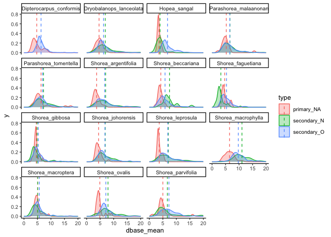
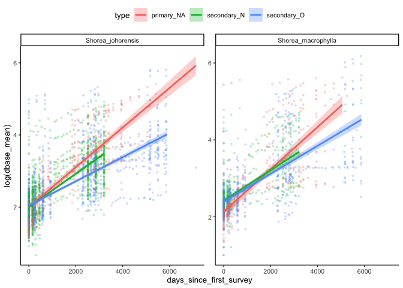
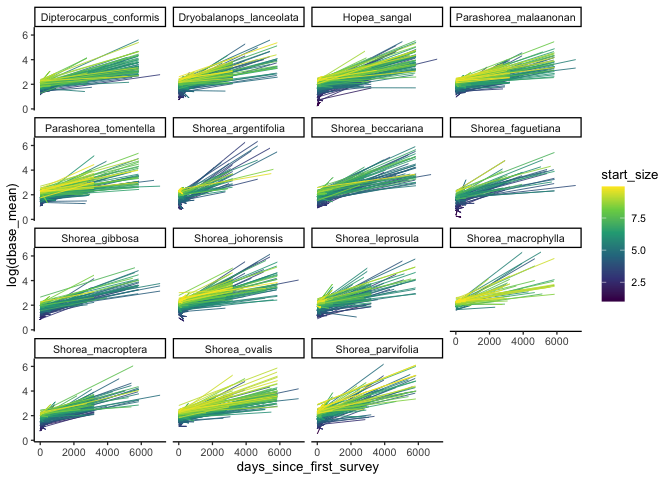
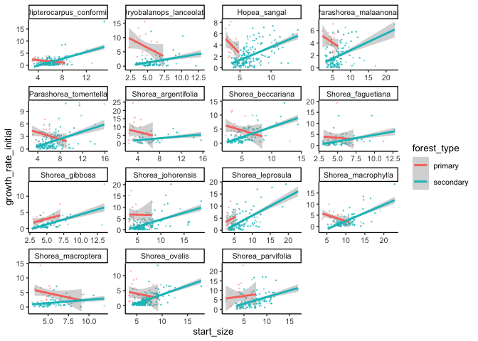

# Investigating size at planting/first survey
eleanorjackson
2024-08-30

> Seedlings were not planted in the forest types at the same time, the
> secondary forest of SBE was planted first then the left over seedlings
> in the nursery were planted in the primary old growth forest of Danum
> Valley Conservation Area. Meaning… seedlings grow for a different
> amount of time in the two forest types and initial size is not
> equalized by randomization (appears to differ on a species-by-species
> basis if I recall correctly)

Smaller seedlings usually have a faster rate of growth, which slows as
they get larger.

Taking a look at this now that I’ve combined the different data sources
and done a little simple cleaning. (see
[00_combine-raw-data.R](../scripts/00_combine-raw-data.R) and
[01_clean-data.R](../scripts/01_clean-data.R)).

``` r
library("tidyverse")
library("here")
library("patchwork")
```

``` r
data <- 
  readRDS(here::here("data", "derived", "data_cleaned.rds"))
```

Let’s have a quick look at the timeline of surveys.

``` r
data %>% 
  group_by(forest_type, survey_date) %>% 
  slice_head() %>% 
  ggplot(aes(y = forest_type, x = survey_date)) +
  geom_point(alpha = 0.6, shape = 16, size = 3)
```


We are waiting on the latest data (2024) from the SBE. **Do we have
planting dates for the Danum Valley seedlings?**

## Starting size

Find the first survey date for each individual.

``` r
data <- 
  data %>% 
  group_by(plant_id) %>%
  slice_min(survey_date, with_ties = FALSE) %>%
  ungroup() %>% 
  select(plant_id, survey_date) %>%
  rename(first_survey = survey_date) %>% 
  right_join(data) 
```

``` r
data %>% 
  filter(survey_date == first_survey) %>% 
  summarise_at(c("dbase_mean", "dbh_mean"), 
               ~sum(is.na(.x))
               )
```

    # A tibble: 1 × 2
      dbase_mean dbh_mean
           <int>    <int>
    1      11704    16939

This is mostly happening in the SBE data.

Find the first survey without size NAs instead.

``` r
data <- 
  data %>% 
  select(- first_survey) %>% 
  drop_na(dbase_mean) %>% 
  group_by(plant_id) %>%
  slice_min(survey_date, with_ties = FALSE) %>%
  ungroup() %>% 
  select(plant_id, survey_date) %>%
  rename(first_survey = survey_date) %>% 
  right_join(select(data, - first_survey)) 
```

``` r
data %>% 
  filter(survey_date == first_survey) %>% 
  ggplot(aes(x = dbase_mean)) +
  geom_histogram(binwidth = 2) +
  facet_wrap(~forest_type, scales = "free_y") +
  xlim(0, 50) +
  
  data %>% 
  filter(survey_date == first_survey) %>% 
  ggplot(aes(x = dbh_mean)) +
  geom_histogram(binwidth = 2) +
  facet_wrap(~forest_type, scales = "free_y") +
  xlim(0, 50) +
  
  data %>% 
  filter(survey_date == first_survey) %>% 
  ggplot(aes(x = height_apex)) +
  geom_histogram(binwidth = 5) +
  facet_wrap(~forest_type, scales = "free_y") +
  xlim(0, 500) +
  
  plot_layout(ncol = 1)
```


Looks like it’s going to be best to look at basal diameter. **Is there a
way to estimate DBH from basal diameter or vice versa?**

## Starting size ~ species + forest type

``` r
data %>% 
  filter(survey_date == first_survey) %>% 
  ggplot(aes(x = dbase_mean, 
             fill = forest_type,
             colour = forest_type)) +
  geom_density(alpha = 0.3) +
  facet_wrap(~genus_species) +
  stat_summary(aes(xintercept = ..x.., y = 0), 
               fun = mean, 
               geom = "vline", 
               orientation = "y",
               linetype = 2) +
  xlim(0, 20) +
  ggtitle("Size at first survey")
```


The secondary forest (SBE) seedlings often have a greater spread of
sizes and a larger mean size in their first survey. They were planted
later, but were larger at the time of planting.

But some species have pretty good overlap:

- *S. gibbosa*
- *S. macroptera*
- *S. faguetiana*

I’ve forgotten that there are two cohorts of secondary forest seedlings,
let’s split them out.

``` r
data %>% 
  filter(
    forest_type == "secondary" & 
      survey_date == first_survey &
      !is.na(old_new)) %>% 
  ggplot(aes(x = dbase_mean, 
             fill = forest_type,
             colour = forest_type,
             linetype = old_new)) +
  geom_density(alpha = 0.3,
               colour = scales::hue_pal()(2)[[2]],
               fill = scales::hue_pal()(2)[[2]]) +
  facet_wrap(~genus_species) +
  stat_summary(aes(xintercept = ..x.., y = 0), 
               fun = mean, 
               geom = "vline", 
               orientation = "y",
               colour = scales::hue_pal()(2)[[2]]) +
  xlim(0, 20) 
```


Similar for most species..

Now comparing all three groups: secondary forest, primary forest first
cohort & primary forest second cohort.

``` r
data %>% 
  rowwise() %>% 
  mutate(type = paste(forest_type, old_new, sep = "_")) %>% 
  ungroup() %>% 
  filter(survey_date == first_survey) %>% 
  filter(case_when(
    forest_type == "secondary" ~ !is.na(old_new),
    T ~ is.na(old_new)
  )) %>% 
  ggplot(aes(x = dbase_mean, 
             fill = type,
             colour = type)) +
  geom_density(alpha = 0.3) +
  facet_wrap(~genus_species) +
  stat_summary(aes(xintercept = ..x.., y = 0), 
               fun = mean, 
               geom = "vline", 
               orientation = "y",
               linetype = 2) +
  xlim(0, 20) 
```


The old and new secondary cohorts are much closer to each other compared
to the primary forest seedlings.

Biggest differences in old v new seen for *H. sangal, S. beccariana, S.
faguetiana, S. macrophylla.*

## Growth ~ species + forest type

Now let’s see if growth is different over time for these three groups.

``` r
data %>%
  rowwise() %>% 
  mutate(type = paste(forest_type, old_new, sep = "_")) %>% 
  ungroup() %>% 
  filter(type != "secondary_NA") %>% 
  ggplot(aes(y = log(dbase_mean),
             x = survey_date,
             fill = type,
             colour = type)) +
  geom_smooth(alpha = 0.3,
              method = "glm", method.args = list(family = "gaussian")) +
  facet_wrap(~genus_species) +
  scale_x_date(guide = guide_axis(angle = 90)) 
```


For some species the seedlings have similar patterns of growth -
parallel lines.

Making that plot again but using `days_since_first_survey` on the
y-axis, rather than `survey_date`.

``` r
data <-
  data %>% 
  drop_na(dbase_mean) %>%
  rowwise() %>% 
  mutate(
    days_since_first_survey =
      survey_date - first_survey
  ) %>% 
  ungroup()
```

``` r
data %>%
  rowwise() %>% 
  mutate(type = paste(forest_type, old_new, sep = "_")) %>% 
  ungroup() %>% 
  filter(type != "secondary_NA") %>% 
  ggplot(aes(y = log(dbase_mean),
             x = days_since_first_survey,
             fill = type,
             colour = type)) +
  geom_smooth(alpha = 0.3,
              method = "glm", method.args = list(family = "gaussian")) +
  facet_wrap(~genus_species, scales = "free_y")
```



Now adding in data points.

``` r
data %>%
  rowwise() %>% 
  mutate(type = paste(forest_type, old_new, sep = "_")) %>% 
  ungroup() %>% 
  filter(type != "secondary_NA") %>% 
  drop_na(dbase_mean) %>% 
  ggplot(aes(y = log(dbase_mean),
             x = days_since_first_survey,
             fill = type,
             colour = type)) +
  geom_point(shape = 16, size = 0.5, alpha = 0.3) +
  geom_smooth(alpha = 0.3,
              method = "glm", method.args = list(family = "gaussian")) +
  facet_wrap(~genus_species, scales = "free_y") 
```


I want to look at a few of the species more closely.

``` r
data %>%
  rowwise() %>% 
  mutate(type = paste(forest_type, old_new, sep = "_")) %>% 
  ungroup() %>% 
  drop_na(dbase_mean) %>% 
  filter(type != "secondary_NA" &
           (genus_species == "Shorea_macrophylla" |
           genus_species == "Shorea_johorensis")) %>% 
  ggplot(aes(y = log(dbase_mean),
             x = days_since_first_survey,
             fill = type,
             colour = type)) +
  geom_point(shape = 16, size = 1, alpha = 0.3) +
  geom_smooth(alpha = 0.3,
              method = "glm", method.args = list(family = "gaussian")) +
  facet_wrap(~genus_species, scales = "free_y") +
  theme(legend.position = "top") 
```


## Individual growth ~ starting size

New column for size at first survey.

``` r
data <- 
  data %>%
  filter(survey_date == first_survey) %>% 
  rename(start_size = dbase_mean) %>% 
  select(plant_id, start_size) %>% 
  distinct() %>% 
  right_join(data)
```

``` r
data %>% 
  drop_na(dbase_mean, start_size) %>% 
  filter(start_size < 10) %>% 
  ggplot(aes(y = log(dbase_mean),
             x = days_since_first_survey,
             group = start_size,
             colour = start_size)) +
  geom_smooth(alpha = 0.3, se = FALSE, linewidth = 0.3,
              method = "glm", method.args = list(family = "gaussian")) +
  scale_colour_viridis_c() +
  facet_wrap(~genus_species)
```


Steeper purple lines compared to yellow lines would mean that smaller
seedlings have a faster rate of growth. Maybe some evidence of this in
*Shorea argentifolia.*

Let’s separate out secondary and primary forest seedlings.

``` r
data %>% 
  filter(forest_type == "primary") %>% 
  drop_na(dbase_mean, start_size) %>% 
  filter(start_size < 10) %>% 
  ggplot(aes(y = log(dbase_mean),
             x = days_since_first_survey,
             group = start_size,
             colour = start_size)) +
  geom_smooth(alpha = 0.3, se = FALSE, linewidth = 0.3,
              method = "glm", method.args = list(family = "gaussian")) +
  scale_colour_viridis_c() +
  facet_wrap(~genus_species) +
  ggtitle("Primary forest") +
  
  data %>% 
  filter(forest_type == "secondary") %>% 
  drop_na(dbase_mean, start_size) %>% 
  filter(start_size < 10) %>% 
  ggplot(aes(y = log(dbase_mean),
             x = days_since_first_survey,
             group = start_size,
             colour = start_size)) +
  geom_smooth(alpha = 0.3, se = FALSE, linewidth = 0.3,
              method = "glm", method.args = list(family = "gaussian")) +
  scale_colour_viridis_c() +
  facet_wrap(~genus_species) +
  ggtitle("Secondary forest") +
  
  plot_layout(ncol = 1, guides = "collect")
```



Is rate of growth faster for smaller seedlings?

Let’s look at the initial rate of growth - from the first survey to the
last one before the break in data collection around 2008.

Growth rate =

size at time<sup>1</sup> - size at time<sup>2</sup> / (difference in
days / 365.25)

``` r
# get last survey date pre 2008
data <- 
  data %>% 
  drop_na(dbase_mean) %>%
  filter(survey_date < "2008-01-01") %>% 
  filter(survey_date != first_survey) %>% 
  group_by(plant_id) %>%
  slice_max(survey_date, with_ties = FALSE) %>%
  ungroup() %>% 
  select(plant_id, survey_date) %>%
  rename(yr3_survey = survey_date) %>% 
  right_join(data) 

# get size at that date
data <- 
  data %>%
  drop_na(dbase_mean) %>%
  filter(survey_date == yr3_survey) %>% 
  rename(yr3_size = dbase_mean) %>% 
  select(plant_id, yr3_size) %>% 
  distinct() %>% 
  right_join(data)

# calculate initial growth rate
data <- 
  data %>%
  drop_na(dbase_mean) %>%
  filter(old_new == "O" | is.na(old_new))%>% 
  filter(survey_date == first_survey |
           survey_date == yr3_survey) %>% 
  pivot_longer(cols = c(start_size, yr3_size)) %>% 
  group_by(plant_id) %>%
  summarise(growth = max(value) - min(value),
            time = max(days_since_first_survey)) %>% 
  mutate(time = time_length(time, unit = "days")) %>% 
  filter(time > 0) %>% 
  mutate(growth_rate_initial = growth / (time / 365.25) ) %>% 
  select(plant_id, growth_rate_initial) %>% 
  right_join(data)
```

``` r
data %>% 
  drop_na(growth_rate_initial) %>% 
  filter(survey_date == first_survey) %>% 
  ggplot(aes(y = growth_rate_initial, 
             x = start_size,
             colour = forest_type)) +
  geom_point(shape = 16, alpha = 0.5)+
  geom_smooth(method = "glm", method.args = list(family = "gaussian"))
```



``` r
data %>% 
  drop_na(growth_rate_initial) %>% 
  filter(survey_date == first_survey) %>% 
  ggplot(aes(y = growth_rate_initial, 
             x = start_size,
             colour = forest_type)) +
  geom_point(shape = 16, alpha = 0.5, size = 0.5) +
  geom_smooth(se = FALSE,
              method = "glm", method.args = list(family = "gaussian")) +
  facet_wrap(~genus_species)
```


``` r
data %>% 
  drop_na(growth_rate_initial) %>% 
  filter(survey_date == first_survey) %>% 
  ggplot(aes(y = growth_rate_initial, 
             x = start_size,
             colour = forest_type)) +
  geom_point(shape = 16, alpha = 0.5, size = 0.5) +
  geom_smooth(method = "glm", method.args = list(family = "gaussian")) +
  facet_wrap(~genus_species, scales = "free")
```


Negative trend for primary forest seedlings is as expected. But the
sample size is smaller.

Perhaps SBE seedlings are beyond initial growth spurt at this point? -
they were larger at the time of planting.

Let’s look at the overall growth rate, and only include individuals that
survived till at least 2015. Would expect the trend in primary forest
seedlings to reverse.

``` r
# get last survey date
data <- 
  data %>% 
  drop_na(dbase_mean) %>%
  filter(survey_date < "2015-01-01") %>% 
  filter(survival == 1) %>% 
  filter(survey_date != first_survey) %>% 
  group_by(plant_id) %>%
  slice_max(survey_date, with_ties = FALSE) %>%
  ungroup() %>% 
  select(plant_id, survey_date) %>%
  rename(last_survey = survey_date) %>% 
  distinct() %>%
  right_join(data) 

# get size at that date
data <- 
  data %>%
  drop_na(dbase_mean) %>%
  filter(survey_date == last_survey) %>% 
  rename(last_size = dbase_mean) %>% 
  select(plant_id, last_size) %>% 
  distinct() %>% 
  right_join(data)

# calculate initial growth rate
data <- 
  data %>%
  drop_na(dbase_mean) %>%
  filter(survey_date == first_survey |
           survey_date == last_survey) %>% 
  pivot_longer(cols = c(start_size, last_size)) %>% 
  group_by(plant_id) %>%
  summarise(growth = max(value) - min(value),
            time = max(days_since_first_survey)) %>% 
  mutate(time = time_length(time, unit = "days")) %>% 
  filter(time > 0) %>% 
  mutate(growth_rate_total = growth / (time / 365.25) ) %>% 
  select(plant_id, growth_rate_total) %>% 
  distinct() %>%
  right_join(data)
```

``` r
data %>% 
  drop_na(growth_rate_total) %>% 
  filter(survey_date == first_survey) %>% 
  ggplot(aes(y = growth_rate_total, 
             x = start_size,
             colour = forest_type)) +
  geom_point(shape = 16, alpha = 0.5, size = 1) +
  geom_smooth(method = "glm", method.args = list(family = "gaussian")) +
  facet_wrap(~forest_type, scales = "free")
```


``` r
data %>% 
  drop_na(growth_rate_total) %>% 
  filter(survey_date == first_survey) %>% 
  ggplot(aes(y = growth_rate_total, 
             x = start_size,
             colour = forest_type)) +
  geom_point(shape = 16, alpha = 0.5, size = 0.5) +
  geom_smooth(method = "glm", method.args = list(family = "gaussian")) +
  facet_wrap(~genus_species, scales = "free")
```



We still have that positive trend in the SBE seedlings.

Let’s reduce the growth period as much as possible and calculate growth
rate using the first + second survey of each individual.

``` r
# get last survey date
data <- 
  data %>% 
  filter(forest_type == "secondary") %>% 
  drop_na(dbase_mean) %>%
  filter(survey_date != first_survey) %>% 
  group_by(plant_id) %>%
  slice_min(survey_date, with_ties = FALSE) %>%
  ungroup() %>% 
  select(plant_id, survey_date) %>%
  rename(second_survey = survey_date) %>% 
  distinct() %>%
  right_join(data) 

# get size at that date
data <- 
  data %>%
  filter(forest_type == "secondary") %>% 
  drop_na(dbase_mean) %>%
  filter(survey_date == second_survey) %>% 
  rename(second_size = dbase_mean) %>% 
  select(plant_id, second_size) %>% 
  distinct() %>% 
  right_join(data)

# calculate initial growth rate
data <- 
  data %>%
  drop_na(dbase_mean) %>%
  filter(forest_type == "secondary") %>% 
  filter(survey_date == first_survey |
           survey_date == second_survey) %>% 
  pivot_longer(cols = c(start_size, second_size)) %>% 
  group_by(plant_id) %>%
  summarise(growth = max(value) - min(value),
            time = max(days_since_first_survey)) %>% 
  mutate(time = time_length(time, unit = "days")) %>% 
  filter(time > 0) %>% 
  mutate(growth_rate_initial = growth / (time / 365.25) ) %>% 
  select(plant_id, growth_rate_initial) %>% 
  distinct() %>%
  right_join(data)
```

``` r
data %>% 
  filter(forest_type == "secondary") %>% 
  drop_na(growth_rate_total) %>% 
  filter(survey_date == first_survey) %>% 
  ggplot(aes(y = growth_rate_initial, 
             x = start_size)) +
  geom_point(shape = 16, alpha = 0.5, size = 1,
             colour = scales::hue_pal()(2)[[2]]) +
  geom_smooth(method = "glm", method.args = list(family = "gaussian"),
              colour = scales::hue_pal()(2)[[2]]) +
  facet_wrap(~forest_type, scales = "free") +
  xlim(0, 30)
```


It’s still there!

## Summary

- SBE / secondary forest seedlings are generally larger at the time of
  planting
- There is a negative correlation between starting size and growth rate
  for Danum seedlings
  - but the opposite trend for SBE seedlings
