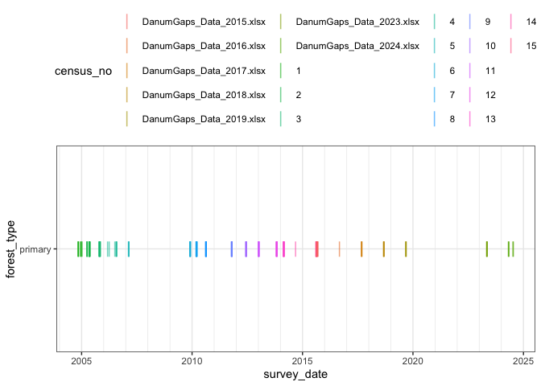
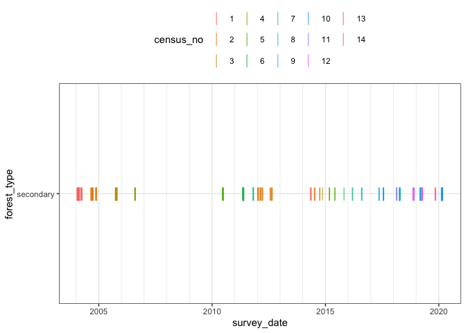
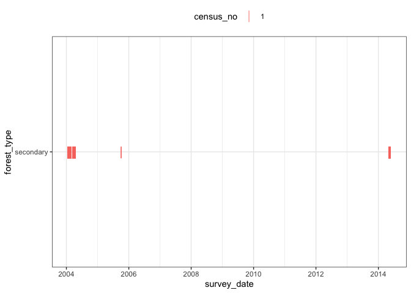

# Cleaning census numbers
eleanorjackson
2024-08-28

``` r
library("tidyverse")
library("here")
library("patchwork")
```

For the Danum data, most of the dead trees are recorded as
`survival == 0`, but for the SBE, there is often no entry for the
individual if not found.

To look at survival, we might need to back fill the data with dead
trees, which means that we’ll need to separate out the dates by
‘census’.

I’m going to try and group entries by census here.

## Primary forest

The older Danum data had a `census` variable already, and I should be
able to add `census` IDs to the new datasets quite easily since each
census was stored in a different excel file and censuses were done
roughly once a year.

``` r
data <- 
  readRDS(here::here("data", "derived", "data_cleaned.rds"))
```

``` r
data %>% 
  filter(forest_type == "primary") %>% 
  mutate(month = lubridate::month(survey_date)) %>% 
  group_by(survey_date) %>% 
  slice_head() %>% 
  ggplot(aes(y = forest_type, x = survey_date, colour = census_no)) +
  geom_point(alpha = 0.6, shape = "|", size = 5) +
  theme_bw() +
  scale_x_date(minor_breaks = "year") +
  theme(legend.position = "top") 
```



For the primary forest data `census_no` is currently a mix of the
`census` as defined in the older data sheet for the older data, and for
the newer data the name of the data sheet that the data came from.

I think that the newer data will all follow on from the older data, but
let’s check.

``` r
data %>% 
  filter(forest_type == "primary") %>% 
  group_by(census_no) %>% 
  summarise(median_date = median(survey_date, na.rm = TRUE)) %>% 
  arrange(median_date) %>% 
  knitr::kable()
```

| census_no                | median_date |
|:-------------------------|:------------|
| 1                        | 2004-11-11  |
| 2                        | 2005-05-12  |
| 3                        | 2005-10-29  |
| 4                        | 2006-07-17  |
| 5                        | 2007-02-21  |
| 6                        | 2009-12-04  |
| 7                        | 2010-03-18  |
| 8                        | 2010-08-23  |
| 9                        | 2011-10-21  |
| 10                       | 2012-06-14  |
| 11                       | 2013-01-10  |
| 12                       | 2013-11-06  |
| 13                       | 2014-02-28  |
| 14                       | 2014-09-13  |
| 15                       | 2015-08-21  |
| DanumGaps_Data_2015.xlsx | 2015-09-10  |
| DanumGaps_Data_2016.xlsx | 2016-09-08  |
| DanumGaps_Data_2017.xlsx | 2017-09-10  |
| DanumGaps_Data_2018.xlsx | 2018-09-10  |
| DanumGaps_Data_2019.xlsx | 2019-09-09  |
| DanumGaps_Data_2023.xlsx | 2023-05-07  |
| DanumGaps_Data_2024.xlsx | 2024-05-06  |

Yes - looks like that’s the case. We can rename
`DanumGaps_Data_2015.xlsx` - `DanumGaps_Data_2024.xlsx` as censuses 16
through to 22.

## Secondary forest

Now looking at the SBE data.

``` r
data %>% 
  filter(forest_type == "secondary") %>% 
  mutate(month = lubridate::month(survey_date)) %>% 
  group_by(survey_date) %>% 
  slice_head() %>% 
  ggplot(aes(y = forest_type, x = survey_date, colour = census_no)) +
  geom_point(alpha = 0.6, shape = "|", size = 5) +
  theme_bw() +
  scale_x_date(minor_breaks = "year") +
  theme(legend.position = "top") 
```



``` r
data %>% 
  filter(forest_type == "secondary") %>% 
  group_by(census_no) %>% 
  summarise(median_date = median(survey_date, na.rm = TRUE),
            max_date = max(survey_date, na.rm = TRUE),
            min_date = min(survey_date, na.rm = TRUE)) %>% 
  arrange(max_date) %>% 
  knitr::kable()
```

| census_no | median_date | max_date   | min_date   |
|:----------|:------------|:-----------|:-----------|
| 1         | 2004-02-25  | 2014-05-22 | 2004-01-23 |
| 2         | 2004-11-19  | 2014-07-17 | 2004-09-01 |
| 3         | 2005-10-11  | 2014-11-18 | 2005-09-30 |
| 4         | 2006-08-10  | 2015-03-11 | 2005-10-04 |
| 5         | 2010-06-29  | 2015-06-08 | 2010-06-18 |
| 6         | 2011-05-20  | 2015-10-28 | 2011-05-13 |
| 7         | 2011-10-27  | 2016-03-15 | 2011-10-25 |
| 11        | 2018-02-21  | 2018-02-26 | 2018-02-21 |
| 8         | 2018-04-13  | 2018-04-21 | 2016-08-10 |
| 12        | 2018-11-19  | 2018-12-04 | 2018-11-15 |
| 9         | 2019-03-13  | 2019-03-16 | 2017-05-14 |
| 13        | 2019-04-09  | 2019-04-13 | 2019-04-05 |
| 14        | 2019-11-09  | 2019-11-11 | 2019-11-06 |
| 10        | 2020-02-24  | 2020-03-03 | 2017-07-24 |

Strange that the census numbers are not in the same order as the survey
dates.

And some of the censuses cover a very large range?

Look at census 1:

``` r
data %>% 
  filter(forest_type == "secondary" &
           census_no == 1) %>%
  ggplot(aes(y = forest_type, x = survey_date, colour = census_no)) +
  geom_point(alpha = 0.6, shape = "|", size = 5) +
  theme_bw() +
  scale_x_date(minor_breaks = "year") +
  theme(legend.position = "top") 
```



Perhaps the 2005 and 2014 surveys were listed as census one by mistake.

``` r
data %>% 
  filter(forest_type == "secondary" &
           census_no == 1) %>%
  group_by(plant_id) %>% 
  summarise(n()) %>% 
  filter(`n()` >1) %>% 
  glimpse()
```

    Rows: 360
    Columns: 2
    $ plant_id <fct> 003_01_032_O, 003_01_033_O, 003_03_015_O, 003_06_025_O, 003_0…
    $ `n()`    <int> 2, 2, 2, 2, 2, 2, 2, 2, 2, 2, 2, 2, 2, 2, 2, 2, 2, 2, 2, 2, 2…

There are a lot of duplicates.

Let’s see if the duplicates are still there when we remove the 2005 and
2014 surveys.

``` r
data %>% 
  filter(forest_type == "secondary" &
           census_no == 1) %>%
  filter(survey_date < ymd("2005-01-01")) %>% 
  group_by(plant_id) %>% 
  summarise(n()) %>% 
  filter(`n()` >1) %>% 
  glimpse()
```

    Rows: 311
    Columns: 2
    $ plant_id <fct> 003_01_032_O, 003_01_033_O, 003_03_015_O, 003_06_025_O, 003_0…
    $ `n()`    <int> 2, 2, 2, 2, 2, 2, 2, 2, 2, 2, 2, 2, 2, 2, 2, 2, 2, 2, 2, 2, 2…

There are still a lot of duplicates. Taking a look at just one plant to
see what’s going on.

``` r
data %>% filter(plant_id == "003_01_032_O") %>% 
  arrange(census_no) %>% 
  knitr::kable()
```

| forest_type | plant_id     | plot | line | position | old_new | plant_no | genus         | species   | genus_species           | planting_date | census_no | survey_date | survival | height_apex | dbh_mean | dbase_mean |
|:------------|:-------------|:-----|:-----|:---------|:--------|:---------|:--------------|:----------|:------------------------|:--------------|:----------|:------------|---------:|------------:|---------:|-----------:|
| secondary   | 003_01_032_O | 003  | 01   | 032      | O       | NA       | Dipterocarpus | conformis | Dipterocarpus_conformis | 2002-07-23    | 1         | 2004-01-29  |        1 |          NA |      NaN |        NaN |
| secondary   | 003_01_032_O | 003  | 01   | 032      | O       | NA       | Dipterocarpus | conformis | Dipterocarpus_conformis | 2002-07-23    | 1         | 2004-01-29  |        1 |          70 |      NaN |     6.7250 |
| secondary   | 003_01_032_O | 003  | 01   | 032      | O       | NA       | Dipterocarpus | conformis | Dipterocarpus_conformis | 2002-07-23    | 2         | 2004-09-30  |        1 |          86 |      NaN |    12.2555 |
| secondary   | 003_01_032_O | 003  | 01   | 032      | O       | NA       | Dipterocarpus | conformis | Dipterocarpus_conformis | 2002-07-23    | 3         | 2005-10-01  |        1 |         135 |    2.695 |    14.5800 |
| secondary   | 003_01_032_O | 003  | 01   | 032      | O       | NA       | Dipterocarpus | conformis | Dipterocarpus_conformis | 2002-07-23    | 4         | 2006-08-09  |        1 |         146 |    4.050 |    15.3500 |
| secondary   | 003_01_032_O | 003  | 01   | 032      | O       | NA       | Dipterocarpus | conformis | Dipterocarpus_conformis | 2002-07-23    | 5         | 2010-06-18  |        1 |         178 |    6.500 |    16.0500 |
| secondary   | 003_01_032_O | 003  | 01   | 032      | O       | NA       | Dipterocarpus | conformis | Dipterocarpus_conformis | 2002-07-23    | 6         | 2011-05-14  |        1 |          78 |      NaN |    15.4500 |
| secondary   | 003_01_032_O | 003  | 01   | 032      | O       | NA       | Dipterocarpus | conformis | Dipterocarpus_conformis | 2002-07-23    | 7         | 2011-10-25  |        1 |          NA |      NaN |    16.6000 |

There is a duplicate entry for the first census - but all the size
measurements are NA…

Try removing all rows with NAs for all the size variables.

``` r
data %>% 
  filter(forest_type == "secondary" &
           census_no == 1) %>%
  filter(!if_all(c(height_apex, dbh_mean, dbase_mean), is.na)) %>%
  filter(survey_date < ymd("2005-01-01")) %>% 
  group_by(plant_id) %>% 
  summarise(n()) %>% 
  filter(`n()` >1) %>% 
  glimpse()
```

    Rows: 61
    Columns: 2
    $ plant_id <fct> 005_15_023_O, 008_06_018_O, 008_06_020_O, 008_16_045_O, 011_0…
    $ `n()`    <int> 2, 2, 2, 2, 2, 2, 2, 2, 2, 2, 2, 2, 2, 2, 2, 2, 2, 2, 2, 2, 2…

That hasn’t solved the problem..

``` r
data %>% filter(plant_id == "005_15_023_O") %>% 
  arrange(census_no) %>% 
  knitr::kable()
```

| forest_type | plant_id     | plot | line | position | old_new | plant_no | genus | species | genus_species | planting_date | census_no | survey_date | survival | height_apex | dbh_mean | dbase_mean |
|:------------|:-------------|:-----|:-----|:---------|:--------|:---------|:------|:--------|:--------------|:--------------|:----------|:------------|---------:|------------:|---------:|-----------:|
| secondary   | 005_15_023_O | 005  | 15   | 023      | O       | NA       | Hopea | sangal  | Hopea_sangal  | 2002-07-26    | 1         | 2004-02-19  |        1 |          75 |      NaN |      6.660 |
| secondary   | 005_15_023_O | 005  | 15   | 023      | O       | NA       | Hopea | sangal  | Hopea_sangal  | 2002-07-26    | 1         | 2004-02-19  |        1 |          53 |      NaN |      5.635 |
| secondary   | 005_15_023_O | 005  | 15   | 023      | O       | NA       | Hopea | sangal  | Hopea_sangal  | 2002-07-26    | 2         | 2012-02-22  |        1 |         266 |    15.25 |     21.500 |
| secondary   | 005_15_023_O | 005  | 15   | 023      | O       | NA       | Hopea | sangal  | Hopea_sangal  | 2002-07-26    | 2         | 2004-09-23  |        1 |         107 |      NaN |      8.763 |
| secondary   | 005_15_023_O | 005  | 15   | 023      | O       | NA       | Hopea | sangal  | Hopea_sangal  | 2002-07-26    | 3         | 2005-10-14  |        1 |          NA |      NaN |        NaN |
| secondary   | 005_15_023_O | 005  | 15   | 023      | O       | NA       | Hopea | sangal  | Hopea_sangal  | 2002-07-26    | 4         | 2006-08-11  |        1 |         150 |     4.90 |     14.300 |
| secondary   | 005_15_023_O | 005  | 15   | 023      | O       | NA       | Hopea | sangal  | Hopea_sangal  | 2002-07-26    | 5         | 2010-06-29  |        1 |         180 |     7.65 |     15.450 |
| secondary   | 005_15_023_O | 005  | 15   | 023      | O       | NA       | Hopea | sangal  | Hopea_sangal  | 2002-07-26    | 6         | 2011-05-18  |        1 |         194 |    10.80 |     17.000 |
| secondary   | 005_15_023_O | 005  | 15   | 023      | O       | NA       | Hopea | sangal  | Hopea_sangal  | 2002-07-26    | 7         | 2011-10-25  |        1 |          NA |      NaN |     19.850 |
| secondary   | 005_15_023_O | 005  | 15   | 023      | O       | NA       | Hopea | sangal  | Hopea_sangal  | 2002-07-26    | 8         | 2018-04-12  |        1 |         570 |    37.05 |     45.000 |
| secondary   | 005_15_023_O | 005  | 15   | 023      | O       | NA       | Hopea | sangal  | Hopea_sangal  | 2002-07-26    | 9         | 2019-03-13  |        1 |          NA |    40.00 |     55.000 |
| secondary   | 005_15_023_O | 005  | 15   | 023      | O       | NA       | Hopea | sangal  | Hopea_sangal  | 2002-07-26    | 10        | 2020-02-25  |        1 |        1067 |    95.00 |    115.000 |

There seem to be entries for the same tree on the same date but with
different size measurements ?!
