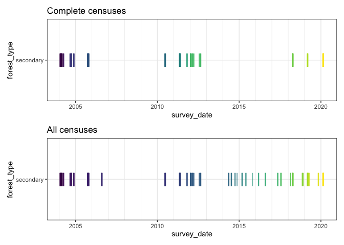
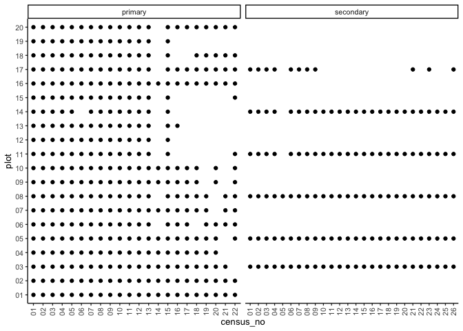

# Cleaning census numbers
eleanorjackson
2024-09-06

``` r
library("tidyverse")
library("here")
library("patchwork")
```

Following up on
[2024-08-28_cleaning-census-no.md](2024-08-28_cleaning-census-no.md).

I’ve realised that in the SBE data `sample` is nested within
`data_origin`. :facepalm:

``` r
data <- 
  readRDS(here::here("data", "derived", "data_cleaned.rds"))
```

I’ve created a `census_no` variable which orders the censuses by median
survey date.

``` r
data %>% 
  filter(forest_type == "secondary") %>% 
  group_by(census_id, census_no) %>% 
  summarise(median_date = median(survey_date, na.rm = TRUE),
            min_date = min(survey_date, na.rm = TRUE),
            max_date = max(survey_date, na.rm = TRUE),
            days = max_date - min_date
            ) %>% 
  arrange(max_date) %>% 
  knitr::kable()
```

| census_id           | census_no | median_date | min_date   | max_date   | days     |
|:--------------------|:----------|:------------|:-----------|:-----------|:---------|
| full_measurement_01 | 01        | 2004-02-25  | 2004-01-23 | 2004-04-01 | 69 days  |
| intensive_01        | 02        | 2004-02-25  | 2004-01-23 | 2005-10-04 | 620 days |
| intensive_02        | 03        | 2004-11-18  | 2004-09-01 | 2005-10-04 | 398 days |
| intensive_03        | 04        | 2005-10-11  | 2005-09-30 | 2005-10-25 | 25 days  |
| intensive_04        | 05        | 2006-08-10  | 2005-10-04 | 2006-08-18 | 318 days |
| intensive_05        | 06        | 2010-06-29  | 2010-06-18 | 2010-07-02 | 14 days  |
| intensive_06        | 07        | 2011-05-20  | 2011-05-13 | 2011-05-28 | 15 days  |
| intensive_07        | 08        | 2011-10-27  | 2011-10-25 | 2011-10-31 | 6 days   |
| full_measurement_02 | 09        | 2012-03-28  | 2012-01-11 | 2012-08-28 | 230 days |
| climber_01          | 10        | 2014-05-08  | 2014-05-07 | 2014-05-22 | 15 days  |
| climber_02          | 11        | 2014-07-15  | 2014-07-11 | 2014-07-17 | 6 days   |
| climber_03          | 12        | 2014-10-06  | 2014-10-05 | 2014-11-18 | 44 days  |
| climber_04          | 13        | 2015-03-10  | 2015-03-09 | 2015-03-11 | 2 days   |
| climber_05          | 14        | 2015-06-03  | 2015-06-03 | 2015-06-08 | 5 days   |
| climber_06          | 15        | 2015-10-28  | 2015-10-28 | 2015-10-28 | 0 days   |
| climber_07          | 16        | 2016-03-14  | 2016-03-14 | 2016-03-15 | 1 days   |
| climber_08          | 17        | 2016-08-11  | 2016-08-10 | 2016-08-12 | 2 days   |
| climber_09          | 18        | 2017-05-16  | 2017-05-14 | 2017-05-17 | 3 days   |
| climber_10          | 19        | 2017-07-25  | 2017-07-24 | 2017-07-27 | 3 days   |
| climber_11          | 20        | 2018-02-21  | 2018-02-21 | 2018-02-26 | 5 days   |
| intensive_08        | 21        | 2018-04-14  | 2018-04-09 | 2018-04-21 | 12 days  |
| climber_12          | 22        | 2018-11-19  | 2018-11-15 | 2018-12-04 | 19 days  |
| intensive_09        | 23        | 2019-03-13  | 2019-03-06 | 2019-03-16 | 10 days  |
| climber_13          | 24        | 2019-04-09  | 2019-04-05 | 2019-04-13 | 8 days   |
| climber_14          | 25        | 2019-11-09  | 2019-11-06 | 2019-11-11 | 5 days   |
| intensive_10        | 26        | 2020-02-24  | 2020-02-17 | 2020-03-03 | 15 days  |

Some of the censuses took a very long time to complete?

``` r
data %>% 
  filter(forest_type == "secondary") %>% 
  group_by(census_id) %>% 
  summarise(n_distinct(plot)) %>% 
  knitr::kable()
```

| census_id           | n_distinct(plot) |
|:--------------------|-----------------:|
| climber_01          |                5 |
| climber_02          |                5 |
| climber_03          |                5 |
| climber_04          |                5 |
| climber_05          |                5 |
| climber_06          |                5 |
| climber_07          |                5 |
| climber_08          |                5 |
| climber_09          |                5 |
| climber_10          |                5 |
| climber_11          |                5 |
| climber_12          |                5 |
| climber_13          |                5 |
| climber_14          |                5 |
| full_measurement_01 |                6 |
| full_measurement_02 |                6 |
| intensive_01        |                6 |
| intensive_02        |                6 |
| intensive_03        |                6 |
| intensive_04        |                3 |
| intensive_05        |                6 |
| intensive_06        |                6 |
| intensive_07        |                6 |
| intensive_08        |                6 |
| intensive_09        |                6 |
| intensive_10        |                6 |

There are 6 plots. Not every census surveys all 6 plots.

``` r
data_complete_censuses <-
  data %>% 
  filter(forest_type == "secondary") %>% 
  filter(str_detect(census_id, "full_measurement") |
           str_detect(census_id, "intensive")) %>% 
  filter(!census_id == "intensive_04") 
```

``` r
data_complete_censuses %>% 
  filter(forest_type == "secondary") %>% 
  mutate(month = lubridate::month(survey_date)) %>% 
  group_by(survey_date) %>% 
  slice_head() %>% 
  ggplot(aes(y = forest_type, x = survey_date, colour = as.ordered(census_no))) +
  geom_point(alpha = 0.6, shape = "|", size = 7) +
  theme_bw() +
  scale_x_date(minor_breaks = "year") +
  scale_colour_viridis_d() +
  theme(legend.position = "none") +
  ggtitle("Complete censuses") +
  
  data %>% 
  filter(forest_type == "secondary") %>% 
  mutate(month = lubridate::month(survey_date)) %>% 
  group_by(survey_date) %>% 
  slice_head() %>% 
  ggplot(aes(y = forest_type, x = survey_date, colour = as.ordered(census_no))) +
  geom_point(alpha = 0.6, shape = "|", size = 7) +
  theme_bw() +
  scale_x_date(minor_breaks = "year") +
  scale_colour_viridis_d() +
  theme(legend.position = "none") +
  ggtitle("All censuses") +
  
  patchwork::plot_layout(ncol = 1)
```



``` r
data %>% 
  filter(forest_type == "secondary") %>%
  group_by(plant_id, census_no) %>% 
  summarise(n()) %>% 
  filter(`n()` >1) %>% 
  knitr::kable()
```

| plant_id               | census_no | n() |
|:-----------------------|:----------|----:|
| 14_14_011_N            | 08        |   2 |
| 14_14_NA_O_ovalis      | 21        |   2 |
| 14_14_NA_O_ovalis      | 23        |   2 |
| 14_14_NA_O_ovalis      | 26        |   2 |
| 14_17_NA_O_johorensis  | 21        |   3 |
| 14_17_NA_O_johorensis  | 23        |   2 |
| 14_17_NA_O_johorensis  | 26        |   3 |
| 14_17_NA_O_sangal      | 21        |   3 |
| 14_17_NA_O_sangal      | 23        |   3 |
| 14_17_NA_O_sangal      | 26        |   3 |
| 17_02_NA_N_tomentella  | 23        |   2 |
| 17_11_NA_O_sangal      | 21        |   2 |
| 17_11_NA_O_sangal      | 23        |   2 |
| 17_11_NA_O_sangal      | 26        |   2 |
| 17_16_NA_NA_beccariana | 21        |   2 |

Duplicate trees within a single census are mostly trees without a
“position”, so they’ve ended up with the same `plant_id` as another
individual.

``` r
data %>% 
  janitor::get_dupes(-c(census_id, census_no)) %>% 
  glimpse()
```

    Rows: 13,668
    Columns: 19
    Rowwise: 
    $ forest_type   <chr> "primary", "primary", "primary", "primary", "primary", "…
    $ plant_id      <chr> "13_20", "13_20", "13_20", "13_20", "13_9", "13_9", "13_…
    $ plot          <chr> "13", "13", "13", "13", "13", "13", "13", "13", "05", "0…
    $ line          <chr> NA, NA, NA, NA, NA, NA, NA, NA, "20", "20", "20", "20", …
    $ position      <chr> NA, NA, NA, NA, NA, NA, NA, NA, "064", "064", "064", "06…
    $ old_new       <chr> NA, NA, NA, NA, NA, NA, NA, NA, "O", "O", "O", "O", "O",…
    $ plant_no      <chr> "20", "20", "20", "20", "9", "9", "9", "9", NA, NA, NA, …
    $ genus         <chr> "Shorea", "Shorea", "Shorea", "Shorea", "Shorea", "Shore…
    $ species       <chr> "macrophylla", "macrophylla", "macrophylla", "macrophyll…
    $ genus_species <chr> "Shorea_macrophylla", "Shorea_macrophylla", "Shorea_macr…
    $ planting_date <date> NA, NA, NA, NA, NA, NA, NA, NA, 2002-07-22, 2002-07-22,…
    $ survey_date   <date> NA, NA, NA, NA, NA, NA, NA, NA, 2005-10-04, 2005-10-04,…
    $ survival      <dbl> 1, 1, 1, 1, 0, 0, 0, 0, 0, 0, 0, 0, 0, 0, 0, 0, 0, 0, 0,…
    $ height_apex   <dbl> NA, NA, NA, NA, NA, NA, NA, NA, NA, NA, NA, NA, NA, NA, …
    $ dbh_mean      <dbl> NaN, NaN, NaN, NaN, NaN, NaN, NaN, NaN, NaN, NaN, NaN, N…
    $ dbase_mean    <dbl> NaN, NaN, NaN, NaN, NaN, NaN, NaN, NaN, NaN, NaN, NaN, N…
    $ dupe_count    <int> 4, 4, 4, 4, 4, 4, 4, 4, 4, 4, 4, 4, 4, 4, 4, 4, 4, 4, 4,…
    $ census_id     <chr> "6", "7", "8", "9", "6", "7", "8", "9", "intensive_01", …
    $ census_no     <chr> "06", "07", "08", "09", "06", "07", "08", "09", "02", "0…

There are a lot of rows which are identical - only differing in
`census_id`

``` r
data %>% 
  janitor::get_dupes(-c(census_id, census_no)) %>% 
  group_by(census_id) %>% 
  summarise(n())
```

    # A tibble: 9 × 2
      census_id           `n()`
      <chr>               <int>
    1 6                       2
    2 7                       2
    3 8                       2
    4 9                       2
    5 full_measurement_01  6824
    6 intensive_01         6827
    7 intensive_02            3
    8 intensive_03            3
    9 intensive_04            3

Seems to be a big overlap between `full_measurement_01` and
`intensive_01`, probably explains why the `intensive_01` survey took 620
days.

``` r
data %>% 
  filter(survival == 1) %>% 
  filter(if_all(c(dbh_mean, dbase_mean, height_apex), is.na)) %>%
  janitor::get_dupes(-c(census_id, census_no)) %>% 
  group_by(census_id) %>% 
  summarise(n())
```

    # A tibble: 6 × 2
      census_id           `n()`
      <chr>               <int>
    1 6                       1
    2 7                       1
    3 8                       1
    4 9                       1
    5 full_measurement_01   248
    6 intensive_01          248

A fair chunk of NAs.

``` r
data %>% 
  select(census_no, plot, forest_type) %>%
  distinct() %>% 
  ggplot(aes(x = census_no, y = plot)) +
  geom_point() +
  facet_wrap(~forest_type, scales = "free_x") +
  guides(x =  guide_axis(angle = 90)) 
```


