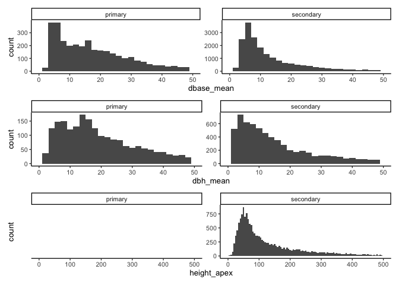
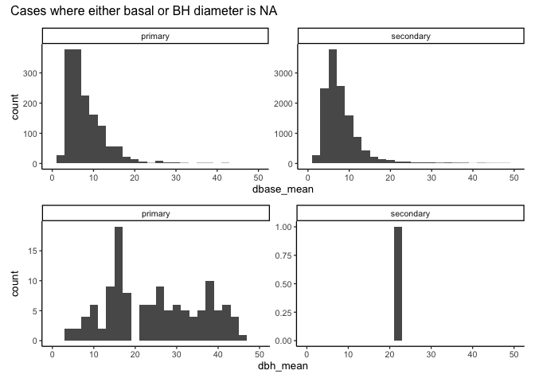
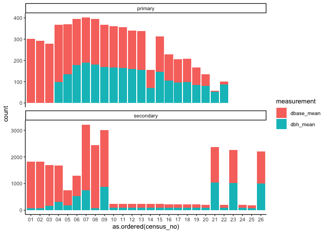
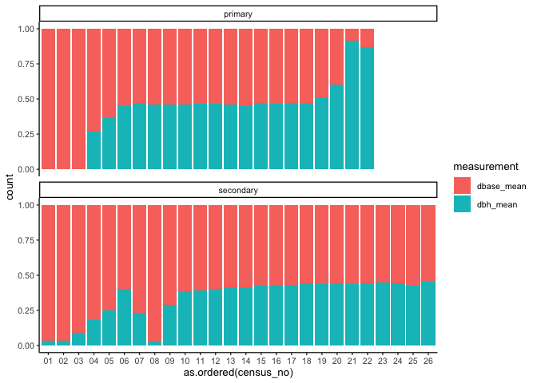
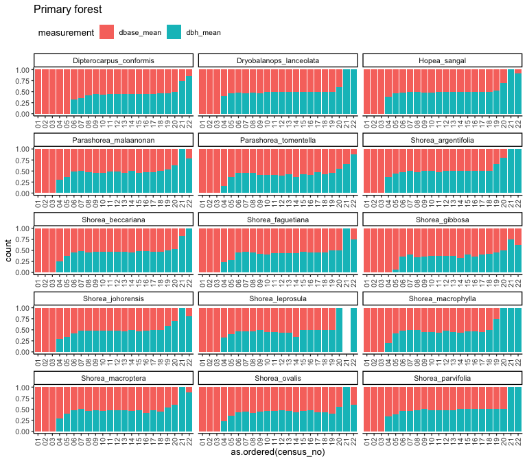
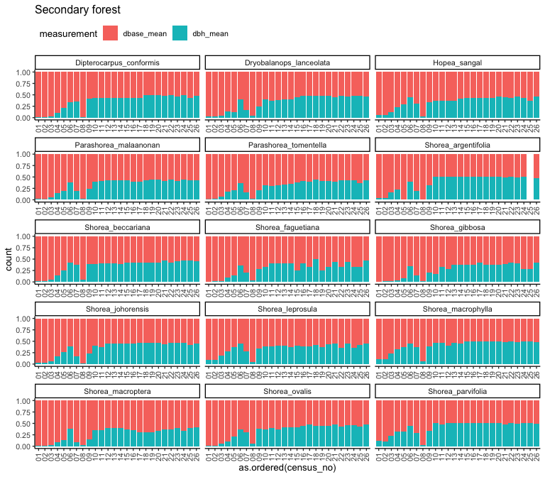
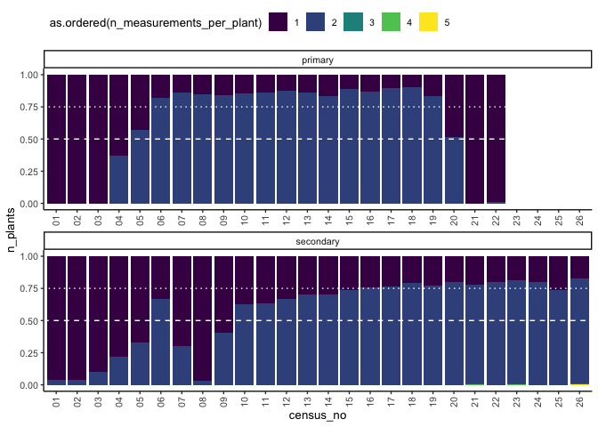
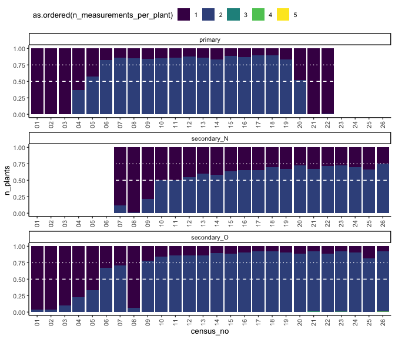

# Diameter conversion
eleanorjackson
2024-09-04

``` r
library("tidyverse")
library("here")
library("patchwork")
```

Some of the tree diameter measurements were taken at breast height
(1.3m), but others were taken at at base of the tree (5 cm from the
ground).

``` r
data <- 
  readRDS(here::here("data", "derived", "data_cleaned.rds"))
```

``` r
data %>% 
  ggplot(aes(x = dbase_mean)) +
  geom_histogram(binwidth = 2) +
  facet_wrap(~forest_type, scales = "free_y") +
  xlim(0, 50) +
  
  data %>% 
  ggplot(aes(x = dbh_mean)) +
  geom_histogram(binwidth = 2) +
  facet_wrap(~forest_type, scales = "free_y") +
  xlim(0, 50) +
  
  data %>% 
  ggplot(aes(x = height_apex)) +
  geom_histogram(binwidth = 5) +
  facet_wrap(~forest_type, scales = "free_y") +
  xlim(0, 500) +
  
  plot_layout(ncol = 1)
```



``` r
data %>% 
  filter(is.na(dbh_mean)) %>% 
  ggplot(aes(x = dbase_mean)) +
  geom_histogram(binwidth = 2) +
  facet_wrap(~forest_type, scales = "free_y") +
  xlim(0, 50) +
  
  data %>% 
  filter(is.na(dbase_mean)) %>% 
  ggplot(aes(x = dbh_mean)) +
  geom_histogram(binwidth = 2) +
  facet_wrap(~forest_type, scales = "free_y") +
  xlim(0, 50)  +
  
  plot_layout(ncol = 1) +
  plot_annotation(title = "Cases where either basal or BH diameter is NA")
```



From [Philipson *et al.* 2020](https://doi.org/10.1126/science.aay4490),
we can calculate diameter at breast height from our `dbase_mean`
measurements with this equation:

$$
diameter_{1.3m} = \frac{DBH_{POM}}{exp(-0.029(POM - 1.3))}
$$

They used this when the point of measurement (POM) had to be raised
above breast height (1.3m) due to buttress roots. I don’t know if this
applicable to our problem - our seedlings were too small for DBH to be
taken so the POM is below 1.3m.

Also.. I think this would need to be species specific, and we’d be
introducing a lot of error.

Perhaps if there is an approximate cut-off date for when trees are large
enough to be measured by DBH, we can split the data into early and late
growth and analyse separately. Seedling to sapling, and sapling to
adult? - different growth stages.

``` r
data %>% 
  pivot_longer(c(dbase_mean, dbh_mean), 
               names_to = "measurement", 
               values_to = "size") %>% 
  drop_na(size) %>% 
  ggplot(aes(x = as.ordered(census_no), 
             fill = measurement)) +
  geom_bar() +
  facet_wrap(~forest_type, scales = "free_y", ncol = 1)
```



Let’s make the same figure but as proportions.

``` r
data %>% 
  pivot_longer(c(dbase_mean, dbh_mean), 
               names_to = "measurement", 
               values_to = "size") %>% 
  drop_na(size) %>% 
  ggplot(aes(x = as.ordered(census_no), 
             fill = measurement)) +
  geom_bar(position = "fill") +
  facet_wrap(~forest_type, scales = "free_y", ncol = 1)
```



The SBE census 8 shows quite a big (proportional) drop in DBH
measurements?

From eyeballing it, from census 6 in the primary forest and census 10 in
the secondary forest, we seem to have a ~50:50 split in measurements.

Species grow at different rates, so perhaps we’ll see differences there.

``` r
data %>% 
  filter(forest_type == "primary") %>% 
  pivot_longer(c(dbase_mean, dbh_mean), 
               names_to = "measurement", 
               values_to = "size") %>% 
  drop_na(size) %>% 
  ggplot(aes(x = as.ordered(census_no), 
             fill = measurement)) +
  geom_bar(position = "fill") +
  facet_wrap(~genus_species, ncol = 3,
             axis.labels = "all_x", axes = "all_x") +
  ggtitle("Primary forest") +
  guides(x =  guide_axis(angle = 90)) +
  theme(legend.position = "top", legend.justification = "left")
```



Basal diameter measurements are used for longer in *D. conformis* and
*S. gibbosa*. They have 100% basal measurements till census 5/6, whereas
other sp. tend to only have 100% basal measurements till survey 3.

Draw again for the secondary forest seedlings.

``` r
data %>% 
  filter(forest_type == "secondary") %>% 
  pivot_longer(c(dbase_mean, dbh_mean), 
               names_to = "measurement", 
               values_to = "size") %>% 
  drop_na(size) %>% 
  ggplot(aes(x = as.ordered(census_no), 
             fill = measurement)) +
  geom_bar(position = "fill") +
  facet_wrap(~genus_species, ncol = 3,
             axis.labels = "all_x", axes = "all_x") +
  ggtitle("Secondary forest") +
  guides(x =  guide_axis(angle = 90)) +
  theme(legend.position = "top", legend.justification = "left")
```



I’m not really seeing that same pattern in the SBE data - fairly similar
across species?

``` r
data %>% 
  pivot_longer(c(dbase_mean, dbh_mean), 
               names_to = "measurement", 
               values_to = "size") %>% 
  drop_na(size) %>% 
  group_by(forest_type, plant_id, census_no) %>% 
  summarise(n_measurements_per_plant = n()) %>% 
  group_by(n_measurements_per_plant, forest_type) %>% 
  summarise(n()) 
```

    # A tibble: 7 × 3
    # Groups:   n_measurements_per_plant [5]
      n_measurements_per_plant forest_type `n()`
                         <int> <chr>       <int>
    1                        1 primary      1660
    2                        1 secondary   12975
    3                        2 primary      2236
    4                        2 secondary    7332
    5                        3 secondary       4
    6                        4 secondary       6
    7                        5 secondary       1

``` r
data %>% 
  pivot_longer(c(dbase_mean, dbh_mean), 
               names_to = "measurement", 
               values_to = "size") %>% 
  drop_na(size) %>% 
  group_by(forest_type, plant_id, census_no) %>% 
  summarise(n_measurements_per_plant = n()) %>% 
  group_by(n_measurements_per_plant, forest_type, census_no) %>% 
  summarise(n_plants = n()) %>% 
  ggplot(aes(x = census_no, y = n_plants, 
             fill = as.ordered(n_measurements_per_plant))) +
  geom_col(position = "fill") +
  facet_wrap(~forest_type, ncol = 1,
             axis.labels = "all_x", axes = "all_x") +
  guides(x =  guide_axis(angle = 90)) +
  theme(legend.position = "top", legend.justification = "left") +
  geom_hline(yintercept = 0.5, colour = "white", linetype = 2) +
  geom_hline(yintercept = 0.75, colour = "white", linetype = 3)
```



This figure shows us how many plants have *both* a DBH and basal
diameter measurement in each survey.

Looking at this, I want to say from census 6 onwards we should use DBH,
but there is that dip in the SBE data with censuses 7, 8, 9, having many
trees with only a basal diameter measurement.

We also don’t yet how we’re going to line up the 2 forest types in terms
of dates / size, since the SBE seedlings were planted & surveyed earlier
and were larger at the time of their first survey (see
[2024-08-07_investigate-initial-size.md](2024-08-07_investigate-initial-size.md)).

``` r
data %>% 
  filter(forest_type == "secondary" &
           census_no == "08") %>% 
  group_by(census_id, plot) %>% 
  summarise(n_distinct(plant_id))
```

    # A tibble: 6 × 3
    # Groups:   census_id [1]
      census_id    plot  `n_distinct(plant_id)`
      <chr>        <chr>                  <int>
    1 intensive_07 03                       562
    2 intensive_07 05                       805
    3 intensive_07 08                       786
    4 intensive_07 11                       603
    5 intensive_07 14                       802
    6 intensive_07 17                       505

Census 8 of the SBE is a census of the intensive plots - so covers all 6
plots. Don’t know why basal diameters were used.

Update: I’ve had an idea about why basal diameters were used in census
8, there were two cohorts!! The new cohort of seedlings would have been
too small for DBH.

``` r
data %>% 
  mutate(cohort = ifelse(forest_type == "secondary",
                         paste(forest_type, old_new, sep = "_"),
                         forest_type)) %>% 
  filter(cohort != "secondary_NA" ) %>% 
  pivot_longer(c(dbase_mean, dbh_mean), 
               names_to = "measurement", 
               values_to = "size") %>% 
  drop_na(size) %>% 
  group_by(cohort, plant_id, census_no) %>% 
  summarise(n_measurements_per_plant = n()) %>% 
  group_by(n_measurements_per_plant, cohort, census_no) %>% 
  summarise(n_plants = n()) %>% 
  ggplot(aes(x = census_no, y = n_plants, 
             fill = as.ordered(n_measurements_per_plant))) +
  geom_col(position = "fill") +
  facet_wrap(~cohort, ncol = 1,
             axis.labels = "all_x", axes = "all_x") +
  guides(x =  guide_axis(angle = 90)) +
  theme(legend.position = "top", legend.justification = "left") +
  geom_hline(yintercept = 0.5, colour = "white", linetype = 2) +
  geom_hline(yintercept = 0.75, colour = "white", linetype = 3)
```



Hmm looks better but census 8 is still odd in the old SBE cohort.
