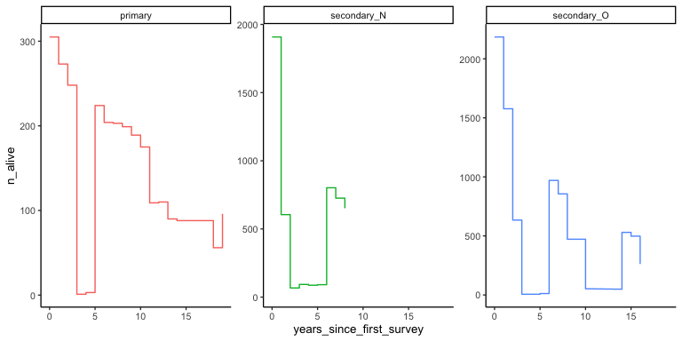
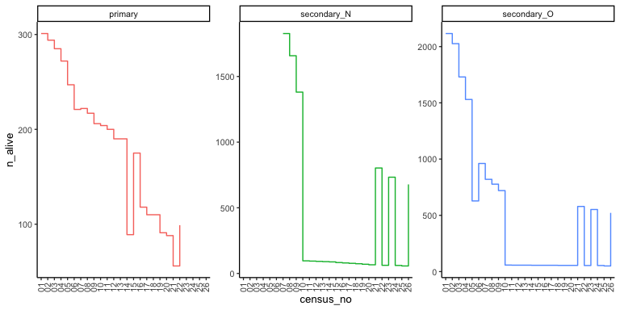
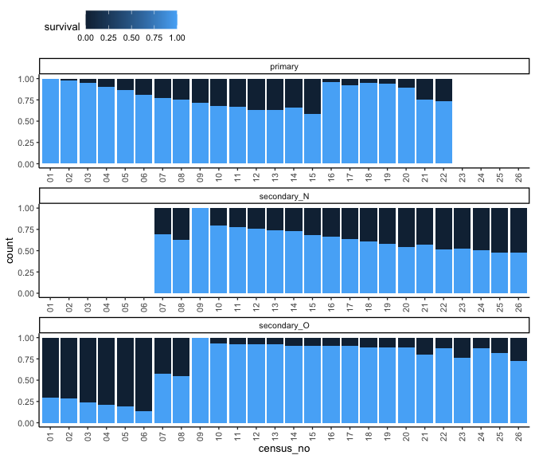
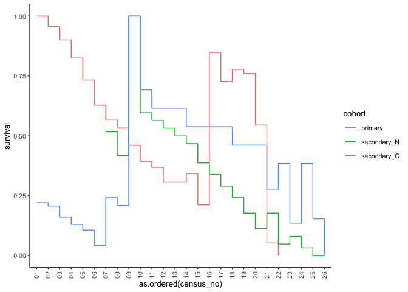

# Taking a look at survival
eleanorjackson
2024-09-04

``` r
library("tidyverse")
library("here")
library("patchwork")
```

Some resources for when we get to the modelling:

- https://parsnip.tidymodels.org/reference/details_proportional_hazards_survival.html
- https://betanalpha.github.io/assets/case_studies/survival_modeling.html

``` r
data <- 
  readRDS(here::here("data", "derived", "data_cleaned.rds"))
```

``` r
data <- 
  data %>% 
  drop_na(survival) %>% 
  group_by(plant_id) %>%
  slice_min(survey_date, with_ties = FALSE) %>%
  ungroup() %>% 
  select(plant_id, survey_date) %>%
  rename(first_survey = survey_date) %>% 
  right_join(data) 
```

``` r
data <-
  data %>% 
  drop_na(survival) %>%
  mutate(
    days_since_first_survey =
      survey_date - first_survey
  ) 
```

``` r
data %>% 
  filter(survival == 1) %>% 
  mutate(cohort = ifelse(forest_type == "secondary",
                         paste(forest_type, old_new, sep = "_"),
                         forest_type)) %>% 
  filter(cohort != "secondary_NA" ) %>% 
  mutate(years_since_first_survey = 
           floor(time_length(days_since_first_survey, "years"))) %>% 
  group_by(years_since_first_survey, cohort) %>% 
  summarise(n_alive = n_distinct(plant_id)) %>% 
  ggplot(aes(y = n_alive, x = years_since_first_survey, colour = cohort)) +
  geom_step() +
  facet_wrap(~cohort, scales = "free_y") +
  theme(legend.position = "none")
```



``` r
data %>% 
  filter(survival == 1) %>%
  mutate(cohort = ifelse(forest_type == "secondary",
                         paste(forest_type, old_new, sep = "_"),
                         forest_type)) %>% 
  filter(cohort != "secondary_NA" ) %>%
  mutate(census_no = as.ordered(census_no)) %>% 
  group_by(census_no, cohort) %>% 
  summarise(n_alive = n_distinct(plant_id)) %>% 
  ggplot(aes(y = n_alive, x = census_no, 
             colour = cohort, group = cohort)) +
  geom_step() +
  facet_wrap(~cohort, scales = "free_y") +
  theme(legend.position = "none") +
  guides(x =  guide_axis(angle = 90))
```



For both the DV and SBE sites, each census doesn’t cover every
plot/seedling, so we can’t really look at survival like this.

It’s still strange that the SBE seedlings fall off a cliff at the
beginning, whereas the Danum ones have a steady decline.

Did we miss the initial die-off when seedlings fail to establish
properly?

Try as a proportion …

``` r
data %>% 
  mutate(cohort = ifelse(forest_type == "secondary",
                         paste(forest_type, old_new, sep = "_"),
                         forest_type)) %>% 
  filter(cohort != "secondary_NA" ) %>% 
  ggplot(aes(x = census_no, group = survival, 
             fill = survival)) +
  geom_bar(position = "fill") +
  facet_wrap(~cohort, ncol = 1,
             axis.labels = "all_x", axes = "all_x") +
  guides(x =  guide_axis(angle = 90)) +
  theme(legend.position = "top", legend.justification = "left") 
```



… and now as a time-to-event dataset

``` r
data <-
  data %>%
  filter(survival == "0") %>%
  group_by(plant_id) %>%
  slice_min(lubridate::ymd(survey_date), with_ties = FALSE) %>%
  ungroup() %>% 
  select(plant_id, survey_date) %>%
  rename(dead_date = survey_date) %>% 
  left_join(data)
```

``` r
data %>% 
  filter(survey_date == dead_date) %>% 
  mutate(cohort = ifelse(forest_type == "secondary",
                         paste(forest_type, old_new, sep = "_"),
                         forest_type)) %>% 
  filter(cohort != "secondary_NA" ) %>% 
  mutate(years_since_first_survey = 
           floor(time_length(days_since_first_survey, "years"))) %>% 
  ggplot(aes(x = years_since_first_survey, 
             colour = cohort,
             group = cohort)) +
  geom_density(linewidth = 0.75) +
  ylab("Event density")
```


They are so different?

``` r
data %>% 
  mutate(cohort = ifelse(forest_type == "secondary",
                         paste(forest_type, old_new, sep = "_"),
                         forest_type)) %>% 
  filter(cohort != "secondary_NA" ) %>% 
  group_by(cohort, census_no, survival) %>% 
  summarise(n_distinct(plant_id), .groups = "drop") %>% 
  pivot_wider(names_from = survival, 
              values_from = `n_distinct(plant_id)`) %>% 
  mutate(`1` = replace_na(`1`, 0),
         `0` = replace_na(`0`, 0)) %>% 
  mutate(survival = `1` / (`1` +`0`)) %>% 
  ggplot(aes(y = survival, x = as.ordered(census_no), 
             colour = cohort, group = cohort)) +
  geom_step() +
  guides(x =  guide_axis(angle = 90))
```



:grimacing: I think we need to sort out the dead trees.
