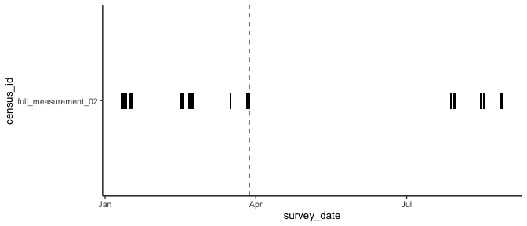
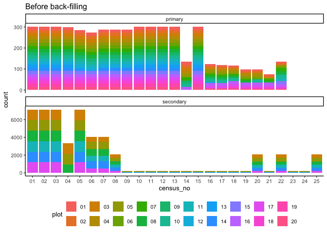
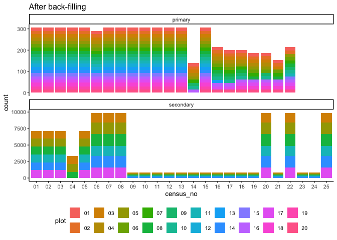
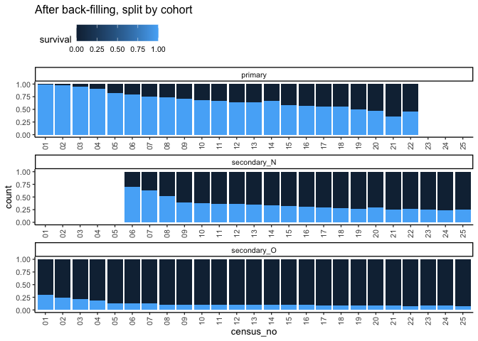
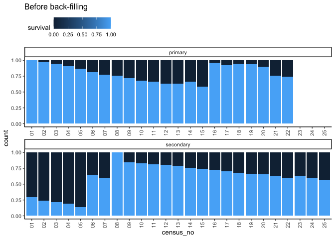
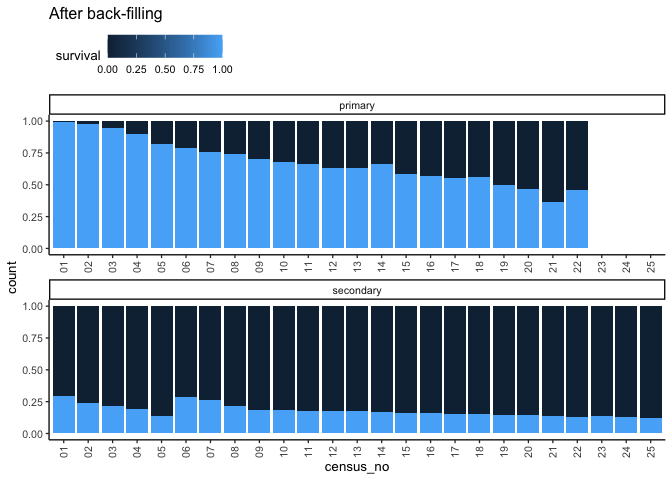
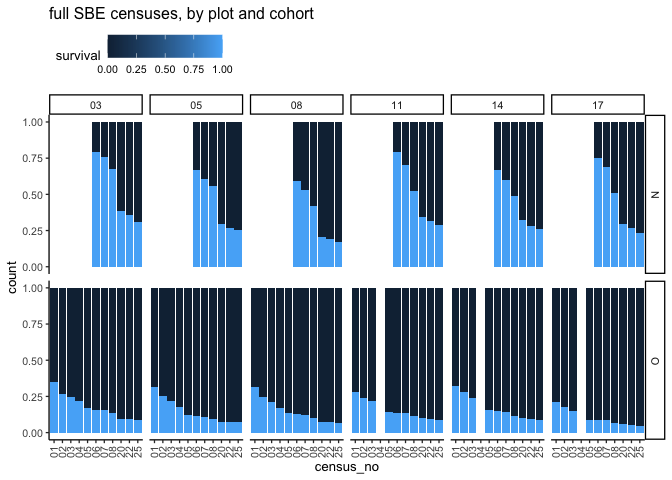
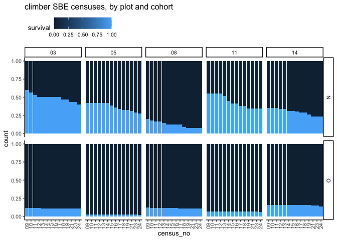
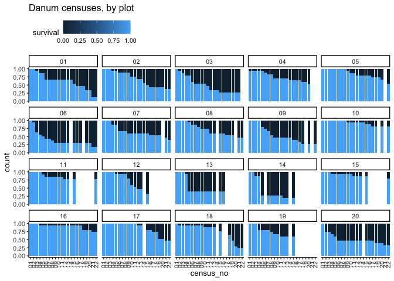

# Cleaning
eleanorjackson
2024-09-18

There are a few things that still need to be cleaned-up in the data.
Primarily,

- missing survey dates
- missing dead trees

``` r
library("tidyverse")
library("here")
library("patchwork")
library("janitor")
```

``` r
data <- 
  readRDS(here::here("data", "derived", "data_cleaned.rds")) %>% 
  drop_na(survival) # there are 35 trees with survival as NA?
```

## Missing survey dates

**When adding to the cleaning script, we need to do this step before
cleaning Lazarus trees.**

``` r
data %>% 
  filter(is.na(survey_date)) %>% glimpse
```

    Rows: 44
    Columns: 18
    $ forest_type   <chr> "primary", "primary", "primary", "primary", "primary", "…
    $ plant_id      <chr> "13_9", "13_9", "13_9", "13_9", "13_20", "13_20", "13_20…
    $ plot          <chr> "13", "13", "13", "13", "13", "13", "13", "13", "05", "0…
    $ line          <chr> NA, NA, NA, NA, NA, NA, NA, NA, "11", "11", "11", "11", …
    $ position      <chr> NA, NA, NA, NA, NA, NA, NA, NA, "001", "004", "014", "01…
    $ old_new       <chr> NA, NA, NA, NA, NA, NA, NA, NA, "O", "O", "N", "N", "O",…
    $ plant_no      <chr> "9", "9", "9", "9", "20", "20", "20", "20", NA, NA, NA, …
    $ genus         <chr> "Shorea", "Shorea", "Shorea", "Shorea", "Shorea", "Shore…
    $ species       <chr> "johorensis", "johorensis", "johorensis", "johorensis", …
    $ genus_species <chr> "Shorea_johorensis", "Shorea_johorensis", "Shorea_johore…
    $ planting_date <date> NA, NA, NA, NA, NA, NA, NA, NA, 2002-07-25, 2002-07-25,…
    $ census_id     <chr> "6", "7", "8", "9", "6", "7", "8", "9", "full_measuremen…
    $ survey_date   <date> NA, NA, NA, NA, NA, NA, NA, NA, NA, NA, NA, NA, NA, NA,…
    $ survival      <dbl> 0, 0, 0, 0, 1, 1, 1, 1, 1, 1, 1, 1, 1, 1, 1, 1, 1, 1, 1,…
    $ height_apex   <dbl> NA, NA, NA, NA, NA, NA, NA, NA, 71.7, 117.6, 277.0, 208.…
    $ dbh_mean      <dbl> NaN, NaN, NaN, NaN, NaN, NaN, NaN, NaN, NaN, NaN, 16.15,…
    $ dbase_mean    <dbl> NaN, NaN, NaN, NaN, NaN, NaN, NaN, NaN, 13.40, 11.35, 23…
    $ census_no     <chr> "06", "07", "08", "09", "06", "07", "08", "09", "08", "0…

There are only 79 trees with missing survey dates, which doesn’t seem so
bad.

``` r
data %>% 
  filter(is.na(survey_date)) %>% 
  filter(census_id == "full_measurement_02") %>% glimpse
```

    Rows: 36
    Columns: 18
    $ forest_type   <chr> "secondary", "secondary", "secondary", "secondary", "sec…
    $ plant_id      <chr> "05_11_001_O", "05_11_004_O", "05_11_014_N", "05_11_018_…
    $ plot          <chr> "05", "05", "05", "05", "05", "05", "05", "05", "05", "0…
    $ line          <chr> "11", "11", "11", "11", "11", "11", "11", "11", "11", "1…
    $ position      <chr> "001", "004", "014", "018", "040", "030", "031", "032", …
    $ old_new       <chr> "O", "O", "N", "N", "O", "N", "N", "N", "N", "O", "N", "…
    $ plant_no      <chr> NA, NA, NA, NA, NA, NA, NA, NA, NA, NA, NA, NA, NA, NA, …
    $ genus         <chr> "Parashorea", "Shorea", "Shorea", "Parashorea", "Diptero…
    $ species       <chr> "malaanonan", "macroptera", "leprosula", "malaanonan", "…
    $ genus_species <chr> "Parashorea_malaanonan", "Shorea_macroptera", "Shorea_le…
    $ planting_date <date> 2002-07-25, 2002-07-25, NA, NA, 2002-07-25, NA, NA, NA,…
    $ census_id     <chr> "full_measurement_02", "full_measurement_02", "full_meas…
    $ survey_date   <date> NA, NA, NA, NA, NA, NA, NA, NA, NA, NA, NA, NA, NA, NA,…
    $ survival      <dbl> 1, 1, 1, 1, 1, 1, 1, 1, 1, 1, 1, 1, 1, 1, 1, 1, 1, 1, 1,…
    $ height_apex   <dbl> 71.7, 117.6, 277.0, 208.0, 200.0, 162.8, 52.6, 151.0, 40…
    $ dbh_mean      <dbl> NaN, NaN, 16.15, 12.25, 8.90, 4.15, NaN, 5.45, NaN, 17.6…
    $ dbase_mean    <dbl> 13.40, 11.35, 23.40, 22.05, 18.90, 12.45, 6.40, 11.70, 4…
    $ census_no     <chr> "08", "08", "08", "08", "08", "08", "08", "08", "08", "0…

Most of the missing survey dates are in the `full_measurement_02`
census.

``` r
med_date <-
  data %>% 
  filter(census_id == "full_measurement_02") %>% 
  pull(survey_date) %>% 
  median(na.rm = TRUE)
  
data %>% 
  filter(census_id == "full_measurement_02") %>% 
  ggplot(aes(x = survey_date, y = census_id)) +
  geom_point(alpha = 0.8, shape = "|", size = 5) +
  geom_vline(xintercept = med_date, linetype = 2)
```



The `full_measurement_02` is a long census, but I think we should still
be ok to use the median survey date per census to fill in the missing
survey dates.

``` r
all_med_dates <-
  data %>% 
  group_by(census_id, census_no) %>% 
  summarise(median_date = median(survey_date, na.rm = TRUE)) 
```

``` r
data <- 
  data %>% 
  right_join(all_med_dates) %>% 
  mutate(survey_date = case_when(
    is.na(survey_date) ~ median_date,
    .default = survey_date
  )) %>% 
  select(-median_date)
```

## Backfill dead trees

We don’t want a record of every tree to be in every census, as not all
plots were visited in every census.

I only want to add a dead tree if it was visited not but recorded.

``` r
data %>% 
  filter(! str_detect(plant_id, "NA")) %>% 
  select(census_no, plot, forest_type) %>%
  distinct() %>% 
  glimpse()
```

    Rows: 509
    Columns: 3
    $ census_no   <chr> "16", "16", "16", "16", "16", "16", "17", "17", "17", "17"…
    $ plot        <chr> "01", "02", "03", "06", "13", "16", "01", "02", "03", "06"…
    $ forest_type <chr> "primary", "primary", "primary", "primary", "primary", "pr…

There are 509 unique census/plot/forest type combinations.

..also for the “climber” surveys, only 2 lines of each plot were
measured..

``` r
data %>% 
  filter(forest_type == "secondary" ) %>%
  group_by(census_no, census_id, plot) %>%  
  summarise(n_distinct(line)) %>%
  knitr::kable()
```

| census_no | census_id           | plot | n_distinct(line) |
|:----------|:--------------------|:-----|-----------------:|
| 01        | full_measurement_01 | 03   |               20 |
| 01        | full_measurement_01 | 05   |               20 |
| 01        | full_measurement_01 | 08   |               20 |
| 01        | full_measurement_01 | 11   |               20 |
| 01        | full_measurement_01 | 14   |               20 |
| 01        | full_measurement_01 | 17   |               20 |
| 02        | intensive_02        | 03   |               20 |
| 02        | intensive_02        | 05   |               20 |
| 02        | intensive_02        | 08   |               20 |
| 02        | intensive_02        | 11   |               20 |
| 02        | intensive_02        | 14   |               20 |
| 02        | intensive_02        | 17   |               20 |
| 03        | intensive_03        | 03   |               20 |
| 03        | intensive_03        | 05   |               20 |
| 03        | intensive_03        | 08   |               20 |
| 03        | intensive_03        | 11   |               20 |
| 03        | intensive_03        | 14   |               20 |
| 03        | intensive_03        | 17   |               20 |
| 04        | intensive_04        | 03   |               20 |
| 04        | intensive_04        | 05   |               20 |
| 04        | intensive_04        | 08   |               16 |
| 05        | intensive_05        | 03   |               20 |
| 05        | intensive_05        | 05   |               20 |
| 05        | intensive_05        | 08   |               20 |
| 05        | intensive_05        | 11   |               20 |
| 05        | intensive_05        | 14   |               20 |
| 05        | intensive_05        | 17   |               20 |
| 06        | intensive_06        | 03   |               20 |
| 06        | intensive_06        | 05   |               20 |
| 06        | intensive_06        | 08   |               20 |
| 06        | intensive_06        | 11   |               20 |
| 06        | intensive_06        | 14   |               20 |
| 06        | intensive_06        | 17   |               20 |
| 07        | intensive_07        | 03   |               20 |
| 07        | intensive_07        | 05   |               20 |
| 07        | intensive_07        | 08   |               20 |
| 07        | intensive_07        | 11   |               20 |
| 07        | intensive_07        | 14   |               20 |
| 07        | intensive_07        | 17   |               20 |
| 08        | full_measurement_02 | 03   |               20 |
| 08        | full_measurement_02 | 05   |               20 |
| 08        | full_measurement_02 | 08   |               20 |
| 08        | full_measurement_02 | 11   |               20 |
| 08        | full_measurement_02 | 14   |               20 |
| 08        | full_measurement_02 | 17   |               20 |
| 09        | climber_01          | 03   |                2 |
| 09        | climber_01          | 05   |                2 |
| 09        | climber_01          | 08   |                2 |
| 09        | climber_01          | 11   |                2 |
| 09        | climber_01          | 14   |                2 |
| 10        | climber_02          | 03   |                2 |
| 10        | climber_02          | 05   |                2 |
| 10        | climber_02          | 08   |                2 |
| 10        | climber_02          | 11   |                2 |
| 10        | climber_02          | 14   |                2 |
| 11        | climber_03          | 03   |                2 |
| 11        | climber_03          | 05   |                2 |
| 11        | climber_03          | 08   |                2 |
| 11        | climber_03          | 11   |                2 |
| 11        | climber_03          | 14   |                2 |
| 12        | climber_04          | 03   |                2 |
| 12        | climber_04          | 05   |                2 |
| 12        | climber_04          | 08   |                2 |
| 12        | climber_04          | 11   |                2 |
| 12        | climber_04          | 14   |                2 |
| 13        | climber_05          | 03   |                2 |
| 13        | climber_05          | 05   |                2 |
| 13        | climber_05          | 08   |                2 |
| 13        | climber_05          | 11   |                2 |
| 13        | climber_05          | 14   |                2 |
| 14        | climber_06          | 03   |                2 |
| 14        | climber_06          | 05   |                2 |
| 14        | climber_06          | 08   |                2 |
| 14        | climber_06          | 11   |                2 |
| 14        | climber_06          | 14   |                2 |
| 15        | climber_07          | 03   |                2 |
| 15        | climber_07          | 05   |                2 |
| 15        | climber_07          | 08   |                2 |
| 15        | climber_07          | 11   |                2 |
| 15        | climber_07          | 14   |                2 |
| 16        | climber_08          | 03   |                2 |
| 16        | climber_08          | 05   |                2 |
| 16        | climber_08          | 08   |                2 |
| 16        | climber_08          | 11   |                2 |
| 16        | climber_08          | 14   |                2 |
| 17        | climber_09          | 03   |                2 |
| 17        | climber_09          | 05   |                2 |
| 17        | climber_09          | 08   |                2 |
| 17        | climber_09          | 11   |                2 |
| 17        | climber_09          | 14   |                2 |
| 18        | climber_10          | 03   |                2 |
| 18        | climber_10          | 05   |                2 |
| 18        | climber_10          | 08   |                2 |
| 18        | climber_10          | 11   |                2 |
| 18        | climber_10          | 14   |                2 |
| 19        | climber_11          | 03   |                2 |
| 19        | climber_11          | 05   |                2 |
| 19        | climber_11          | 08   |                2 |
| 19        | climber_11          | 11   |                2 |
| 19        | climber_11          | 14   |                2 |
| 20        | intensive_08        | 03   |               20 |
| 20        | intensive_08        | 05   |               20 |
| 20        | intensive_08        | 08   |               20 |
| 20        | intensive_08        | 11   |               20 |
| 20        | intensive_08        | 14   |               20 |
| 20        | intensive_08        | 17   |               20 |
| 21        | climber_12          | 03   |                2 |
| 21        | climber_12          | 05   |                2 |
| 21        | climber_12          | 08   |                2 |
| 21        | climber_12          | 11   |                2 |
| 21        | climber_12          | 14   |                2 |
| 22        | intensive_09        | 03   |               20 |
| 22        | intensive_09        | 05   |               20 |
| 22        | intensive_09        | 08   |               20 |
| 22        | intensive_09        | 11   |               20 |
| 22        | intensive_09        | 14   |               20 |
| 22        | intensive_09        | 17   |               20 |
| 23        | climber_13          | 03   |                2 |
| 23        | climber_13          | 05   |                2 |
| 23        | climber_13          | 08   |                2 |
| 23        | climber_13          | 11   |                2 |
| 23        | climber_13          | 14   |                2 |
| 24        | climber_14          | 03   |                2 |
| 24        | climber_14          | 05   |                2 |
| 24        | climber_14          | 08   |                2 |
| 24        | climber_14          | 11   |                2 |
| 24        | climber_14          | 14   |                2 |
| 25        | intensive_10        | 03   |               20 |
| 25        | intensive_10        | 05   |               20 |
| 25        | intensive_10        | 08   |               20 |
| 25        | intensive_10        | 11   |               20 |
| 25        | intensive_10        | 14   |               20 |
| 25        | intensive_10        | 17   |               20 |

And strangely for the 4th intensive survey only 16 out of 20 lines were
surveyed?

I’m going to add line to the plot id for the SBE plots - so that we can
get a list of plant ids per line.

``` r
data <- 
  data %>% 
  mutate(plot_line = case_when(
    forest_type == "secondary" ~ paste(plot, line, sep = "_"),
    .default = plot
  ))
```

``` r
data %>% 
  filter(! str_detect(plant_id, "NA")) %>% 
  select(census_id, census_no, plot_line, forest_type) %>%
  distinct() %>% 
  glimpse()
```

    Rows: 1,772
    Columns: 4
    $ census_id   <chr> "DanumGaps_Data_2015.xlsx", "DanumGaps_Data_2015.xlsx", "D…
    $ census_no   <chr> "16", "16", "16", "16", "16", "16", "17", "17", "17", "17"…
    $ plot_line   <chr> "01", "02", "03", "06", "13", "16", "01", "02", "03", "06"…
    $ forest_type <chr> "primary", "primary", "primary", "primary", "primary", "pr…

There are 1,772 unique census/plot/forest type/line combinations.

First let’s get list of every unique tree in each plot/line (not
including trees which are missing location data - there are some SBE
trees with NAs for position/line).

``` r
plants_in_plots <- 
  data %>% 
  filter(! str_detect(plant_id, "NA")) %>% 
  select(forest_type, plot_line, plant_id) %>% 
  distinct() %>% 
  group_by(forest_type, plot_line) %>% 
  nest(.key = "id_list") %>% 
  ungroup()
```

Then, get those 1,772 unique census/plot/forest type/line combinations
to use as an index.

``` r
keys <- data %>% 
  select(census_id, census_no, plot_line, forest_type) %>%
  distinct() %>% 
  left_join(plants_in_plots, by = c("plot_line", "forest_type"))
```

Then, create a function that will add in any missing plant_ids and
record them as “dead”

``` r
backfill_trees <- function(census_name, census, plot_no, site,
                           tree_ids, data) {
  data %>% 
    filter(census_id == census_name,
           census_no == census,
           plot_line == plot_no,
           forest_type == site) %>% 
    full_join(tree_ids, by = "plant_id") %>% 
    mutate(survival = replace_na(survival, 0)) %>% 
    ungroup() %>% 
    tidyr::fill(forest_type, plot, census_id, census_no, plot_line)
}
```

Test the function with a single census/plot/forest type combination

``` r
backfill_trees(census_name = keys$census_id[[1]], 
               census = keys$census_no[[1]], 
               plot_no = keys$plot_line[[1]], 
               site = keys$forest_type[[1]], 
               tree_ids = keys$id_list[[1]], 
               data = data) %>% 
  glimpse
```

    Rows: 15
    Columns: 19
    $ forest_type   <chr> "primary", "primary", "primary", "primary", "primary", "…
    $ plant_id      <chr> "01_6", "01_1", "01_2", "01_9", "01_13", "01_16", "01_17…
    $ plot          <chr> "01", "01", "01", "01", "01", "01", "01", "01", "01", "0…
    $ line          <chr> NA, NA, NA, NA, NA, NA, NA, NA, NA, NA, NA, NA, NA, NA, …
    $ position      <chr> NA, NA, NA, NA, NA, NA, NA, NA, NA, NA, NA, NA, NA, NA, …
    $ old_new       <chr> NA, NA, NA, NA, NA, NA, NA, NA, NA, NA, NA, NA, NA, NA, …
    $ plant_no      <chr> "6", "1", "2", "9", "13", "16", "17", "19", NA, NA, NA, …
    $ genus         <chr> "Hopea", "Dipterocarpus", "Shorea", "Shorea", "Shorea", …
    $ species       <chr> "sangal", "conformis", "ovalis", "johorensis", "macropte…
    $ genus_species <chr> "Hopea_sangal", "Dipterocarpus_conformis", "Shorea_ovali…
    $ planting_date <date> NA, NA, NA, NA, NA, NA, NA, NA, NA, NA, NA, NA, NA, NA,…
    $ census_id     <chr> "DanumGaps_Data_2015.xlsx", "DanumGaps_Data_2015.xlsx", …
    $ survey_date   <date> 2015-09-09, 2015-09-09, 2015-09-09, 2015-09-09, 2015-09…
    $ survival      <dbl> 1, 1, 1, 1, 1, 1, 0, 1, 0, 0, 0, 0, 0, 0, 0
    $ height_apex   <dbl> NA, NA, NA, NA, NA, NA, NA, NA, NA, NA, NA, NA, NA, NA, …
    $ dbh_mean      <dbl> 51.00, 4.45, 47.00, 128.00, 89.00, 5.00, 75.00, 14.00, N…
    $ dbase_mean    <dbl> 61.00, 15.00, 53.00, 126.00, 115.00, 20.45, 79.00, 22.95…
    $ census_no     <chr> "16", "16", "16", "16", "16", "16", "16", "16", "16", "1…
    $ plot_line     <chr> "01", "01", "01", "01", "01", "01", "01", "01", "01", "0…

Now map the function across all 1,772 unique census/plot/forest
type/line combinations. This might take a while to run..

``` r
data_backfilled <-
  pmap(
    .f = backfill_trees,
    .l = list(
      census_name = keys$census_id,
      census = keys$census_no,
      plot_no = keys$plot_line,
      site = keys$forest_type,
      tree_ids = keys$id_list
    ),
      data = data
  ) %>%
  bind_rows()
```

``` r
data %>% ungroup() %>% count() 
```

    # A tibble: 1 × 1
          n
      <int>
    1 56117

``` r
data_backfilled %>% ungroup() %>% count() 
```

    # A tibble: 1 × 1
           n
       <int>
    1 121286

We have massively increased the size of the data

``` r
data_backfilled %>% filter(survival == 1) %>% ungroup() %>% count() 
```

    # A tibble: 1 × 1
          n
      <int>
    1 23903

``` r
data %>% filter(survival == 1) %>% ungroup() %>% count() 
```

    # A tibble: 1 × 1
          n
      <int>
    1 23903

But we still have the same number of alive trees, which is good.

To fill in the plant-level data (which is missing for the dead trees
we’ve just added), I want to check if any plants switch species ID.

``` r
sp_switch_plants <- 
  data_backfilled %>% 
  group_by(plant_id) %>% 
  summarise(n_distinct(genus_species, na.rm = TRUE)) %>% 
  filter(`n_distinct(genus_species, na.rm = TRUE)` > 1) %>% 
  pull(plant_id)

length(sp_switch_plants)
```

    [1] 10

There are 10 plants which switch species, which is not too bad

``` r
data_backfilled %>% 
  filter(! is.na(genus_species)) %>% 
  filter(plant_id %in% sp_switch_plants) %>% 
  arrange(plant_id) %>% 
  knitr::kable()
```

| forest_type | plant_id | plot | line | position | old_new | plant_no | genus | species | genus_species | planting_date | census_id | survey_date | survival | height_apex | dbh_mean | dbase_mean | census_no | plot_line |
|:---|:---|:---|:---|:---|:---|:---|:---|:---|:---|:---|:---|:---|---:|---:|---:|---:|:---|:---|
| secondary | 05_04_043_N | 05 | 04 | 043 | N | NA | Shorea | leprosula | Shorea_leprosula | NA | intensive_06 | 2011-05-16 | 1 | 46.5 | NaN | 3.40 | 06 | 05_04 |
| secondary | 05_04_043_N | 05 | 04 | 043 | N | NA | Shorea | macrophylla | Shorea_macrophylla | NA | intensive_07 | 2011-10-25 | 0 | NA | NaN | NaN | 07 | 05_04 |
| secondary | 05_16_043_N | 05 | 16 | 043 | N | NA | Shorea | leprosula | Shorea_leprosula | NA | intensive_06 | 2011-05-18 | 1 | 97.5 | NaN | 6.85 | 06 | 05_16 |
| secondary | 05_16_043_N | 05 | 16 | 043 | N | NA | Shorea | leprosula | Shorea_leprosula | NA | intensive_07 | 2011-10-25 | 0 | NA | NaN | NaN | 07 | 05_16 |
| secondary | 05_16_043_N | 05 | 16 | 043 | N | NA | Shorea | faguetiana | Shorea_faguetiana | NA | intensive_10 | 2020-02-25 | 0 | NA | NaN | NaN | 25 | 05_16 |
| secondary | 11_04_032_N | 11 | 04 | 032 | N | NA | Shorea | johorensis | Shorea_johorensis | NA | intensive_06 | 2011-05-25 | 1 | 38.0 | NaN | 3.90 | 06 | 11_04 |
| secondary | 11_04_032_N | 11 | 04 | 032 | N | NA | Shorea | gibbosa | Shorea_gibbosa | NA | intensive_07 | 2011-10-31 | 0 | NA | NaN | NaN | 07 | 11_04 |
| secondary | 11_15_044_N | 11 | 15 | 044 | N | NA | Shorea | argentifolia | Shorea_argentifolia | NA | intensive_06 | 2011-05-24 | 1 | 89.4 | NaN | 5.45 | 06 | 11_15 |
| secondary | 11_15_044_N | 11 | 15 | 044 | N | NA | Shorea | argentifolia | Shorea_argentifolia | NA | intensive_07 | 2011-10-28 | 1 | NA | NaN | NaN | 07 | 11_15 |
| secondary | 11_15_044_N | 11 | 15 | 044 | N | NA | Shorea | macroptera | Shorea_macroptera | NA | intensive_08 | 2018-04-18 | 1 | 170.5 | 5.55 | 13.70 | 20 | 11_15 |
| secondary | 11_15_044_N | 11 | 15 | 044 | N | NA | Shorea | macroptera | Shorea_macroptera | NA | intensive_09 | 2019-03-15 | 1 | 178.0 | 6.05 | 15.30 | 22 | 11_15 |
| secondary | 11_15_044_N | 11 | 15 | 044 | N | NA | Shorea | macroptera | Shorea_macroptera | NA | intensive_10 | 2020-02-20 | 0 | NA | NaN | NaN | 25 | 11_15 |
| secondary | 14_08_021_N | 14 | 08 | 021 | N | NA | Shorea | johorensis | Shorea_johorensis | NA | intensive_06 | 2011-05-23 | 1 | 33.0 | NaN | 4.80 | 06 | 14_08 |
| secondary | 14_08_021_N | 14 | 08 | 021 | N | NA | Shorea | johorensis | Shorea_johorensis | NA | intensive_07 | 2011-10-28 | 1 | NA | NaN | 6.35 | 07 | 14_08 |
| secondary | 14_08_021_N | 14 | 08 | 021 | N | NA | Shorea | gibbosa | Shorea_gibbosa | NA | intensive_10 | 2020-02-28 | 1 | 194.5 | 5.15 | 15.65 | 25 | 14_08 |
| secondary | 14_10_009_N | 14 | 10 | 009 | N | NA | Shorea | parvifolia | Shorea_parvifolia | NA | intensive_06 | 2011-05-21 | 1 | 44.5 | NaN | 4.35 | 06 | 14_10 |
| secondary | 14_10_009_N | 14 | 10 | 009 | N | NA | Shorea | leprosula | Shorea_leprosula | NA | intensive_07 | 2011-10-28 | 1 | NA | NaN | 4.95 | 07 | 14_10 |
| secondary | 14_14_104_N | 14 | 14 | 104 | N | NA | Parashorea | malaanonan | Parashorea_malaanonan | NA | climber_01 | 2014-05-07 | 1 | 44.0 | NaN | 5.10 | 09 | 14_14 |
| secondary | 14_14_104_N | 14 | 14 | 104 | N | NA | Parashorea | malaanonan | Parashorea_malaanonan | NA | climber_02 | 2014-07-15 | 1 | 50.0 | NaN | 5.25 | 10 | 14_14 |
| secondary | 14_14_104_N | 14 | 14 | 104 | N | NA | Parashorea | malaanonan | Parashorea_malaanonan | NA | climber_03 | 2014-11-18 | 1 | 52.0 | NaN | 5.00 | 11 | 14_14 |
| secondary | 14_14_104_N | 14 | 14 | 104 | N | NA | Parashorea | malaanonan | Parashorea_malaanonan | NA | climber_04 | 2015-03-10 | 1 | 55.0 | NaN | 5.30 | 12 | 14_14 |
| secondary | 14_14_104_N | 14 | 14 | 104 | N | NA | Parashorea | malaanonan | Parashorea_malaanonan | NA | climber_05 | 2015-06-08 | 1 | 61.2 | NaN | 7.35 | 13 | 14_14 |
| secondary | 14_14_104_N | 14 | 14 | 104 | N | NA | Parashorea | malaanonan | Parashorea_malaanonan | NA | climber_06 | 2015-10-28 | 1 | 93.5 | NaN | 7.50 | 14 | 14_14 |
| secondary | 14_14_104_N | 14 | 14 | 104 | N | NA | Parashorea | malaanonan | Parashorea_malaanonan | NA | climber_07 | 2016-03-15 | 1 | 93.5 | NaN | 8.25 | 15 | 14_14 |
| secondary | 14_14_104_N | 14 | 14 | 104 | N | NA | Parashorea | malaanonan | Parashorea_malaanonan | NA | climber_08 | 2016-08-12 | 1 | 93.0 | NaN | 9.20 | 16 | 14_14 |
| secondary | 14_14_104_N | 14 | 14 | 104 | N | NA | Parashorea | malaanonan | Parashorea_malaanonan | NA | climber_09 | 2017-05-16 | 1 | 115.0 | NaN | 9.95 | 17 | 14_14 |
| secondary | 14_14_104_N | 14 | 14 | 104 | N | NA | Parashorea | tomentella | Parashorea_tomentella | NA | climber_10 | 2017-07-27 | 1 | 118.0 | NaN | 10.20 | 18 | 14_14 |
| secondary | 14_14_104_N | 14 | 14 | 104 | N | NA | Parashorea | tomentella | Parashorea_tomentella | NA | climber_11 | 2018-02-24 | 1 | 116.0 | NaN | 9.00 | 19 | 14_14 |
| secondary | 14_14_104_N | 14 | 14 | 104 | N | NA | Parashorea | tomentella | Parashorea_tomentella | NA | climber_12 | 2018-12-01 | 1 | 117.0 | NaN | 10.00 | 21 | 14_14 |
| secondary | 14_14_104_N | 14 | 14 | 104 | N | NA | Parashorea | tomentella | Parashorea_tomentella | NA | climber_13 | 2019-04-10 | 1 | 116.5 | NaN | 9.75 | 23 | 14_14 |
| secondary | 14_14_104_N | 14 | 14 | 104 | N | NA | Parashorea | tomentella | Parashorea_tomentella | NA | climber_14 | 2019-11-11 | 1 | 120.0 | NaN | 9.85 | 24 | 14_14 |
| secondary | 14_17_001_N | 14 | 17 | 001 | N | NA | Hopea | sangal | Hopea_sangal | NA | intensive_06 | 2011-05-23 | 1 | NA | NaN | NaN | 06 | 14_17 |
| secondary | 14_17_001_N | 14 | 17 | 001 | N | NA | Shorea | beccariana | Shorea_beccariana | NA | intensive_07 | 2011-10-27 | 1 | NA | NaN | 7.60 | 07 | 14_17 |
| secondary | 17_12_001_N | 17 | 12 | 001 | N | NA | Shorea | johorensis | Shorea_johorensis | NA | intensive_06 | 2011-05-26 | 1 | 460.0 | 34.05 | 47.20 | 06 | 17_12 |
| secondary | 17_12_001_N | 17 | 12 | 001 | N | NA | Shorea | macroptera | Shorea_macroptera | NA | intensive_07 | 2011-10-31 | 1 | NA | NaN | 56.55 | 07 | 17_12 |
| secondary | 17_15_001_N | 17 | 15 | 001 | N | NA | Shorea | macrophylla | Shorea_macrophylla | NA | intensive_06 | 2011-05-25 | 1 | 40.0 | NaN | 10.60 | 06 | 17_15 |
| secondary | 17_15_001_N | 17 | 15 | 001 | N | NA | Shorea | macrophylla | Shorea_macrophylla | NA | intensive_07 | 2011-10-31 | 0 | NA | NaN | 10.45 | 07 | 17_15 |
| secondary | 17_15_001_N | 17 | 15 | 001 | N | NA | Dryobalanops | lanceolata | Dryobalanops_lanceolata | NA | intensive_10 | 2020-03-03 | 0 | NA | NaN | NaN | 25 | 17_15 |

Let’s assume that the most recent ID is the most accurate.

``` r
sp_index <- 
  data_backfilled %>% 
  filter(! is.na(genus_species)) %>% 
  filter(plant_id %in% sp_switch_plants) %>% 
  group_by(plant_id) %>% 
  slice_max(survey_date) %>% 
  select(plant_id, genus, species, genus_species)
  
data_backfilled <-
  data_backfilled %>%
  rows_update(sp_index, by = "plant_id", unmatched = "ignore")
```

Ok, now we can fill in all the data that is missing from the dead trees
that we just added

``` r
data_backfilled <-
  data_backfilled %>% 
  dplyr::group_by(plant_id) %>% 
  arrange(survey_date, .by_group = TRUE) %>% 
  tidyr::fill(line:planting_date, .direction = "updown") %>% 
  ungroup()
```

Want to check that the number of plants is now consistent for each plot
across censuses.

``` r
data_backfilled %>% 
  filter(! str_detect(plant_id, "NA")) %>% 
  group_by(census_no, plot, forest_type) %>% 
  summarise(n = n_distinct(plant_id)) %>%
  pivot_wider(names_from = census_no, values_from = n) %>% 
  arrange(forest_type) %>% 
  knitr::kable()
```

| plot | forest_type | 01 | 02 | 03 | 04 | 05 | 06 | 07 | 08 | 09 | 10 | 11 | 12 | 13 | 14 | 15 | 16 | 17 | 18 | 19 | 20 | 21 | 22 | 23 | 24 | 25 |
|:---|:---|---:|---:|---:|---:|---:|---:|---:|---:|---:|---:|---:|---:|---:|---:|---:|---:|---:|---:|---:|---:|---:|---:|---:|---:|---:|
| 01 | primary | 15 | 15 | 15 | 15 | 15 | 15 | 15 | 15 | 15 | 15 | 15 | 15 | 15 | 15 | 15 | 15 | 15 | 15 | 15 | 15 | 15 | 15 | NA | NA | NA |
| 02 | primary | 16 | 16 | 16 | 16 | 16 | 16 | 16 | 16 | 16 | 16 | 16 | 16 | 16 | 16 | 16 | 16 | 16 | 16 | 16 | 16 | 16 | 16 | NA | NA | NA |
| 03 | primary | 15 | 15 | 15 | 15 | 15 | 15 | 15 | 15 | 15 | 15 | 15 | 15 | 15 | 15 | 15 | 15 | 15 | 15 | 15 | 15 | 15 | NA | NA | NA | NA |
| 04 | primary | 17 | 17 | 17 | 17 | 17 | 17 | 17 | 17 | 17 | 17 | 17 | 17 | 17 | 17 | 17 | 17 | 17 | 17 | 17 | 17 | NA | NA | NA | NA | NA |
| 05 | primary | 15 | 15 | 15 | 15 | 15 | 15 | 15 | 15 | 15 | 15 | 15 | 15 | 15 | 15 | 15 | 15 | 15 | 15 | 15 | 15 | NA | 15 | NA | NA | NA |
| 06 | primary | 16 | 16 | 16 | 16 | 16 | 16 | 16 | 16 | 16 | 16 | 16 | 16 | 16 | NA | 16 | 16 | 16 | NA | 16 | 16 | 16 | 16 | NA | NA | NA |
| 07 | primary | 15 | 15 | 15 | 15 | 15 | 15 | 15 | 15 | 15 | 15 | 15 | 15 | 15 | 15 | 15 | 15 | 15 | 15 | 15 | NA | 15 | 15 | NA | NA | NA |
| 08 | primary | 15 | 15 | 15 | 15 | 15 | 15 | 15 | 15 | 15 | 15 | 15 | 15 | 15 | NA | 15 | 15 | 15 | 15 | 15 | NA | 15 | 15 | NA | NA | NA |
| 09 | primary | 15 | 15 | 15 | 15 | 15 | 15 | 15 | 15 | 15 | 15 | 15 | 15 | 15 | 15 | 15 | 15 | 15 | 15 | NA | 15 | NA | 15 | NA | NA | NA |
| 10 | primary | 16 | 16 | 16 | 16 | 16 | 16 | 16 | 16 | 16 | 16 | 16 | 16 | 16 | 16 | 16 | 16 | 16 | 16 | NA | 16 | NA | 16 | NA | NA | NA |
| 11 | primary | 14 | 14 | 14 | 14 | 14 | 14 | 14 | 14 | 14 | 14 | 14 | 14 | 14 | NA | 14 | NA | NA | NA | NA | NA | NA | 14 | NA | NA | NA |
| 12 | primary | 15 | 15 | 15 | 15 | 15 | 15 | 15 | 15 | 15 | 15 | 15 | 15 | 15 | NA | 15 | NA | NA | NA | NA | NA | NA | NA | NA | NA | NA |
| 13 | primary | 15 | 15 | 15 | 15 | 15 | 15 | 15 | 15 | 15 | 15 | 15 | 15 | 15 | NA | 15 | 15 | NA | NA | NA | NA | NA | NA | NA | NA | NA |
| 14 | primary | 15 | 15 | 15 | 15 | 15 | NA | 15 | 15 | 15 | 15 | 15 | 15 | 15 | NA | 15 | NA | NA | NA | NA | NA | NA | NA | NA | NA | NA |
| 15 | primary | 15 | 15 | 15 | 15 | 15 | 15 | 15 | 15 | 15 | 15 | 15 | 15 | 15 | NA | 15 | NA | NA | NA | NA | NA | NA | 15 | NA | NA | NA |
| 16 | primary | 15 | 15 | 15 | 15 | 15 | 15 | 15 | 15 | 15 | 15 | 15 | 15 | 15 | 15 | 15 | 15 | 15 | 15 | 15 | 15 | 15 | 15 | NA | NA | NA |
| 17 | primary | 15 | 15 | 15 | 15 | 15 | 15 | 15 | 15 | 15 | 15 | 15 | 15 | 15 | NA | 15 | 15 | 15 | 15 | 15 | 15 | 15 | 15 | NA | NA | NA |
| 18 | primary | 17 | 17 | 17 | 17 | 17 | 17 | 17 | 17 | 17 | 17 | 17 | 17 | 17 | NA | 17 | NA | NA | 17 | 17 | 17 | 17 | 17 | NA | NA | NA |
| 19 | primary | 15 | 15 | 15 | 15 | 15 | 15 | 15 | 15 | 15 | 15 | 15 | 15 | 15 | NA | 15 | NA | NA | NA | NA | NA | NA | NA | NA | NA | NA |
| 20 | primary | 15 | 15 | 15 | 15 | 15 | 15 | 15 | 15 | 15 | 15 | 15 | 15 | 15 | NA | 15 | 15 | 15 | 15 | 15 | 15 | 15 | 15 | NA | NA | NA |
| 03 | secondary | 1494 | 1494 | 1494 | 1494 | 1494 | 1494 | 1494 | 1494 | 144 | 144 | 144 | 144 | 144 | 144 | 144 | 144 | 144 | 144 | 144 | 1494 | 144 | 1494 | 144 | 144 | 1494 |
| 05 | secondary | 1748 | 1748 | 1748 | 1748 | 1748 | 1748 | 1748 | 1748 | 173 | 173 | 173 | 173 | 173 | 173 | 173 | 173 | 173 | 173 | 173 | 1748 | 173 | 1748 | 173 | 173 | 1748 |
| 08 | secondary | 1758 | 1758 | 1758 | 1413 | 1758 | 1758 | 1758 | 1758 | 178 | 178 | 178 | 178 | 178 | 178 | 178 | 178 | 178 | 178 | 178 | 1758 | 178 | 1758 | 178 | 178 | 1758 |
| 11 | secondary | 1571 | 1571 | 1571 | NA | 1571 | 1571 | 1571 | 1571 | 149 | 149 | 149 | 149 | 149 | 149 | 149 | 149 | 149 | 149 | 149 | 1571 | 149 | 1571 | 149 | 149 | 1571 |
| 14 | secondary | 1753 | 1753 | 1753 | NA | 1753 | 1753 | 1753 | 1753 | 197 | 197 | 197 | 197 | 197 | 197 | 197 | 197 | 197 | 197 | 197 | 1753 | 197 | 1753 | 197 | 197 | 1753 |
| 17 | secondary | 1559 | 1559 | 1559 | NA | 1559 | 1559 | 1559 | 1559 | NA | NA | NA | NA | NA | NA | NA | NA | NA | NA | NA | 1559 | NA | 1559 | NA | NA | 1559 |

OK, I’ve noticed a problem..

The new cohort of trees in the SBE were planted from census 6 onwards,
but we’ve just put them into previous censuses!

Should be an easy fix to just filter them out.

``` r
data_backfilled_f <-
  data_backfilled %>% 
  filter(!
    (forest_type == "secondary" & 
       old_new == "N" & 
       census_no %in% c("01", "02", "03", "04", "05") )
  ) 
```

``` r
data_backfilled_f %>% 
  filter(! str_detect(plant_id, "NA")) %>% 
  group_by(census_no, plot, forest_type) %>% 
  summarise(n = n_distinct(plant_id)) %>%
  pivot_wider(names_from = census_no, values_from = n) %>% 
  arrange(forest_type) %>% 
  knitr::kable()
```

| plot | forest_type | 01 | 02 | 03 | 04 | 05 | 06 | 07 | 08 | 09 | 10 | 11 | 12 | 13 | 14 | 15 | 16 | 17 | 18 | 19 | 20 | 21 | 22 | 23 | 24 | 25 |
|:---|:---|---:|---:|---:|---:|---:|---:|---:|---:|---:|---:|---:|---:|---:|---:|---:|---:|---:|---:|---:|---:|---:|---:|---:|---:|---:|
| 01 | primary | 15 | 15 | 15 | 15 | 15 | 15 | 15 | 15 | 15 | 15 | 15 | 15 | 15 | 15 | 15 | 15 | 15 | 15 | 15 | 15 | 15 | 15 | NA | NA | NA |
| 02 | primary | 16 | 16 | 16 | 16 | 16 | 16 | 16 | 16 | 16 | 16 | 16 | 16 | 16 | 16 | 16 | 16 | 16 | 16 | 16 | 16 | 16 | 16 | NA | NA | NA |
| 03 | primary | 15 | 15 | 15 | 15 | 15 | 15 | 15 | 15 | 15 | 15 | 15 | 15 | 15 | 15 | 15 | 15 | 15 | 15 | 15 | 15 | 15 | NA | NA | NA | NA |
| 04 | primary | 17 | 17 | 17 | 17 | 17 | 17 | 17 | 17 | 17 | 17 | 17 | 17 | 17 | 17 | 17 | 17 | 17 | 17 | 17 | 17 | NA | NA | NA | NA | NA |
| 05 | primary | 15 | 15 | 15 | 15 | 15 | 15 | 15 | 15 | 15 | 15 | 15 | 15 | 15 | 15 | 15 | 15 | 15 | 15 | 15 | 15 | NA | 15 | NA | NA | NA |
| 06 | primary | 16 | 16 | 16 | 16 | 16 | 16 | 16 | 16 | 16 | 16 | 16 | 16 | 16 | NA | 16 | 16 | 16 | NA | 16 | 16 | 16 | 16 | NA | NA | NA |
| 07 | primary | 15 | 15 | 15 | 15 | 15 | 15 | 15 | 15 | 15 | 15 | 15 | 15 | 15 | 15 | 15 | 15 | 15 | 15 | 15 | NA | 15 | 15 | NA | NA | NA |
| 08 | primary | 15 | 15 | 15 | 15 | 15 | 15 | 15 | 15 | 15 | 15 | 15 | 15 | 15 | NA | 15 | 15 | 15 | 15 | 15 | NA | 15 | 15 | NA | NA | NA |
| 09 | primary | 15 | 15 | 15 | 15 | 15 | 15 | 15 | 15 | 15 | 15 | 15 | 15 | 15 | 15 | 15 | 15 | 15 | 15 | NA | 15 | NA | 15 | NA | NA | NA |
| 10 | primary | 16 | 16 | 16 | 16 | 16 | 16 | 16 | 16 | 16 | 16 | 16 | 16 | 16 | 16 | 16 | 16 | 16 | 16 | NA | 16 | NA | 16 | NA | NA | NA |
| 11 | primary | 14 | 14 | 14 | 14 | 14 | 14 | 14 | 14 | 14 | 14 | 14 | 14 | 14 | NA | 14 | NA | NA | NA | NA | NA | NA | 14 | NA | NA | NA |
| 12 | primary | 15 | 15 | 15 | 15 | 15 | 15 | 15 | 15 | 15 | 15 | 15 | 15 | 15 | NA | 15 | NA | NA | NA | NA | NA | NA | NA | NA | NA | NA |
| 13 | primary | 15 | 15 | 15 | 15 | 15 | 15 | 15 | 15 | 15 | 15 | 15 | 15 | 15 | NA | 15 | 15 | NA | NA | NA | NA | NA | NA | NA | NA | NA |
| 14 | primary | 15 | 15 | 15 | 15 | 15 | NA | 15 | 15 | 15 | 15 | 15 | 15 | 15 | NA | 15 | NA | NA | NA | NA | NA | NA | NA | NA | NA | NA |
| 15 | primary | 15 | 15 | 15 | 15 | 15 | 15 | 15 | 15 | 15 | 15 | 15 | 15 | 15 | NA | 15 | NA | NA | NA | NA | NA | NA | 15 | NA | NA | NA |
| 16 | primary | 15 | 15 | 15 | 15 | 15 | 15 | 15 | 15 | 15 | 15 | 15 | 15 | 15 | 15 | 15 | 15 | 15 | 15 | 15 | 15 | 15 | 15 | NA | NA | NA |
| 17 | primary | 15 | 15 | 15 | 15 | 15 | 15 | 15 | 15 | 15 | 15 | 15 | 15 | 15 | NA | 15 | 15 | 15 | 15 | 15 | 15 | 15 | 15 | NA | NA | NA |
| 18 | primary | 17 | 17 | 17 | 17 | 17 | 17 | 17 | 17 | 17 | 17 | 17 | 17 | 17 | NA | 17 | NA | NA | 17 | 17 | 17 | 17 | 17 | NA | NA | NA |
| 19 | primary | 15 | 15 | 15 | 15 | 15 | 15 | 15 | 15 | 15 | 15 | 15 | 15 | 15 | NA | 15 | NA | NA | NA | NA | NA | NA | NA | NA | NA | NA |
| 20 | primary | 15 | 15 | 15 | 15 | 15 | 15 | 15 | 15 | 15 | 15 | 15 | 15 | 15 | NA | 15 | 15 | 15 | 15 | 15 | 15 | 15 | 15 | NA | NA | NA |
| 03 | secondary | 1192 | 1192 | 1192 | 1192 | 1192 | 1494 | 1494 | 1494 | 144 | 144 | 144 | 144 | 144 | 144 | 144 | 144 | 144 | 144 | 144 | 1494 | 144 | 1494 | 144 | 144 | 1494 |
| 05 | secondary | 1187 | 1187 | 1187 | 1187 | 1187 | 1748 | 1748 | 1748 | 173 | 173 | 173 | 173 | 173 | 173 | 173 | 173 | 173 | 173 | 173 | 1748 | 173 | 1748 | 173 | 173 | 1748 |
| 08 | secondary | 1191 | 1191 | 1191 | 945 | 1191 | 1758 | 1758 | 1758 | 178 | 178 | 178 | 178 | 178 | 178 | 178 | 178 | 178 | 178 | 178 | 1758 | 178 | 1758 | 178 | 178 | 1758 |
| 11 | secondary | 1189 | 1189 | 1189 | NA | 1189 | 1571 | 1571 | 1571 | 149 | 149 | 149 | 149 | 149 | 149 | 149 | 149 | 149 | 149 | 149 | 1571 | 149 | 1571 | 149 | 149 | 1571 |
| 14 | secondary | 1196 | 1196 | 1196 | NA | 1196 | 1753 | 1753 | 1753 | 197 | 197 | 197 | 197 | 197 | 197 | 197 | 197 | 197 | 197 | 197 | 1753 | 197 | 1753 | 197 | 197 | 1753 |
| 17 | secondary | 1193 | 1193 | 1193 | NA | 1193 | 1559 | 1559 | 1559 | NA | NA | NA | NA | NA | NA | NA | NA | NA | NA | NA | 1559 | NA | 1559 | NA | NA | 1559 |

## Add survey dates again

The dead trees we added won’t have survey dates - we can use the median
for the census.

``` r
data_backfilled_f <- 
  data_backfilled_f %>% 
  right_join(all_med_dates) %>% 
  mutate(survey_date = case_when(
    is.na(survey_date) ~ median_date,
    .default = survey_date
  )) %>% 
  select(-median_date)
```

## Lazarus trees

``` r
lazarus_ids <- data_backfilled_f %>%
  group_by(plant_id) %>%
  filter(survival == "1" & lag(survival, order_by = survey_date) == "0") %>%
  pull(plant_id) %>%
  unique()

paste("There are", length(lazarus_ids), "Lazarus trees", sep = " ")
```

    [1] "There are 254 Lazarus trees"

``` r
last_alive_dates <-
  data_backfilled_f %>%
  filter(survival == "1") %>%
  group_by(plant_id) %>%
  slice_max(lubridate::ymd(survey_date), with_ties = FALSE) %>%
  select(plant_id, survey_date) %>%
  rename(last_alive = survey_date)

# Assuming that the most recent time a tree was found alive was correct
# and previous records of survival == 0 were incorrect
data_backfilled_f <-
  data_backfilled_f %>%
  filter(plant_id %in% lazarus_ids) %>%
  left_join(last_alive_dates,
            by = "plant_id") %>%
  mutate(
    survival = case_when(
      survey_date <= last_alive ~ 1,

      survey_date > last_alive ~ 0,

      is.na(survey_date) ~ NA
      )
    ) %>%
  select(- last_alive) %>%
  bind_rows(filter(data_backfilled_f, ! plant_id %in% lazarus_ids))
```

## Visual check

``` r
data %>% 
  filter(! str_detect(plant_id, "NA")) %>% 
  ggplot(aes(x = census_no, fill = plot)) +
  geom_bar() +
  facet_wrap(~forest_type, ncol = 1, scales = "free_y") +
  theme(legend.position = "bottom") +
  guides(fill = guide_legend(nrow = 2)) +
  ggtitle("Before back-filling")
```



``` r
data_backfilled_f %>% 
  filter(! str_detect(plant_id, "NA")) %>% 
  ggplot(aes(x = census_no, fill = plot)) +
  geom_bar() +
  facet_wrap(~forest_type, ncol = 1, scales = "free_y") +
  theme(legend.position = "bottom") +
  guides(fill = guide_legend(nrow = 2)) +
  ggtitle("After back-filling")
```



``` r
data_backfilled_f %>% 
  group_by(plant_id) %>% 
  arrange(survey_date, .by_group = TRUE) %>% 
    ungroup() %>% 
    mutate(cohort = ifelse(forest_type == "secondary",
                           paste(forest_type, old_new, sep = "_"),
                           forest_type)) %>% 
    filter(cohort != "secondary_NA" ) %>% 
    ggplot(aes(x = census_no, group = survival, 
               fill = survival)) +
    geom_bar(position = "fill") +
    facet_wrap(~cohort, ncol = 1,
               axis.labels = "all_x", axes = "all_x") +
    guides(x =  guide_axis(angle = 90)) +
    theme(legend.position = "top", legend.justification = "left") +
  ggtitle("After back-filling, split by cohort")
```



``` r
data %>% 
  group_by(plant_id) %>% 
  arrange(survey_date, .by_group = TRUE) %>% 
    ungroup() %>% 
    ggplot(aes(x = census_no, group = survival, 
               fill = survival)) +
    geom_bar(position = "fill") +
    facet_wrap(~forest_type, ncol = 1,
               axis.labels = "all_x", axes = "all_x") +
    guides(x =  guide_axis(angle = 90)) +
    theme(legend.position = "top", legend.justification = "left") +
    ggtitle("Before back-filling")
```



``` r
data_backfilled_f %>% 
  group_by(plant_id) %>% 
  arrange(survey_date, .by_group = TRUE) %>% 
    ungroup() %>% 
    ggplot(aes(x = census_no, group = survival, 
               fill = survival)) +
    geom_bar(position = "fill") +
    facet_wrap(~forest_type, ncol = 1,
               axis.labels = "all_x", axes = "all_x") +
    guides(x =  guide_axis(angle = 90)) +
    theme(legend.position = "top", legend.justification = "left")+
    ggtitle("After back-filling")
```



``` r
data_backfilled_f %>% 
  filter(!is.na(old_new)) %>% 
  filter(!str_detect(census_id, "climber")) %>%
  filter(forest_type == "secondary") %>% 
  ggplot(aes(x = census_no, group = survival, 
               fill = survival)) +
    geom_bar(position = "fill") +
    facet_grid(old_new~plot) +
    guides(x =  guide_axis(angle = 90)) +
    theme(legend.position = "top", legend.justification = "left") +
  ggtitle("full SBE censuses, by plot and cohort")
```



``` r
data_backfilled_f %>% 
  filter(!is.na(old_new)) %>% filter(str_detect(census_id, "climber")) %>%
  filter(forest_type == "secondary") %>% 
  ggplot(aes(x = census_no, group = survival, 
               fill = survival)) +
    geom_bar(position = "fill") +
    facet_grid(old_new~plot) +
    guides(x =  guide_axis(angle = 90)) +
    theme(legend.position = "top", legend.justification = "left") +
  ggtitle("climber SBE censuses, by plot and cohort")
```



``` r
data_backfilled_f %>% 
  filter(forest_type == "primary") %>% 
  ggplot(aes(x = census_no, group = survival, 
               fill = survival)) +
    geom_bar(position = "fill") +
    facet_wrap(~plot) +
    guides(x =  guide_axis(angle = 90)) +
    theme(legend.position = "top", legend.justification = "left") +
  ggtitle("Danum censuses, by plot")
```



Looks good! I’ll incorporate this into the
[01_clean-data.R](../scripts/01_clean-data.R) script.
