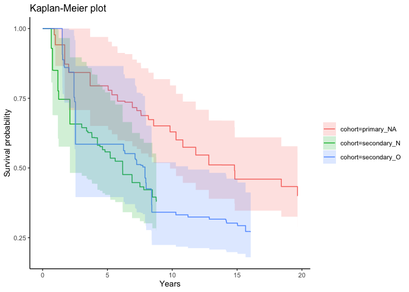
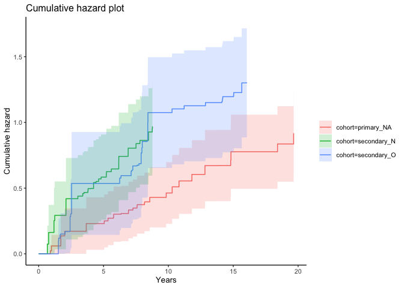
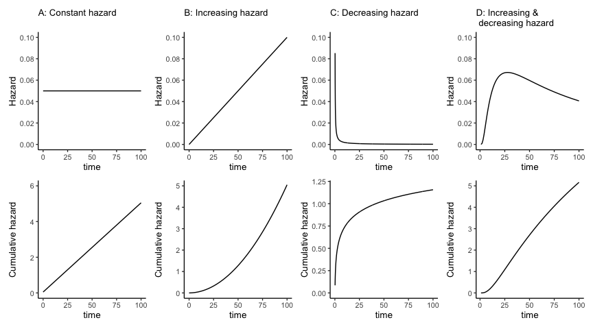
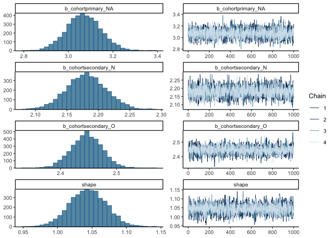
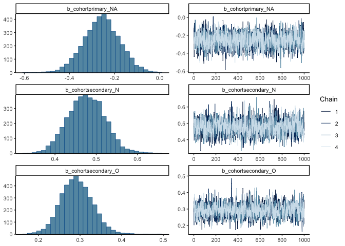
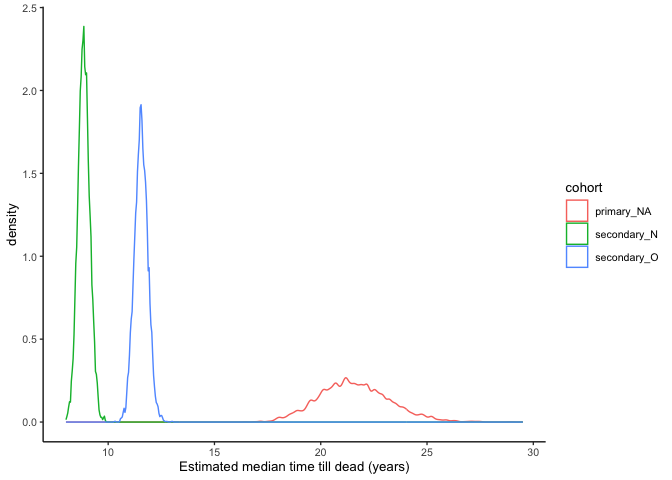
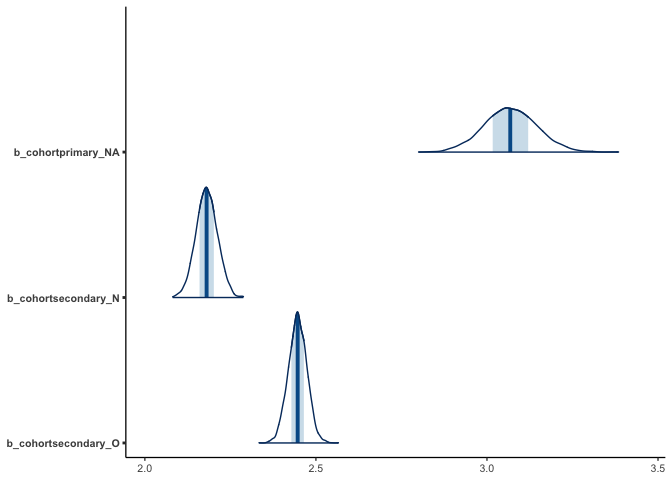
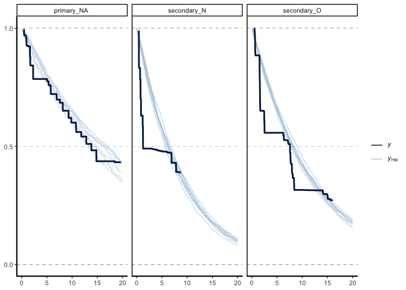

# Continuous-Time Event Occurrence models
eleanorjackson
2024-09-23

Now that we have clean data :tada: I want to have a stab at some
survival models.

Some useful resources:

- [Intro to survival analysis in
  R](https://www.emilyzabor.com/tutorials/survival_analysis_in_r_tutorial.html)
- [Applied longitudinal data analysis: Modeling change and event
  occurrence.](https://doi.org/10.1093/acprof:oso/9780195152968.001.0001)
- [brms + tidyverse translation of above
  book](https://bookdown.org/content/4253/)
- [Survival model section of the Stan user
  guide](https://mc-stan.org/docs/stan-users-guide/survival.html)
- [Fully flexible analysis of behavioural sequences based on parametric
  survival models with frailties—A
  tutorial](https://doi.org/10.1111/eth.13225)

``` r
library("tidyverse")
library("here")
library("patchwork")
library("survival")
library("ggsurvfit")
library("brms")
library("tidybayes")
```

For now, I’m going to split the data into primary forest, secondary
forest 1st cohort, and secondary forest 2nd cohort.

Eventually I’d want to have forest type and cohort as separate
covariates (plus species, plot, etc.) - but keeping it simple to start
with just 1 covariate.

``` r
data <- 
  readRDS(here::here("data", "derived", "data_cleaned.rds")) %>% 
  mutate(census_no = as.ordered(census_no)) %>% 
  mutate(cohort = paste(forest_type, old_new, sep = "_")) %>% 
  filter(! cohort == "secondary_NA") %>% 
  filter(! str_detect(plant_id, "NA")) 
```

Now creating a “time” variable. I’m using days since first survey at the
individual plant level. I’ll also create a column which has the units in
years rather than days, as it might be easier to read (years will still
be continuous though e.g. 627 days = 1.717808 years).

``` r
data <-
  data %>%
  group_by(plant_id) %>%
  slice_min(survey_date, with_ties = FALSE) %>%
  select(plant_id, survey_date) %>%
  rename(first_survey = survey_date) %>%
  ungroup() %>% 
  right_join(data)

data <-
  data %>%
  rowwise() %>% 
  mutate(
    days =
      survey_date - first_survey) %>% 
  ungroup() %>% 
  mutate(years = as.numeric(days, units= "weeks")/52.25,
         days_num = as.numeric(days))
```

## Censoring

A common problem with continuous time to event data is that we often
don’t know when exactly an event happened - a seedling was alive in one
census and dead in the next but could have died at any point between
those two censuses.

This is what we call interval censored data. You can also get right
censored data (e.g. seedling still alive at the end of the study), and
left censored data (seedling already dead at the start of the study).

For now I’m going to remove seedlings which were already dead by the
first survey, I’ve read that left-censoring can be tricky and it is
common to remove them.

Some useful info on how to format censored data for `brms`
[here.](https://discourse.mc-stan.org/t/survival-analysis-with-right-censored-and-interval-censored-data-with-brms/24668)
But you’ll also see that I have to reformat the censor column for other
packages, there seems to be no consensus!

``` r
interval_censored <-
  data %>% 
  filter(survival == 0) %>% 
  group_by(plant_id) %>% 
  slice_min(survey_date, with_ties = FALSE) %>% 
  ungroup() %>% 
  rename(time_to_dead = years) %>% 
  select(plant_id, genus_species, plot, cohort, time_to_dead) %>% 
  mutate(censor = "interval")


interval_censored <-
  data %>% 
  filter(plant_id %in% interval_censored$plant_id) %>% 
  filter(survival == 1) %>% 
  group_by(plant_id) %>% 
  slice_max(survey_date, with_ties = FALSE) %>% 
  ungroup() %>% 
  rename(time_to_last_alive = years) %>% 
  select(plant_id, time_to_last_alive) %>% 
  right_join(interval_censored) 
  
  
right_censored <- 
  data %>% 
  filter(!plant_id %in% interval_censored$plant_id) %>% 
  group_by(plant_id) %>% 
  slice_max(survey_date, with_ties = FALSE) %>% 
  ungroup() %>% 
  rename(time_to_last_alive = years) %>% 
  select(plant_id, genus_species, plot, cohort, time_to_last_alive) %>% 
  mutate(censor = "right")

data_aggregated <- 
  bind_rows(interval_censored, right_censored) %>% 
  filter(time_to_last_alive > 0) %>% 
  mutate(plot_id = as.factor(paste(cohort, plot, sep = "_")))

data_aggregated <- 
  data_aggregated %>% 
  mutate(censor_2 = case_when(
         censor == "right" ~ "right",
         censor == "interval" ~ "none")) %>% 
  mutate(time_to_dead = case_when(
    censor == "right" ~ time_to_last_alive,
    .default = time_to_dead
  )) 
```

``` r
data_aggregated %>% 
  slice_sample(n = 30) %>%
  pivot_longer(cols = c(time_to_last_alive, time_to_dead)) %>% 
  ggplot(aes(y = plant_id, x = value, colour = name, group = plant_id)) +
  geom_path(colour = "lightgrey") +
  geom_point(alpha = 0.5, size = 2) +
  theme(legend.position = "top")
```


Seedlings with only one data point are right censored and seedlings with
two data points are interval censored.

## Survival

Censoring is built into survival models by incorporating it into the
likelihood function underlying the analysis.

The survival probability at a certain time, is a conditional probability
of surviving beyond that time, given that an individual has survived
just prior to that time.

The [Kaplan-Meier
estimate](https://en.wikipedia.org/wiki/Kaplan–Meier_estimator) of
survival probability at a given time is the product of these conditional
probabilities up until that given time.

We can fit a survival curve and create a K-M plot using the `{survival}`
package.

``` r
data_surv <- 
  data_aggregated %>% 
  mutate(event = recode(censor, "interval" = 3, "right" = 0, "left" = 2)) %>% 
  mutate(time_to_dead = case_when(
    censor == "right" ~ NA,
    .default = time_to_dead
  ))

fit_surv <- 
  survfit(data = data_surv,
          Surv(time = time_to_last_alive, 
               time2 = time_to_dead,
               type = "interval2") ~ cohort)
```

``` r
fit_surv %>% 
  ggsurvfit::ggsurvfit(theme = theme_classic(base_size = 10)) +
  labs(
    x = "Years",
    y = "Survival probability"
  ) + 
  add_confidence_interval() +
  ggtitle("Kaplan-Meier plot")
```



``` r
fit_surv %>% 
  ggsurvfit::ggsurvfit(theme = theme_classic(base_size = 10), type = "cumhaz") +
  labs(
    x = "Years",
    y = "Cumulative hazard"
  ) + 
  add_confidence_interval() +
  ggtitle("Cumulative hazard plot")
```



## Models

> In principle, in continuous time, we would like to estimate a value
> for the survivor and hazard functions at every possible instant when
> an event could occur. In practice, we can do so only if we are willing
> to adopt constraining parametric assumptions about the distribution of
> event times. To support this approach, statisticians have identified
> dozens of different distributions–Weibull, Gompertz, gamma, and
> log-logistic, to name a few–that event times might follow, and in some
> fields—industrial product testing, for example–parametric estimation
> is the dominant mode of analysis (see, e.g., Lawless, 1982).

> In many other fields, including most of the social, behavioral, and
> medical sciences, nonparametric methods are more popular. The
> fundamental advantage of nonparametric methods is that we need not
> make constraining assumptions about the distribution of event times.
> This flexibility is important because: (1) few researchers have a
> sound basis for preferring one distribution over another; and (2)
> adopting an incorrect assumption can lead to erroneous conclusions.
> With a nonparametric approach, you essentially trade the possibility
> of a minor increase in efficiency if a particular assumption holds for
> the guarantee of doing nearly as well for most data sets, regardless
> of its tenability.

> For decades, in a kind of mathematic irony, statisticians obtained
> nonparametric estimates of the continuous-time survivor and hazard
> functions by grouping event times into a small number of intervals,
> constructing a life table, and applying the discrete-time strategies
> of chapter 10 (with some minor revisions noted below).

**From [Applied longitudinal data analysis: Modeling change and event
occurrence.](https://doi.org/10.1093/acprof:oso/9780195152968.001.0001)
pp. 475–476**

The [Cox proportional
hazards](https://en.wikipedia.org/wiki/Proportional_hazards_model) model
is a popular nonparametric method *however* [they can’t handle interval
censored
data,](https://www.mdpi.com/2227-7099/10/9/218#sec3-economies-10-00218)
which is a bit of a bummer because the vast majority of our data are
interval censored.

Some of our alternatives could be: - use a Cox model but use the mid
point of the interval as the event time - use a parametric model

In `brms`, families `Gamma`, `weibull`, `exponential`, `lognormal`,
`frechet`, `inverse.gaussian`, and `cox` (Cox proportional hazards
model) can be used (among others) for time-to-event/survival regression.

In our data it looks like hazard is a bit higher at the start and then
gradually is levelling off.

I’m taking a bit of code from
[here](https://bookdown.org/content/4253/describing-continuous-time-event-occurrence-data.html#understanding-the-meaning-of-cumulative-hazard.)
to understand how the cumulative distribution function might look. It
should help us to think about which `brms` family to try.

<details class="code-fold">
<summary>Code</summary>

``` r
# two custom geoms to simplify our subplot code 

geom_h <- function(subtitle, ...) {
  
  list(
    geom_line(...),
    scale_y_continuous("Hazard",
                       breaks = 0:5 * 0.02),
    labs(subtitle = subtitle),
    coord_cartesian(ylim = c(0, .1))
  )
  
}

geom_H <- function(y_ul, ...) {
  
  list(
    geom_line(...),
    ylab("Cumulative hazard"),
    coord_cartesian(ylim = c(0, y_ul))
  )
  
}
```

</details>
<details class="code-fold">
<summary>Code</summary>

``` r
# a: constant hazard
d <-
  tibble(time = seq(from = 0, to = 100, by = 1)) %>% 
  mutate(h = 0.05) %>%  
  mutate(H = cumsum(h))

p1 <- d %>% 
  ggplot(aes(x = time, y = h)) +
  geom_h(subtitle = "A: Constant hazard")

p2 <- d %>% 
  ggplot(aes(x = time, y = H)) +
  geom_H(y_ul = 6)

# b: increasing hazard
d <-
  tibble(time = seq(from = 0, to = 100, by = 1)) %>% 
  mutate(h = 0.001 * time) %>%  
  mutate(H = cumsum(h))

p3 <- d %>% 
  ggplot(aes(x = time, y = h)) + 
  geom_h(subtitle = "B: Increasing hazard")
  
p4 <- d %>% 
  ggplot(aes(x = time, y = H)) +
  geom_H(y_ul = 5)

# decreasing hazard
d <-
  tibble(time = seq(from = .2, to = 100, by = .1)) %>% 
  # note out use of the gamma distribution (see )
  mutate(h = dgamma(time, shape = .02, rate = .001)) %>%  
  mutate(H = cumsum(h))

p5 <- d %>% 
  ggplot(aes(x = time, y = h)) +
  geom_h(subtitle = "C: Decreasing hazard")

p6 <- d %>% 
  ggplot(aes(x = time, y = H)) +
  geom_H(y_ul = 1.2)

# increasing & decreasing hazard
d <-
  tibble(time = seq(from = 1, to = 100, by = 1)) %>% 
  # note our use of the Fréchet distribution
  mutate(h = dfrechet(time, loc = 0, scale = 250, shape = .5) * 25) %>%  
  mutate(H = cumsum(h))

p7 <- d %>% 
  ggplot(aes(x = time, y = h)) +
  geom_h(subtitle = "D: Increasing &\n decreasing hazard")

p8 <- d %>% 
  ggplot(aes(x = time, y = H)) +
  geom_H(y_ul = 5)

# combine with patchwork and plot!
((p1 / p2) | (p3 / p4) | (p5 / p6) | (p7 / p8)) &
  theme(panel.grid = element_blank())
```

</details>



I’m thinking that C looks most likely? That’s the Gamma distribution.

## Fitting

For fun, let’s fit 2 models and compare them.

One of them a nonparametric (cox) model and the other one parametric
(Gamma distribution).

The Cox model won’t be able to use the interval censored data, so for
now we’ll just say that the `time_to_dead` is exact (in future I’ll try
the midpoint).

The parametric survival model will take the interval censored data.

### parametric survival model

``` r
fit_1 <- 
  brm(time_to_last_alive|cens(x = censor, y2 = time_to_dead) ~ 0 + cohort, 
      data = data_aggregated,
      family = brmsfamily("Gamma"), 
      chains = 4, init = 0,
      seed = 123,
      file = here::here("code", "notebooks", "models",
                        "2024-09-19_continuous-survival-models", 
                        "fit_1.rds"),
      file_refit = "on_change")
```

``` r
plot(fit_1)
```



``` r
print(fit_1)
```

     Family: gamma 
      Links: mu = log; shape = identity 
    Formula: time_to_last_alive | cens(x = censor, y2 = time_to_dead) ~ 0 + cohort 
       Data: data_aggregated (Number of observations: 3758) 
      Draws: 4 chains, each with iter = 2000; warmup = 1000; thin = 1;
             total post-warmup draws = 4000

    Regression Coefficients:
                      Estimate Est.Error l-95% CI u-95% CI Rhat Bulk_ESS Tail_ESS
    cohortprimary_NA      3.07      0.08     2.92     3.22 1.00     4231     2999
    cohortsecondary_N     2.18      0.03     2.12     2.24 1.00     3993     2760
    cohortsecondary_O     2.45      0.03     2.39     2.50 1.00     3727     3111

    Further Distributional Parameters:
          Estimate Est.Error l-95% CI u-95% CI Rhat Bulk_ESS Tail_ESS
    shape     1.04      0.03     0.99     1.10 1.00     3666     2876

    Draws were sampled using sampling(NUTS). For each parameter, Bulk_ESS
    and Tail_ESS are effective sample size measures, and Rhat is the potential
    scale reduction factor on split chains (at convergence, Rhat = 1).

Rhat value for shape is a bit high suggesting the chains didn’t mix
well, but our trace plot looks ok - warrants further investigation in
the future.

### non-parametric survival model

``` r
fit_2 <- 
  brm(time_to_last_alive|cens(x = censor_2, y2 = time_to_dead) ~ 0 + cohort, 
      data = data_aggregated,
      family = brmsfamily("cox"), 
      chains = 4,
      seed = 123,
      file = here::here("code", "notebooks", "models",
                        "2024-09-19_continuous-survival-models", 
                        "fit_2.rds"),
      file_refit = "on_change")
```

``` r
plot(fit_2)
```



``` r
print(fit_2)
```

     Family: cox 
      Links: mu = log 
    Formula: time_to_last_alive | cens(x = censor_2, y2 = time_to_dead) ~ 0 + cohort 
       Data: data_aggregated (Number of observations: 3758) 
      Draws: 4 chains, each with iter = 2000; warmup = 1000; thin = 1;
             total post-warmup draws = 4000

    Regression Coefficients:
                      Estimate Est.Error l-95% CI u-95% CI Rhat Bulk_ESS Tail_ESS
    cohortprimary_NA     -0.26      0.08    -0.41    -0.10 1.00     3006     2809
    cohortsecondary_N     0.48      0.04     0.39     0.56 1.00     1511     2264
    cohortsecondary_O     0.29      0.04     0.22     0.37 1.00     1780     2522

    Draws were sampled using sampling(NUTS). For each parameter, Bulk_ESS
    and Tail_ESS are effective sample size measures, and Rhat is the potential
    scale reduction factor on split chains (at convergence, Rhat = 1).

## Compare models

Compare the 2 models using leave-one-out cross validation.

``` r
fit_1 <- add_criterion(fit_1, "loo")
fit_2 <- add_criterion(fit_2, "loo")

loo_compare(fit_1, fit_2)
```

          elpd_diff se_diff
    fit_1    0.0       0.0 
    fit_2 -620.6      54.1 

This suggests that our nonparametric model is a better fit.

I’m not going to go too in depth interpreting the models, but we can
take a quick look at the posterior of `fit_1`.

On the response scale:

``` r
data_aggregated %>%
  group_by(cohort) %>%
  add_epred_draws(fit_1) %>%
  ggplot(aes(x = .epred, group = cohort, colour = cohort)) +
  geom_density() +
  xlab("Estimated median time till dead (years)")
```



On the linear (?) scale:

``` r
bayesplot::mcmc_areas(fit_1, regex_pars = "b_")
```



``` r
# ppc_km_overlay can't do interval censored data
# 0 = right censored, 1 = event

data_aggregated <- 
  data_aggregated %>% 
  mutate(censor_3 = case_when(
         censor == "right" ~ 0,
         censor == "interval" ~ 1)) %>% 
  mutate()

pp <- posterior_predict(fit_1, draw_ids = 1:10)

bayesplot::ppc_km_overlay_grouped(y = data_aggregated$time_to_last_alive, 
                                  yrep = pp, 
                                  status_y = data_aggregated$censor_3, 
                                  group = data_aggregated$cohort) +
  xlim(0, 20)
```



*y* is the data and *y_rep* are draws from the posterior predictive
distribution. The fit for the primary data looks quite good but for the
secondary forest seedlings the drop off in survival doesn’t seem as
sharp as it should be.
