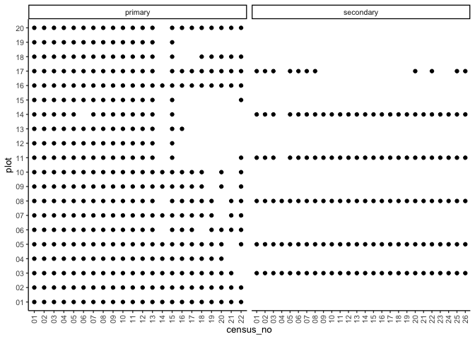
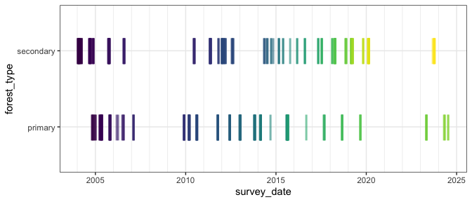
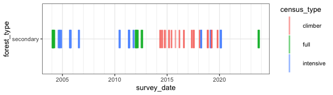

# A summary of the data
eleanorjackson
2024-10-21

I’m creating a document to summarise the clean dataset which we are
working with for the current manuscript.

Here we will look at:

- How many individual plants are there?
- How many species and how many individuals of each?
- How many plots are in each forest type?
- How frequently were the seedlings surveyed?

In future docs I’ll do descriptive summaries of growth and survival.

<details class="code-fold">
<summary>Code</summary>

``` r
library("tidyverse")
library("here")
library("patchwork")
```

</details>
<details class="code-fold">
<summary>Code</summary>

``` r
# reading in data and adding a column distinguishing cohorts 1 & 2 from
# the primary forest seedlings
data <- 
  readRDS(here::here("data", "derived", "data_cleaned.rds")) %>% 
  mutate(census_no = as.ordered(census_no)) %>% 
  mutate(cohort = paste(forest_type, old_new, sep = "_")) %>% 
  filter(! cohort == "secondary_NA") %>% 
  filter(! str_detect(plant_id, "NA")) 
```

</details>

A glimpse of the data.

<details class="code-fold">
<summary>Code</summary>

``` r
glimpse(data)
```

</details>

    Rows: 119,636
    Columns: 19
    $ forest_type   <chr> "primary", "primary", "primary", "primary", "primary", "…
    $ plant_id      <chr> "01_6", "01_6", "01_6", "01_6", "01_6", "01_6", "01_6", …
    $ plot          <chr> "01", "01", "01", "01", "01", "01", "01", "01", "01", "0…
    $ line          <chr> NA, NA, NA, NA, NA, NA, NA, NA, NA, NA, NA, NA, NA, NA, …
    $ position      <chr> NA, NA, NA, NA, NA, NA, NA, NA, NA, NA, NA, NA, NA, NA, …
    $ old_new       <chr> NA, NA, NA, NA, NA, NA, NA, NA, NA, NA, NA, NA, NA, NA, …
    $ plant_no      <chr> "6", "6", "6", "6", "6", "6", "6", "6", "6", "6", "6", "…
    $ genus         <chr> "Hopea", "Hopea", "Hopea", "Hopea", "Hopea", "Hopea", "H…
    $ species       <chr> "sangal", "sangal", "sangal", "sangal", "sangal", "sanga…
    $ genus_species <chr> "Hopea_sangal", "Hopea_sangal", "Hopea_sangal", "Hopea_s…
    $ planting_date <date> NA, NA, NA, NA, NA, NA, NA, NA, NA, NA, NA, NA, NA, NA,…
    $ census_no     <ord> 01, 02, 03, 04, 05, 06, 07, 08, 09, 10, 11, 12, 13, 14, …
    $ census_id     <chr> "1", "2", "3", "4", "5", "6", "7", "8", "9", "10", "11",…
    $ survey_date   <date> 2004-11-07, 2005-05-17, 2005-10-18, 2006-07-27, 2007-02…
    $ survival      <dbl> 1, 1, 1, 1, 1, 1, 1, 1, 1, 1, 1, 1, 1, 1, 1, 1, 1, 1, 0,…
    $ height_apex   <dbl> NA, NA, NA, NA, NA, NA, NA, NA, NA, NA, NA, NA, NA, NA, …
    $ dbh_mean      <dbl> NaN, NaN, NaN, 7.55, 15.30, 47.15, 47.75, 53.00, 53.45, …
    $ dbase_mean    <dbl> 3.30, 5.00, 6.05, 12.50, 20.50, 53.35, 51.35, 57.25, 64.…
    $ cohort        <chr> "primary_NA", "primary_NA", "primary_NA", "primary_NA", …

## Individual plants & species

<details class="code-fold">
<summary>Code</summary>

``` r
data %>% 
  group_by(cohort, genus_species) %>% 
  summarise(n_individuals = n_distinct(plant_id)) %>% 
  pivot_wider(names_from = cohort, 
              values_from = n_individuals) %>% 
  rowwise() %>% 
  mutate(total = sum(primary_NA, 
                     secondary_N, 
                     secondary_O, 
                     na.rm = TRUE)) %>% 
  arrange(-total) %>% 
  janitor::adorn_totals() %>% 
  knitr::kable(col.names = c("Species", 
                             "Primary", 
                             "Secondary, 2nd cohort",
                             "Secondary, 1st cohort",
                             "Total # of individuals"))
```

</details>

| Species | Primary | Secondary, 2nd cohort | Secondary, 1st cohort | Total \# of individuals |
|:---|---:|---:|---:|---:|
| Parashorea_tomentella | 25 | 299 | 498 | 822 |
| Dryobalanops_lanceolata | 20 | 312 | 480 | 812 |
| Shorea_johorensis | 20 | 285 | 491 | 796 |
| Parashorea_malaanonan | 21 | 281 | 488 | 790 |
| Shorea_leprosula | 19 | 240 | 476 | 735 |
| Shorea_macroptera | 20 | 241 | 471 | 732 |
| Shorea_macrophylla | 20 | 203 | 481 | 704 |
| Shorea_gibbosa | 20 | 188 | 477 | 685 |
| Hopea_sangal | 20 | 138 | 515 | 673 |
| Shorea_argentifolia | 20 | 174 | 462 | 656 |
| Shorea_ovalis | 20 | 128 | 490 | 638 |
| Shorea_parvifolia | 22 | 152 | 461 | 635 |
| Shorea_faguetiana | 19 | 83 | 458 | 560 |
| Dipterocarpus_conformis | 20 | NA | 506 | 526 |
| Shorea_beccariana | 20 | 22 | 468 | 510 |
| Total | 306 | 2746 | 7222 | 10274 |

There are 10274 individual plants in the data from 15 species.

306 in the primary forest, and 9968 in the secondary forest.

38% of the 1<sup>st</sup> cohort of secondary forest seedlings were
replaced with a cohort 2 seedling.

<details class="code-fold">
<summary>Code</summary>

``` r
data %>% 
  group_by(forest_type, plot) %>% 
  summarise(n_species = n_distinct(genus_species)) %>% 
  pivot_wider(names_from = forest_type, 
              values_from = n_species) %>% 
  knitr::kable()
```

</details>

| plot | primary | secondary |
|:-----|--------:|----------:|
| 01   |      15 |        NA |
| 02   |      15 |        NA |
| 03   |      14 |        15 |
| 04   |      15 |        NA |
| 05   |      15 |        15 |
| 06   |      15 |        NA |
| 07   |      15 |        NA |
| 08   |      14 |        15 |
| 09   |      15 |        NA |
| 10   |      14 |        NA |
| 11   |      14 |        15 |
| 12   |      15 |        NA |
| 13   |      15 |        NA |
| 14   |      14 |        15 |
| 15   |      15 |        NA |
| 16   |      15 |        NA |
| 17   |      15 |        15 |
| 18   |      14 |        NA |
| 19   |      15 |        NA |
| 20   |      15 |        NA |

Plots contain either 14 or 15 different species.

Secondary forest plots were enrichment planted with 16 species each,
primary forest plots were planted with 23-25 species each. Species were
only included in this data if they occur in both the primary and
secondary forest.

<details class="code-fold">
<summary>Code</summary>

``` r
sp_lists <- 
  read_csv(here::here("data", "derived", "data_combined.csv")) %>% 
  select(forest_type, genus_species) %>% 
  distinct() %>% 
  drop_na(genus_species) %>% 
  group_by(forest_type) %>% 
  {setNames(group_split(., .keep = FALSE), group_keys(.)[[1]])}
```

</details>

Species in **both** the primary and secondary forest:

<details class="code-fold">
<summary>Code</summary>

``` r
intersect(sp_lists$secondary$genus_species, 
          sp_lists$primary$genus_species)
```

</details>

     [1] "Dryobalanops_lanceolata" "Shorea_leprosula"       
     [3] "Shorea_macrophylla"      "Shorea_gibbosa"         
     [5] "Parashorea_tomentella"   "Parashorea_malaanonan"  
     [7] "Dipterocarpus_conformis" "Shorea_beccariana"      
     [9] "Hopea_sangal"            "Shorea_argentifolia"    
    [11] "Shorea_macroptera"       "Shorea_parvifolia"      
    [13] "Shorea_ovalis"           "Shorea_johorensis"      
    [15] "Shorea_faguetiana"      

Species in the secondary forest which aren’t in the primary forest:

<details class="code-fold">
<summary>Code</summary>

``` r
setdiff(sp_lists$secondary$genus_species, 
        sp_lists$primary$genus_species)
```

</details>

    [1] "Hopea_ferruginea"

Species in the primary forest which aren’t in the secondary forest:

<details class="code-fold">
<summary>Code</summary>

``` r
setdiff(sp_lists$primary$genus_species, 
        sp_lists$secondary$genus_species)
```

</details>

     [1] "Shorea_acuminatissima" "Shorea_superba"        "Shorea_oleosa"        
     [4] "Shorea_parvistipulata" "Shorea_smithiana"      "Durian_graveolens"    
     [7] "Dryobalanops_beccarii" "Shorea_mecistopteryx"  "Shorea_pinanga"       
    [10] "Shorea_guiso"         

## Plots

<details class="code-fold">
<summary>Code</summary>

``` r
data %>% 
  group_by(forest_type) %>% 
  summarise(n_plots = n_distinct(plot)) %>% 
  knitr::kable()
```

</details>

| forest_type | n_plots |
|:------------|--------:|
| primary     |      20 |
| secondary   |       6 |

There are 20 plots in the primary forest (plots `01:20`) and 6 in the
secondary forest (plots `03, 05, 08, 11, 14, 17`).

Only intensively sampled plots from the SBE (secondary forest) were
included in this data, and of the Danum plots (primary forest) only
(sub-)plots in treefall gaps and those without drought treatments were
included.

<details class="code-fold">
<summary>Code</summary>

``` r
data %>% 
  filter(forest_type=="secondary") %>% 
  group_by(plot) %>% 
  summarise(n_lines = n_distinct(line)) %>% 
  knitr::kable()
```

</details>

| plot | n_lines |
|:-----|--------:|
| 03   |      20 |
| 05   |      20 |
| 08   |      20 |
| 11   |      20 |
| 14   |      20 |
| 17   |      20 |

In the secondary forest there are 20 planting lines in each of the 6
intensively sampled plots.

<details class="code-fold">
<summary>Code</summary>

``` r
data %>% 
  filter(forest_type=="secondary") %>% 
  group_by(plot) %>% 
  summarise(n_positions = n_distinct(position)) %>% 
  knitr::kable()
```

</details>

| plot | n_positions |
|:-----|------------:|
| 03   |          66 |
| 05   |          67 |
| 08   |          67 |
| 11   |          67 |
| 14   |          86 |
| 17   |          69 |

The SBE was set up with the implicit assumption that each of the
planting lines would have 66 positions where a seedling was planted.
However, due to some positions being un-plantable (i.e. obstructed by
rock or stream), and due to undulating topography (seedling was planted
every 3m) there are often more or less than 66 planting positions.

There are more individual plants than positions as those that died very
early in the experiment were replaced by a new cohort of seedlings.

## Censuses

<details class="code-fold">
<summary>Code</summary>

``` r
data %>% 
  select(census_no, plot, forest_type) %>%
  distinct() %>% 
  ggplot(aes(x = census_no, y = plot)) +
  geom_point() +
  facet_wrap(~forest_type, scales = "free_x") +
  guides(x =  guide_axis(angle = 90)) 
```

</details>



There have been 22 censuses of the primary forest seedlings, and 26
censuses of the secondary forest seedlings.

Plot 17 in the secondary forest was not sampled as frequently as the
other secondary forest plots as it wasn’t included in surveys for the
climber cutting study (explained further below).

Not all the censuses were complete.

<details class="code-fold">
<summary>Code</summary>

``` r
data %>% 
  group_by(forest_type, census_no) %>% 
  summarise(n_distinct(plot)) %>% 
  pivot_wider(names_from = forest_type, 
              values_from = `n_distinct(plot)`) %>% 
  mutate(primary = (primary/20)*100,
         secondary = (secondary/6)*100) %>% 
  rename(`% of primary plots censused` = primary,
         `% of secondary plots censused` = secondary) %>% 
  knitr::kable(digits = 1)
```

</details>

| census_no | % of primary plots censused | % of secondary plots censused |
|:----------|----------------------------:|------------------------------:|
| 01        |                         100 |                         100.0 |
| 02        |                         100 |                         100.0 |
| 03        |                         100 |                         100.0 |
| 04        |                         100 |                          50.0 |
| 05        |                         100 |                         100.0 |
| 06        |                          95 |                         100.0 |
| 07        |                         100 |                         100.0 |
| 08        |                         100 |                         100.0 |
| 09        |                         100 |                          83.3 |
| 10        |                         100 |                          83.3 |
| 11        |                         100 |                          83.3 |
| 12        |                         100 |                          83.3 |
| 13        |                         100 |                          83.3 |
| 14        |                          45 |                          83.3 |
| 15        |                         100 |                          83.3 |
| 16        |                          70 |                          83.3 |
| 17        |                          65 |                          83.3 |
| 18        |                          65 |                          83.3 |
| 19        |                          60 |                          83.3 |
| 20        |                          60 |                         100.0 |
| 21        |                          50 |                          83.3 |
| 22        |                          70 |                         100.0 |
| 23        |                          NA |                          83.3 |
| 24        |                          NA |                          83.3 |
| 25        |                          NA |                         100.0 |
| 26        |                          NA |                         100.0 |

Within the secondary forest, not every planting line was surveyed when
the rest of the plot was censused.

Three of the secondary forest plots received a climber cutting treatment
(plots `05`, `11` and `14`) (see [O’Brien *et al*
2019](https://doi.org/10.1111/1365-2664.13335)). When data was collected
for this study only two planting lines from each of the climber cut
(plots `05`, `11` and `14`) and control plots (plots `03` and `08`) were
surveyed since a full census would take too long.

<details class="code-fold">
<summary>Code</summary>

``` r
data %>% 
  mutate(month = lubridate::month(survey_date)) %>% 
  group_by(survey_date) %>% 
  slice_head() %>% 
  ggplot(aes(y = forest_type, x = survey_date, 
             colour = census_no)) +
  geom_point(alpha = 0.6, shape = "|", size = 10) +
  theme_bw() +
  scale_x_date(minor_breaks = "year") +
  scale_colour_viridis_d() +
  theme(legend.position = "none")
```

</details>



The censuses were not evenly spaced through time.

<details class="code-fold">
<summary>Code</summary>

``` r
data %>% 
  filter(forest_type == "secondary") %>% 
  mutate(census_type = str_extract(census_id, "[a-z]+" )) %>% 
  mutate(month = lubridate::month(survey_date)) %>% 
  group_by(survey_date) %>% 
  slice_head() %>% 
  ggplot(aes(y = forest_type, x = survey_date, 
             colour = census_type)) +
  geom_point(alpha = 0.6, shape = "|", size = 10) +
  theme_bw() +
  scale_x_date(minor_breaks = "year") 
```

</details>



Secondary forest plots which were included in each census type:

<details class="code-fold">
<summary>Code</summary>

``` r
data %>% 
  filter(forest_type == "secondary") %>% 
  mutate(census_type = str_extract(census_id, "[a-z]+" )) %>% 
  select(census_type, plot) %>% 
  distinct() %>% 
  pivot_wider(names_from = census_type, values_from = plot) %>% 
  knitr::kable()
```

</details>

| full                   | intensive              | climber            |
|:-----------------------|:-----------------------|:-------------------|
| 03, 05, 08, 11, 14, 17 | 03, 05, 08, 11, 14, 17 | 03, 05, 08, 11, 14 |

Plots `05`, `11` and `14` received a climber cutting treatment.

- In the **full** surveys every individual in every plot was surveyed
- In the **intensive** surveys every individual in 6 of the plots were
  surveyed (all plots included in this data)
- In the **climber** surveys 2 planting lines of 5 plots were surveyed
