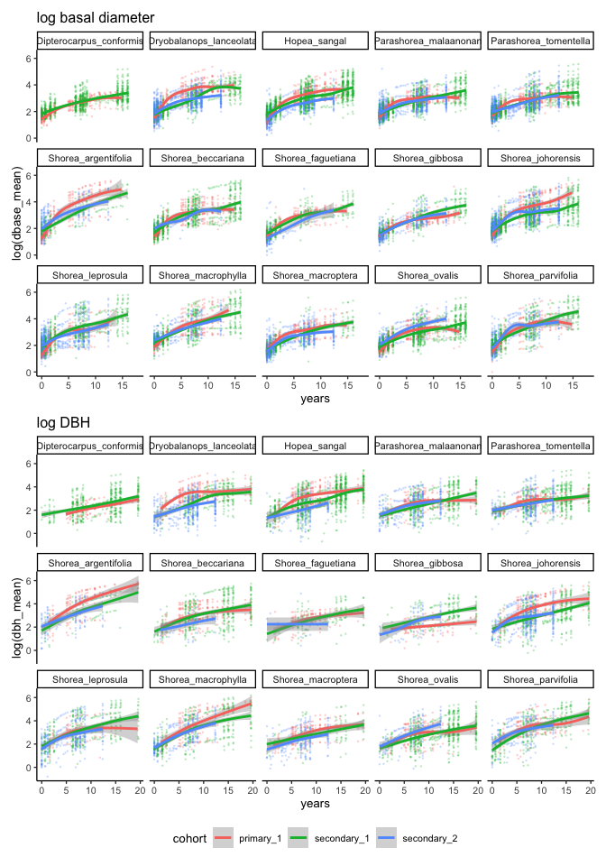

# A summary of growth
eleanorjackson
2024-10-14

Here we will look at:

- Size of seedlings at their first survey
- Diameter measurements at BH vs basal
- Growth between forest types
- Growth between species
- Interactions of species & forest types
- Effect of climber cutting on growth

<details class="code-fold">
<summary>Code</summary>

``` r
library("tidyverse")
library("here")
library("patchwork")
library("formattable")
```

</details>
<details class="code-fold">
<summary>Code</summary>

``` r
# reading in data and adding a column distinguishing cohorts 1 & 2 from
# the primary forest seedlings
data <- 
  readRDS(here::here("data", "derived", "data_cleaned.rds")) %>% 
  mutate(census_no = as.ordered(census_no)) %>% 
  mutate(cohort = paste(forest_type, old_new, sep = "_")) %>% 
  filter(! cohort == "secondary_NA") %>% 
  filter(! str_detect(plant_id, "NA")) 
```

</details>

## Size of seedlings at their first survey

<details class="code-fold">
<summary>Code</summary>

``` r
data %>% 
  filter(survival == 1) %>% 
  group_by(plant_id) %>% 
  slice_min(survey_date, with_ties = FALSE) %>% 
  ggplot(aes(x = dbase_mean, 
             fill = cohort,
             colour = cohort)) +
  geom_density(alpha = 0.3) +
  facet_wrap(~genus_species, ncol = 5) +
  stat_summary(aes(xintercept = after_stat(x), y = 0), 
               fun = median, 
               geom = "vline", 
               orientation = "y",
               linetype = 2) +
  xlim(0, 20) +
  theme(legend.position = "top") +
  ylab("density") +
  xlab("basal diameter at first survey")
```

</details>


Dashed line shows the median value.

Seedlings in the primary forest are usually smaller at the time of their
first measurement.

The secondary forest of SBE was planted first then the left over
seedlings in the nursery were planted in the primary old growth forest
of Danum Valley.

Data suggests that the seedlings grew slower when kept in pots for
longer and some species were more affected than others. The table below
quantifies the difference in medians between forest types for each
species.

<details class="code-fold">
<summary>Code</summary>

``` r
data %>% 
  filter(survival == 1) %>% 
  group_by(plant_id) %>% 
  slice_min(survey_date, with_ties = FALSE) %>% 
  group_by(genus_species, cohort) %>% 
  summarise(med = median(dbase_mean, na.rm = TRUE)) %>% 
  pivot_wider(names_from = cohort, values_from = med) %>% 
  select(-secondary_N) %>% 
  rowwise() %>% 
  mutate(difference_in_median_basal_diameter  = secondary_O - primary_NA) %>% 
  arrange(desc(difference_in_median_basal_diameter)) %>% 
  knitr::kable(digits = 2)
```

</details>

| genus_species | primary_NA | secondary_O | difference_in_median_basal_diameter |
|:---|---:|---:|---:|
| Shorea_macrophylla | 6.35 | 9.38 | 3.03 |
| Shorea_leprosula | 3.40 | 6.16 | 2.76 |
| Hopea_sangal | 3.48 | 6.04 | 2.56 |
| Shorea_argentifolia | 3.40 | 5.92 | 2.52 |
| Shorea_parvifolia | 4.35 | 6.70 | 2.35 |
| Shorea_ovalis | 4.40 | 6.60 | 2.20 |
| Dipterocarpus_conformis | 4.03 | 5.94 | 1.91 |
| Shorea_johorensis | 4.15 | 5.84 | 1.69 |
| Shorea_beccariana | 3.92 | 5.14 | 1.21 |
| Parashorea_malaanonan | 4.82 | 5.98 | 1.16 |
| Dryobalanops_lanceolata | 4.65 | 5.76 | 1.10 |
| Parashorea_tomentella | 5.25 | 6.35 | 1.10 |
| Shorea_faguetiana | 4.25 | 4.75 | 0.50 |
| Shorea_macroptera | 4.80 | 5.20 | 0.40 |
| Shorea_gibbosa | 4.50 | 4.64 | 0.14 |

## Diameter measurements at BH vs basal

<details class="code-fold">
<summary>Code</summary>

``` r
data %>% 
  filter(survival == 1) %>% 
  group_by(cohort, census_no) %>% 
  summarise(n_dbh_only = sum(!is.na(dbh_mean) & is.na(dbase_mean)),
            n_basal_only = sum(!is.na(dbase_mean) & is.na(dbh_mean)),
            n_dbh_and_basal = sum(!is.na(dbh_mean) & !is.na(dbase_mean)) ) %>% 
  pivot_longer(cols = c(n_dbh_only, n_basal_only, n_dbh_and_basal), 
               names_to = "measurement",
               values_to = "n_plants") %>% 
  ggplot(aes(x = census_no, y = n_plants, 
             fill = measurement)) +
  geom_col(position = "fill") +
  facet_wrap(~cohort, ncol = 1,
             axis.labels = "all_x", axes = "all_x") +
  guides(x =  guide_axis(angle = 90)) +
  theme(legend.position = "top", legend.justification = "left") +
  geom_hline(yintercept = 0.5, colour = "white", linetype = 2) +
  geom_hline(yintercept = 0.75, colour = "white", linetype = 3)
```

</details>


At least 75% of seedlings have both DBH and basal diameter measurements
by:

- Census 6 in the primary forest (2009)
- Census 8 in the secondary forest (1<sup>st</sup> cohort) (2012)

It takes longer before both diameter measurements are recorded for 75%
of the secondary forest’s *2<sup>nd</sup> cohort* of seedlings.

<details class="code-fold">
<summary>Code</summary>

``` r
data <-
  data %>%
  group_by(plant_id) %>%
  slice_min(survey_date, with_ties = FALSE) %>%
  select(plant_id, survey_date) %>%
  rename(first_survey = survey_date) %>%
  ungroup() %>% 
  right_join(data)


data <-
  data %>%
  rowwise() %>% 
  mutate(
    days =
      survey_date - first_survey) %>% 
  ungroup() %>% 
  mutate(years = as.numeric(days, units = "weeks")/52.25,
         days_num = as.numeric(days))
```

</details>

## Growth by forest type / cohort

<details class="code-fold">
<summary>Code</summary>

``` r
all_gr <- 
  data %>% 
  group_by(plant_id, genus_species, forest_type) %>%
  summarise(dbh_diff = max(dbh_mean, na.rm = TRUE) - min(dbh_mean, na.rm = TRUE),
            basal_diff = max(dbase_mean, na.rm = TRUE) - min(dbase_mean, na.rm = TRUE),
            max_years = max(years, na.rm = TRUE), 
            .groups = "keep") %>% 
  filter_if(~is.numeric(.), all_vars(!is.infinite(.))) %>% 
  summarise(yearly_growth_rate_dbh = dbh_diff/max_years,
            yearly_growth_rate_basal = basal_diff/max_years)  

all_gr %>% 
  group_by(forest_type) %>% 
  summarise(median(yearly_growth_rate_basal),
            median(yearly_growth_rate_dbh)) %>% 
  knitr::kable(digits = 2)
```

</details>

| forest_type | median(yearly_growth_rate_basal) | median(yearly_growth_rate_dbh) |
|:---|---:|---:|
| primary | 1.41 | 0.98 |
| secondary | 1.23 | 0.57 |

<details class="code-fold">
<summary>Code</summary>

``` r
all_gr %>% 
  group_by(forest_type) %>% 
  ggplot(aes(x = forest_type, y = yearly_growth_rate_basal)) +
  geom_jitter(alpha = 0.2, shape = 16) +
  geom_boxplot(aes(colour = forest_type), 
               outliers = FALSE, 
               linewidth = 0.8,
               fill = "transparent") +
  coord_cartesian(ylim = c(0, 10)) +
  theme(legend.position = "none") +
  
  all_gr %>% 
  group_by(forest_type) %>% 
  ggplot(aes(x = forest_type, y = yearly_growth_rate_dbh)) +
  geom_jitter(alpha = 0.2, shape = 16) +
  geom_boxplot(aes(colour = forest_type),
               outliers = FALSE, 
               linewidth = 0.8,
               fill = "transparent") +
  coord_cartesian(ylim = c(0, 10)) +
  theme(legend.position = "none")
```

</details>


Yearly growth rate is generally slower in the secondary forest.

<details class="code-fold">
<summary>Code</summary>

``` r
fit_basal <- 
  lme4::glmer(log(dbase_mean) ~ days_num + cohort + (1|plant_id), 
             data = data)

fit_dbh <- 
  lme4::glmer(log(dbh_mean) ~ days_num + cohort + (1|plant_id), 
             data = data)

data %>% 
  drop_na(dbase_mean) %>% 
  ggplot(aes(x = years, y = log(dbase_mean), colour = cohort)) +
  geom_point(alpha = 0.3, size = 0.5, shape = 16) +
  geom_smooth(aes(y = predict(fit_basal), colour = cohort),
              method = "glm", method.args = list(family = "gaussian")) +
  ggtitle("log basal diameter") +
  
  data %>% 
  drop_na(dbh_mean) %>% 
  ggplot(aes(x = years, y = log(dbh_mean), colour = cohort)) +
  geom_point(alpha = 0.3, size = 0.5, shape = 16) +
  geom_smooth(aes(y = predict(fit_dbh)),
              method = "glm", method.args = list(family = "gaussian")) +
  ggtitle("log DBH") +
  
  patchwork::plot_layout(guides = "collect") +
  patchwork::plot_annotation(title = "geom_smooth(method = `glm`)") &
  theme(legend.position = "bottom")
```

</details>


<details class="code-fold">
<summary>Code</summary>

``` r
data %>% 
  drop_na(dbase_mean) %>% 
  ggplot(aes(x = years, y = log(dbase_mean), colour = cohort)) +
  geom_point(alpha = 0.3, size = 0.5, shape = 16) +
  geom_smooth(method = "gam") +
  ggtitle("log basal diameter") +
  
  data %>% 
  drop_na(dbh_mean) %>% 
  ggplot(aes(x = years, y = log(dbh_mean), colour = cohort)) +
  geom_point(alpha = 0.3, size = 0.5, shape = 16) +
  geom_smooth(method = "gam") +
  ggtitle("log DBH") +
  
  patchwork::plot_layout(guides = "collect") +
  patchwork::plot_annotation(title = "geom_smooth(method = `gam`)") &
  theme(legend.position = "bottom")
```

</details>


1<sup>st</sup> cohort and 2<sup>nd</sup> cohort of the secondary forest
seedlings look very similar. Perhaps some evidence for primary forest
seedlings having initial higher growth rate?

## Growth by species

<details class="code-fold">
<summary>Code</summary>

``` r
all_gr %>% 
  group_by(genus_species) %>% 
  summarise(median(yearly_growth_rate_dbh),
            median(yearly_growth_rate_basal)) %>% 
  arrange(desc(`median(yearly_growth_rate_dbh)`)) %>% 
  formattable::format_table(
    format = "html",
    digits = 2,
    list(`median(yearly_growth_rate_dbh)` = 
           formattable::color_tile("transparent", "lightpink"),
         `median(yearly_growth_rate_basal)` = 
           formattable::color_tile("transparent", "lightpink"))
  )
```

</details>

| genus_species | median(yearly_growth_rate_dbh) | median(yearly_growth_rate_basal) |
|---:|---:|---:|
| Hopea_sangal | <span style="display: block; padding: 0 4px; border-radius: 4px; background-color: #ffb6c1">0.88</span> | <span style="display: block; padding: 0 4px; border-radius: 4px; background-color: #ffd5dc">1.37</span> |
| Shorea_faguetiana | <span style="display: block; padding: 0 4px; border-radius: 4px; background-color: #ffbfc8">0.81</span> | <span style="display: block; padding: 0 4px; border-radius: 4px; background-color: #ffcbd3">1.50</span> |
| Shorea_parvifolia | <span style="display: block; padding: 0 4px; border-radius: 4px; background-color: #ffbfc9">0.81</span> | <span style="display: block; padding: 0 4px; border-radius: 4px; background-color: #ffdde2">1.28</span> |
| Shorea_johorensis | <span style="display: block; padding: 0 4px; border-radius: 4px; background-color: #ffbfc9">0.81</span> | <span style="display: block; padding: 0 4px; border-radius: 4px; background-color: #ffb6c1">1.78</span> |
| Shorea_beccariana | <span style="display: block; padding: 0 4px; border-radius: 4px; background-color: #ffc1ca">0.80</span> | <span style="display: block; padding: 0 4px; border-radius: 4px; background-color: #ffd3da">1.40</span> |
| Shorea_ovalis | <span style="display: block; padding: 0 4px; border-radius: 4px; background-color: #ffc4cd">0.78</span> | <span style="display: block; padding: 0 4px; border-radius: 4px; background-color: #ffd1d8">1.43</span> |
| Shorea_gibbosa | <span style="display: block; padding: 0 4px; border-radius: 4px; background-color: #ffc4cd">0.77</span> | <span style="display: block; padding: 0 4px; border-radius: 4px; background-color: #ffdfe4">1.24</span> |
| Shorea_argentifolia | <span style="display: block; padding: 0 4px; border-radius: 4px; background-color: #ffced5">0.71</span> | <span style="display: block; padding: 0 4px; border-radius: 4px; background-color: #ffdae0">1.31</span> |
| Dipterocarpus_conformis | <span style="display: block; padding: 0 4px; border-radius: 4px; background-color: #ffe3e7">0.55</span> | <span style="display: block; padding: 0 4px; border-radius: 4px; background-color: #ffeef1">1.06</span> |
| Shorea_macrophylla | <span style="display: block; padding: 0 4px; border-radius: 4px; background-color: #ffe4e8">0.54</span> | <span style="display: block; padding: 0 4px; border-radius: 4px; background-color: #ffffff">0.85</span> |
| Shorea_macroptera | <span style="display: block; padding: 0 4px; border-radius: 4px; background-color: #ffe8ec">0.51</span> | <span style="display: block; padding: 0 4px; border-radius: 4px; background-color: #ffccd3">1.50</span> |
| Shorea_leprosula | <span style="display: block; padding: 0 4px; border-radius: 4px; background-color: #ffe9ec">0.51</span> | <span style="display: block; padding: 0 4px; border-radius: 4px; background-color: #fff2f4">1.01</span> |
| Parashorea_malaanonan | <span style="display: block; padding: 0 4px; border-radius: 4px; background-color: #fff4f6">0.43</span> | <span style="display: block; padding: 0 4px; border-radius: 4px; background-color: #ffecef">1.08</span> |
| Dryobalanops_lanceolata | <span style="display: block; padding: 0 4px; border-radius: 4px; background-color: #fff9fa">0.39</span> | <span style="display: block; padding: 0 4px; border-radius: 4px; background-color: #ffecef">1.08</span> |
| Parashorea_tomentella | <span style="display: block; padding: 0 4px; border-radius: 4px; background-color: #ffffff">0.36</span> | <span style="display: block; padding: 0 4px; border-radius: 4px; background-color: #fff5f6">0.97</span> |

<details class="code-fold">
<summary>Code</summary>

``` r
all_gr %>% 
  group_by(genus_species) %>% 
  mutate(`median(yearly_growth_rate_basal)` = median(yearly_growth_rate_basal)) %>% 
  ggplot(aes(x = genus_species,
             y = yearly_growth_rate_basal,
             group = genus_species)) +
  geom_jitter(alpha = 0.2, shape = 16) +
  geom_boxplot(aes(colour = `median(yearly_growth_rate_basal)`), 
               outliers = FALSE, 
               linewidth = 0.8,
               fill = "transparent") +
  coord_cartesian(ylim = c(0, 10)) +
  scale_colour_viridis_c() +
  theme(axis.title.x = element_blank()) +
  guides(x =  guide_axis(angle = 90)) +
  
  all_gr %>% 
  group_by(genus_species) %>% 
  mutate(`median(yearly_growth_rate_dbh)` = median(yearly_growth_rate_dbh)) %>% 
  ggplot(aes(x = genus_species, 
             y = yearly_growth_rate_dbh)) +
  geom_jitter(alpha = 0.2, shape = 16) +
  geom_boxplot(aes(colour = `median(yearly_growth_rate_dbh)`),
               outliers = FALSE, 
               linewidth = 0.8,
               fill = "transparent") +
  coord_cartesian(ylim = c(0, 10)) +
  scale_colour_viridis_c() +
  theme(axis.title.x = element_blank()) +
  guides(x = guide_axis(angle = 90)) +
  
  plot_layout(guides = "collect", ncol = 2) &
  theme(legend.position = "bottom") 
```

</details>


<details class="code-fold">
<summary>Code</summary>

``` r
all_gr %>% 
  group_by(genus_species) %>% 
  summarise(median(yearly_growth_rate_basal)) %>%
  right_join(data) %>% 
  drop_na(dbase_mean) %>% 
  ggplot(aes(x = years, y = log(dbase_mean), 
             group = genus_species)) +
  geom_point(alpha = 0.3, size = 0.5, shape = 16) +
  geom_smooth(aes(colour = `median(yearly_growth_rate_basal)`),
              linewidth = 1, method = "gam") +
  facet_wrap(~genus_species, ncol = 5) +
  scale_colour_viridis_c() +
  theme(legend.position = "none") +
  ggtitle("log basal diameter") +
  
  all_gr %>% 
  group_by(genus_species) %>% 
  summarise(median(yearly_growth_rate_dbh)) %>%
  right_join(data) %>% 
  drop_na(dbh_mean) %>% 
  ggplot(aes(x = years, y = log(dbh_mean),
         group = genus_species)) +
  geom_point(alpha = 0.3, size = 0.5, shape = 16) +
  geom_smooth(aes(colour = `median(yearly_growth_rate_dbh)`),
              linewidth = 1, method = "gam") +
  facet_wrap(~genus_species, ncol = 5) +
  scale_colour_viridis_c() +
  theme(legend.position = "none") +
  ggtitle("log DBH") +
  
  plot_layout(ncol = 1) &
  theme(legend.position = "bottom") 
```

</details>


A fast basal diameter growth rate doesn’t always correlate to a fast DBH
growth rate.

## Growth by species & forest type

Table of median yearly DBH growth rate in different forest types:

<details class="code-fold">
<summary>Code</summary>

``` r
all_gr %>% 
  group_by(genus_species, forest_type) %>% 
  summarise(yearly_growth_rate_dbh = median(yearly_growth_rate_dbh)) %>% 
  pivot_wider(names_from = forest_type, values_from = yearly_growth_rate_dbh) %>% 
  arrange(desc(primary)) %>% 
  mutate(diff = primary - secondary) %>% 
  formattable::format_table(
    format = "html",
    digits = 2,
    list(formattable::area(col = primary:secondary) ~ 
           formattable::color_tile("transparent", "lightpink"))
  ) 
```

</details>

| genus_species | primary | secondary | diff |
|---:|---:|---:|---:|
| Shorea_argentifolia | <span style="display: block; padding: 0 4px; border-radius: 4px; background-color: #ffb6c1">2.51</span> | <span style="display: block; padding: 0 4px; border-radius: 4px; background-color: #fff5f6">0.62</span> | 1.887 |
| Hopea_sangal | <span style="display: block; padding: 0 4px; border-radius: 4px; background-color: #ffcad2">1.88</span> | <span style="display: block; padding: 0 4px; border-radius: 4px; background-color: #ffeef0">0.82</span> | 1.059 |
| Dryobalanops_lanceolata | <span style="display: block; padding: 0 4px; border-radius: 4px; background-color: #ffd1d8">1.69</span> | <span style="display: block; padding: 0 4px; border-radius: 4px; background-color: #fffefe">0.33</span> | 1.362 |
| Shorea_johorensis | <span style="display: block; padding: 0 4px; border-radius: 4px; background-color: #ffd2d9">1.66</span> | <span style="display: block; padding: 0 4px; border-radius: 4px; background-color: #fff0f3">0.75</span> | 0.912 |
| Shorea_parvifolia | <span style="display: block; padding: 0 4px; border-radius: 4px; background-color: #ffdce1">1.37</span> | <span style="display: block; padding: 0 4px; border-radius: 4px; background-color: #fff6f7">0.59</span> | 0.779 |
| Shorea_macroptera | <span style="display: block; padding: 0 4px; border-radius: 4px; background-color: #ffdde2">1.32</span> | <span style="display: block; padding: 0 4px; border-radius: 4px; background-color: #fffafb">0.46</span> | 0.860 |
| Shorea_beccariana | <span style="display: block; padding: 0 4px; border-radius: 4px; background-color: #ffdee3">1.31</span> | <span style="display: block; padding: 0 4px; border-radius: 4px; background-color: #fff0f2">0.77</span> | 0.545 |
| Shorea_macrophylla | <span style="display: block; padding: 0 4px; border-radius: 4px; background-color: #ffe2e6">1.19</span> | <span style="display: block; padding: 0 4px; border-radius: 4px; background-color: #ffffff">0.33</span> | 0.860 |
| Shorea_ovalis | <span style="display: block; padding: 0 4px; border-radius: 4px; background-color: #ffecef">0.87</span> | <span style="display: block; padding: 0 4px; border-radius: 4px; background-color: #fff0f2">0.77</span> | 0.098 |
| Parashorea_malaanonan | <span style="display: block; padding: 0 4px; border-radius: 4px; background-color: #ffeff1">0.79</span> | <span style="display: block; padding: 0 4px; border-radius: 4px; background-color: #fffcfc">0.41</span> | 0.376 |
| Shorea_leprosula | <span style="display: block; padding: 0 4px; border-radius: 4px; background-color: #fff3f5">0.67</span> | <span style="display: block; padding: 0 4px; border-radius: 4px; background-color: #fffafa">0.48</span> | 0.190 |
| Dipterocarpus_conformis | <span style="display: block; padding: 0 4px; border-radius: 4px; background-color: #fff5f7">0.60</span> | <span style="display: block; padding: 0 4px; border-radius: 4px; background-color: #fff9fa">0.50</span> | 0.100 |
| Shorea_faguetiana | <span style="display: block; padding: 0 4px; border-radius: 4px; background-color: #fff9fa">0.49</span> | <span style="display: block; padding: 0 4px; border-radius: 4px; background-color: #ffebee">0.92</span> | -0.430 |
| Shorea_gibbosa | <span style="display: block; padding: 0 4px; border-radius: 4px; background-color: #fffcfc">0.41</span> | <span style="display: block; padding: 0 4px; border-radius: 4px; background-color: #ffecef">0.89</span> | -0.475 |
| Parashorea_tomentella | <span style="display: block; padding: 0 4px; border-radius: 4px; background-color: #fffdfd">0.38</span> | <span style="display: block; padding: 0 4px; border-radius: 4px; background-color: #fffefe">0.36</span> | 0.028 |

Most species seem to grow faster in the primary forest.

<details class="code-fold">
<summary>Code</summary>

``` r
data %>% 
  drop_na(dbase_mean) %>% 
  ggplot(aes(x = years, y = log(dbase_mean), colour = cohort)) +
  geom_point(alpha = 0.3, size = 0.5, shape = 16) +
  geom_smooth(method = "gam") +
  facet_wrap(~genus_species, ncol = 5) +
  xlim(0, 18) +
  ggtitle("log basal diameter") +
  
  data %>% 
  drop_na(dbh_mean) %>% 
  ggplot(aes(x = years, y = log(dbh_mean), colour = cohort)) +
  geom_point(alpha = 0.3, size = 0.5, shape = 16) +
  geom_smooth(method = "gam") +
  facet_wrap(~genus_species, ncol = 5) +
  ggtitle("log DBH") +
  
  plot_layout(guides = "collect", ncol = 1) &
  theme(legend.position = "bottom") 
```

</details>


## Climber-cut vs non-climber cut plots

Three of the secondary forest plots received a climber cutting treatment
(plots `05`, `11` and `14`) (see [O’Brien *et al*
2019](https://doi.org/10.1111/1365-2664.13335)). Table of median yearly
DBH growth rate:

<details class="code-fold">
<summary>Code</summary>

``` r
all_gr_pl <- 
  data %>% 
  filter(forest_type == "secondary") %>% 
  mutate(climber_cut = ifelse(
    plot %in% c("05", "11", "14"),
    TRUE, FALSE
  )) %>% 
  group_by(plant_id, genus_species, climber_cut) %>%
  summarise(dbh_diff = max(dbh_mean, na.rm = TRUE) - min(dbh_mean, na.rm = TRUE),
            basal_diff = max(dbase_mean, na.rm = TRUE) - min(dbase_mean, na.rm = TRUE),
            max_years = max(years, na.rm = TRUE), 
            .groups = "keep") %>% 
  filter_if(~is.numeric(.), all_vars(!is.infinite(.))) %>% 
  summarise(yearly_growth_rate_dbh = dbh_diff/max_years,
            yearly_growth_rate_basal = basal_diff/max_years)  

all_gr_pl %>% 
  group_by(genus_species, climber_cut) %>% 
  summarise(yearly_growth_rate_dbh = median(yearly_growth_rate_dbh)) %>% 
  pivot_wider(names_from = climber_cut, values_from = yearly_growth_rate_dbh) %>% 
  rename(climbers_cut = `TRUE`, climbers_not_cut = `FALSE`) %>% 
  arrange(desc(climbers_not_cut)) %>% 
  mutate(diff = climbers_not_cut - climbers_cut) %>% 
  formattable::format_table(
    format = "html",
    digits = 2,
    list(formattable::area(col = climbers_not_cut:climbers_cut) ~ 
           formattable::color_tile("transparent", "lightpink"))
  )
```

</details>

| genus_species | climbers_not_cut | climbers_cut | diff |
|---:|---:|---:|---:|
| Shorea_gibbosa | <span style="display: block; padding: 0 4px; border-radius: 4px; background-color: #ffc6ce">0.96</span> | <span style="display: block; padding: 0 4px; border-radius: 4px; background-color: #ffd4da">0.77</span> | 0.190 |
| Hopea_sangal | <span style="display: block; padding: 0 4px; border-radius: 4px; background-color: #ffc7cf">0.94</span> | <span style="display: block; padding: 0 4px; border-radius: 4px; background-color: #ffd8de">0.71</span> | 0.229 |
| Shorea_ovalis | <span style="display: block; padding: 0 4px; border-radius: 4px; background-color: #ffcbd3">0.89</span> | <span style="display: block; padding: 0 4px; border-radius: 4px; background-color: #ffd8de">0.71</span> | 0.181 |
| Shorea_faguetiana | <span style="display: block; padding: 0 4px; border-radius: 4px; background-color: #ffd0d7">0.82</span> | <span style="display: block; padding: 0 4px; border-radius: 4px; background-color: #ffc1ca">1.03</span> | -0.207 |
| Shorea_johorensis | <span style="display: block; padding: 0 4px; border-radius: 4px; background-color: #ffd5db">0.76</span> | <span style="display: block; padding: 0 4px; border-radius: 4px; background-color: #ffd7dd">0.73</span> | 0.033 |
| Shorea_beccariana | <span style="display: block; padding: 0 4px; border-radius: 4px; background-color: #ffdde2">0.65</span> | <span style="display: block; padding: 0 4px; border-radius: 4px; background-color: #ffb6c1">1.18</span> | -0.526 |
| Dipterocarpus_conformis | <span style="display: block; padding: 0 4px; border-radius: 4px; background-color: #ffe9ed">0.49</span> | <span style="display: block; padding: 0 4px; border-radius: 4px; background-color: #ffe8eb">0.51</span> | -0.021 |
| Shorea_macroptera | <span style="display: block; padding: 0 4px; border-radius: 4px; background-color: #ffebee">0.46</span> | <span style="display: block; padding: 0 4px; border-radius: 4px; background-color: #ffecef">0.45</span> | 0.010 |
| Parashorea_tomentella | <span style="display: block; padding: 0 4px; border-radius: 4px; background-color: #ffeef0">0.43</span> | <span style="display: block; padding: 0 4px; border-radius: 4px; background-color: #fff9fa">0.28</span> | 0.148 |
| Parashorea_malaanonan | <span style="display: block; padding: 0 4px; border-radius: 4px; background-color: #ffeff1">0.41</span> | <span style="display: block; padding: 0 4px; border-radius: 4px; background-color: #fff0f2">0.40</span> | 0.012 |
| Dryobalanops_lanceolata | <span style="display: block; padding: 0 4px; border-radius: 4px; background-color: #ffeff1">0.41</span> | <span style="display: block; padding: 0 4px; border-radius: 4px; background-color: #fffafa">0.27</span> | 0.139 |
| Shorea_parvifolia | <span style="display: block; padding: 0 4px; border-radius: 4px; background-color: #ffeff2">0.41</span> | <span style="display: block; padding: 0 4px; border-radius: 4px; background-color: #ffcdd5">0.86</span> | -0.457 |
| Shorea_leprosula | <span style="display: block; padding: 0 4px; border-radius: 4px; background-color: #fff3f5">0.36</span> | <span style="display: block; padding: 0 4px; border-radius: 4px; background-color: #ffe2e6">0.59</span> | -0.234 |
| Shorea_argentifolia | <span style="display: block; padding: 0 4px; border-radius: 4px; background-color: #fff4f6">0.34</span> | <span style="display: block; padding: 0 4px; border-radius: 4px; background-color: #ffd8dd">0.72</span> | -0.383 |
| Shorea_macrophylla | <span style="display: block; padding: 0 4px; border-radius: 4px; background-color: #ffffff">0.20</span> | <span style="display: block; padding: 0 4px; border-radius: 4px; background-color: #ffd1d8">0.80</span> | -0.600 |

The effect of climber cutting on growth seems to vary by species.

<details class="code-fold">
<summary>Code</summary>

``` r
all_gr_pl %>% 
  ggplot(aes(x = genus_species, 
             y = yearly_growth_rate_dbh,
             colour = climber_cut)) +
  geom_jitter(alpha = 0.2, shape = 16) +
  geom_boxplot(outliers = FALSE, 
               linewidth = 0.8,
               fill = "transparent") +
  coord_cartesian(ylim = c(0, 10)) +
  theme(axis.title.x = element_blank()) +
  guides(x = guide_axis(angle = 90))+
  
  all_gr_pl %>% 
  ggplot(aes(x = genus_species, 
             y = yearly_growth_rate_dbh,
             colour = climber_cut)) +
  geom_jitter(alpha = 0.2, shape = 16) +
  geom_boxplot(outliers = FALSE, 
               linewidth = 0.8,
               fill = "transparent") +
  coord_cartesian(ylim = c(0, 10)) +
  theme(axis.title.x = element_blank()) +
  guides(x = guide_axis(angle = 90)) +
  
  plot_layout(guides = "collect",
              ncol = 1) &
  theme(legend.position = "bottom") 
```

</details>



Effect of climber cutting seems not so apparent when looking at the full
distribution of the data. Perhaps more variation in growth rate in
climber cut plots?

<details class="code-fold">
<summary>Code</summary>

``` r
data %>% 
  filter(forest_type == "secondary") %>% 
  mutate(climber_cut = ifelse(
    plot %in% c("05", "11", "14"),
    TRUE, FALSE
  )) %>% 
  drop_na(dbase_mean) %>% 
  ggplot(aes(x = years, y = log(dbase_mean))) +
  geom_point(alpha = 0.3, size = 0.5, shape = 16) +
  geom_smooth(aes(colour = climber_cut), size = 1, method = "gam") +
  facet_wrap(~plot, ncol = 3) +
  ggtitle("log basal diameter") +
  
  data %>% 
  filter(forest_type == "secondary") %>% 
  mutate(climber_cut = ifelse(
    plot %in% c("05", "11", "14"),
    TRUE, FALSE
  )) %>% 
  drop_na(dbase_mean) %>% 
  ggplot(aes(x = years, y = log(dbh_mean))) +
  geom_point(alpha = 0.3, size = 0.5, shape = 16) +
  geom_smooth(aes(colour = climber_cut), size = 1, method = "gam") +
  facet_wrap(~plot, ncol = 3) +
  ggtitle("log dbh")  +
  
  plot_layout(guides = "collect", ncol = 1) +
  plot_annotation(title = "Secondary forest seedlings by plot") &
  theme(legend.position = "bottom") 
```

</details>


