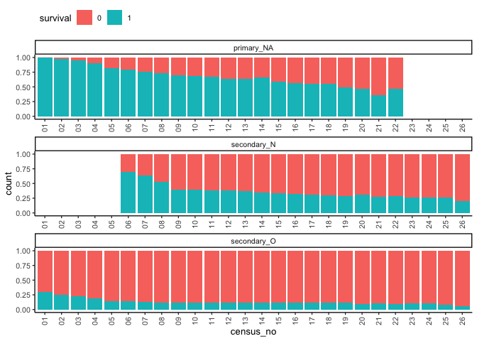
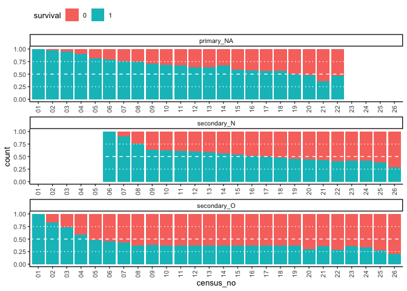
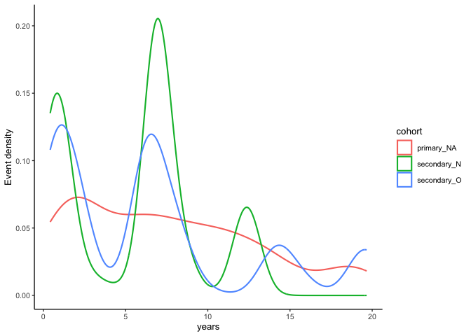
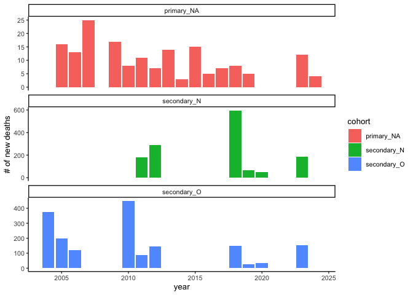
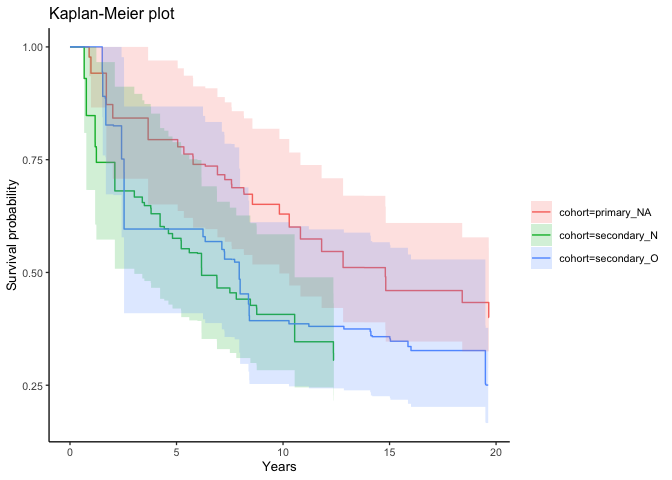
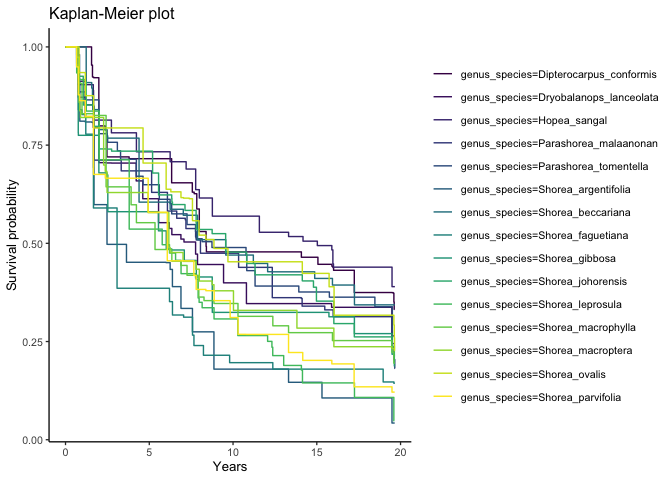
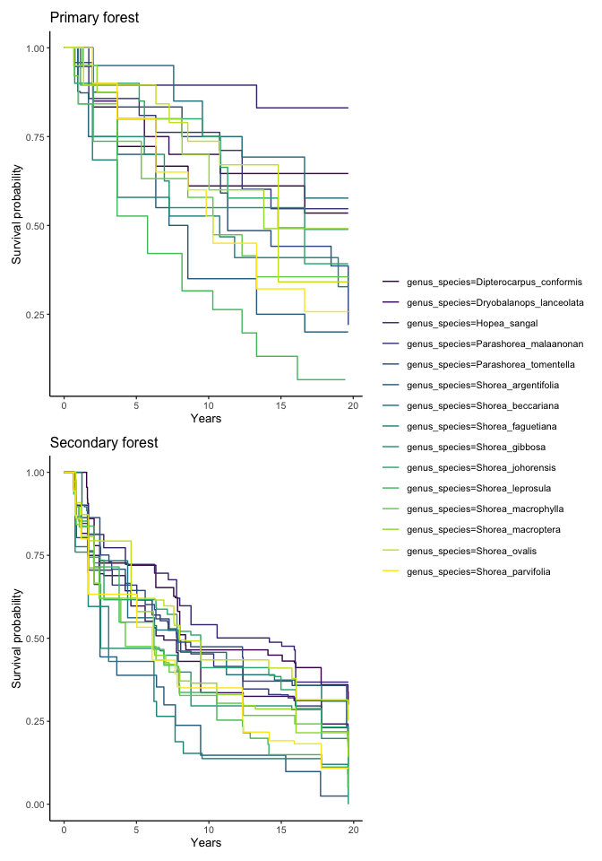
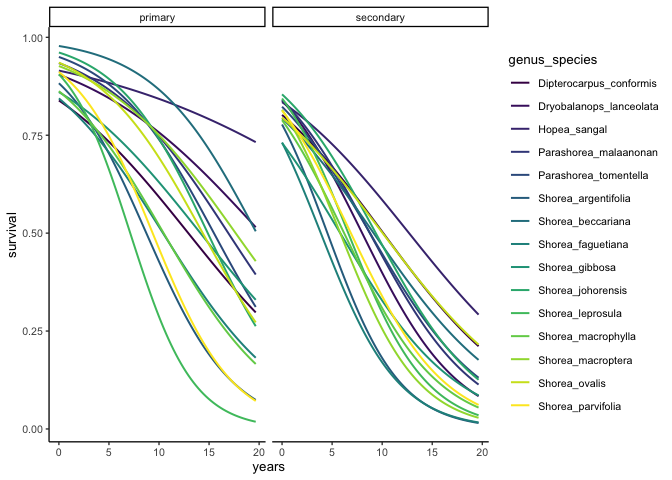

# A summary of survival
eleanorjackson
2024-10-14

<details class="code-fold">
<summary>Code</summary>

``` r
library("tidyverse")
library("here")
library("patchwork")
library("survival")
library("ggsurvfit")
set.seed(123)
```

</details>
<details class="code-fold">
<summary>Code</summary>

``` r
# reading in data and adding a column distinguishing cohorts 1 & 2 from
# the primary forest seedlings
data <- 
  readRDS(here::here("data", "derived", "data_cleaned.rds")) %>% 
  mutate(census_no = as.ordered(census_no)) %>% 
  mutate(cohort = paste(forest_type, old_new, sep = "_")) %>% 
  filter(! cohort == "secondary_NA") %>% 
  filter(! str_detect(plant_id, "NA")) 
```

</details>
<details class="code-fold">
<summary>Code</summary>

``` r
data %>% 
  mutate(survival = as.factor(survival)) %>% 
  ggplot(aes(x = census_no, group = survival, 
             fill = survival)) +
  geom_bar(position = "fill") +
  facet_wrap(~cohort, ncol = 1,
             axis.labels = "all_x", axes = "all_x") +
  guides(x =  guide_axis(angle = 90)) +
  theme(legend.position = "top", legend.justification = "left") 
```

</details>



I think we need to remove seedlings that were already dead at the time
of their first census. These seedlings are “left-censored”. Accounting
for left-censored data in models is tricky and it’s common to remove
them. Also - not sure how biologically relevant these points are -
likely it was moving from pot to ground that killed them?

First creating a “time” variable. I’m using days since first survey at
the individual plant level. I’ll also create a column which has the
units in years rather than days, as it might be easier to read (years
will still be continuous though e.g. 627 days = 1.717808 years).

<details class="code-fold">
<summary>Code</summary>

``` r
data <-
  data %>%
  group_by(plant_id) %>%
  slice_min(survey_date, with_ties = FALSE) %>%
  select(plant_id, survey_date) %>%
  rename(first_survey = survey_date) %>%
  ungroup() %>% 
  right_join(data)

data <-
  data %>%
  rowwise() %>% 
  mutate(
    days =
      survey_date - first_survey) %>% 
  ungroup() %>% 
  mutate(years = as.numeric(days, units= "weeks")/52.25,
         days_num = as.numeric(days))
```

</details>
<details class="code-fold">
<summary>Code</summary>

``` r
left_censored <- 
  data %>% 
  filter(survival == 0 & days == 0) %>%  
  select(plant_id) %>% 
  distinct()

data %>% 
  filter(!plant_id %in% left_censored$plant_id) %>% 
  mutate(survival = as.factor(survival)) %>% 
  ggplot(aes(x = census_no, group = survival, 
             fill = survival)) +
  geom_bar(position = "fill") +
  facet_wrap(~cohort, ncol = 1,
             axis.labels = "all_x", axes = "all_x") +
  guides(x =  guide_axis(angle = 90)) +
  theme(legend.position = "top", legend.justification = "left") +
  geom_hline(yintercept = 0.5, colour = "white", linetype = 2) +
  geom_hline(yintercept = 0.75, colour = "white", linetype = 3) +
  geom_hline(yintercept = 0.25, colour = "white", linetype = 3)
```

</details>



<details class="code-fold">
<summary>Code</summary>

``` r
data %>% 
  filter(!plant_id %in% left_censored$plant_id) %>% 
  filter(survival == "0") %>%
  group_by(plant_id) %>%
  slice_min(lubridate::ymd(survey_date), with_ties = FALSE) %>%
  ungroup() %>% 
  ggplot(aes(x = years, 
             colour = cohort,
             group = cohort)) +
  geom_density(linewidth = 0.75) +
  ylab("Event density")
```

</details>



Seedling deaths seem to happen fairly gradually over time in the primary
forest, for the secondary forest we see big spikes in deaths over time -
likely due to sampling effort?

Also looks like after 15 years, there are no deaths in the
2<sup>nd</sup> cohort of secondary forest seedlings, but this is because
we have no data past this point - it’s in the future!

I want to fit some survival curves - to do this we need to sort out the
censoring.

A common problem with continuous time to event data is that we often
don’t know when exactly an event happened - a seedling was alive in one
census and dead in the next but could have died at any point between
those two censuses.

This is what we call interval censored data. You can also get right
censored data (e.g. seedling still alive at the end of the study), and
left censored data (seedling already dead at the start of the study,
which we filtered out above).

<details class="code-fold">
<summary>Code</summary>

``` r
interval_censored <-
  data %>% 
  filter(survival == 0) %>% 
  group_by(plant_id) %>% 
  slice_min(survey_date, with_ties = FALSE) %>% 
  ungroup() %>% 
  rename(time_to_dead = years) %>% 
  select(plant_id, genus_species, plot, cohort, time_to_dead) %>% 
  mutate(censor = "interval") 


interval_censored <-
  data %>% 
  filter(plant_id %in% interval_censored$plant_id) %>% 
  filter(survival == 1) %>% 
  group_by(plant_id) %>% 
  slice_max(survey_date, with_ties = FALSE) %>% 
  ungroup() %>% 
  rename(time_to_last_alive = years) %>% 
  select(plant_id, time_to_last_alive) %>% 
  right_join(interval_censored) 
  
  
right_censored <- 
  data %>% 
  filter(!plant_id %in% interval_censored$plant_id) %>% 
  group_by(plant_id) %>% 
  slice_max(survey_date, with_ties = FALSE) %>% 
  ungroup() %>% 
  rename(time_to_last_alive = years) %>% 
  select(plant_id, genus_species, plot, cohort, time_to_last_alive) %>% 
  mutate(censor = "right")

data_aggregated <- 
  bind_rows(interval_censored, right_censored) %>% 
  filter(time_to_last_alive > 0) %>% 
  mutate(plot_id = as.factor(paste(cohort, plot, sep = "_")))

data_aggregated <- 
  data_aggregated %>% 
  mutate(time_to_dead = case_when(
    censor == "right" ~ time_to_last_alive,
    .default = time_to_dead
  )) 
```

</details>
<details class="code-fold">
<summary>Code</summary>

``` r
data_aggregated %>% 
  slice_sample(n = 30) %>%
  pivot_longer(cols = c(time_to_last_alive, time_to_dead)) %>% 
  ggplot(aes(y = plant_id, x = value, colour = name, group = plant_id)) +
  geom_path(colour = "lightgrey") +
  geom_point(alpha = 0.5, size = 2) +
  theme(legend.position = "top")
```

</details>



Seedlings with only one data point are right censored and seedlings with
two data points are interval censored.

Censoring is built into survival models by incorporating it into the
likelihood function underlying the analysis.

The survival probability at a certain time, is a conditional probability
of surviving beyond that time, given that an individual has survived
just prior to that time.

The [Kaplan-Meier
estimate](https://en.wikipedia.org/wiki/Kaplan–Meier_estimator) of
survival probability at a given time is the product of these conditional
probabilities up until that given time.

We can fit a survival curve and create a K-M plot using the `{survival}`
package.

<details class="code-fold">
<summary>Code</summary>

``` r
# different packages want censors formatted in different ways
data_surv <- 
  data_aggregated %>% 
  mutate(event = recode(censor, "interval" = 3, "right" = 0, "left" = 2)) %>% 
  mutate(time_to_dead = case_when(
    censor == "right" ~ NA,
    .default = time_to_dead
  ))

fit_surv <- 
  survfit(data = data_surv,
          Surv(time = time_to_last_alive, 
               time2 = time_to_dead,
               type = "interval2") ~ cohort)
```

</details>
<details class="code-fold">
<summary>Code</summary>

``` r
fit_surv %>% 
  ggsurvfit::ggsurvfit(theme = theme_classic(base_size = 10)) +
  labs(
    x = "Years",
    y = "Survival probability"
  ) + 
  add_confidence_interval() +
  ggtitle("Kaplan-Meier plot")
```

</details>



<details class="code-fold">
<summary>Code</summary>

``` r
fit_surv_sp <- 
  survfit(data = data_surv,
          Surv(time = time_to_last_alive, 
               time2 = time_to_dead,
               type = "interval2") ~ genus_species)
```

</details>

I’ve removed the CI’s for species else you can’t see anything.

<details class="code-fold">
<summary>Code</summary>

``` r
fit_surv_sp %>% 
  ggsurvfit::ggsurvfit(theme = theme_classic(base_size = 10)) +
  labs(
    x = "Years",
    y = "Survival probability"
  ) + 
  scale_colour_viridis_d() +
  ggtitle("Kaplan-Meier plot")
```

</details>



<details class="code-fold">
<summary>Code</summary>

``` r
fit_surv_sp_p <- 
  survfit(data = filter(data_surv, cohort == "primary_NA"),
          Surv(time = time_to_last_alive, 
               time2 = time_to_dead,
               type = "interval2") ~ genus_species)

fit_surv_sp_s <- 
  survfit(data = filter(data_surv, str_detect(cohort, "secondary")),
          Surv(time = time_to_last_alive, 
               time2 = time_to_dead,
               type = "interval2") ~ genus_species)
```

</details>
<details class="code-fold">
<summary>Code</summary>

``` r
fit_surv_sp_p %>% 
  ggsurvfit::ggsurvfit(theme = theme_classic(base_size = 10)) +
  labs(
    x = "Years",
    y = "Survival probability"
  ) + 
  scale_colour_viridis_d() +
  ggtitle("Primary forest") +
  
  fit_surv_sp_s %>% 
  ggsurvfit::ggsurvfit(theme = theme_classic(base_size = 10)) +
  labs(
    x = "Years",
    y = "Survival probability"
  ) + 
  scale_colour_viridis_d() +
  ggtitle("Secondary forest") +
  
  plot_layout(guides = "collect", ncol = 1)
```

</details>



It’s hard to see what’s going on with so many colours.

We can also plot survival as a binomial.

<details class="code-fold">
<summary>Code</summary>

``` r
p <- ggplot() +
  geom_smooth(data = filter(data, !plant_id %in% left_censored$plant_id), 
              aes(x = days_num, y = survival), 
              method = "glm", method.args = list(family = "binomial")) +
  facet_wrap(~forest_type)

p +
  ggdist::geom_dots(data = filter(data, !plant_id %in% left_censored$plant_id), 
                    aes(y = as.numeric(survival), x = days_num, 
                        side = ifelse(survival == 0, "bottom", "top")), 
                    color = "grey20", binwidth = 150, overflow = "compress", 
                    shape = 16, alpha = 0.3, size = 0.5) 
```

</details>


Survival looks similar in the two forest types, but perhaps survival is
slightly higher for primary forest seedlings in the first 5 years or so.

<details class="code-fold">
<summary>Code</summary>

``` r
data %>%  
  filter(!plant_id %in% left_censored$plant_id) %>% 
  ggplot() +
  geom_smooth(aes(survival, x = years, 
                  colour = genus_species), 
              se = FALSE, linewidth = 0.7,
              method = "glm", method.args = list(family = "binomial")) +
  facet_wrap(~forest_type) +
  scale_colour_viridis_d() 
```

</details>



<details class="code-fold">
<summary>Code</summary>

``` r
data %>%  
  filter(!plant_id %in% left_censored$plant_id) %>% 
  ggplot(aes(survival, x = years, 
                  colour = cohort)) +
  geom_smooth(se = FALSE, linewidth = 0.7,
              method = "glm", method.args = list(family = "binomial")) +
  facet_wrap(~genus_species, ncol = 5)  +
  ggtitle("geom_smooth(method = `glm`)") +
  
  data %>%  
  filter(!plant_id %in% left_censored$plant_id) %>% 
  ggplot(aes(survival, x = years, 
                  colour = cohort)) +
  geom_smooth(se = FALSE, linewidth = 0.7,
              method = "gam", method.args = list(family = "binomial")) +
  facet_wrap(~genus_species, ncol = 5)  +
  ggtitle("geom_smooth(method = `gam`)") +
  
  plot_layout(guides = "collect", ncol = 1) &
  theme(legend.position = "bottom", legend.justification = "left") 
```

</details>


This is quite interesting, survival always higher for primary forest
seedlings.
