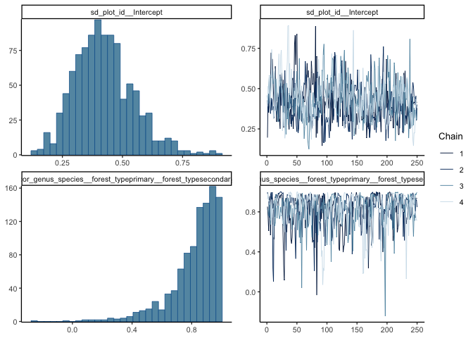

# Some survival models - comparing families
eleanorjackson
2024-11-01

``` r
library("tidyverse")
library("here")
library("patchwork")
library("brms")
library("loo")
```

``` r
data <- 
  readRDS(here::here("data", "derived", "data_cleaned.rds"))
```

``` r
data <-
  data %>%
  group_by(plant_id) %>%
  slice_min(survey_date, with_ties = FALSE) %>%
  select(plant_id, survey_date) %>%
  rename(first_survey = survey_date) %>%
  ungroup() %>% 
  right_join(data)

data <-
  data %>%
  rowwise() %>% 
  mutate(
    days =
      survey_date - first_survey) %>% 
  ungroup() %>% 
  mutate(years = as.numeric(days, units= "weeks")/52.25,
         days_num = as.numeric(days))
```

``` r
interval_censored <-
  data %>% 
  filter(survival == 0) %>% 
  group_by(plant_id) %>% 
  slice_min(survey_date, with_ties = FALSE) %>% 
  ungroup() %>% 
  rename(time_to_dead = years) %>% 
  select(plant_id, genus_species, plot, forest_type, cohort, time_to_dead) %>% 
  mutate(censor = "interval")


interval_censored <-
  data %>% 
  filter(plant_id %in% interval_censored$plant_id) %>% 
  filter(survival == 1) %>% 
  group_by(plant_id) %>% 
  slice_max(survey_date, with_ties = FALSE) %>% 
  ungroup() %>% 
  rename(time_to_last_alive = years) %>% 
  select(plant_id, time_to_last_alive) %>% 
  right_join(interval_censored) 
  
  
right_censored <- 
  data %>% 
  filter(!plant_id %in% interval_censored$plant_id) %>% 
  group_by(plant_id) %>% 
  slice_max(survey_date, with_ties = FALSE) %>% 
  ungroup() %>% 
  rename(time_to_last_alive = years) %>% 
  select(plant_id, genus_species, plot, forest_type, 
         cohort, time_to_last_alive) %>% 
  mutate(censor = "right")

data_aggregated <- 
  bind_rows(interval_censored, right_censored) %>% 
  filter(time_to_last_alive > 0) %>% 
  mutate(plot_id = as.factor(paste(forest_type, plot, sep = "_")))

data_aggregated <- 
  data_aggregated %>% 
  mutate(censor_2 = case_when(
         censor == "right" ~ "right",
         censor == "interval" ~ "none")) %>% 
  mutate(time_to_dead = case_when(
    censor == "right" ~ time_to_last_alive,
    .default = time_to_dead
  )) %>% 
  rowwise() %>% 
  mutate(time_to_dead_2 = case_when(
    censor == "interval" ~ median(c(time_to_last_alive, time_to_dead)),
    .default = time_to_dead
  ) ) %>% 
  ungroup()
```

## Cox

The `:` operator creates a new factor that consists of the combined
levels of the two grouping levels. So the effects of one are assumed to
vary across the other.

The `/` operator indicates nested grouping structures and expands one
grouping factor into two or more when using multiple `/` within one
term.

Cox can’t account for interval censored data, so I’m using the mid-point
of the interval as the dead date.

``` r
fit_cox <- 
  brm(time_to_last_alive|cens(x = censor_2, y2 = time_to_dead_2) ~ 
        0 + forest_type + (0 + forest_type | genus_species) +
        (1 | cohort) + (1 | plot_id), 
      data = data_aggregated,
      family = brmsfamily("cox"), 
      iter = 500,
      cores = 4,
      chains = 4,
      seed = 123,
      file = here::here("code", "notebooks", "models",
                        "2024-10-25_model-survival", 
                        "fit_cox.rds"),
      file_refit = "on_change")
```

``` r
plot(fit_cox)
```




``` r
bayesplot::mcmc_areas(fit_cox, regex_pars = "^r_genus_species", prob = 0.95)
```


``` r
bayesplot::mcmc_areas(fit_cox, regex_pars = "b_", prob = 0.95)
```


## Weibull

``` r
fit_weibull <- 
  brm(time_to_last_alive|cens(x = censor, y2 = time_to_dead) ~ 
        0 + forest_type + (0 + forest_type | genus_species) +
        (1 | cohort) + (1 | plot_id), 
      data = data_aggregated,
      family = brmsfamily("weibull"), 
      iter = 500,
      cores = 4,
      chains = 4,
      seed = 123,
      file = here::here("code", "notebooks", "models",
                        "2024-10-25_model-survival", 
                        "fit_weibull.rds"),
      file_refit = "on_change")
```

``` r
plot(fit_weibull)
```


``` r
bayesplot::mcmc_areas(fit_weibull, regex_pars = "b_", prob = 0.95)
```


``` r
bayesplot::mcmc_areas(fit_weibull, regex_pars = "^r_genus_species", prob = 0.95)
```


``` r
# ppc_km_overlay can't do interval censored data
# 0 = right censored, 1 = event

data_aggregated <- 
  data_aggregated %>% 
  mutate(censor_3 = case_when(
         censor == "right" ~ 0,
         censor == "interval" ~ 1)) %>% 
  mutate()

pp_weibull <- posterior_predict(fit_weibull, draw_ids = 1:10)

bayesplot::ppc_km_overlay_grouped(y = data_aggregated$time_to_last_alive, 
                                  yrep = pp_weibull, 
                                  status_y = data_aggregated$censor_3, 
                                  group = data_aggregated$forest_type) +
  xlim(0, 20)
```


## Gamma

``` r
fit_gamma <- 
  brm(time_to_last_alive|cens(x = censor, y2 = time_to_dead) ~ 
        0 + forest_type + (0 + forest_type | genus_species) +
        (1 | cohort) + (1 | plot_id), 
      data = data_aggregated,
      family = brmsfamily("Gamma"), 
      iter = 500,
      cores = 4,
      chains = 4,
      seed = 123,
      file = here::here("code", "notebooks", "models",
                        "2024-10-25_model-survival", 
                        "fit_gamma.rds"),
      file_refit = "on_change")
```

``` r
plot(fit_gamma)
```


``` r
bayesplot::mcmc_areas(fit_gamma, regex_pars = "b_", prob = 0.95)
```


``` r
bayesplot::mcmc_areas(fit_gamma, regex_pars = "^r_genus_species", prob = 0.95)
```


``` r
pp_gamma <- posterior_predict(fit_gamma, draw_ids = 1:10)

bayesplot::ppc_km_overlay_grouped(y = data_aggregated$time_to_last_alive, 
                                  yrep = pp_gamma, 
                                  status_y = data_aggregated$censor_3, 
                                  group = data_aggregated$forest_type) +
  xlim(0, 20)
```


## Loo compare

``` r
loo_c <- 
  loo_compare(
    loo(fit_cox),
    loo(fit_gamma),
    loo(fit_weibull)
    )

loo_c
```

                elpd_diff se_diff
    fit_weibull    0.0       0.0 
    fit_gamma     -2.2       1.6 
    fit_cox     -935.2      55.2 

Weibull performs best.
