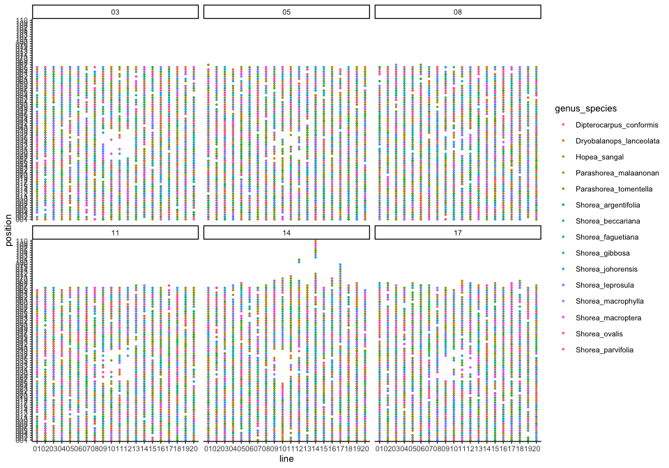
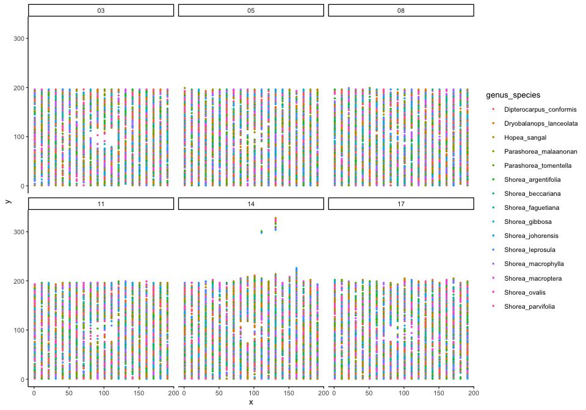
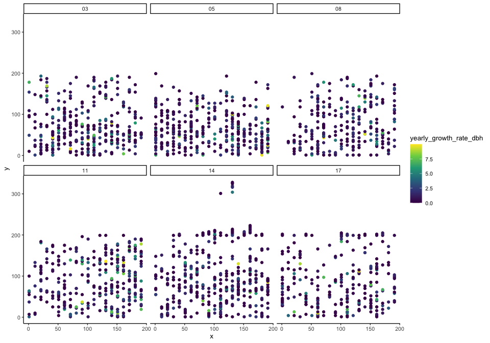
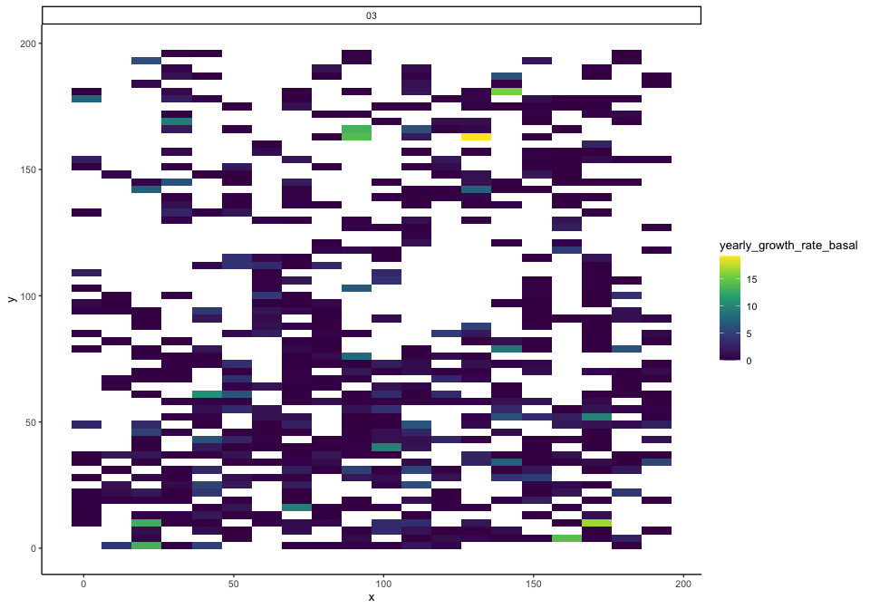

# Explore spatial autocorrelation
eleanorjackson
2024-10-30

``` r
library("tidyverse")
library("here")
library("patchwork")
```

Do plants that are closer together have similar growth / survival
rates??

``` r
data <- 
  readRDS(here::here("data", "derived", "data_cleaned.rds")) 
```

``` r
data %>% 
  filter(forest_type == "secondary") %>% 
  select(plant_id, plot, line, position, genus_species) %>% 
  distinct() %>% 
  ggplot(aes(x = line, y = position, colour = genus_species)) +
  geom_point(size = 0.5) +
  facet_wrap(~plot)
```



There are 3 m between each planting position and 10 m between each line.
Above fig is plotted by line and position but let’s try and plot things
in meters.

``` r
x_vals <- 
  tibble(x = seq(from = 1, by = 10, length.out = 20),
       line = levels(filter(data, forest_type == "secondary")$line))

y_vals <- 
  tibble(y = seq(from = 1, by = 3, length.out = 110),
       position = 1:110) %>% 
  mutate(position = formatC(position,
                             width = 3,
                             format = "d",
                             flag = "0")) %>% 
  mutate(position = as.factor(position))

SBE_space <- 
  data %>% 
  filter(forest_type == "secondary") %>% 
  mutate(position = as.factor(position)) %>% 
  left_join(y_vals) %>% 
  left_join(x_vals) 
```

``` r
SBE_space %>% 
  select(plant_id, plot, x, y, genus_species) %>% 
  distinct() %>% 
  ggplot(aes(x = x, y = y, colour = genus_species)) +
  geom_point(size = 0.5) +
  facet_wrap(~plot)
```



Maybe we can colour by growth rate to eyeball any spatial patterns.

``` r
# Creating a 'time since first survey' variable

SBE_space <-
  SBE_space %>%
  group_by(plant_id) %>%
  slice_min(survey_date, with_ties = FALSE) %>%
  select(plant_id, survey_date) %>%
  rename(first_survey = survey_date) %>%
  ungroup() %>% 
  right_join(SBE_space)

SBE_space <-
  SBE_space %>%
  rowwise() %>% 
  mutate(
    days =
      survey_date - first_survey) %>% 
  ungroup() %>% 
  mutate(years = as.numeric(days, units = "weeks")/52.25,
         days_num = as.numeric(days))

left_censored <- 
  SBE_space %>% 
  filter(survival == 0 & days == 0) %>%  
  select(plant_id) %>% 
  distinct()

SBE_space <-
  SBE_space %>%
  filter(!plant_id %in% left_censored$plant_id) 
```

``` r
# Getting yearly growth rates per individual

SBE_gr <- 
  SBE_space %>% 
  group_by(plant_id, genus_species, plot, x, y, position, line) %>%
  summarise(dbh_diff = max(dbh_mean, na.rm = TRUE) - 
              min(dbh_mean, na.rm = TRUE),
            basal_diff = max(dbase_mean, na.rm = TRUE) - 
              min(dbase_mean, na.rm = TRUE),
            max_years = max(years, na.rm = TRUE), 
            .groups = "keep") %>% 
  summarise(yearly_growth_rate_dbh = dbh_diff/max_years,
            yearly_growth_rate_basal = basal_diff/max_years)  %>% 
  filter(!if_all(c(yearly_growth_rate_dbh, yearly_growth_rate_basal), 
                 is.infinite)) %>% 
  mutate(yearly_growth_rate_dbh = replace(yearly_growth_rate_dbh, 
                                          is.infinite(yearly_growth_rate_dbh),
                                          NA),
         yearly_growth_rate_basal = replace(yearly_growth_rate_basal, 
                                          is.infinite(yearly_growth_rate_basal),
                                          NA))
```

``` r
SBE_gr %>% 
  distinct() %>% 
  filter(yearly_growth_rate_dbh < 10) %>% 
  ggplot(aes(x = x, y = y, colour = yearly_growth_rate_dbh)) +
  geom_point() +
  facet_wrap(~plot) +
  scale_colour_viridis_c() 
```



``` r
SBE_gr %>% 
  filter(plot == "03") %>% 
  ggplot(aes(x, y, fill = yearly_growth_rate_basal)) + 
  geom_tile() +
  scale_fill_viridis_c() +
  facet_wrap(~plot) 
```



These are interesting to look at but I don’t think they tell us much.
growth rate is going to be relative for each species, and it’s harder to
get a per-individual value for survival.

But, I also don’t think we can ignore any potential spatial
autocorrelation.

A good approach might be:

- fit a model with and without spatial autocorrelation ([CAR
  model?](http://paulbuerkner.com/brms/reference/car.html)) and compare
  them via `loo()`
- and/or check for spatial autocorrelation in the residuals of each
  model using Moran’s I test ([{spdep} R
  package](https://r-spatial.github.io/spdep/index.html)). *“if you’ve
  modelled all the spatial auto-correlation in your data, then the Moran
  coefficient for your residuals (using the posterior mean of the fitted
  values for example) will be slightly negative”*

Some relevant discussion:

- https://discourse.mc-stan.org/t/correct-way-to-incorporate-spatial-autocorrelation/17736/2
- https://mc-stan.org/users/documentation/case-studies/icar_stan.html
- https://discourse.mc-stan.org/t/spatial-autocorrelation/9609
- https://www.paulamoraga.com/book-spatial/spatial-autocorrelation.html

Creating maps/x, y grid values for the primary forest seedlings might be
more difficult - plant/tag number doesn’t correspond to position and
position of a species is random in each plot. We will need to look back
at the field maps.

We want to include info on how individuals within plots are connected
but not necessarily how plots are connected to each other… Need to think
about how that will work in the CAR model.

If CAR doesn’t work we could think about splitting the plot into
quadrats (e.g. 10x10m) and add this as a random effect - better than
using line numbers?
