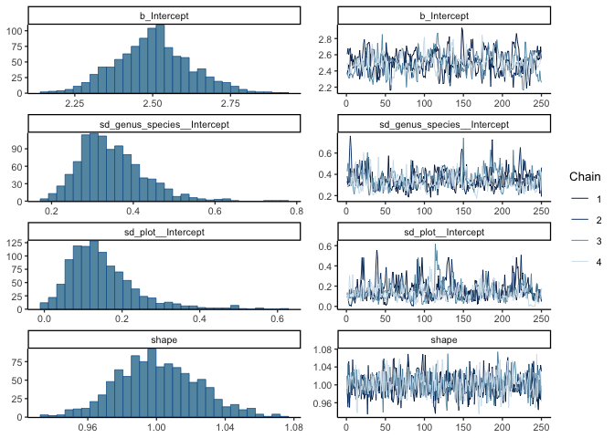
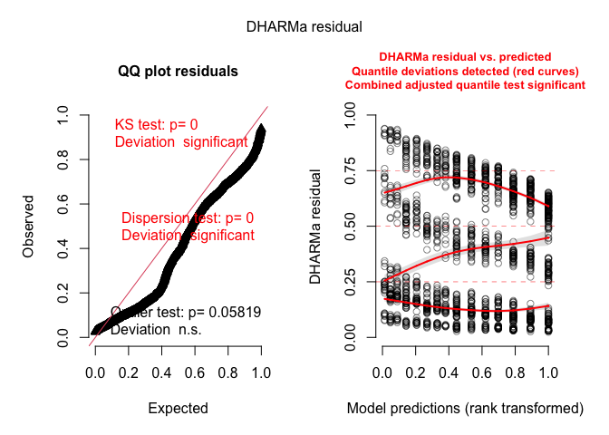

# Testing for spatial autocorrelation in survival
eleanorjackson
2024-11-07

``` r
library("tidyverse")
library("here")
library("patchwork")
library("brms")
library("DHARMa")
library("DHARMa.helpers")
```

``` r
data <- 
  readRDS(here::here("data", "derived", "data_cleaned.rds"))
```

# aggregate data for survival models

``` r
data <-
  data %>%
  group_by(plant_id) %>%
  slice_min(survey_date, with_ties = FALSE) %>%
  select(plant_id, survey_date) %>%
  rename(first_survey = survey_date) %>%
  ungroup() %>% 
  right_join(data)

data <-
  data %>%
  rowwise() %>% 
  mutate(
    days =
      survey_date - first_survey) %>% 
  ungroup() %>% 
  mutate(years = as.numeric(days, units= "weeks")/52.25,
         days_num = as.numeric(days))
```

``` r
interval_censored <-
  data %>% 
  filter(survival == 0) %>% 
  group_by(plant_id) %>% 
  slice_min(survey_date, with_ties = FALSE) %>% 
  ungroup() %>% 
  rename(time_to_dead = years) %>% 
  select(plant_id, genus_species, plot, forest_type, cohort, time_to_dead) %>% 
  mutate(censor = "interval")


interval_censored <-
  data %>% 
  filter(plant_id %in% interval_censored$plant_id) %>% 
  filter(survival == 1) %>% 
  group_by(plant_id) %>% 
  slice_max(survey_date, with_ties = FALSE) %>% 
  ungroup() %>% 
  rename(time_to_last_alive = years) %>% 
  select(plant_id, time_to_last_alive) %>% 
  right_join(interval_censored) 
  
  
right_censored <- 
  data %>% 
  filter(!plant_id %in% interval_censored$plant_id) %>% 
  group_by(plant_id) %>% 
  slice_max(survey_date, with_ties = FALSE) %>% 
  ungroup() %>% 
  rename(time_to_last_alive = years) %>% 
  select(plant_id, genus_species, plot, forest_type, 
         cohort, time_to_last_alive) %>% 
  mutate(censor = "right")

data_aggregated <- 
  bind_rows(interval_censored, right_censored) %>% 
  filter(time_to_last_alive > 0) %>% 
  mutate(plot_id = as.factor(paste(forest_type, plot, sep = "_")))

data_aggregated <- 
  data_aggregated %>% 
  mutate(censor_2 = case_when(
         censor == "right" ~ "right",
         censor == "interval" ~ "none")) %>% 
  mutate(time_to_dead = case_when(
    censor == "right" ~ time_to_last_alive,
    .default = time_to_dead
  )) %>% 
  rowwise() %>% 
  mutate(time_to_dead_2 = case_when(
    censor == "interval" ~ median(c(time_to_last_alive, time_to_dead)),
    .default = time_to_dead
  ) ) %>% 
  ungroup()
```

# generate grid

``` r
x_vals <- 
  tibble(x = seq(from = 1, by = 10, length.out = 20),
       line = levels(filter(data, forest_type == "secondary")$line))

y_vals <- 
  tibble(y = seq(from = 1, by = 3, length.out = 110),
       position = 1:110) %>% 
  mutate(position = formatC(position,
                             width = 3,
                             format = "d",
                             flag = "0")) %>% 
  mutate(position = as.factor(position))

SBE_space <- 
  data %>% 
  filter(forest_type == "secondary") %>% 
  mutate(position = as.factor(position)) %>% 
  left_join(y_vals) %>% 
  left_join(x_vals) %>% 
  mutate(y = case_when(
    plot == "03" ~ y + 1000,
    plot == "05" ~ y + 500,
    plot == "08" ~ y + 700,
    plot == "11" ~ y + 1000,
    plot == "14" ~ y + 400,
    plot == "17" ~ y + 900,
  )) %>% 
  mutate(x = case_when(
    plot == "03" ~ x + 0,
    plot == "05" ~ x + 0,
    plot == "08" ~ x + 200,
    plot == "11" ~ x + 400,
    plot == "14" ~ x + 400,
    plot == "17" ~ x + 600,
  ))
```

``` r
SBE_space %>% 
  filter(cohort == "1") %>% 
  select(plant_id, plot, x, y) %>% 
  distinct() %>% 
  ggplot(aes(x = x, y = y, colour = plot)) +
  geom_point(size = 0.5) 
```


``` r
SBE_space_surv <- 
  SBE_space %>% 
  filter(cohort == "1") %>% 
  select(plant_id, plot, line, position, x, y) %>% 
  distinct() %>% 
  left_join(data_aggregated) %>% 
  drop_na() # NAs are left censored plants
```

# fit for just primary forest and cohort 1

``` r
fit_secondary_part_pool <- 
  brm(time_to_last_alive|cens(x = censor, y2 = time_to_dead) ~ 
        1 + (1 | genus_species) + (1 | plot), 
      data = SBE_space_surv,
      family = brmsfamily("weibull"), 
      iter = 500,
      cores = 4,
      chains = 4,
      seed = 123,
      file = here::here("code", "notebooks", "models",
                        "2024-11-05_test-spatial-autocorrelation", 
                        "fit_weibull_sbe_part_pool.rds"),
      file_refit = "on_change")
```

``` r
plot(fit_secondary_part_pool)
```



``` r
mod_check <- dh_check_brms(fit_secondary_part_pool)
```


``` r
testSpatialAutocorrelation(
  mod_check, 
  x = SBE_space_surv$x, 
  y = SBE_space_surv$y
)
```


        DHARMa Moran's I test for distance-based autocorrelation

    data:  mod_check
    observed = 0.01381694, expected = -0.00055218, sd = 0.00170848, p-value
    < 2.2e-16
    alternative hypothesis: Distance-based autocorrelation

*Plot showing each residual with at its x,y position, coloured according
to the residual value. Residuals with 0.5 are coloured white, everything
below 0.5 is coloured increasingly red, everything above 0.5 is coloured
increasingly blue.*

If you’ve modelled all the spatial auto-correlation in your data, then
the Moran coefficient for your residuals will be slightly negative.

Fit without pooling of species rather than partial pooling.

``` r
fit_secondary_no_pool <- 
  brm(time_to_last_alive|cens(x = censor, y2 = time_to_dead) ~ 
        1 + genus_species + (1 | plot), 
      data = SBE_space_surv,
      family = brmsfamily("weibull"), 
      iter = 500,
      cores = 4,
      chains = 4,
      seed = 123,
      file = here::here("code", "notebooks", "models",
                        "2024-11-05_test-spatial-autocorrelation", 
                        "fit_weibull_sbe_no_pool.rds"),
      file_refit = "on_change")
```

``` r
plot(fit_secondary_no_pool)
```


``` r
mod_check_no_pool <- dh_check_brms(fit_secondary_no_pool)
```



``` r
testSpatialAutocorrelation(
  mod_check_no_pool, 
  x = SBE_space_surv$x, 
  y = SBE_space_surv$y
)
```


        DHARMa Moran's I test for distance-based autocorrelation

    data:  mod_check_no_pool
    observed = 0.01363009, expected = -0.00055218, sd = 0.00170846, p-value
    < 2.2e-16
    alternative hypothesis: Distance-based autocorrelation
