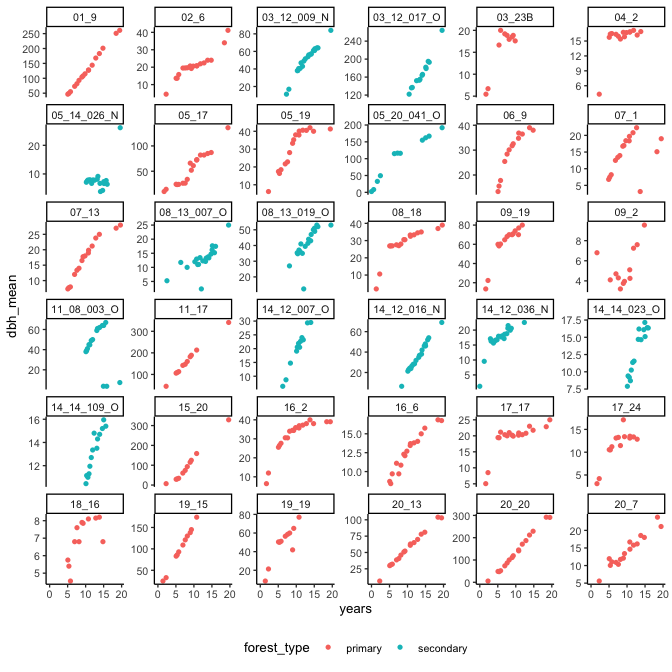
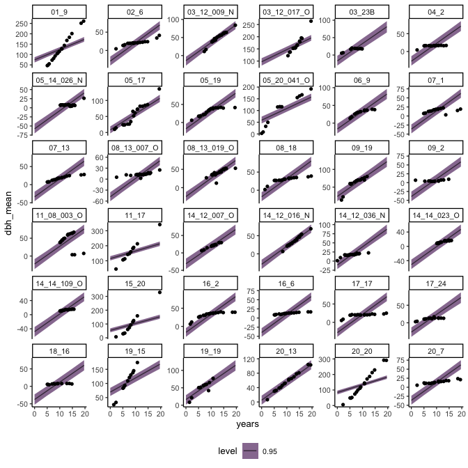
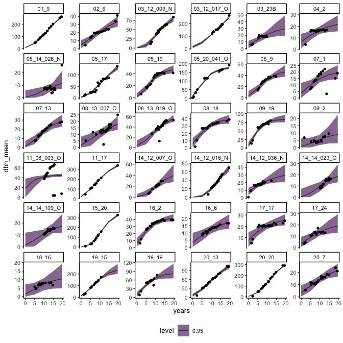
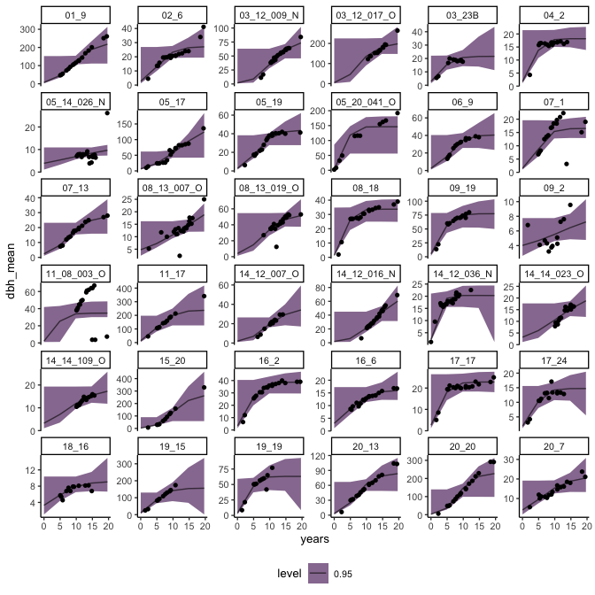

# Try to model growth
eleanorjackson
2024-12-13

I found [an interesting
article](https://betanalpha.github.io/assets/chapters_html/tree_diameter_growth_analysis.html)
about fitting tree growth models in Stan.

``` r
library("tidyverse")
library("here")
library("patchwork")
library("brms")
library("tidybayes")
library("modelr")
```

``` r
data <- 
  readRDS(here::here("data", "derived", "data_cleaned.rds"))
```

Selecting trees which have more than 10 data points.

``` r
well_sampled_trees <- 
  data %>% 
  group_by(plant_id) %>% 
  summarise(records = sum(!is.na(dbh_mean))) %>% 
  filter(records > 10)
```

Now taking a random sample of 36 trees.

``` r
data_sample <-
  data %>% 
  filter(survival == 1) %>% 
  filter(plant_id %in% well_sampled_trees$plant_id) %>% 
  filter(plant_id %in% sample(unique(plant_id), 36))
```

``` r
data_sample %>% 
  ggplot(aes(y = dbh_mean, x = years, colour = forest_type)) +
  geom_point(shape = 16) +
  facet_wrap(~plant_id, scales = "free_y") +
  theme(legend.position = "bottom")
```



## linear diameter growth

``` r
linear_growth <- 
  brm(dbh_mean ~ 
        years + (1 | plant_id), 
      data = data_sample,
      family = brmsfamily("gaussian"), 
      iter = 500,
      cores = 4,
      chains = 4,
      seed = 123,
      file = here::here("code", "notebooks", "models",
                        "2024-12-13_model-growth", 
                        "linear_growth.rds"),
      file_refit = "on_change")
```

``` r
data_sample %>% 
  data_grid(years = seq_range(years, n = 5),
            plant_id = droplevels(unique(data_sample$plant_id))) %>% 
  add_epred_draws(linear_growth, 
                  n_draws = 50) %>%
  ggplot(aes(y = dbh_mean, x = years)) +
  stat_lineribbon(aes(y = .epred), 
                  linewidth = 0.5, 
                  .width = 0.95, 
                  alpha = 0.6) +
  geom_point(data = data_sample, 
             shape = 16) +
  facet_wrap(~plant_id, 
             scales = "free_y") +
  theme(legend.position = "bottom")
```



## non linear diameter growth

Assuming that assume that diameter growth follows a sigmoidal curve -
Gompertz model.

Model formula from here:
https://discourse.mc-stan.org/t/hierarchical-gompertz-model/13724

Equation (1) here:
https://journals.plos.org/plosone/article?id=10.1371/journal.pone.0178691#sec005

``` r
gompertz <- bf(dbh_mean ~ A * exp( -exp( -(k * (years - delay) ) ) ),
             A ~ 1 + (1 | plant_id),
             k ~ 1 + (1 | plant_id),
             delay ~ 1 + (1 | plant_id),
             nl = TRUE)
```

- `A` is the adult or maximum DBH
- `k` is a growth rate coefficient which affecs the slope
- `delay` represents time at inflection i.e. it shifts the sigmoidal
  curve horizontally without changing it’s shape

``` r
non_linear_growth <- 
  brm(gompertz,
      data = data_sample,
      family = brmsfamily("gaussian"), 
      iter = 500,
      cores = 4,
      chains = 4,
      seed = 123,
      file = here::here("code", "notebooks", "models",
                        "2024-12-13_model-growth", 
                        "non_linear_growth.rds"),
      file_refit = "on_change")
```

``` r
data_sample %>% 
  data_grid(years = seq_range(years, n = 5),
            plant_id = droplevels(unique(data_sample$plant_id))) %>% 
  add_epred_draws(non_linear_growth, 
                  n_draws = 50) %>%
  ggplot(aes(y = dbh_mean, x = years)) +
  stat_lineribbon(aes(y = .epred), 
                  linewidth = 0.5, 
                  .width = 0.95, 
                  alpha = 0.6) +
  geom_point(data = data_sample, 
             shape = 16) +
  facet_wrap(~plant_id, 
             scales = "free_y") +
  theme(legend.position = "bottom")
```



Trying with lognormal response distribution rather than gaussian. The
Gaussian family is simpler to fit but allows negative values of DBH
which isn’t possible!

``` r
non_linear_growth_lognorm <- 
  brm(gompertz,
      data = data_sample,
      family = lognormal(link = "identity", link_sigma = "log"), 
      iter = 500,
      cores = 4,
      chains = 4,
      seed = 123,
      file = here::here("code", "notebooks", "models",
                        "2024-12-13_model-growth", 
                        "non_linear_growth_lognorm.rds"),
      file_refit = "on_change")
```

``` r
data_sample %>% 
  data_grid(years = seq_range(years, n = 5),
            plant_id = droplevels(unique(data_sample$plant_id))) %>% 
  add_epred_draws(non_linear_growth_lognorm, 
                  n_draws = 50) %>%
  ggplot(aes(y = dbh_mean, x = years)) +
  stat_lineribbon(aes(y = .epred), 
                  linewidth = 0.5, 
                  .width = 0.95, 
                  alpha = 0.6) +
  geom_point(data = data_sample, 
             shape = 16) +
  facet_wrap(~plant_id, 
             scales = "free_y") +
  theme(legend.position = "bottom")
```



I think we need to tidy up those instances where trees are shrinking
(most of them look like measurement error to me).
