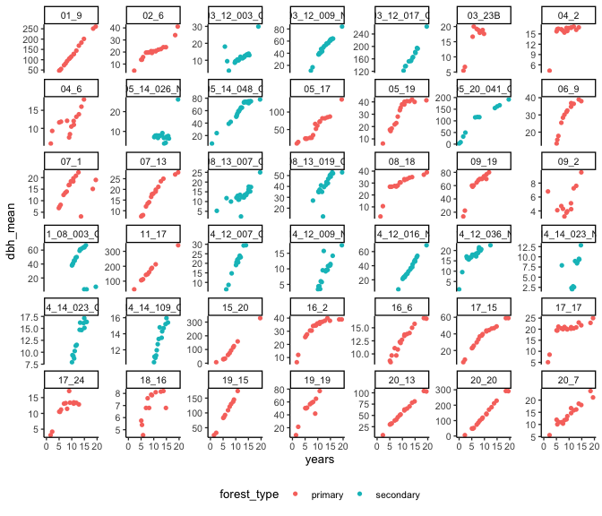
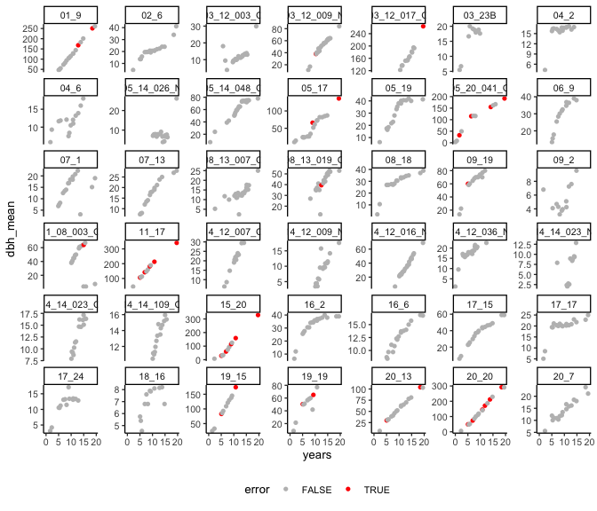
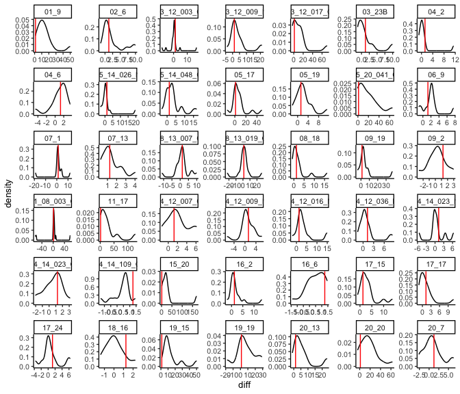
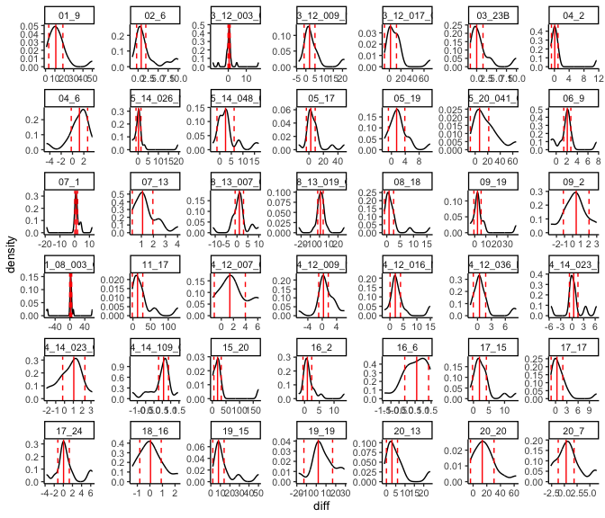
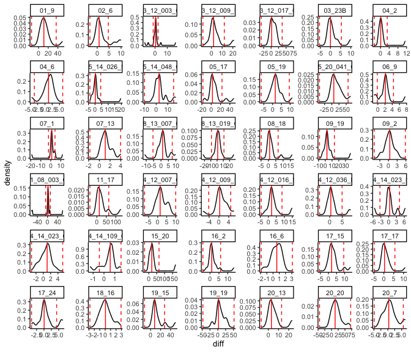
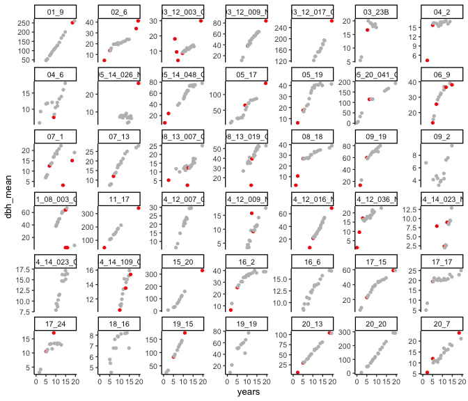
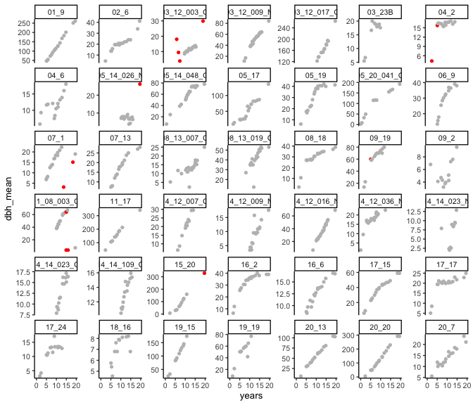
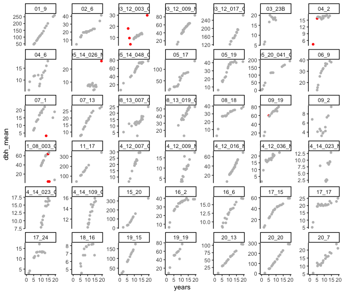

# Growth measurement error
eleanorjackson
2025-01-08

There are some growth data points which look like measurement error to
me.

``` r
library("tidyverse")
library("here")
library("patchwork")
```

``` r
data <- 
  readRDS(here::here("data", "derived", "data_cleaned.rds"))
```

Selecting trees which have more than 10 data points.

``` r
well_sampled_trees <- 
  data %>% 
  group_by(plant_id) %>% 
  summarise(records = sum(!is.na(dbh_mean))) %>% 
  filter(records > 10)
```

Now taking a random sample of 36 trees.

``` r
data_sample <-
  data %>% 
  filter(survival == 1) %>% 
  filter(plant_id %in% well_sampled_trees$plant_id) %>% 
  filter(plant_id %in% sample(unique(plant_id), 42))
```

``` r
data_sample %>% 
  ggplot(aes(y = dbh_mean, x = years, colour = forest_type)) +
  geom_point(shape = 16) +
  facet_wrap(~plant_id, scales = "free_y") +
  theme(legend.position = "bottom")
```



I’ll try and pick out the outliers by selecting points which are very
different (say more than 20cm..) from the previous measurement for that
tree.

``` r
data_sample %>%
  drop_na(dbh_mean) %>% 
  group_by(plant_id) %>%
  mutate(diff = dbh_mean - lag(dbh_mean, order_by = years)) %>% 
  mutate(diff = ifelse(is.na(diff), 
                       dbh_mean - lead(dbh_mean, order_by = years),
                       diff)) %>% 
  mutate(error = ifelse(diff > 20, TRUE, FALSE)) %>% 
  ggplot(aes(y = dbh_mean, x = years, colour = error)) +
  geom_point(shape = 16) +
  facet_wrap(~plant_id, scales = "free_y") +
  theme(legend.position = "bottom") +
  scale_colour_manual(values = c("FALSE" = "gray", "TRUE" = "red"))
```



This hasn’t worked, we need the “threshold” for selecting outliers to be
relative to each individual - some trees grow faster than others.

``` r
data_sample %>% 
  drop_na(dbh_mean) %>% 
  group_by(plant_id) %>%
  mutate(diff = dbh_mean - lag(dbh_mean, order_by = years)) %>%
  ggplot(aes(x = diff)) +
  geom_density() +
  facet_wrap(~plant_id,
             scales = "free") +
  geom_vline(aes(xintercept = median(diff, na.rm = TRUE)),
             colour = "red")
```



Using [Median Absolute Deviation
(MAD)](https://en.wikipedia.org/wiki/Median_absolute_deviation) rather
than IQR since distributions are not normal.

``` r
mad_vals <- 
  data_sample %>% 
  drop_na(dbh_mean) %>% 
  group_by(plant_id) %>%
  mutate(diff = dbh_mean - lag(dbh_mean, order_by = years)) %>%
  mutate(diff = ifelse(is.na(diff), 
                       dbh_mean - lead(dbh_mean, order_by = years),
                       diff)) %>% 
  summarise(mad = mad(diff, na.rm = TRUE),
            median = median(diff, na.rm = TRUE)) %>% 
  mutate(m_mad = median - mad,
         p_mad = median + mad)

data_sample %>% 
  drop_na(dbh_mean) %>% 
  group_by(plant_id) %>%
  mutate(diff = dbh_mean - lag(dbh_mean, order_by = years)) %>%
  ggplot(aes(x = diff)) +
  geom_density() +
  facet_wrap(~plant_id,
             scales = "free") +
  geom_vline(data = mad_vals, aes(xintercept = median),
             colour = "red") +
  geom_vline(data = mad_vals, aes(xintercept = m_mad),
             colour = "red", linetype = 2) +
  geom_vline(data = mad_vals, aes(xintercept = p_mad),
             colour = "red", linetype = 2)
```



The default range contains 50% of the distribution (scale factor =
1.4826). We can change the scale factor in the calculation of MAD to
widen the distribution.

``` r
mad_vals <- 
  data_sample %>% 
  drop_na(dbh_mean) %>% 
  group_by(plant_id) %>%
  mutate(diff = dbh_mean - lag(dbh_mean, order_by = years)) %>%
  mutate(diff = ifelse(is.na(diff), 
                       dbh_mean - lead(dbh_mean, order_by = years),
                       diff)) %>% 
  summarise(mad = mad(diff, na.rm = TRUE, constant = 5),
            median = median(diff, na.rm = TRUE, constant = 5)) %>% 
  mutate(m_mad = median - mad,
         p_mad = median + mad)

data_sample %>% 
  drop_na(dbh_mean) %>% 
  group_by(plant_id) %>%
  mutate(diff = dbh_mean - lag(dbh_mean, order_by = years)) %>%
  ggplot(aes(x = diff)) +
  geom_density() +
  facet_wrap(~plant_id,
             scales = "free") +
  geom_vline(data = mad_vals, aes(xintercept = median),
             colour = "red") +
  geom_vline(data = mad_vals, aes(xintercept = m_mad),
             colour = "red", linetype = 2) +
  geom_vline(data = mad_vals, aes(xintercept = p_mad),
             colour = "red", linetype = 2)
```



``` r
data_sample %>% 
  drop_na(dbh_mean) %>% 
  group_by(plant_id) %>%
  mutate(diff = dbh_mean - lag(dbh_mean, order_by = years)) %>%
  mutate(diff = ifelse(is.na(diff), 
                       dbh_mean - lead(dbh_mean, order_by = years),
                       diff)) %>% 
  left_join(mad_vals) %>% 
  ggplot(aes(y = dbh_mean, x = years,
             colour = ifelse(diff < m_mad | diff > p_mad,
                                 "red", "grey"))) +
  
  facet_wrap(~plant_id, scales = "free_y") +
  geom_point(shape = 16) +
  theme(legend.position = "bottom") +
  scale_colour_identity()
```



MAD of 5 units still looks too restrictive.

``` r
mad_vals <- 
  data_sample %>% 
  drop_na(dbh_mean) %>% 
  group_by(plant_id) %>%
  mutate(diff = dbh_mean - lag(dbh_mean, order_by = years)) %>%
  mutate(diff = ifelse(is.na(diff), 
                       dbh_mean - lead(dbh_mean, order_by = years),
                       diff)) %>% 
  summarise(mad = mad(diff, na.rm = TRUE, constant = 15),
            median = median(diff, na.rm = TRUE, constant = 15)) %>% 
  mutate(m_mad = median - mad,
         p_mad = median + mad)

data_sample %>% 
  drop_na(dbh_mean) %>% 
  group_by(plant_id) %>%
  mutate(diff = dbh_mean - lag(dbh_mean, order_by = years)) %>%
  mutate(diff = ifelse(is.na(diff), 
                       dbh_mean - lead(dbh_mean, order_by = years),
                       diff)) %>% 
  left_join(mad_vals) %>% 
  ggplot(aes(y = dbh_mean, x = years,
             colour = ifelse(diff < m_mad | diff > p_mad,
                                 "red", "grey"))) +
  
  facet_wrap(~plant_id, scales = "free_y") +
  geom_point(shape = 16) +
  theme(legend.position = "bottom") +
  scale_colour_identity()
```



MAD is very wide here with a scaling factor of 15 units but I still
don’t think I’d be happy using this…

There are some measurments with very large lag but still plausable
because the intervening time period is so long e.g. plant `15_20`in the
above.

``` r
data_sample %>% 
  drop_na(dbh_mean) %>% 
  group_by(plant_id) %>%
  mutate(diff = dbh_mean - lag(dbh_mean, order_by = years)) %>%
  mutate(diff = ifelse(is.na(diff), 
                       dbh_mean - lead(dbh_mean, order_by = years),
                       diff)) %>% 
  mutate(time_lag = years - lag(years, order_by = years)) %>% 
  mutate(time_lag = ifelse(is.na(time_lag), 
                       years - lead(years, order_by = years),
                       time_lag)) %>% 
  left_join(mad_vals) %>% 
  ggplot(aes(y = dbh_mean, x = years,
             colour = ifelse((diff < m_mad | diff > p_mad) & time_lag < 4,
                                 "red", "grey"))) +
  
  facet_wrap(~plant_id, scales = "free_y") +
  geom_point(shape = 16) +
  theme(legend.position = "bottom") +
  scale_colour_identity()
```



In the above figure I’ve now specified that in addition to being outside
the MAD (scale 15), a measurement needs to have been taken less than 4
years since the preivous measurement to be counted as an error.

I still think we could risk losing valid points with this method. I
think we should park it and come back to this idea if the models are
struggling.
