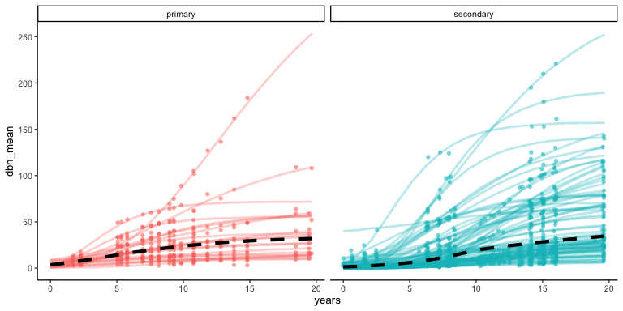
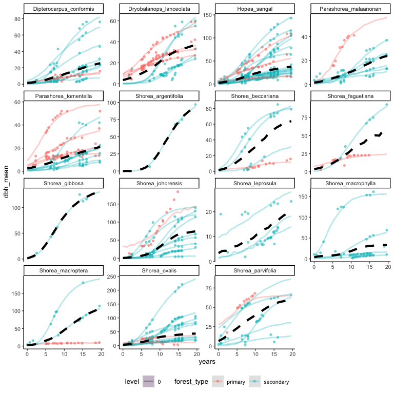

# Non-linear models of growth
eleanorjackson
2025-01-09

``` r
library("tidyverse")
library("here")
library("patchwork")
library("brms")
library("tidybayes")
library("modelr")
```

``` r
data <- 
  readRDS(here::here("data", "derived", "data_cleaned.rds"))
```

Selecting trees which have more than 5 data points.

``` r
well_sampled_trees <- 
  data %>% 
  group_by(plant_id) %>% 
  summarise(records = sum(!is.na(dbh_mean))) %>% 
  filter(records > 5)
```

Now taking a random sample of 100 trees.

``` r
data_sample <-
  data %>% 
  filter(survival == 1) %>% 
  filter(plant_id %in% well_sampled_trees$plant_id) %>% 
  filter(plant_id %in% sample(unique(plant_id), 100))
```

## fixed effect of forest type (m1)

Allowing random intercept for each individual plant.

``` r
gompertz1 <- bf(dbh_mean ~ A * exp( -exp( -(k * (years - delay) ) ) ),
             A ~ 0 + forest_type + (1 | plant_id),
             k ~ 0 + forest_type + (1 | plant_id),
             delay ~ 0 + forest_type + (1 | plant_id),
             nl = TRUE)
```

- `A` is the adult or maximum DBH
- `k` is a growth rate coefficient which affecs the slope
- `delay` represents time at inflection i.e. it shifts the sigmoidal
  curve horizontally without changing it’s shape

``` r
m1 <- 
  brm(gompertz1,
      data = data_sample,
      family = brmsfamily("gaussian"), 
      iter = 500,
      cores = 4,
      chains = 4,
      seed = 123,
      file = here::here("code", "notebooks", "models",
                        "2025-01-06_model-growth-nonlin", 
                        "m1.rds"),
      file_refit = "on_change")
```

``` r
keys_ft <- data_sample %>% 
  select(plant_id, forest_type) %>% 
  distinct() %>% 
  mutate(plant_id = droplevels(plant_id))

data_sample %>% 
  data_grid(years = seq_range(years, n = 20),
            plant_id = droplevels(unique(data_sample$plant_id))) %>% 
  left_join(keys_ft) %>% 
  add_predicted_draws(m1) %>% 
  ggplot(aes(y = dbh_mean, x = years)) +
  geom_point(data = data_sample, 
             aes(colour = forest_type),
             shape = 16,
             alpha = 0.6) +
  
  facet_wrap(~forest_type) +
  stat_lineribbon(aes(y = .prediction, 
                group = plant_id,
                colour = forest_type), 
                .width = 0, 
                linewidth = 1,
                alpha = 0.3) +
  stat_lineribbon(aes(y = .prediction, 
                      group = forest_type), 
                  colour = "black",
                  linetype = 2,
                  linewidth = 1.5, 
                  .width = 0) +
  theme(legend.position = "none")
```



Posterior preditions for each tree and for each forest type.

## add random effect of species

Allowing random slope of forest type within each species AND random
intercept for each individual plant.

``` r
gompertz2 <- bf(dbh_mean ~ A * exp( -exp( -(k * (years - delay) ) ) ),
             A ~ 0 + forest_type + 
               (0 + forest_type|genus_species) + (1 | plant_id),
             k ~ 0 + forest_type + 
               (0 + forest_type|genus_species) + (1 | plant_id),
             delay ~ 0 + forest_type + 
               (0 + forest_type|genus_species) + (1 | plant_id),
             nl = TRUE)
```

``` r
m2 <- 
  brm(gompertz2,
      data = data_sample,
      family = brmsfamily("gaussian"), 
      iter = 500,
      cores = 4,
      chains = 4,
      seed = 123,
      file = here::here("code", "notebooks", "models",
                        "2025-01-06_model-growth-nonlin", 
                        "m2.rds"),
      file_refit = "on_change")
```

``` r
keys_ft_sp <- data_sample %>% 
  select(plant_id, forest_type, genus_species) %>% 
  distinct(plant_id, .keep_all = TRUE) %>% 
  mutate(plant_id = droplevels(plant_id))

data_sample %>% 
  data_grid(years = seq_range(years, n = 20),
            plant_id = droplevels(unique(data_sample$plant_id))) %>% 
  left_join(keys_ft_sp) %>% 
  add_predicted_draws(m2) %>% 
  ggplot(aes(y = dbh_mean, x = years)) +
  geom_point(data = data_sample, 
             aes(colour = forest_type),
             shape = 16,
             alpha = 0.6) +
  stat_lineribbon(aes(y = .prediction, 
                group = plant_id,
                colour = forest_type), 
                .width = 0, 
                linewidth = 1,
                alpha = 0.3) +
  stat_lineribbon(aes(y = .prediction, 
                      group = genus_species), 
                  colour = "black",
                  linetype = 2,
                  linewidth = 1.5, 
                  .width = 0,
                  show.legend = FALSE) +
  facet_wrap(~genus_species,
             scales = "free_y") +
  theme(legend.position = "bottom")
```



## add random effect of cohort and plot

I think the maximal version of the model could look something like this:

``` r
growth ~ 0 + forest_type + 
               (0 + forest_type | genus_species) + 
               (1 | plant_id) + 
               (1 | forest_type:plot) + 
               (1 | forest_type:cohort)
```

Which equates to:

- fixed effect of forest type
- random slope of forest type within each species
- random intercept for each individual plant
- random intercept among plots within forest types
- random intercept among cohort within forest types

I don’t think this will fit well on the small subset of data I’m using
here, will have to wait to run it on the cluster.

Cohort as a random effect might be especially tricky since only 2 levels
in secondary forest and one level in primary forest…
