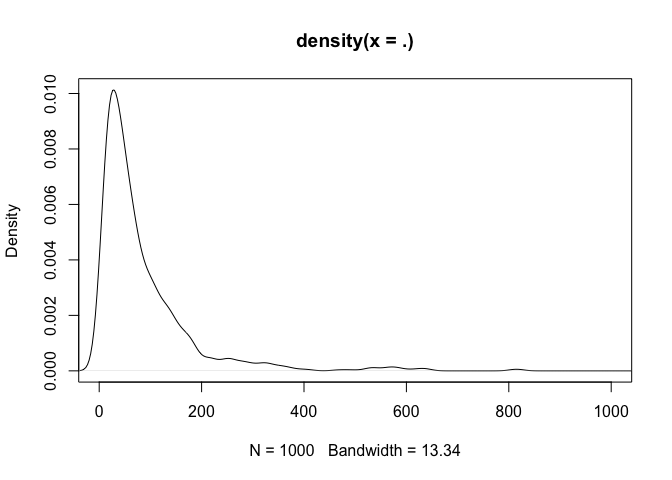
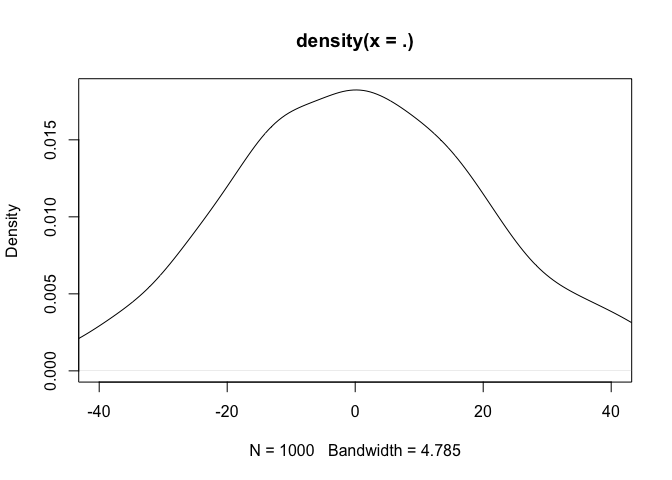
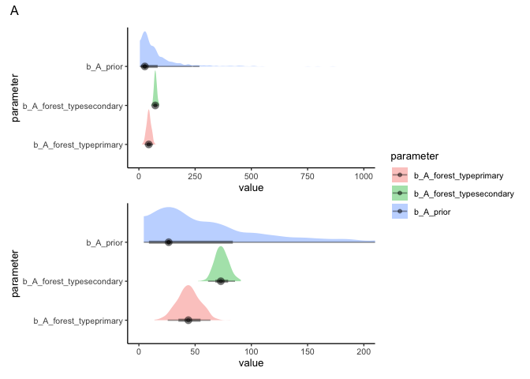
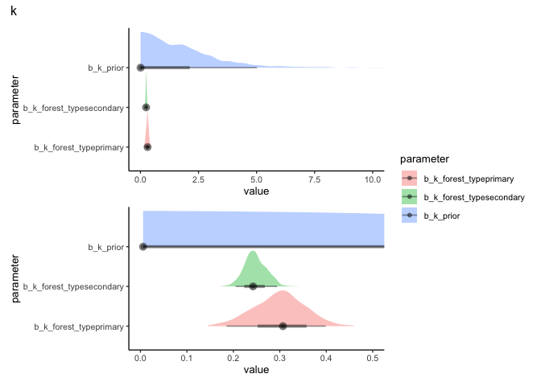

# Explore priors for the growth models
eleanorjackson
2025-01-15

``` r
library("tidyverse")
library("here")
library("patchwork")
library("brms")
library("tidybayes")
library("modelr")
```

``` r
data <- 
  readRDS(here::here("data", "derived", "data_cleaned.rds"))

ft_lognorm <-
  readRDS(here::here("output", "models", "ft_lognorm.rds"))
```

Selecting trees which have more than 5 data points.

``` r
well_sampled_trees <- 
  data %>% 
  group_by(plant_id) %>% 
  summarise(records = sum(!is.na(dbh_mean))) %>% 
  filter(records > 5)
```

Now taking a random sample of 100 trees.

``` r
data_sample <-
  data %>% 
  filter(survival == 1) %>% 
  filter(plant_id %in% well_sampled_trees$plant_id) %>% 
  filter(plant_id %in% sample(unique(plant_id), 100))
```

## Define model formula

``` r
gompertz1 <- bf(dbh_mean ~ A * exp( -exp( -(k * (years - delay) ) ) ),
             A ~ 0 + forest_type + (1 | plant_id),
             k ~ 0 + forest_type + (1 | plant_id),
             delay ~ 0 + forest_type + (1 | plant_id),
             nl = TRUE)
```

- `A` is the adult or maximum DBH
- `k` is a growth rate coefficient which affects the slope
- `delay` represents time at inflection i.e. it shifts the sigmoidal
  curve horizontally without changing it’s shape

## Posterior for *A*:

*A* is the assymptote or maximum tree DBH per individual.

Max dbh we might expect: 200cm - [largest danum
tree](https://coomeslab.org/portfolio/the-worlds-tallest-tropical-tree-in-three-dimensions/).
“Large” diameter trees in the Danum 50ha plot (the largest 1% of trees ≥
1 cm DBH in the forest) are above 65.7cm
(https://doi.org/10.1111/geb.12747)

Posteriors from previous model fit with full data:

``` r
ft_lognorm %>% 
  spread_draws(b_A_forest_typeprimary, b_A_forest_typesecondary) %>% 
  pivot_longer(cols = 
                 c(b_A_forest_typeprimary, b_A_forest_typesecondary), 
               names_to = "parameter") %>% 
  mutate(A_cm = exp(value)) %>% 
  ggplot(aes(x = A_cm, y = parameter)) +
  stat_halfeye()
```


suggested prior:

``` r
rlnorm(n = 1000, meanlog = 4, sdlog = 1) %>% 
  density() %>% 
  plot(xlim = c(0, 400))
```



## Posterior for *k*:

*k* is a constant that determines the rate of change of the curve (how
squished is the S curve on the x-axis?)

Posteriors from previous model fit with full data:

``` r
ft_lognorm %>% 
  spread_draws(b_k_forest_typeprimary, b_k_forest_typesecondary) %>% 
  pivot_longer(cols = 
                 c(b_k_forest_typeprimary, b_k_forest_typesecondary), 
               names_to = "parameter") %>% 
  mutate(k = value) %>% 
  ggplot(aes(x = k, y = parameter)) +
  stat_halfeye()
```


``` r
rstudent_t(n = 1000, df = 5, mu = 0, sigma = 5) %>% 
  density() %>% 
  plot(xlim = c(0, 50)) 
```


## Posterior for *delay*:

*delay* is a constant that determines displacement on the x axis
(x-intercept in years).

Posteriors from previous model fit with full data:

``` r
ft_lognorm %>% 
  spread_draws(b_delay_forest_typeprimary, b_delay_forest_typesecondary) %>% 
  pivot_longer(cols = 
                 c(b_delay_forest_typeprimary, b_delay_forest_typesecondary), 
               names_to = "parameter") %>% 
  mutate(delay = value) %>% 
  ggplot(aes(x = delay, y = parameter)) +
  stat_halfeye()
```


``` r
rstudent_t(n = 1000, df = 5, mu = 0, sigma = 50) %>% 
  density() %>% 
  plot(xlim = c(0, 200))
```



## Define priors

``` r
priors1 <- c(
  prior(lognormal(4, 1), nlpar = "A", lb = 0),
  prior(student_t(5, 0, 5), nlpar = "k", lb = 0),
  prior(student_t(5, 0, 50), nlpar = "delay", lb = 0))
```

Fit model with priors

``` r
m1 <- 
  brm(gompertz1,
      data = data_sample,
      family = brmsfamily("gaussian"), 
      prior = priors1,
      iter = 500,
      cores = 4,
      chains = 4,
      seed = 123,
      file = here::here("code", "notebooks", "models",
                        "2025-01-13_explore-growth-model-priors", 
                        "m1.rds"),
      sample_prior = "yes",
      file_refit = "on_change")
```

# Compare prior and posterior distributions

## *A*

``` r
prior_A <- 
  m1 %>% 
  prior_draws() %>% 
  pivot_longer(cols = b_A, 
               names_to = "parameter") %>% 
  mutate(parameter = case_match(parameter, "b_A" ~ "b_A_prior")) %>% 
  select(value, parameter)

posterior_A <-
  m1 %>% 
  spread_draws(b_A_forest_typeprimary, b_A_forest_typesecondary) %>% 
  pivot_longer(cols = 
                 c(b_A_forest_typeprimary, b_A_forest_typesecondary), 
               names_to = "parameter") %>% 
  select(value, parameter)

bind_rows(prior_A, posterior_A) %>% 
  ggplot(aes(x = value, y = parameter,
             fill = parameter)) +
  stat_halfeye(alpha = 0.4, 
               normalize = "groups",
               point_interval = "mode_hdi") +
  coord_cartesian(xlim = c(0, 400)) +
  ggtitle("A")
```


## *k*

``` r
prior_k <- 
  m1 %>% 
  prior_draws() %>% 
  pivot_longer(cols = b_k, 
               names_to = "parameter") %>% 
  mutate(parameter = case_match(parameter, "b_k" ~ "b_k_prior")) %>% 
  select(value, parameter)

posterior_k <-
  m1 %>% 
  spread_draws(b_k_forest_typeprimary, b_k_forest_typesecondary) %>% 
  pivot_longer(cols = 
                 c(b_k_forest_typeprimary, b_k_forest_typesecondary), 
               names_to = "parameter") %>% 
  select(value, parameter)

bind_rows(prior_k, posterior_k) %>% 
  ggplot(aes(x = value, 
             fill = parameter, 
             y = parameter)) +
  stat_halfeye(alpha = 0.4, 
               normalize = "groups",
               point_interval = "mode_hdi") +
  coord_cartesian(xlim = c(0, 10)) +
  
  bind_rows(prior_k, posterior_k) %>% 
  ggplot(aes(x = value, 
             fill = parameter, 
             y = parameter)) +
  stat_halfeye(alpha = 0.4, 
               normalize = "groups",
               point_interval = "mode_hdi") +
  coord_cartesian(xlim = c(0, 1)) +
  
  plot_layout(guides = "collect", ncol = 1)+
  plot_annotation(title = "k")
```



## delay

``` r
prior_delay <- 
  m1 %>% 
  prior_draws() %>% 
  pivot_longer(cols = b_delay, 
               names_to = "parameter") %>% 
  mutate(parameter = case_match(parameter, "b_delay" ~ "b_delay_prior")) %>% 
  select(value, parameter)

posterior_delay <-
  m1 %>% 
  spread_draws(b_delay_forest_typeprimary, b_delay_forest_typesecondary) %>% 
  pivot_longer(cols = 
                 c(b_delay_forest_typeprimary, b_delay_forest_typesecondary), 
               names_to = "parameter") %>% 
  select(value, parameter)

bind_rows(prior_delay, posterior_delay) %>% 
  ggplot(aes(x = value, 
             fill = parameter,
             y = parameter)) +
  stat_halfeye(alpha = 0.4, 
               normalize = "groups",
               point_interval = "mode_hdi") +
  coord_cartesian(xlim = c(0, 100)) +
  
  bind_rows(prior_delay, posterior_delay) %>% 
  ggplot(aes(x = value, 
             fill = parameter,
             y = parameter)) +
  stat_halfeye(alpha = 0.4, 
               normalize = "groups",
               point_interval = "mode_hdi") +
  coord_cartesian(xlim = c(0, 15)) +
  
  plot_layout(guides = "collect", ncol = 1) +
  plot_annotation(title = "delay")
```


