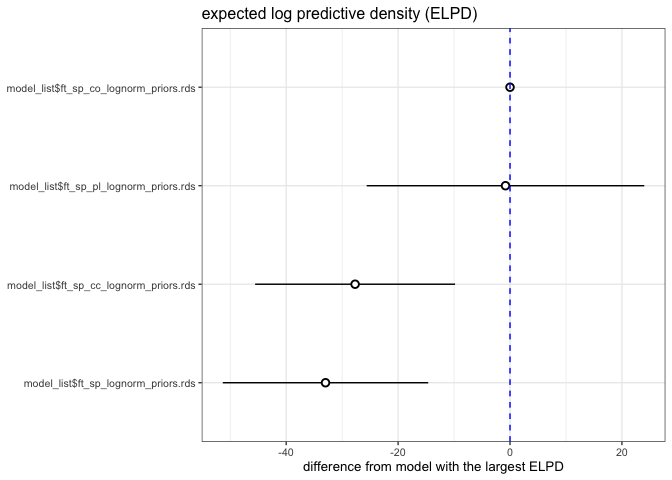
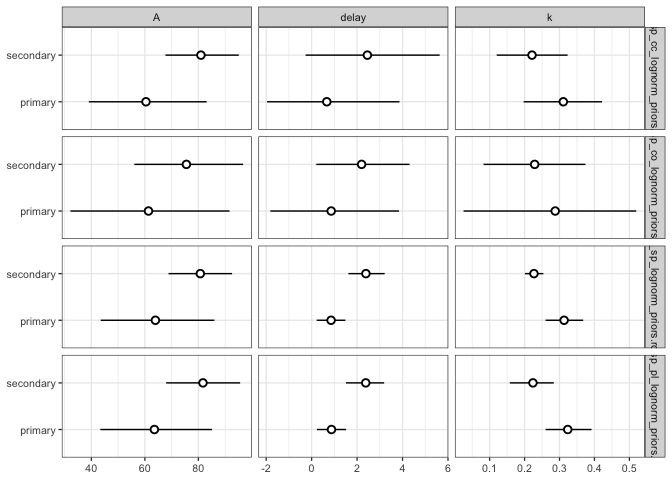
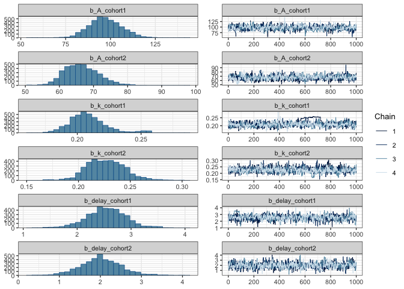

# Compare growth models
eleanorjackson
2025-01-29

Here I’m comparing models of different complexity (in terms of their
random effect structure).

``` r
library("tidyverse")
library("here")
library("patchwork")
library("brms")
library("broom.mixed")
```

``` r
file_names <- as.list(dir(path = here::here("output", "models", "priors2"),
                          full.names = TRUE))

model_list <- map(file_names, readRDS, environment())

names(model_list) <- lapply(file_names, basename)
```

Leave-one-out cross-validation (LOO-CV) is a popular method for
comparing Bayesian models based on their estimated predictive
performance on new/unseen data.

Expected log predictive density (ELPD): If new observations are
well-accounted by the posterior predictive distribution, then the
density of the posterior predictive distribution is high and so is its
logarithm. So higher ELPD = better predictive performance.

``` r
comp <- loo_compare(model_list$ft_lognorm_priors.rds,
                    model_list$ft_sp_lognorm_priors.rds,
                    model_list$ft_sp_pl_lognorm_priors.rds,
                    model_list$ft_sp_pl_co_lognorm_priors.rds)

print(comp, digits = 3)
```

                                              elpd_diff se_diff  
    model_list$ft_sp_pl_co_lognorm_priors.rds     0.000     0.000
    model_list$ft_sp_pl_lognorm_priors.rds      -43.483    22.514
    model_list$ft_sp_lognorm_priors.rds         -53.862    16.913
    model_list$ft_lognorm_priors.rds          -2749.305    81.632

``` r
comp %>% 
  data.frame() %>% 
  rownames_to_column(var = "model_name") %>% 
  ggplot(aes(x    = reorder(model_name, elpd_diff), 
             y    = elpd_diff, 
             ymin = elpd_diff - se_diff, 
             ymax = elpd_diff + se_diff)) +
  geom_pointrange(shape = 21, fill = "white") +
  coord_flip() +
  geom_hline(yintercept = 0, colour = "blue", linetype = 2) +
  labs(x = NULL, y = "difference from model with the largest ELPD", 
       title = "expected log predictive density (ELPD)") 
```



``` r
loo_compare(model_list$ft_sp_lognorm_priors.rds,
            model_list$ft_sp_pl_lognorm_priors.rds,
            model_list$ft_sp_pl_co_lognorm_priors.rds) %>% 
  data.frame() %>% 
  rownames_to_column(var = "model_name") %>% 
  ggplot(aes(x    = reorder(model_name, elpd_diff), 
             y    = elpd_diff, 
             ymin = elpd_diff - se_diff, 
             ymax = elpd_diff + se_diff)) +
  geom_pointrange(shape = 21, fill = "white") +
  coord_flip() +
  geom_hline(yintercept = 0, colour = "blue", linetype = 2) +
  labs(x = NULL, y = "difference from model with the largest ELPD", 
       title = "expected log predictive density (ELPD)") 
```


In the [loo package
documentation](https://mc-stan.org/loo/articles/online-only/faq.html#how-to-use-cross-validation-for-model-selection-)
they say:

> If elpd difference (`elpd_diff` in loo package) is less than 4, the
> difference is small [(Sivula, Magnusson and Vehtari,
> 2020)](https://doi.org/10.48550/arXiv.2008.10296)). If elpd difference
> is larger than 4, then compare that difference to standard error of
> `elpd_diff` (provided e.g. by loo package) [(Sivula, Magnusson and
> Vehtari, 2020)](https://doi.org/10.48550/arXiv.2008.10296).

## Compare parameter estimates

``` r
my_coef_tab <-
  tibble(fit = model_list[2:4],
         model = names(model_list[2:4])) %>%
  mutate(tidy = purrr::map(
    fit,
    tidy,
    parameters = c(
      "b_A_forest_typeprimary",
      "b_A_forest_typesecondary",
      "b_k_forest_typeprimary",
      "b_k_forest_typesecondary",
      "b_delay_forest_typeprimary",
      "b_delay_forest_typesecondary"
    )
  )) %>%
  unnest(tidy)
```

``` r
my_coef_tab %>% 
  rowwise() %>% 
  mutate(parameter = pluck(strsplit(term,"_"),1,2)) %>% 
  ggplot(aes(x = term, y = estimate, ymin = conf.low, ymax = conf.high)) +
  geom_pointrange(shape = 21, fill = "white") +
  labs(x = NULL,
       y = NULL) +
  coord_flip() +
  facet_grid(model~parameter, 
             scales = "free") 
```



These are the estimates of the posterior distribution with 95% credible
intervals based on quantiles.

``` r
my_vars <- c("b_A_forest_typeprimary", "b_A_forest_typesecondary",
             "b_delay_forest_typeprimary", "b_delay_forest_typesecondary",
             "b_k_forest_typeprimary", "b_k_forest_typesecondary")

my_regex <- paste0(my_vars, collapse="|")

draws <-
  map(model_list,
           tidybayes::spread_draws, !!sym(my_regex), regex = TRUE) %>% 
  bind_rows(.id = "model") %>% 
  pivot_longer(cols = all_of(my_vars), 
               names_to = "var") %>% 
  rowwise() %>% 
  mutate(parameter = pluck(strsplit(var,"_"), 1, 2)) 

draws %>% 
  ggplot(aes(x = value, y = var)) +
  tidybayes::stat_halfeye(normalize = "groups",
               point_interval = "mode_hdi") +
  facet_grid(model~parameter, scales = "free") 
```


Here looking at the mode (point) and highest density interval (I think
sometimes prefered since they allow for skewed posterior distributions).

The most basic model is really terrible. Excluding it from the below
plot.

``` r
my_vars <- c("b_A_forest_typeprimary", "b_A_forest_typesecondary",
             "b_delay_forest_typeprimary", "b_delay_forest_typesecondary",
             "b_k_forest_typeprimary", "b_k_forest_typesecondary")

my_regex <- paste0(my_vars, collapse="|")

draws <-
  map(model_list[2:4],
           tidybayes::spread_draws, !!sym(my_regex), regex = TRUE) %>% 
  bind_rows(.id = "model") %>% 
  pivot_longer(cols = all_of(my_vars), 
               names_to = "var") %>% 
  rowwise() %>% 
  mutate(parameter = pluck(strsplit(var,"_"), 1, 2)) 

draws %>% 
  ggplot(aes(x = value, y = var)) +
  tidybayes::stat_halfeye(normalize = "groups",
               point_interval = "mode_hdi") +
  facet_grid(model~parameter, scales = "free")
```


Adding cohort into the model seems to introduce a lot of uncertainty in
the estimates for *delay* and *k*, yet this model supposedly has the
best predictive performance? Do I need to give the chains longer to
converge?

### ft_sp_lognorm_priors

``` r
plot(model_list[[2]], 
       variable = "^b_*",
       ask = FALSE,
       regex = TRUE,
       nvariables = 6) 
```


### ft_sp_pl_lognorm_priors

``` r
plot(model_list[[4]], 
       variable = "^b_*",
       ask = FALSE,
       regex = TRUE,
       nvariables = 6) 
```



### ft_sp_pl_co_lognorm_priors

``` r
plot(model_list[[3]], 
       variable = "^b_*",
       ask = FALSE,
       regex = TRUE,
       nvariables = 6) 
```


They do look a bit sloppy here compared to the other models.
