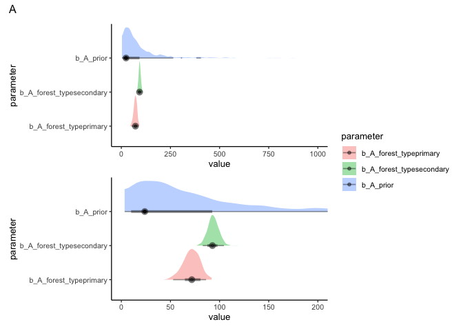
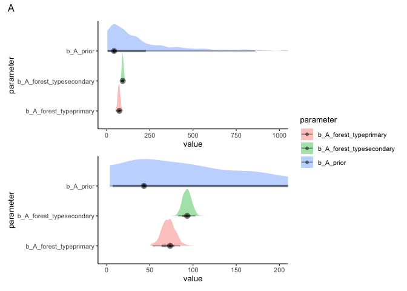
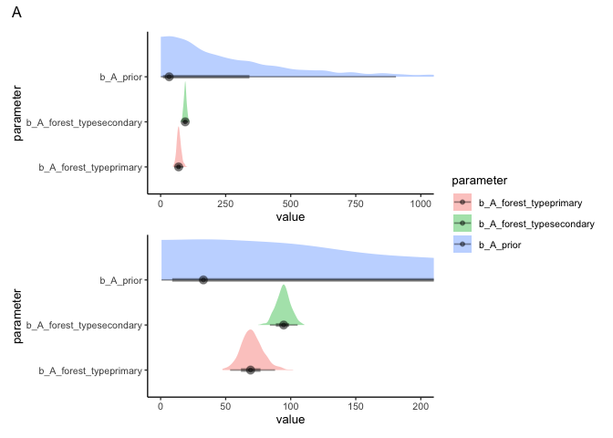
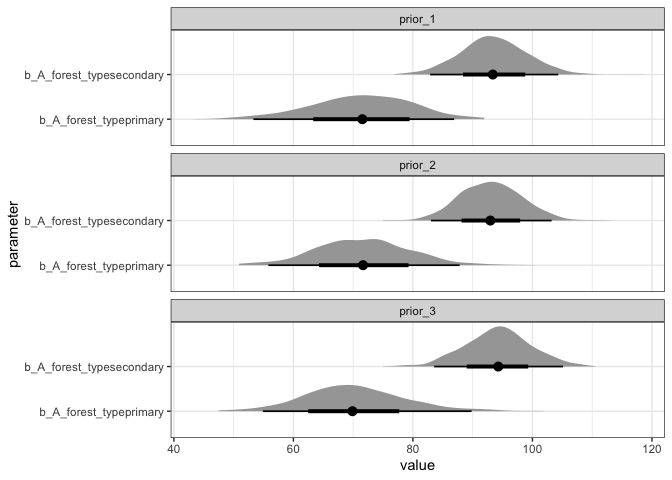

# Explore priors for *A* in the growth models
eleanorjackson
2025-01-24

I’m a bit concerned that the priors I set for *A*
[here](./code/notebooks/2025-01-13_explore-growth-model-priors.md) are
too narrow.

``` r
library("tidyverse")
library("here")
library("patchwork")
library("brms")
library("tidybayes")
library("modelr")
```

``` r
data <- 
  readRDS(here::here("data", "derived", "data_cleaned.rds"))
```

Selecting trees which have more than 5 data points.

``` r
well_sampled_trees <- 
  data %>% 
  group_by(plant_id) %>% 
  summarise(records = sum(!is.na(dbh_mean))) %>% 
  filter(records > 5)
```

``` r
data_sample <-
  data %>% 
  filter(survival == 1) %>% 
  filter(plant_id %in% well_sampled_trees$plant_id) %>% 
  filter(plant_id %in% sample(unique(plant_id), 300))
```

## Define model formula

``` r
gompertz1 <- bf(dbh_mean ~ log(A) * exp( -exp( -(k * (years - delay) ) ) ),
             log(A) ~ 0 + forest_type + (1 | plant_id),
             k ~ 0 + forest_type + (1 | plant_id),
             delay ~ 0 + forest_type + (1 | plant_id),
             nl = TRUE)
```

``` r
priors1 <- c(
  prior(lognormal(4, 1), nlpar = "A", lb = 0),
  prior(student_t(5, 0, 2), nlpar = "k", lb = 0),
  prior(student_t(5, 0, 20), nlpar = "delay"))
```

``` r
m1 <- 
  brm(gompertz1,
      data = data_sample,
      family = brmsfamily("lognormal"), 
      prior = priors1,
      init = 0,
      iter = 500,
      cores = 4,
      chains = 4,
      seed = 123,
      file = here::here("code", "notebooks", "models",
                        "2025-01-24_test-A-param-prior", 
                        "m1.rds"),
      sample_prior = "yes",
      file_refit = "on_change")
```

``` r
priors2 <- c(
  prior(lognormal(5, 1.2), nlpar = "A", lb = 0),
  prior(student_t(5, 0, 2), nlpar = "k", lb = 0),
  prior(student_t(5, 0, 20), nlpar = "delay"))
```

``` r
m2 <- 
  brm(gompertz1,
      data = data_sample,
      family = brmsfamily("lognormal"), 
      prior = priors2,
      init = 0,
      iter = 500,
      cores = 4,
      chains = 4,
      seed = 123,
      file = here::here("code", "notebooks", "models",
                        "2025-01-24_test-A-param-prior", 
                        "m2.rds"),
      sample_prior = "yes",
      file_refit = "on_change")
```

``` r
priors3 <- c(
  prior(gamma(1, 0.0035), nlpar = "A", lb = 0),
  prior(student_t(5, 0, 2), nlpar = "k", lb = 0),
  prior(student_t(5, 0, 20), nlpar = "delay"))
```

``` r
m3 <- 
  brm(gompertz1,
      data = data_sample,
      family = brmsfamily("lognormal"), 
      prior = priors3,
      init = 0,
      iter = 500,
      cores = 4,
      chains = 4,
      seed = 123,
      file = here::here("code", "notebooks", "models",
                        "2025-01-24_test-A-param-prior", 
                        "m3.rds"),
      sample_prior = "yes",
      file_refit = "on_change")
```

# m1

``` r
prior_1 <- 
  m1 %>% 
  prior_draws() %>% 
  pivot_longer(cols = b_A, 
               names_to = "parameter") %>% 
  mutate(parameter = case_match(parameter, "b_A" ~ "b_A_prior")) %>% 
  select(value, parameter)

posterior_1 <-
  m1 %>% 
  spread_draws(b_A_forest_typeprimary, b_A_forest_typesecondary) %>% 
  pivot_longer(cols = 
                 c(b_A_forest_typeprimary, b_A_forest_typesecondary), 
               names_to = "parameter") %>% 
  mutate(prior = "prior_1") %>% 
  select(value, parameter, prior)

bind_rows(prior_1, posterior_1) %>% 
  ggplot(aes(x = value, y = parameter,
             fill = parameter)) +
  stat_halfeye(alpha = 0.4, 
               normalize = "groups",
               point_interval = "mode_hdi") +
  coord_cartesian(xlim = c(0, 1000)) +
  
  bind_rows(prior_1, posterior_1) %>% 
  ggplot(aes(x = value, y = parameter,
             fill = parameter)) +
  stat_halfeye(alpha = 0.4, 
               normalize = "groups",
               point_interval = "mode_hdi") +
  coord_cartesian(xlim = c(0, 200)) +
  
  plot_layout(guides = "collect", ncol = 1)+
  plot_annotation(title = "A")
```



``` r
posterior_1 %>% 
  summarise
```

    # A tibble: 1 × 0

``` r
prior_2 <- 
  m2 %>% 
  prior_draws() %>% 
  pivot_longer(cols = b_A, 
               names_to = "parameter") %>% 
  mutate(parameter = case_match(parameter, "b_A" ~ "b_A_prior")) %>% 
  select(value, parameter)

posterior_2 <-
  m2 %>% 
  spread_draws(b_A_forest_typeprimary, b_A_forest_typesecondary) %>% 
  pivot_longer(cols = 
                 c(b_A_forest_typeprimary, b_A_forest_typesecondary), 
               names_to = "parameter") %>% 
  mutate(prior = "prior_2") %>% 
  select(value, parameter, prior)

bind_rows(prior_2, posterior_2) %>% 
  ggplot(aes(x = value, y = parameter,
             fill = parameter)) +
  stat_halfeye(alpha = 0.4, 
               normalize = "groups",
               point_interval = "mode_hdi") +
  coord_cartesian(xlim = c(0, 1000)) +
  
  bind_rows(prior_2, posterior_2) %>% 
  ggplot(aes(x = value, y = parameter,
             fill = parameter)) +
  stat_halfeye(alpha = 0.4, 
               normalize = "groups",
               point_interval = "mode_hdi") +
  coord_cartesian(xlim = c(0, 200)) +
  
  plot_layout(guides = "collect", ncol = 1)+
  plot_annotation(title = "A")
```



``` r
prior_3 <- 
  m3 %>% 
  prior_draws() %>% 
  pivot_longer(cols = b_A, 
               names_to = "parameter") %>% 
  mutate(parameter = case_match(parameter, "b_A" ~ "b_A_prior")) %>% 
  select(value, parameter)

posterior_3 <-
  m3 %>% 
  spread_draws(b_A_forest_typeprimary, b_A_forest_typesecondary) %>% 
  pivot_longer(cols = 
                 c(b_A_forest_typeprimary, b_A_forest_typesecondary), 
               names_to = "parameter") %>% 
  mutate(prior = "prior_3") %>% 
  select(value, parameter, prior)

bind_rows(prior_3, posterior_3) %>% 
  ggplot(aes(x = value, y = parameter,
             fill = parameter)) +
  stat_halfeye(alpha = 0.4, 
               normalize = "groups",
               point_interval = "mode_hdi") +
  coord_cartesian(xlim = c(0, 1000)) +
  
  bind_rows(prior_3, posterior_3) %>% 
  ggplot(aes(x = value, y = parameter,
             fill = parameter)) +
  stat_halfeye(alpha = 0.4, 
               normalize = "groups",
               point_interval = "mode_hdi") +
  coord_cartesian(xlim = c(0, 200)) +
  
  plot_layout(guides = "collect", ncol = 1)+
  plot_annotation(title = "A")
```



``` r
bind_rows(posterior_1, 
          posterior_2,
          posterior_3) %>% 
  ggplot(aes(y = parameter, x = value)) +
  stat_halfeye() +
  facet_wrap(~prior, ncol = 1) +
  theme_bw()
```



Parameter estimates haven’t really changed with different priors.

But I think that `priors2` look the best - wider and the mode is closer
to the posterior estimates.
