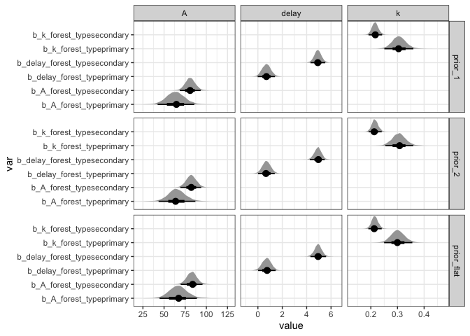

# Prior sensitivity for *A* in the growth models
eleanorjackson
2025-02-05

I’ve fit models with the full data using priors which [I selected
here](./code/notebooks/2025-01-24_test-A-param-prior.md).

I want to check the sensitivity of the pior -  
are the parameter estimates from these two models very different?

``` r
library("tidyverse")
library("here")
library("patchwork")
library("brms")
library("tidybayes")
library("modelr")
```

``` r
priors0 <-
  readRDS(here::here("output", "models", "ft_sp_lognorm.rds"))

priors1 <-
  readRDS(here::here("output", "models", "priors1", "ft_sp_lognorm_priors.rds"))

priors2 <-
  readRDS(here::here("output", "models", "priors2", "ft_sp_lognorm_priors.rds"))

my_vars <- c("b_A_forest_typeprimary", "b_A_forest_typesecondary",
             "b_delay_forest_typeprimary", "b_delay_forest_typesecondary",
             "b_k_forest_typeprimary", "b_k_forest_typesecondary")

my_regex <- paste0(my_vars, collapse="|")
```

The `prior1` model uses a `lognormal(4, 1)` prior on the *A* parameter,
and the `prior2` model uses a wider `lognormal(5, 1.2)` prior on the *A*
parameter. The `prior0` model has flat priors.

``` r
posterior_0 <-
  priors0 %>% 
  spread_draws(!!sym(my_regex), regex = TRUE) %>% 
  pivot_longer(cols = all_of(my_vars), 
               names_to = "var") %>% 
  mutate(prior = "prior_flat") %>% 
  select(value, var, prior)

posterior_1 <-
  priors1 %>% 
  spread_draws(!!sym(my_regex), regex = TRUE) %>% 
  pivot_longer(cols = all_of(my_vars), 
               names_to = "var") %>% 
  mutate(prior = "prior_1") %>% 
  select(value, var, prior)

posterior_2 <-
  priors2 %>% 
  spread_draws(!!sym(my_regex), regex = TRUE) %>% 
  pivot_longer(cols = all_of(my_vars), 
               names_to = "var") %>% 
  mutate(prior = "prior_2") %>% 
  select(value, var, prior)
```

``` r
bind_rows(posterior_0,
          posterior_1, 
          posterior_2) %>% 
  rowwise() %>% 
  mutate(parameter = pluck(strsplit(var,"_"),1,2)) %>% 
  ggplot(aes(x = value, y = var)) +
  stat_halfeye(normalize = "groups",
               point_interval = "mode_hdi") +
  facet_grid(prior~parameter, scales = "free") +
  theme_bw()
```



``` r
posterior_summary(priors0,
                  variable = my_vars)
```

                                   Estimate   Est.Error        Q2.5      Q97.5
    b_A_forest_typeprimary       66.9200320 11.16890363 45.87860788 90.3992136
    b_A_forest_typesecondary     82.8827634  6.35714963 70.52211399 96.1902950
    b_delay_forest_typeprimary    0.7137667  0.37247346 -0.03261414  1.4192522
    b_delay_forest_typesecondary  4.9408014  0.32308832  4.29863546  5.5864640
    b_k_forest_typeprimary        0.3013221  0.02700694  0.24939702  0.3555378
    b_k_forest_typesecondary      0.2151411  0.01263443  0.19065686  0.2405485

``` r
posterior_summary(priors1,
                  variable = my_vars)
```

                                   Estimate   Est.Error         Q2.5      Q97.5
    b_A_forest_typeprimary       63.6841510 11.06554853 42.388204379 85.7291005
    b_A_forest_typesecondary     80.9789038  6.27784215 68.742295952 93.5866803
    b_delay_forest_typeprimary    0.7041777  0.36627534  0.009506281  1.4374545
    b_delay_forest_typesecondary  4.9194741  0.30619053  4.319232144  5.5320558
    b_k_forest_typeprimary        0.3061876  0.02748409  0.253359408  0.3629812
    b_k_forest_typesecondary      0.2163905  0.01288186  0.191983258  0.2430702

``` r
posterior_summary(priors2,
                  variable = my_vars)
```

                                   Estimate   Est.Error        Q2.5      Q97.5
    b_A_forest_typeprimary       65.0374273 10.82556474 43.58695564 87.0136344
    b_A_forest_typesecondary     82.1164545  6.29362181 69.98378559 94.6351305
    b_delay_forest_typeprimary    0.7086997  0.35154776  0.02833159  1.4161811
    b_delay_forest_typesecondary  4.9201186  0.31103886  4.30531896  5.5260121
    b_k_forest_typeprimary        0.3059339  0.02693128  0.25525593  0.3606196
    b_k_forest_typesecondary      0.2156519  0.01253690  0.19183232  0.2409079

Look very similar to me!
