# Tree allometry
eleanorjackson
2025-02-13

Can we predict basal diameter from DBH and vice versa when data is
missing?

``` r
library("tidyverse")
```

Get data

``` r
data <-
  readRDS(here::here("data", "derived", "data_cleaned.rds"))
```

``` r
data %>% 
  ggplot(aes(x = dbase_mean, y = dbh_mean)) +
  geom_point(alpha = 0.5, size = 1.5, shape = 16) 
```

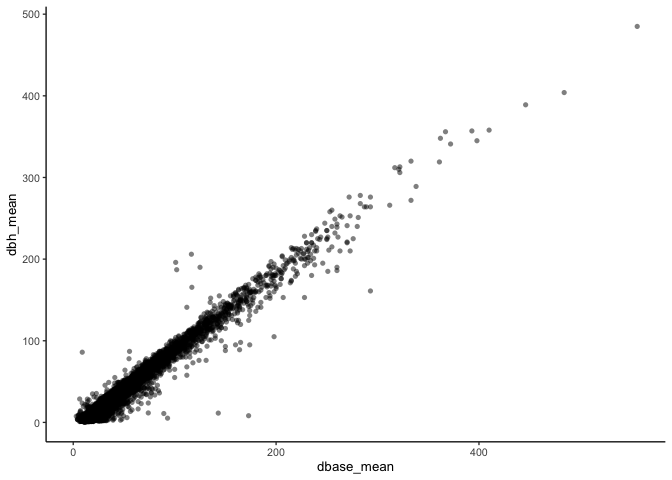

Looks like strong linear correlation.

``` r
data %>% 
  ggplot(aes(x = dbase_mean, y = dbh_mean, colour = forest_type)) +
  geom_point(alpha = 0.5, size = 1.5, shape = 16) 
```

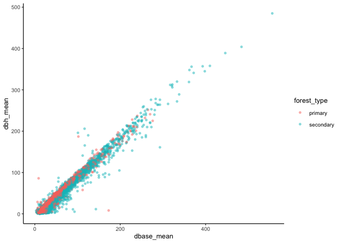

``` r
data %>% 
  ggplot(aes(x = dbase_mean, y = dbh_mean, colour = forest_type)) +
  geom_smooth(method = "glm")
```

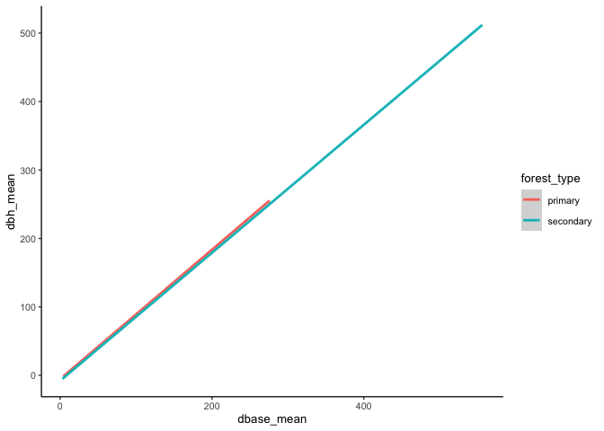

Looks like no difference between forest types.

``` r
data %>% 
  ggplot(aes(x = dbase_mean, y = dbh_mean)) +
  geom_point(alpha = 0.5, size = 1.5, shape = 16) +
  facet_wrap(~genus_species, ncol = 3) +
  ylim(0,400) +
  xlim(0,400)
```

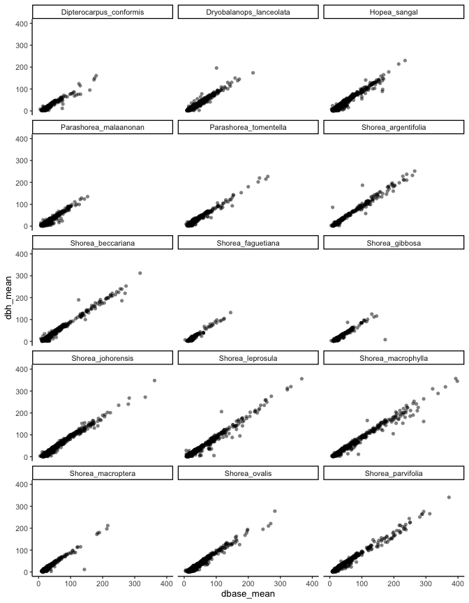

``` r
data %>% 
  ggplot(aes(x = dbase_mean, y = dbh_mean)) +
  geom_point(alpha = 0.5, size = 1.5, shape = 16) +
  facet_wrap(~genus_species, ncol = 3) +
  geom_smooth(method = "glm") +
  ylim(0,400) +
  xlim(0,400)
```

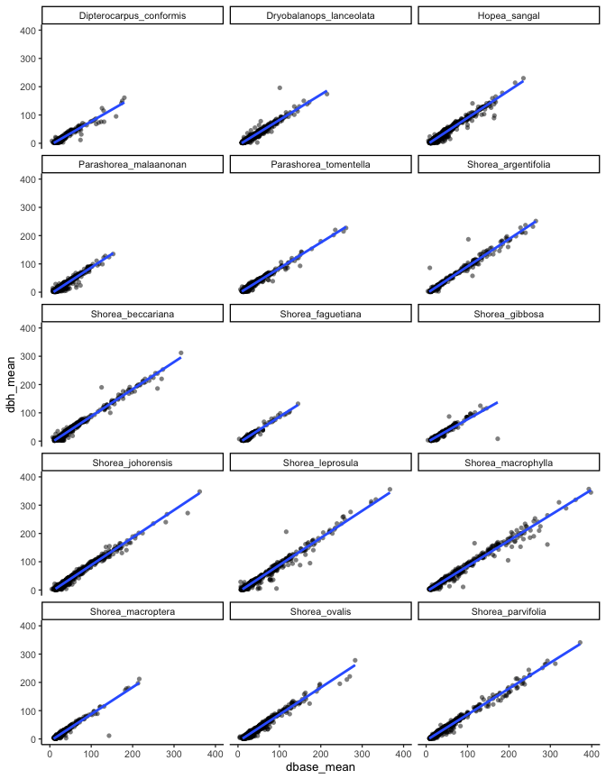

``` r
data %>% 
  ggplot(aes(x = dbase_mean, y = dbh_mean, colour = forest_type)) +
  geom_point(alpha = 0.5, size = 1.5, shape = 16) +
  facet_wrap(~genus_species, ncol = 3) +
  geom_smooth(method = "glm") +
  ylim(0,400) +
  xlim(0,400)
```

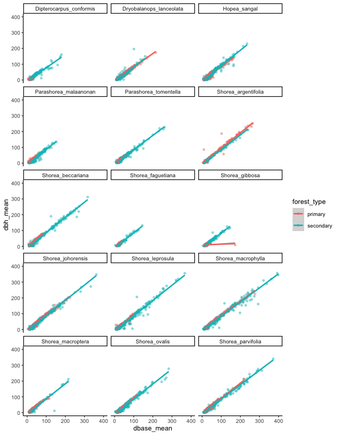

A single point is pushing the fit for *Shorea gibbosa* in the primary
forest down.

``` r
data %>% 
  ggplot(aes(x = dbase_mean, y = dbh_mean, colour = genus_species)) +
  geom_point(alpha = 0.5, size = 1.5, shape = 16) +
  geom_smooth(method = "glm") +
  ylim(0,400) +
  xlim(0,400)
```

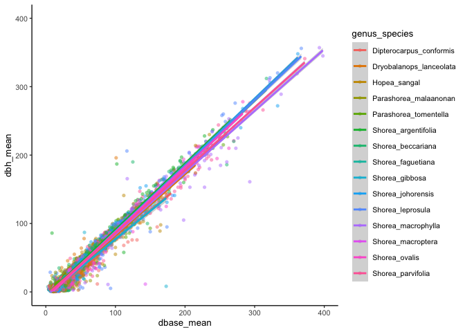

``` r
data %>%
  ggplot(aes(x = dbase_mean, y = dbh_mean, colour = genus_species)) +
  geom_smooth(method = "glm") +
  ylim(0,400) +
  xlim(0,400)
```


Little bit of difference in the slope for each speices but intercepts
look v. similar.

Slope differences happening only at the larger sizes - where there is
less data.

``` r
data %>%
  ggplot(aes(x = dbase_mean, y = dbh_mean, colour = genus_species)) +
  geom_smooth(method = "glm", se = FALSE, linewidth = 0.5) +
  coord_cartesian(xlim= c(0,20), ylim = c(0,20))
```

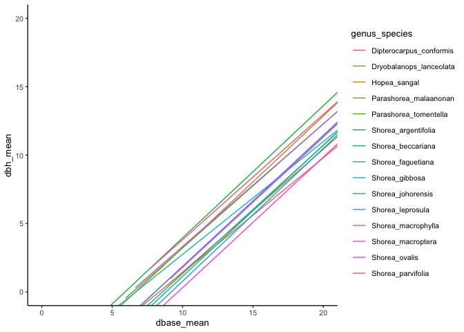

Zoomed in, we can actually see more variation around the intercept.

``` r
m1 <-
  lme4::lmer(dbh_mean ~ dbase_mean + (1 + dbase_mean | genus_species),
      data = data)
```

Will not converge with random slope.

``` r
m2 <-
  lme4::lmer(dbh_mean ~ dbase_mean + (1 | genus_species),
      data = data)
```

``` r
as.data.frame(lme4::ranef(m2, condVar = TRUE), "genus_species") %>% 
  ggplot(aes(y = grp)) +
  geom_point(aes(x = condval)) +
  geom_errorbarh(aes(
    xmin = condval - condsd,
    xmax = condval + condsd), 
    height = 0) +
  geom_vline(xintercept = 0, linetype =2, colour = "blue") +
  xlab("variance in intercept")
```

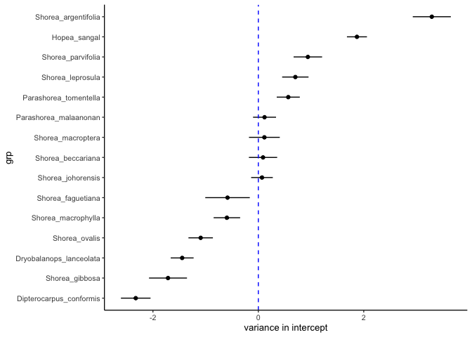

Value of the conditional mean +/- conditional standard deviation.

### prediction vs truth of basal diameter

``` r
dbh_pred <-
  lme4::lmer(dbh_mean ~ dbase_mean + (1 | genus_species),
      data = data)

data %>% 
  modelr::add_predictions(model = dbh_pred,
                          var = "dbh_pred") %>% 
  ggplot(aes(x = dbh_mean, y = dbh_pred)) +
  geom_point()
```

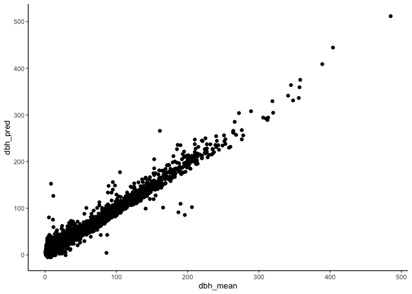

### prediction vs truth of DBH

``` r
dbase_pred <-
  lme4::lmer(dbase_mean ~ dbh_mean + (1 | genus_species),
      data = data)

data %>% 
  modelr::add_predictions(model = dbase_pred,
                          var = "dbase_pred") %>% 
  ggplot(aes(y = dbase_pred, x = dbase_mean)) +
  geom_point()
```


### Filling in NAs with predictions

``` r
data_filled <-
  data %>% 
  modelr::add_predictions(model = dbh_pred, var = "dbh_pred") %>% 
  modelr::add_predictions(model = dbase_pred, var = "dbase_pred") %>% 
  rename(dbh_true = dbh_mean, dbase_true = dbase_mean) %>% 
  
  mutate(dbh = coalesce(dbh_true, dbh_pred) ) %>%
  mutate(dbase = coalesce(dbase_true, dbase_pred) ) %>%
  
  mutate(dbh = replace(dbh, dbh < 0 , NA)) %>% 
  mutate(dbase = replace(dbase, dbase < 0 , NA)) 
```

``` r
data_filled %>% 
  filter(survival == 1) %>% 
  ggplot(aes(x = years, y = dbh, colour = forest_type)) +
  geom_point(alpha = 0.5, shape = 16) +
  facet_wrap(~is.na(dbh_true))
```

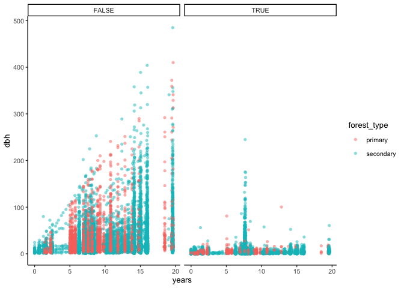

In the above figure, left panel = true dbh, right panel = predicted dbh,

DBH usually missing when seedlings are small.

``` r
data_filled %>% 
  filter(survival == 1) %>% 
  ggplot(aes(x = years, y = dbase, colour = forest_type)) +
  geom_point(alpha = 0.5, shape = 16) +
  facet_wrap(~is.na(dbase_true))
```


In the above figure, left panel = true dbase, right panel = predicted
dbase,

Basal diameter usually missing when seedlings are large.
