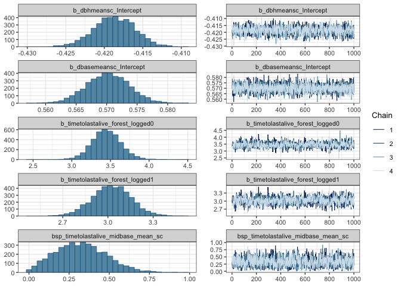
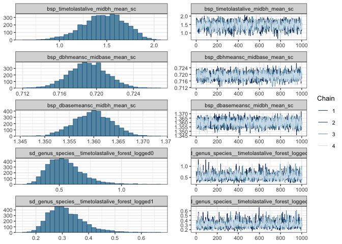
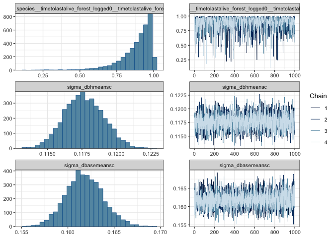
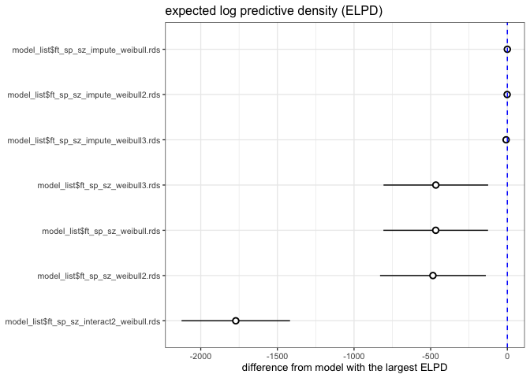
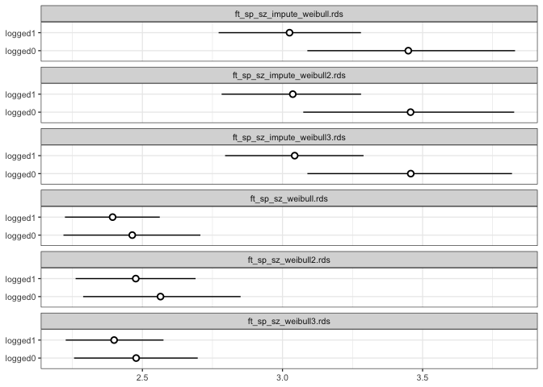

# Compare survival models
eleanorjackson
2025-03-23

``` r
library("tidyverse")
library("brms")
library("patchwork")
library("broom.mixed")
library("tidybayes")
library("modelr")
```

``` r
file_names <- as.list(dir(path = here::here("output", "models", "survival"),
                          full.names = TRUE))

model_list <- map(file_names, readRDS, environment())

names(model_list) <- lapply(file_names, basename)
```

## Censor data

``` r
data <-
  readRDS(here::here("data", "derived", "data_cleaned.rds"))

# time to first recorded dead
interval_censored <-
  data %>%
  filter(survival == 0) %>%
  group_by(plant_id) %>%
  slice_min(survey_date, with_ties = FALSE) %>%
  ungroup() %>%
  rename(time_to_dead = years) %>%
  select(plant_id, genus_species, plot, forest_logged, cohort, time_to_dead) %>%
  mutate(censor = "interval")

# time to last recorded alive
interval_censored <-
  data %>%
  filter(plant_id %in% interval_censored$plant_id) %>%
  filter(survival == 1) %>%
  group_by(plant_id) %>%
  slice_max(survey_date, with_ties = FALSE) %>%
  ungroup() %>%
  rename(time_to_last_alive = years) %>%
  select(plant_id, time_to_last_alive, dbh_mean, dbase_mean) %>%
  right_join(interval_censored)

# trees never recorded dead
right_censored <-
  data %>%
  filter(!plant_id %in% interval_censored$plant_id) %>%
  group_by(plant_id) %>%
  slice_max(survey_date, with_ties = FALSE) %>%
  ungroup() %>%
  rename(time_to_last_alive = years) %>%
  select(plant_id, genus_species, plot, forest_logged,
         cohort, time_to_last_alive, dbh_mean, dbase_mean) %>%
  mutate(censor = "right")

data_aggregated <-
  bind_rows(interval_censored, right_censored) %>%
  filter(time_to_last_alive > 0) %>%
  mutate(dbase_mean_sc = scale(dbase_mean),
         dbh_mean_sc = scale(dbh_mean))
```

## Simple model

``` r
time_to_last_alive|cens(x = censor, y2 = time_to_dead) ~
        0 + forest_logged + dbase_mean_sc +
        (0 + forest_logged|genus_species)
```

``` r
plot(model_list$ft_sp_sz_weibull.rds,
     param = "b_", ask = FALSE)
```


With random slope for size allowed for species:

``` r
time_to_last_alive|cens(x = censor, y2 = time_to_dead) ~
        0 + forest_logged + dbase_mean_sc +
        (0 + forest_logged + dbase_mean_sc|genus_species)
```

``` r
plot(model_list$ft_sp_sz_weibull2.rds,
     param = "b_", ask = FALSE)
```


## Imputing missing values

With forest type explaining size:

``` r
bform <-
  bf(
    time_to_last_alive | cens(x = censor, y2 = time_to_dead) ~
      0 + forest_logged + mi(dbase_mean_sc) + mi(dbh_mean_sc) +
      (0 + forest_logged | genus_species),
    family = brmsfamily("weibull")
  ) +
  bf(dbh_mean_sc |
       mi() ~ mi(dbase_mean_sc) + forest_logged,
     family = brmsfamily("gaussian")) +
  bf(dbase_mean_sc |
       mi() ~ mi(dbh_mean_sc) + forest_logged,
     family = brmsfamily("gaussian")) +
  set_rescor(FALSE)
```

``` r
plot(model_list$ft_sp_sz_impute_weibull.rds,
     param = "b_", ask = FALSE)
```


With species random effect explaining size:

``` r
bform <-
  bf(
    time_to_last_alive | cens(x = censor, y2 = time_to_dead) ~
      0 + forest_logged + mi(dbase_mean_sc) + mi(dbh_mean_sc) +
      (0 + forest_logged  | genus_species),
    family = brmsfamily("weibull")
  ) +
  bf(dbh_mean_sc |
       mi() ~ mi(dbase_mean_sc) + (1 | genus_species),
     family = brmsfamily("gaussian")) +
  bf(dbase_mean_sc |
       mi() ~ mi(dbh_mean_sc) + (1 | genus_species),
     family = brmsfamily("gaussian")) +
  set_rescor(FALSE)
```

``` r
plot(model_list$ft_sp_sz_impute_weibull2.rds,
     param = "b_", ask = FALSE)
```







With species as a fixed effect explaining size:

``` r
bform3 <-
  bf(
    time_to_last_alive | cens(x = censor, y2 = time_to_dead) ~
      0 + forest_logged + mi(dbase_mean_sc) + mi(dbh_mean_sc) +
      (0 + forest_logged | genus_species),
    family = brmsfamily("weibull")
  ) +
  bf(dbh_mean_sc |
       mi() ~ mi(dbase_mean_sc) + genus_species,
     family = brmsfamily("gaussian")) +
  bf(dbase_mean_sc |
       mi() ~ mi(dbh_mean_sc) + genus_species,
     family = brmsfamily("gaussian")) +
  set_rescor(FALSE)
```

``` r
plot(model_list$ft_sp_sz_impute_weibull3.rds,
     param = "b_", ask = FALSE)
```


## Interaction

``` r
time_to_last_alive|cens(x = censor, y2 = time_to_dead) ~
        0 + forest_logged:dbase_mean_sc +
        (0 + forest_logged:dbase_mean_sc | genus_species)
```

``` r
plot(model_list$ft_sp_sz_interact2_weibull.rds,
     param = "b_", ask = FALSE)
```


## Compare

``` r
loo_compare(
  model_list$ft_sp_sz_weibull.rds,
  model_list$ft_sp_sz_weibull2.rds,
  model_list$ft_sp_sz_impute_weibull.rds,
  model_list$ft_sp_sz_impute_weibull2.rds,
  model_list$ft_sp_sz_impute_weibull3.rds,
  model_list$ft_sp_sz_interact2_weibull.rds
) %>% 
  data.frame() %>% 
  rownames_to_column(var = "model_name") %>% 
  ggplot(aes(x    = reorder(model_name, elpd_diff), 
             y    = elpd_diff, 
             ymin = elpd_diff - se_diff, 
             ymax = elpd_diff + se_diff)) +
  geom_pointrange(shape = 21, fill = "white") +
  coord_flip() +
  geom_hline(yintercept = 0, colour = "blue", linetype = 2) +
  labs(x = NULL, y = "difference from model with the largest ELPD", 
       title = "expected log predictive density (ELPD)") 
```


``` r
my_coef_tab <-
  tibble(fit = model_list[c(1,2,3,5,6,7)],
         model = names(model_list[c(1,2,3,5,6,7)])) %>%
  mutate(tidy = purrr::map(
    fit,
    tidy,
    parameters = c(
      "forest_logged0",
      "forest_logged1",
      "shape",
      "dbase_mean_sc"
    )
  )) %>%
  unnest(tidy)
```

``` r
my_coef_tab %>% 
  filter(term == "b_forest_logged0" |
           term == "b_forest_logged1" |
           term == "b_timetolastalive_forest_logged0" |
           term == "b_timetolastalive_forest_logged1" 
           ) %>% 
  rowwise() %>% 
  mutate(parameter = pluck(strsplit(term,"_"),1,-1)) %>% 
  ggplot(aes(x = parameter, y = estimate, ymin = conf.low, ymax = conf.high)) +
  geom_pointrange(shape = 21, fill = "white") +
  labs(x = NULL,
       y = NULL) +
  coord_flip() +
  facet_wrap(~model, ncol = 1) 
```



## Comparing impute models

``` r
my_coef_tab <-
  tibble(fit = model_list[c(1,2,3)],
         model = names(model_list[c(1,2,3)])) %>%
  mutate(tidy = purrr::map(
    fit,
    tidy,
    parameters = c(
      "bsp_dbhmeansc_midbase_mean_sc",
      "bsp_dbasemeansc_midbh_mean_sc"
    )
  )) %>%
  unnest(tidy)
```

``` r
my_coef_tab %>% 
  rowwise() %>% 
  ggplot(aes(x = term, y = estimate, ymin = conf.low, ymax = conf.high)) +
  geom_pointrange(shape = 21, fill = "white") +
  labs(x = NULL,
       y = NULL) +
  coord_flip() +
  facet_wrap(~model, ncol = 1) 
```


