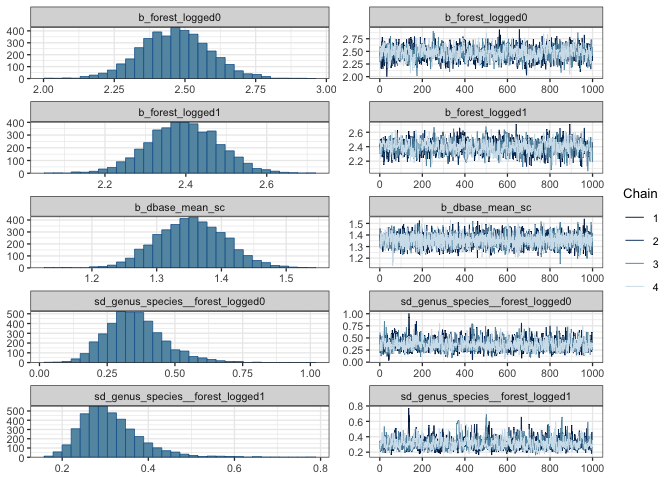
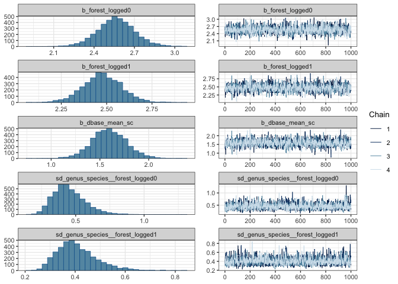

# Compare survival models
eleanorjackson
2025-03-20

``` r
library("tidyverse")
library("brms")
library("patchwork")
library("broom.mixed")
library("tidybayes")
library("modelr")
```

``` r
file_names <- as.list(dir(path = here::here("output", "models", "survival"),
                          full.names = TRUE))

model_list <- map(file_names, readRDS, environment())

names(model_list) <- lapply(file_names, basename)
```

## Censor data

``` r
data <-
  readRDS(here::here("data", "derived", "data_cleaned.rds"))

# time to first recorded dead
interval_censored <-
  data %>%
  filter(survival == 0) %>%
  group_by(plant_id) %>%
  slice_min(survey_date, with_ties = FALSE) %>%
  ungroup() %>%
  rename(time_to_dead = years) %>%
  select(plant_id, genus_species, plot, forest_logged, cohort, time_to_dead) %>%
  mutate(censor = "interval")

# time to last recorded alive
interval_censored <-
  data %>%
  filter(plant_id %in% interval_censored$plant_id) %>%
  filter(survival == 1) %>%
  group_by(plant_id) %>%
  slice_max(survey_date, with_ties = FALSE) %>%
  ungroup() %>%
  rename(time_to_last_alive = years) %>%
  select(plant_id, time_to_last_alive, dbh_mean, dbase_mean) %>%
  right_join(interval_censored)

# trees never recorded dead
right_censored <-
  data %>%
  filter(!plant_id %in% interval_censored$plant_id) %>%
  group_by(plant_id) %>%
  slice_max(survey_date, with_ties = FALSE) %>%
  ungroup() %>%
  rename(time_to_last_alive = years) %>%
  select(plant_id, genus_species, plot, forest_logged,
         cohort, time_to_last_alive, dbh_mean, dbase_mean) %>%
  mutate(censor = "right")

data_aggregated <-
  bind_rows(interval_censored, right_censored) %>%
  filter(time_to_last_alive > 0) %>%
  mutate(dbase_mean_sc = scale(dbase_mean),
         dbh_mean_sc = scale(dbh_mean))
```

## Simple model

``` r
time_to_last_alive|cens(x = censor, y2 = time_to_dead) ~
        0 + forest_logged + dbase_mean_sc +
        (0 + forest_logged|genus_species)
```

``` r
plot(model_list$ft_sp_sz_weibull.rds,
     param = "b_", ask = FALSE)
```




## Imputing missing values

``` r
bform <-
  bf(
    time_to_last_alive | cens(x = censor, y2 = time_to_dead) ~
      0 + forest_logged + mi(dbase_mean_sc) + mi(dbh_mean_sc) +
      (0 + forest_logged | genus_species),
    family = brmsfamily("weibull")
  ) +
  bf(dbh_mean_sc |
       mi() ~ mi(dbase_mean_sc) + forest_logged,
     family = brmsfamily("gaussian")) +
  bf(dbase_mean_sc |
       mi() ~ mi(dbh_mean_sc) + forest_logged,
     family = brmsfamily("gaussian")) +
  set_rescor(FALSE)
```

``` r
plot(model_list$ft_sp_sz_impute_weibull.rds,
     param = "b_", ask = FALSE)
```




## Interaction

``` r
time_to_last_alive|cens(x = censor, y2 = time_to_dead) ~
        0 + forest_logged:dbase_mean_sc +
        (0 + forest_logged:dbase_mean_sc | genus_species)
```

``` r
plot(model_list$ft_sp_sz_interact2_weibull.rds,
     param = "b_", ask = FALSE)
```


## Compare

``` r
add_criterion(model_list$ft_sp_sz_impute_weibull.rds,
      newdata = drop_na(data_aggregated),
      criterion = c("loo", "waic"),
      overwrite = FALSE,
      file = here::here("output", "models", 
                        "survival","ft_sp_sz_impute_weibull"))
```

     Family: MV(weibull, gaussian, gaussian) 
      Links: mu = log; shape = identity
             mu = identity; sigma = identity
             mu = identity; sigma = identity 
    Formula: time_to_last_alive | cens(x = censor, y2 = time_to_dead) ~ 0 + forest_logged + mi(dbase_mean_sc) + mi(dbh_mean_sc) + (0 + forest_logged | genus_species) 
             dbh_mean_sc | mi() ~ mi(dbase_mean_sc) + forest_logged 
             dbase_mean_sc | mi() ~ mi(dbh_mean_sc) + forest_logged 
       Data: data_aggregated (Number of observations: 4004) 
      Draws: 4 chains, each with iter = 2000; warmup = 1000; thin = 1;
             total post-warmup draws = 4000

    Multilevel Hyperparameters:
    ~genus_species (Number of levels: 15) 
                                                                       Estimate
    sd(timetolastalive_forest_logged0)                                     0.51
    sd(timetolastalive_forest_logged1)                                     0.20
    cor(timetolastalive_forest_logged0,timetolastalive_forest_logged1)     0.65
                                                                       Est.Error
    sd(timetolastalive_forest_logged0)                                      0.13
    sd(timetolastalive_forest_logged1)                                      0.04
    cor(timetolastalive_forest_logged0,timetolastalive_forest_logged1)      0.19
                                                                       l-95% CI
    sd(timetolastalive_forest_logged0)                                     0.32
    sd(timetolastalive_forest_logged1)                                     0.13
    cor(timetolastalive_forest_logged0,timetolastalive_forest_logged1)     0.18
                                                                       u-95% CI
    sd(timetolastalive_forest_logged0)                                     0.80
    sd(timetolastalive_forest_logged1)                                     0.30
    cor(timetolastalive_forest_logged0,timetolastalive_forest_logged1)     0.92
                                                                       Rhat
    sd(timetolastalive_forest_logged0)                                 1.00
    sd(timetolastalive_forest_logged1)                                 1.00
    cor(timetolastalive_forest_logged0,timetolastalive_forest_logged1) 1.01
                                                                       Bulk_ESS
    sd(timetolastalive_forest_logged0)                                     1600
    sd(timetolastalive_forest_logged1)                                     1038
    cor(timetolastalive_forest_logged0,timetolastalive_forest_logged1)     1146
                                                                       Tail_ESS
    sd(timetolastalive_forest_logged0)                                     2148
    sd(timetolastalive_forest_logged1)                                     1911
    cor(timetolastalive_forest_logged0,timetolastalive_forest_logged1)     2080

    Regression Coefficients:
                                    Estimate Est.Error l-95% CI u-95% CI Rhat
    dbhmeansc_Intercept                -0.40      0.01    -0.42    -0.39 1.00
    dbasemeansc_Intercept               0.57      0.01     0.54     0.60 1.00
    timetolastalive_forest_logged0      3.07      0.15     2.77     3.38 1.01
    timetolastalive_forest_logged1      3.04      0.09     2.87     3.21 1.01
    dbhmeansc_forest_logged1           -0.03      0.01    -0.05    -0.01 1.00
    dbasemeansc_forest_logged1          0.03      0.01     0.00     0.06 1.00
    timetolastalive_midbase_mean_sc     0.19      0.11    -0.01     0.42 1.01
    timetolastalive_midbh_mean_sc       0.94      0.16     0.62     1.23 1.01
    dbhmeansc_midbase_mean_sc           0.71      0.00     0.70     0.71 1.00
    dbasemeansc_midbh_mean_sc           1.38      0.00     1.37     1.39 1.00
                                    Bulk_ESS Tail_ESS
    dbhmeansc_Intercept                 1977     2480
    dbasemeansc_Intercept               2002     3026
    timetolastalive_forest_logged0       827     1813
    timetolastalive_forest_logged1      1246     1784
    dbhmeansc_forest_logged1            1907     2602
    dbasemeansc_forest_logged1          1956     2995
    timetolastalive_midbase_mean_sc     1531     1996
    timetolastalive_midbh_mean_sc       1484     1731
    dbhmeansc_midbase_mean_sc           3125     3362
    dbasemeansc_midbh_mean_sc           3467     3141

    Further Distributional Parameters:
                          Estimate Est.Error l-95% CI u-95% CI Rhat Bulk_ESS
    shape_timetolastalive     1.53      0.03     1.47     1.58 1.00     7016
    sigma_dbhmeansc           0.12      0.00     0.11     0.12 1.00     4254
    sigma_dbasemeansc         0.16      0.00     0.16     0.17 1.00     4847
                          Tail_ESS
    shape_timetolastalive     2871
    sigma_dbhmeansc           3065
    sigma_dbasemeansc         2924

    Draws were sampled using sampling(NUTS). For each parameter, Bulk_ESS
    and Tail_ESS are effective sample size measures, and Rhat is the potential
    scale reduction factor on split chains (at convergence, Rhat = 1).

``` r
add_criterion(model_list$ft_sp_sz_interact2_weibull.rds,
              newdata = drop_na(data_aggregated),
              overwrite = FALSE,
      criterion = c("loo", "waic"),
      file = here::here("output", "models", 
                        "survival","ft_sp_sz_interact2_weibull"))
```

     Family: weibull 
      Links: mu = log; shape = identity 
    Formula: time_to_last_alive | cens(x = censor, y2 = time_to_dead) ~ 0 + forest_logged:dbase_mean_sc + (0 + forest_logged:dbase_mean_sc | genus_species) 
       Data: data_aggregated (Number of observations: 3889) 
      Draws: 4 chains, each with iter = 2000; warmup = 1000; thin = 1;
             total post-warmup draws = 4000

    Multilevel Hyperparameters:
    ~genus_species (Number of levels: 15) 
                                                                   Estimate
    sd(forest_logged0:dbase_mean_sc)                                   2.82
    sd(forest_logged1:dbase_mean_sc)                                   0.66
    cor(forest_logged0:dbase_mean_sc,forest_logged1:dbase_mean_sc)     0.27
                                                                   Est.Error
    sd(forest_logged0:dbase_mean_sc)                                    0.73
    sd(forest_logged1:dbase_mean_sc)                                    0.15
    cor(forest_logged0:dbase_mean_sc,forest_logged1:dbase_mean_sc)      0.25
                                                                   l-95% CI
    sd(forest_logged0:dbase_mean_sc)                                   1.63
    sd(forest_logged1:dbase_mean_sc)                                   0.44
    cor(forest_logged0:dbase_mean_sc,forest_logged1:dbase_mean_sc)    -0.25
                                                                   u-95% CI Rhat
    sd(forest_logged0:dbase_mean_sc)                                   4.46 1.00
    sd(forest_logged1:dbase_mean_sc)                                   1.00 1.00
    cor(forest_logged0:dbase_mean_sc,forest_logged1:dbase_mean_sc)     0.71 1.00
                                                                   Bulk_ESS
    sd(forest_logged0:dbase_mean_sc)                                   1195
    sd(forest_logged1:dbase_mean_sc)                                   1029
    cor(forest_logged0:dbase_mean_sc,forest_logged1:dbase_mean_sc)      958
                                                                   Tail_ESS
    sd(forest_logged0:dbase_mean_sc)                                   2021
    sd(forest_logged1:dbase_mean_sc)                                   1390
    cor(forest_logged0:dbase_mean_sc,forest_logged1:dbase_mean_sc)     1493

    Regression Coefficients:
                                 Estimate Est.Error l-95% CI u-95% CI Rhat Bulk_ESS
    forest_logged0:dbase_mean_sc    -0.56      0.80    -2.16     1.06 1.00      918
    forest_logged1:dbase_mean_sc     0.36      0.18     0.03     0.72 1.00      903
                                 Tail_ESS
    forest_logged0:dbase_mean_sc     1080
    forest_logged1:dbase_mean_sc     1193

    Further Distributional Parameters:
          Estimate Est.Error l-95% CI u-95% CI Rhat Bulk_ESS Tail_ESS
    shape     0.36      0.00     0.35     0.37 1.00     5570     2810

    Draws were sampled using sampling(NUTS). For each parameter, Bulk_ESS
    and Tail_ESS are effective sample size measures, and Rhat is the potential
    scale reduction factor on split chains (at convergence, Rhat = 1).

``` r
add_criterion(model_list$ft_sp_sz_weibull.rds,
              newdata = drop_na(data_aggregated),
              overwrite = FALSE,
      criterion = c("loo", "waic"),
      file = here::here("output", "models", 
                        "survival","ft_sp_sz_weibull"))
```

     Family: weibull 
      Links: mu = log; shape = identity 
    Formula: time_to_last_alive | cens(x = censor, y2 = time_to_dead) ~ 0 + forest_logged + dbase_mean_sc + (0 + forest_logged | genus_species) 
       Data: data_aggregated (Number of observations: 3889) 
      Draws: 4 chains, each with iter = 2000; warmup = 1000; thin = 1;
             total post-warmup draws = 4000

    Multilevel Hyperparameters:
    ~genus_species (Number of levels: 15) 
                                       Estimate Est.Error l-95% CI u-95% CI Rhat
    sd(forest_logged0)                     0.32      0.10     0.16     0.54 1.00
    sd(forest_logged1)                     0.20      0.05     0.13     0.31 1.00
    cor(forest_logged0,forest_logged1)     0.54      0.27    -0.07     0.95 1.00
                                       Bulk_ESS Tail_ESS
    sd(forest_logged0)                     1691     2246
    sd(forest_logged1)                     1397     2484
    cor(forest_logged0,forest_logged1)      993     1688

    Regression Coefficients:
                   Estimate Est.Error l-95% CI u-95% CI Rhat Bulk_ESS Tail_ESS
    forest_logged0     2.32      0.10     2.12     2.53 1.00     1615     2421
    forest_logged1     2.63      0.06     2.52     2.74 1.00     1681     1959
    dbase_mean_sc      0.84      0.04     0.78     0.92 1.00     6170     2825

    Further Distributional Parameters:
          Estimate Est.Error l-95% CI u-95% CI Rhat Bulk_ESS Tail_ESS
    shape     1.52      0.03     1.47     1.58 1.00     6764     2669

    Draws were sampled using sampling(NUTS). For each parameter, Bulk_ESS
    and Tail_ESS are effective sample size measures, and Rhat is the potential
    scale reduction factor on split chains (at convergence, Rhat = 1).

``` r
loo_compare(
  model_list$ft_sp_sz_weibull.rds,
  model_list$ft_sp_sz_impute_weibull.rds,
  model_list$ft_sp_sz_interact2_weibull.rds
) %>% 
  data.frame() %>% 
  rownames_to_column(var = "model_name") %>% 
  ggplot(aes(x    = reorder(model_name, elpd_diff), 
             y    = elpd_diff, 
             ymin = elpd_diff - se_diff, 
             ymax = elpd_diff + se_diff)) +
  geom_pointrange(shape = 21, fill = "white") +
  coord_flip() +
  geom_hline(yintercept = 0, colour = "blue", linetype = 2) +
  labs(x = NULL, y = "difference from model with the largest ELPD", 
       title = "expected log predictive density (ELPD)") 
```


``` r
my_coef_tab <-
  tibble(fit = model_list[c(1,3,4)],
         model = names(model_list[c(1,3,4)])) %>%
  mutate(tidy = purrr::map(
    fit,
    tidy,
    parameters = c(
      "forest_logged0",
      "forest_logged1",
      "shape",
      "dbase_mean_sc"
    )
  )) %>%
  unnest(tidy)
```

``` r
my_coef_tab %>% 
  filter(term == "b_forest_logged0" |
           term == "b_forest_logged1" |
           term == "b_timetolastalive_forest_logged0" |
           term == "b_timetolastalive_forest_logged1" 
           ) %>% 
  rowwise() %>% 
  mutate(parameter = pluck(strsplit(term,"_"),1,-1)) %>% 
  ggplot(aes(x = term, y = estimate, ymin = conf.low, ymax = conf.high)) +
  geom_pointrange(shape = 21, fill = "white") +
  labs(x = NULL,
       y = NULL) +
  coord_flip() +
  facet_grid(model~parameter, 
             scales = "free") 
```


