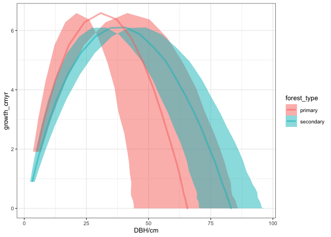
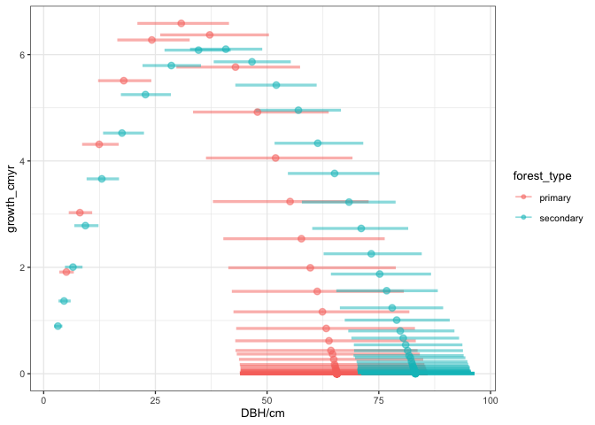
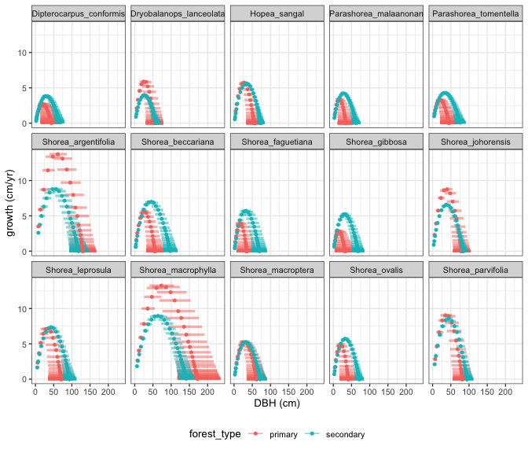

# Calculate growth rate
eleanorjackson
2025-03-25

``` r
library("tidyverse")
library("patchwork")
library("modelr")
library("tidybayes")
```

``` r
mod <- readRDS(here::here("output", 
                          "models", 
                          "priors2", 
                          "growth_model.rds"))
```

``` r
data <-
  readRDS(here::here("data", "derived", "data_cleaned.rds"))

well_sampled_trees <-
  data %>%
  group_by(plant_id) %>%
  summarise(records = sum(!is.na(dbh_mean))) %>%
  filter(records > 2)

data_sample <-
  data %>%
  filter(survival == 1) %>%
  filter(plant_id %in% well_sampled_trees$plant_id)
```

``` r
tidy_epred <- 
  data_sample %>% 
  data_grid(years = c(0:50),
            forest_type,
            .model = mod) %>% 
  add_epred_draws(mod,
                  re_formula = NA)
```

``` r
agr <- 
  tidy_epred %>% 
  group_by(forest_type, years) %>% 
  point_interval(.epred,
                 .width = 0.95,
                 .point = median,
                 .interval = hdi,
                 na.rm = TRUE) %>%
  group_by(forest_type) %>% 
  mutate(lag_dbh_pred = lag(.epred, n = 1, order_by = years)) %>% 
  rowwise() %>% 
  mutate(growth_cmyr = .epred - lag_dbh_pred) %>% 
  ungroup()
```

``` r
agr %>% 
  ggplot(aes(x = .epred, y = growth_cmyr, 
             xmin = .lower, xmax = .upper,
             colour = forest_type, fill = forest_type)) +
  geom_lineribbon(alpha = 0.5) +
  xlab("DBH/cm")
```



``` r
agr %>% 
  ggplot(aes(x = .epred, y = growth_cmyr, 
             colour = forest_type, fill = forest_type)) +
  geom_line(aes(x = .epred), colour = "orange") +
  geom_line(aes(x = .lower), colour = "red") +
  geom_line(aes(x = .upper), colour = "green") +
  facet_wrap(~forest_type)
```


``` r
agr %>% 
  ggplot(aes(x = .epred, y = growth_cmyr, 
             xmin = .lower, xmax = .upper,
             colour = forest_type, fill = forest_type)) +
  geom_pointinterval(alpha = 0.5) +
  xlab("DBH/cm")
```



## By species

``` r
tidy_epred_sp <- 
  data_sample %>% 
  drop_na(dbh_mean) %>% 
  data_grid(years = c(0:40),
            forest_type,
            genus_species,
            .model = mod) %>% 
  add_epred_draws(object = mod, ndraws = NULL,
                  re_formula = ~ (0 + forest_type |genus_species),
                  allow_new_levels = TRUE, dpar = TRUE)
```

``` r
agr_sp <- 
  tidy_epred_sp %>% 
  group_by(forest_type, genus_species, years) %>% 
  point_interval(.epred,
                 .width = 0.95,
                 .point = median,
                 .interval = hdi,
                 na.rm = TRUE) %>%
  group_by(forest_type, genus_species) %>% 
  mutate(lag_epred = lag(.epred, n = 1, order_by = years)) %>% 
  rowwise() %>% 
  mutate(growth_cmyr = .epred - lag_epred) %>% 
  ungroup()
```

``` r
agr_sp %>% 
  ggplot(aes(x = .epred, y = growth_cmyr, colour = forest_type)) +
  geom_point(alpha = 0.5) +
  facet_wrap(~genus_species, scales = "free", nrow = 3) +
  xlab("DBH (cm)") +
  ylab("growth (cm/yr)") +
  theme(legend.position = "bottom")
```


``` r
agr_sp %>% 
  ggplot(aes(x = .epred, y = growth_cmyr, 
             xmin = .lower, xmax = .upper,
             colour = forest_type)) +
  geom_pointinterval(point_alpha = 1, 
                     point_size = 0.75,
                     interval_alpha = 0.5,
                     interval_linewidth = 0.5) +
  facet_wrap(~genus_species, scales = "free", nrow = 3) +
  xlab("DBH (cm)") +
  ylab("growth (cm/yr)") +
  theme(legend.position = "bottom")
```


``` r
agr_sp %>% 
  ggplot(aes(x = .epred, y = growth_cmyr, 
             xmin = .lower, xmax = .upper,
             colour = forest_type)) +
  geom_pointinterval(point_alpha = 1, 
                     point_size = 0.75,
                     interval_alpha = 0.5,
                     interval_linewidth = 0.5) +
  facet_wrap(~genus_species, scales = "fixed", nrow = 3) +
  xlab("DBH (cm)") +
  ylab("growth (cm/yr)") +
  theme(legend.position = "bottom")
```



``` r
agr_sp %>% 
  ggplot(aes(x = .epred, y = growth_cmyr, colour = forest_type)) +
  geom_path() +
  facet_wrap(~genus_species, scales = "fixed", nrow = 3) +
  xlab("DBH (cm)") +
  ylab("growth (cm/yr)") +
  theme(legend.position = "bottom")
```


``` r
agr_sp %>% 
  drop_na() %>% 
  ggplot(aes(x = .epred, y = growth_cmyr, colour = forest_type,
             fill = forest_type, xmin = .lower, xmax = .upper,
             group = forest_type)) +
  geom_lineribbon(alpha = 0.6) +
  facet_wrap(~genus_species, scales = "free", nrow = 3) +
  xlab("DBH (cm)") +
  ylab("growth (cm/yr)") +
  theme(legend.position = "bottom")
```


