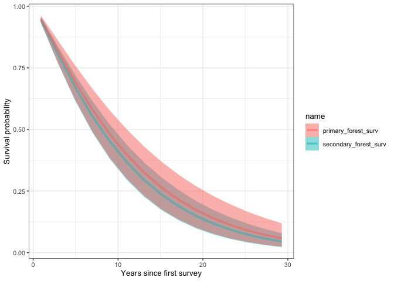
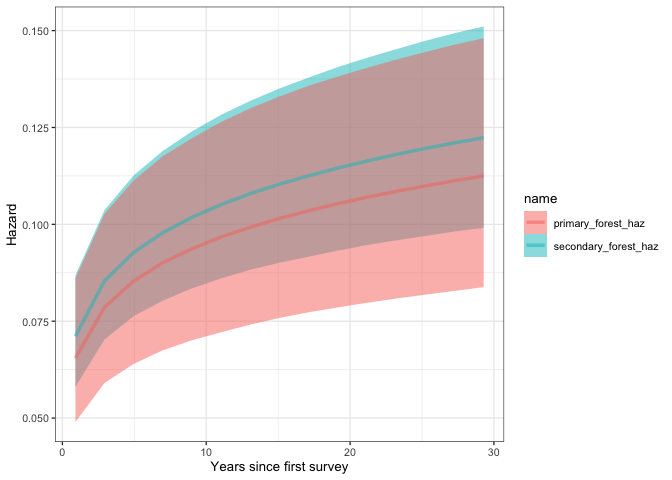
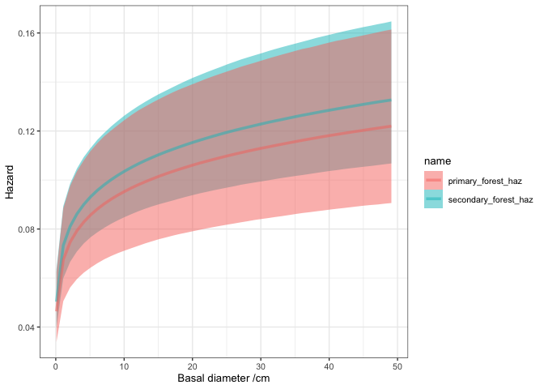

# Calculate survival probability
eleanorjackson
2025-03-20

Getting survival probability and hazards form our first survival models.

``` r
library("tidyverse")
library("patchwork")
library("modelr")
library("tidybayes")
```

``` r
file_names <- as.list(dir(path = here::here("output", "models", "survival"),
                          full.names = TRUE))

model_list <- map(file_names, readRDS, environment())

names(model_list) <- lapply(file_names, basename)
```

## Censor data

(I need to build this into the workflow)

``` r
data <-
  readRDS(here::here("data", "derived", "data_cleaned.rds"))

# time to first recorded dead
interval_censored <-
  data %>%
  filter(survival == 0) %>%
  group_by(plant_id) %>%
  slice_min(survey_date, with_ties = FALSE) %>%
  ungroup() %>%
  rename(time_to_dead = years) %>%
  select(plant_id, genus_species, plot, forest_logged, cohort, time_to_dead) %>%
  mutate(censor = "interval")

# time to last recorded alive
interval_censored <-
  data %>%
  filter(plant_id %in% interval_censored$plant_id) %>%
  filter(survival == 1) %>%
  group_by(plant_id) %>%
  slice_max(survey_date, with_ties = FALSE) %>%
  ungroup() %>%
  rename(time_to_last_alive = years) %>%
  select(plant_id, time_to_last_alive, dbh_mean, dbase_mean) %>%
  right_join(interval_censored)

# trees never recorded dead
right_censored <-
  data %>%
  filter(!plant_id %in% interval_censored$plant_id) %>%
  group_by(plant_id) %>%
  slice_max(survey_date, with_ties = FALSE) %>%
  ungroup() %>%
  rename(time_to_last_alive = years) %>%
  select(plant_id, genus_species, plot, forest_logged,
         cohort, time_to_last_alive, dbh_mean, dbase_mean) %>%
  mutate(censor = "right")

data_aggregated <-
  bind_rows(interval_censored, right_censored) %>%
  filter(time_to_last_alive > 0) %>%
  mutate(dbase_mean_sc = scale(dbase_mean),
         dbh_mean_sc = scale(dbh_mean))
```

Much of this code is coming from the SI of: [Fully flexible analysis of
behavioural sequences based on parametric survival models with frailties
— A tutorial](https://doi.org/10.1111/eth.13225)

`surv = exp(-(((time - 0) / exp (b_Intercept + b_parameter))^shape)))`

[This blog
post](https://www.r-bloggers.com/2020/01/survival-analysis-fitting-weibull-models-for-improving-device-reliability-in-r/)
is also helpful.

> Just like with the survival package, the default parameterization in
> brms can easily trip you up. We are fitting an intercept-only model
> meaning there are no predictor variables. The parameters that get
> estimated by brm() are the Intercept and shape. We can use the shape
> estimate as-is, but it’s a bit tricky to recover the scale. The key is
> that brm() uses a log-link function on the mean 𝜇. There is no doubt
> that this is a rambling post - even so, it is not within scope to try
> to explain link functions and GLM’s (I’m not expert enough to do it
> anyways, refer to Statistical Rethinking by McElreath). In short, to
> convert to scale we need to both undo the link function by taking the
> exponent and then refer to the brms documentation to understand how
> the mean 𝜇 relates to the scale 𝛽. The operation looks like this:

`scale = exp(Intercept)/(gamma(1 + 1/shape))`

Except I am using a no intercept model, i.e. intercept is allowed to
vary by group. I think it’ll look like this, with the intercept removed:

`surv = exp(-(((time - 0) / exp (b_parameter))^shape)))`

## Survival over time

``` r
# set up data-set for prediction (years to be predicted)
pred_df <- 
  data_aggregated %>%
  data_grid(time_to_last_alive = 
              seq_range(time_to_last_alive, n = 20, expand = TRUE)) %>%
  mutate(.chain= 0) %>%
  mutate(shape= 0) %>%
  mutate(.draw= 0) %>%
  mutate(.iteration= 0) %>%
  mutate(b_forest_logged0 = 0) %>%
  mutate(b_forest_logged1 = 0) 

# put together the relevant estimates from the mcmc chains
mcmc_df <- 
  model_list$ft_sp_sz_weibull.rds %>%
  spread_draws (b_forest_logged0,
                b_forest_logged1,
                shape) %>%
  mutate (time_to_last_alive = 0) 

# combine information for prediction and MCMC chains,
# estimate survival, hazard and relative hazard curves
curves_df <- 
  union(mcmc_df, pred_df) %>%
  expand(
    nesting(
      .chain,
      .iteration,
      .draw,
      b_forest_logged0,
      b_forest_logged1,
      shape
    ),
    time_to_last_alive
  ) %>%
  filter(time_to_last_alive > 0) %>%
  filter(.draw > 0) %>%
  # survival curves
  mutate (surv0 = exp(-(((time_to_last_alive - 0) / 
                           exp(b_forest_logged0))^shape))) %>%
  mutate (surv1 = exp(-(((time_to_last_alive - 0) / 
                           exp(b_forest_logged1))^shape))) %>%
  # hazard curves
  mutate (haz0 = ((1 / exp (b_forest_logged0)) * shape *
                    ((time_to_last_alive - 0) / 
                       exp (b_forest_logged0))^(shape - 1))) %>%
  mutate (haz1 = ((1 / exp (b_forest_logged1)) * shape *
                    ((time_to_last_alive - 0) / 
                       exp (b_forest_logged1))^(shape - 1)))  
```

``` r
curves_df %>% 
  pivot_longer(c(surv0, surv1)) %>% 
  ggplot (aes (x= time_to_last_alive, 
               y= value, 
               colour = name, 
               fill = name)) +
  stat_lineribbon (.width= .95, alpha = 0.5) +
  ylab("Survival probability")
```



``` r
curves_df %>% 
  pivot_longer(c(haz0, haz1)) %>% 
  ggplot (aes (x= time_to_last_alive, 
               y= value, 
               colour = name, 
               fill = name)) +
  stat_lineribbon (.width= .95, alpha = 0.5) +
  ylab("Hazard")
```



## Survival over size

``` r
pred_df_sz <- 
  data_aggregated %>%
  data_grid(dbase_mean_sc = 
              seq(0, 50, 2)) %>%
  mutate(.chain = 0) %>%
  mutate(shape = 0) %>%
  mutate(.draw = 0) %>%
  mutate(.iteration = 0) %>%
  mutate(b_forest_logged0 = 0) %>%
  mutate(b_forest_logged1 = 0)

# put together the relevant estimates from the mcmc chains
mcmc_df_sz <-
  model_list$ft_sp_sz_weibull.rds %>%
  spread_draws(b_forest_logged0,
               b_forest_logged1,
               shape) %>%
  mutate(dbase_mean_sc = 2) 

# combine information for prediction and MCMC chains,
# estiamte survival, hazard and relative hazard curves
curves_df_sz <-
  union(pred_df_sz, mcmc_df_sz) %>%
  expand(
    nesting(
      .chain,
      .iteration,
      .draw,
      b_forest_logged0,
      b_forest_logged1,
      shape
    ),
    dbase_mean_sc
  ) %>%
  filter (dbase_mean_sc != 2) %>%
  filter (.draw > 0) %>%
  # survival curves
  mutate (surv0 = exp (-(((dbase_mean_sc - 0) / exp (b_forest_logged0)
  )^shape))) %>%
  mutate (surv1 = exp (-(((dbase_mean_sc - 0) / exp (b_forest_logged1)
  )^shape))) %>%
  # hazard curves
  mutate (haz0 = ((1 / exp (b_forest_logged0)) * shape *
                    ((dbase_mean_sc - 0) / exp (b_forest_logged0)
                    )^(shape - 1))) %>%
  mutate (haz1 = ((1 / exp (b_forest_logged1)) * shape *
                    ((dbase_mean_sc - 0) / exp (b_forest_logged1)
                    )^(shape - 1))) 
```

``` r
curves_df_sz %>% 
  pivot_longer(c(surv0, surv1)) %>% 
  ggplot(aes(x = dbase_mean_sc, 
             y = value, 
             colour = name, 
             fill = name)) +
  stat_lineribbon (.width= .95, alpha = 0.5) +
  ylab("Survival probability") +
  xlab("Basal diameter /cm")
```


``` r
curves_df_sz %>% 
  pivot_longer(c(haz0, haz1)) %>% 
  ggplot (aes (x = dbase_mean_sc, 
               y = value, 
               colour = name, 
               fill = name)) +
  stat_lineribbon (.width= .95, alpha = 0.5) +
  ylab("Survival probability") +
  xlab("Basal diameter /cm")
```



## Try with the species model

``` r
pred_df_sz_sp <- 
  data_aggregated %>%
  data_grid(dbase_mean_sc = 
              seq(0, 50, 2)) %>%
  mutate(.chain = 0) %>%
  mutate(shape = 0) %>%
  mutate(.draw = 0) %>%
  mutate(.iteration = 0) %>%
  mutate(b_forest_logged0 = 0) %>%
  mutate(b_forest_logged1 = 0)

# put together the relevant estimates from the mcmc chains
mcmc_df_sz_sp <-
  model_list$ft_sp_sz_weibull.rds %>%
  spread_draws(shape, `r_.*`, 
                 regex = TRUE) %>% 
  mutate(dbase_mean_sc = 2) 

# combine information for prediction and MCMC chains,
# estiamte survival, hazard and relative hazard curves
curves_df_sz_sp <-
  union(pred_df_sz_sp, mcmc_df_sz_sp) %>%
  expand(
    nesting(
      .chain,
      .iteration,
      .draw,
      b_forest_logged0,
      b_forest_logged1,
      shape
    ),
    dbase_mean_sc
  ) %>%
  filter (dbase_mean_sc != 2) %>%
  filter (.draw > 0) %>%
  # survival curves
  mutate (surv0 = exp (-(((dbase_mean_sc - 0) / exp (b_forest_logged0)
  )^shape))) %>%
  mutate (surv1 = exp (-(((dbase_mean_sc - 0) / exp (b_forest_logged1)
  )^shape))) %>%
  # hazard curves
  mutate (haz0 = ((1 / exp (b_forest_logged0)) * shape *
                    ((dbase_mean_sc - 0) / exp (b_forest_logged0)
                    )^(shape - 1))) %>%
  mutate (haz1 = ((1 / exp (b_forest_logged1)) * shape *
                    ((dbase_mean_sc - 0) / exp (b_forest_logged1)
                    )^(shape - 1))) 
```
