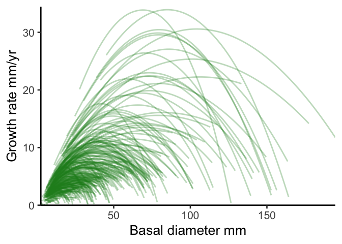

# Create a figure exlaining the analysis?
eleanorjackson
2025-03-26

- [Growth](#growth)
  - [First panel](#first-panel)
    - [Primary forest](#primary-forest)
    - [Secondary forest](#secondary-forest)
  - [Second panel](#second-panel)
    - [Primary forest](#primary-forest-1)
    - [Secondary forest](#secondary-forest-1)
- [Survival](#survival)

``` r
library("tidyverse")
library("patchwork")
library("tidybayes")
library("modelr")
```

# Growth

``` r
growth_data <-
  readRDS(here::here("data",
                     "derived",
                     "data_cleaned.rds"))

well_sampled_trees <-
  growth_data %>%
  group_by(plant_id) %>%
  summarise(records = sum(!is.na(dbh_mean))) %>%
  filter(records > 2)

growth_data <-
  growth_data %>%
  filter(survival == 1) %>%
  filter(plant_id %in% well_sampled_trees$plant_id)
```

``` r
growth_model <- readRDS(here::here("output",
                                   "models",
                                   "priors3",
                                   "growth_model.rds"))
```

## First panel

``` r
sp_n <- 
  growth_data %>% 
  group_by(genus_species, forest_type) %>% 
  summarise(n = n_distinct(plant_id),
            .groups = "drop") %>% 
  pivot_wider(names_from = forest_type, values_from = n) %>% 
  arrange(-secondary)

sp_n
```

    # A tibble: 15 × 3
       genus_species           primary secondary
       <fct>                     <int>     <int>
     1 Hopea_sangal                 17       156
     2 Shorea_johorensis            16       136
     3 Parashorea_tomentella        16       120
     4 Dryobalanops_lanceolata      14       115
     5 Parashorea_malaanonan        16       115
     6 Shorea_ovalis                13        93
     7 Shorea_leprosula              7        83
     8 Shorea_macrophylla           13        73
     9 Dipterocarpus_conformis      10        66
    10 Shorea_parvifolia            13        61
    11 Shorea_macroptera            14        56
    12 Shorea_beccariana            17        54
    13 Shorea_gibbosa               11        37
    14 Shorea_argentifolia          12        29
    15 Shorea_faguetiana             9        16

``` r
sp_1 <- 
  sp_n %>% 
  pluck(1,1) %>% 
  paste()
```

``` r
keys <- 
  growth_data %>%
  filter(genus_species == sp_1) %>% 
  select(plant_id, forest_type) %>%
  distinct(plant_id, .keep_all = TRUE) %>%
  mutate(plant_id = droplevels(plant_id))

growth_data_sp1 <- 
  growth_data %>% 
  filter(genus_species == sp_1)

sp1_preds <- 
  growth_data_sp1 %>%
  data_grid(years = seq_range(years, n = 40),
            genus_species = sp_1,
            plant_id = droplevels(unique(keys$plant_id))) %>%
  left_join(keys) %>%
  add_epred_draws(growth_model,
                  allow_new_levels = FALSE) 
```

### Primary forest

``` r
growth_data_sp1_p <-
  growth_data_sp1 %>% 
  filter(forest_type == "primary")

sp1_preds_p <-
  sp1_preds %>% 
  filter(forest_type == "primary")

ggplot() +
  stat_lineribbon(data = sp1_preds_p,
                  aes(x = years, y = .epred,
                      group = plant_id),
                  colour = "forestgreen",
                  .width = 0,
                  linewidth = 1,
                  alpha = 0.3) +
  stat_lineribbon(data = sp1_preds_p,
                  aes(x = years, y = .epred),
                  .width = 0,
                  linewidth = 1,
                  alpha = 1,
                  linetype = 2) +
  theme(legend.position = "none") +
  ylab("DBH cm") +
  xlab("Years") +
  scale_x_continuous(expand = c(0, 0)) +
  scale_y_continuous(expand = c(0, 0))
```


### Secondary forest

``` r
growth_data_sp1_s <-
  growth_data_sp1 %>% 
  filter(forest_type == "secondary")

sp1_preds_s <-
  sp1_preds %>% 
  filter(forest_type == "secondary")

ggplot() +
  stat_lineribbon(data = sp1_preds_s,
                  aes(x = years, y = .epred,
                      group = plant_id),
                  colour = "forestgreen",
                  .width = 0,
                  linewidth = 1,
                  alpha = 0.3) +
  stat_lineribbon(data = sp1_preds_s,
                  aes(x = years, y = .epred),
                  .width = 0,
                  linewidth = 1,
                  alpha = 1,
                  linetype = 2) +
  theme(legend.position = "none") +
  ylab("DBH cm") +
  xlab("Years") +
  scale_x_continuous(expand = c(0, 0)) +
  scale_y_continuous(expand = c(0, 0))
```


## Second panel

``` r
all_preds <- 
  growth_data %>% 
  drop_na(dbh_mean) %>% 
  data_grid(years = c(0:20),
            forest_type,
            genus_species,
            .model = growth_model) %>% 
  add_epred_draws(object = growth_model, ndraws = NULL,
                  re_formula = ~ (0 + forest_type |genus_species),
                  allow_new_levels = TRUE)


all_gr <- 
  all_preds %>% 
  group_by(forest_type, genus_species, years) %>% 
  point_interval(.epred,
                 .width = 0.95,
                 .point = median,
                 .interval = hdi,
                 na.rm = TRUE) %>%
  group_by(forest_type, genus_species) %>% 
  mutate(lag_epred = lag(.epred, n = 1, order_by = years)) %>% 
  rowwise() %>% 
  mutate(growth_cmyr = .epred - lag_epred) %>% 
  ungroup()

all_gr %>% 
  filter(genus_species == sp_1) %>% 
  ggplot(aes(x = .epred, y = growth_cmyr, 
             xmin = .lower, xmax = .upper)) +
  geom_path(.width = 0,
            linewidth = 1,
            alpha = 1,
            linetype = 2) +
  xlab("DBH cm") +
  ylab("Growth rate cm/yr") +
  scale_x_continuous(expand = c(0, 0)) +
  scale_y_continuous(expand = c(0, 0))
```


### Primary forest

``` r
sp1_gr_p <- 
  sp1_preds_p %>% 
  group_by(plant_id, years) %>% 
  point_interval(.epred,
                 .width = 0.95,
                 .point = median,
                 .interval = hdi,
                 na.rm = TRUE) %>%
  group_by(plant_id) %>% 
  mutate(lag_dbh_pred = lag(.epred, n = 1, order_by = years)) %>% 
  rowwise() %>% 
  mutate(growth_cmyr = .epred - lag_dbh_pred) %>% 
  ungroup()
```

``` r
sp1_gr_p %>% 
  ggplot(aes(x = .epred, y = growth_cmyr)) +
  geom_path(aes(group = plant_id), 
            alpha = 0.3,
            colour = "forestgreen",
            linewidth = 1) +
  xlab("DBH/cm") +
  ylab("Growth rate cm/yr") +
  scale_x_continuous(expand = c(0, 0)) +
  scale_y_continuous(limit = c(0,15), expand = c(0, 0))
```



``` r
all_gr_sp1_p <- 
  all_gr %>% 
  filter(genus_species == sp_1 & forest_type == "primary")

ggplot() +
  geom_path(data = sp1_gr_p,
            aes(x = .epred, y = growth_cmyr,
                group = plant_id), 
            alpha = 0.3,
            colour = "forestgreen",
            linewidth = 1) +
  geom_path(data = all_gr_sp1_p,
            aes(x = .epred, y = growth_cmyr), 
            .width = 0,
            linewidth = 1,
            alpha = 1,
            linetype = 2) +
  xlab("DBH cm") +
  ylab("Growth rate cm/yr") +
  scale_x_continuous(expand = c(0, 0)) +
  scale_y_continuous(limit = c(0, 15), expand = c(0, 0))
```


### Secondary forest

``` r
sp1_gr_s <- 
  sp1_preds_s %>% 
  group_by(plant_id, years) %>% 
  point_interval(.epred,
                 .width = 0.95,
                 .point = median,
                 .interval = hdi,
                 na.rm = TRUE) %>%
  group_by(plant_id) %>% 
  mutate(lag_dbh_pred = lag(.epred, n = 1, order_by = years)) %>% 
  rowwise() %>% 
  mutate(growth_cmyr = .epred - lag_dbh_pred) %>% 
  ungroup()
```

``` r
sp1_gr_s %>% 
  ggplot(aes(x = .epred, y = growth_cmyr)) +
  geom_path(aes(group = plant_id), 
            alpha = 0.3,
            colour = "forestgreen",
            linewidth = 1) +
  xlab("DBH cm") +
  ylab("Growth rate cm/yr") +
  scale_x_continuous(expand = c(0, 0)) +
  scale_y_continuous(limit = c(0,20), expand = c(0, 0))
```


``` r
all_gr_sp1_s <- 
  all_gr %>% 
  filter(genus_species == sp_1 & forest_type == "secondary")

ggplot() +
  geom_path(data = sp1_gr_s,
            aes(x = .epred, y = growth_cmyr,
                group = plant_id), 
            alpha = 0.3,
            colour = "forestgreen",
            linewidth = 1) +
  geom_path(data = all_gr_sp1_s,
            aes(x = .epred, y = growth_cmyr), 
            .width = 0,
            linewidth = 1,
            alpha = 1,
            linetype = 2) +
  xlab("DBH cm") +
  ylab("Growth rate cm/yr") +
  scale_x_continuous(expand = c(0, 0)) +
  scale_y_continuous(limit = c(0,20), expand = c(0, 0))
```


# Survival
