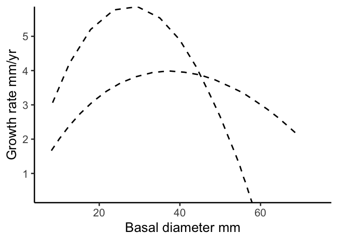
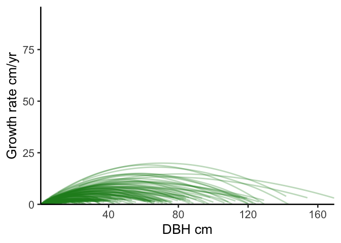
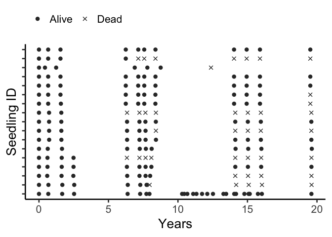

# Create a figure exlaining the analysis?
eleanorjackson
2025-12-16

- [Growth](#growth)
  - [First panel](#first-panel)
  - [Second panel](#second-panel)
  - [Third panel](#third-panel)
- [Survival](#survival)
  - [Fourth panel](#fourth-panel)
  - [Fifth panel](#fifth-panel)
  - [Sixth panel](#sixth-panel)
- [Combined panels](#combined-panels)

``` r
library("patchwork")
library("tidybayes")
library("modelr")
library("tidyverse")
library("ggtext")
```

# Growth

``` r
data <-
  readRDS(here::here("data", "derived", "data_cleaned.rds"))

alive_trees <-
  data %>%
  filter(survival == 1) %>%
  filter(! if_all(c(dbh_mean, dbase_mean), is.na))

well_sampled_alive_trees <-
  alive_trees %>%
  group_by(plant_id) %>%
  summarise(n = n()) %>%
  filter(n > 2)

growth_data <-
  alive_trees %>%
  filter(plant_id %in% well_sampled_alive_trees$plant_id)
```

``` r
growth_model <- readRDS(here::here("output",
                                   "models",
                                   "growth_model_base_p3_allo.rds"))
```

``` r
sp_n <- 
  growth_data %>% 
  group_by(genus_species, forest_type) %>% 
  summarise(n = n_distinct(plant_id),
            .groups = "drop") %>% 
  pivot_wider(names_from = forest_type, values_from = n) %>% 
  arrange(-logged)

sp_n
```

    # A tibble: 15 × 3
       genus_species           logged primary
       <fct>                    <int>   <int>
     1 Parashorea_tomentella      301      20
     2 Shorea_johorensis          295      20
     3 Parashorea_malaanonan      287      20
     4 Hopea_sangal               259      18
     5 Dryobalanops_lanceolata    245      20
     6 Shorea_leprosula           220      19
     7 Shorea_ovalis              198      19
     8 Shorea_macroptera          172      19
     9 Shorea_macrophylla         156      17
    10 Dipterocarpus_conformis    140      18
    11 Shorea_parvifolia          129      20
    12 Shorea_gibbosa             106      18
    13 Shorea_beccariana          105      20
    14 Shorea_argentifolia         97      19
    15 Shorea_faguetiana           74      18

``` r
sp_1 <- 
  sp_n %>% 
  pluck(1, 4) %>% 
  paste()
```

``` r
keys <- 
  growth_data %>%
  filter(genus_species == sp_1) %>% 
  select(plant_id, forest_type) %>%
  distinct(plant_id, .keep_all = TRUE) %>%
  mutate(plant_id = droplevels(plant_id))

growth_data_sp1 <- 
  growth_data %>% 
  filter(genus_species == sp_1)

sp1_preds <- 
  growth_data_sp1 %>%
  data_grid(years = seq_range(years, n = 10),
            genus_species = sp_1,
            plant_id = droplevels(unique(keys$plant_id))) %>%
  left_join(keys) %>%
  filter(forest_type == "logged") %>% 
  add_epred_draws(growth_model,
                  allow_new_levels = FALSE) 
```

## First panel

``` r
plant_1 <- 
  growth_data_sp1 %>% 
  filter(forest_type == "logged") %>% 
  group_by(plant_id) %>% 
  summarise(n = n()) %>% 
  arrange(-n) %>% 
  pluck(1, 14) %>% 
  paste()

growth_data_pl1 <-
  growth_data_sp1 %>% 
  filter(plant_id == plant_1)

pl1_preds <-
  sp1_preds %>% 
  filter(plant_id == plant_1)

p1 <- 
  ggplot() +
  stat_lineribbon(data = pl1_preds,
                  aes(x = years, y = .epred,
                      group = plant_id),
                  colour = "forestgreen",
                  .width = 0,
                  linewidth = 1,
                  alpha = 0.4) +
  geom_point(data = growth_data_pl1,
             aes(x = years, y = dbase_mean),
             shape = 4, stroke = 0.75, size = 2,
             colour = "forestgreen") +
  theme(legend.position = "none") +
  ylab("Basal diameter mm") +
  xlab("Years") +
  scale_x_continuous(expand = c(0, 0)) +
  scale_y_continuous(expand = c(0, 1))

p1
```


## Second panel

``` r
growth_data_sp1_s <-
  growth_data_sp1 %>% 
  filter(forest_type == "logged")

sp1_preds_s <-
  sp1_preds %>% 
  filter(forest_type == "logged")

p2 <- 
  ggplot() +
  stat_lineribbon(data = sp1_preds_s,
                  aes(x = years, y = .epred,
                      group = plant_id),
                  colour = "forestgreen",
                  .width = 0,
                  linewidth = 1,
                  alpha = 0.3) +
  stat_lineribbon(data = sp1_preds_s,
                  aes(x = years, y = .epred),
                  .width = 0,
                  linewidth = 1,
                  alpha = 1,
                  linetype = 2) +
  theme(legend.position = "none") +
  ylab("Basal diameter mm") +
  xlab("Years") +
  scale_x_continuous(expand = c(0, 0)) +
  scale_y_continuous(expand = c(0, 0))

p2
```


## Third panel

``` r
all_preds <- 
  growth_data %>% 
  drop_na(dbase_mean) %>% 
  data_grid(years = c(0:20),
            forest_type,
            genus_species = sp_1,
            .model = growth_model) %>% 
  add_epred_draws(object = growth_model, ndraws = NULL,
                  re_formula = ~ (0 + forest_type |genus_species),
                  allow_new_levels = FALSE)


all_gr <- 
  all_preds %>% 
  group_by(forest_type, genus_species, years) %>% 
  point_interval(.epred,
                 .width = 0.95,
                 .point = median,
                 .interval = hdi,
                 na.rm = TRUE) %>%
  group_by(forest_type, genus_species) %>% 
  mutate(lag_epred = lag(.epred, n = 1, order_by = years)) %>% 
  rowwise() %>% 
  mutate(growth_cmyr = .epred - lag_epred) %>% 
  ungroup()

all_gr %>% 
  filter(genus_species == sp_1) %>% 
  ggplot(aes(x = .epred, y = growth_cmyr, 
             xmin = .lower, xmax = .upper)) +
  geom_path(linewidth = 1,
            alpha = 1,
            linetype = 2) +
  xlab("Basal diameter mm") +
  ylab("Growth rate mm year<sup>-1</sup>") +
  scale_x_continuous(expand = c(0, 0)) +
  scale_y_continuous(expand = c(0, 0)) +
  theme(axis.title.y = element_markdown())
```



``` r
sp1_gr_s <- 
  sp1_preds_s %>% 
  group_by(plant_id, years) %>% 
  point_interval(.epred,
                 .width = 0.95,
                 .point = median,
                 .interval = hdi,
                 na.rm = TRUE) %>%
  group_by(plant_id) %>% 
  mutate(lag_dbh_pred = lag(.epred, n = 1, order_by = years)) %>% 
  rowwise() %>% 
  mutate(growth_cmyr = .epred - lag_dbh_pred) %>% 
  ungroup()
```

``` r
all_gr_sp1_s <- 
  all_gr %>% 
  filter(genus_species == sp_1 & forest_type == "logged")

p3 <- 
  ggplot() +
  geom_line(data = sp1_gr_s,
            aes(x = .epred, y = growth_cmyr,
                group = plant_id), 
            alpha = 0.3,
            stat = "smooth",
            colour = "forestgreen",
            linewidth = 1) +
  geom_path(data = all_gr_sp1_s,
            aes(x = .epred, y = growth_cmyr), 
            linewidth = 1,
            alpha = 1,
            linetype = 2) +
  xlab("Basal diameter mm") +
  ylab("Growth rate mm year<sup>-1</sup>") +
  scale_x_continuous(expand = c(0, 0)) +
  scale_y_continuous(limit = c(0, NA), expand = c(0, 0)) +
  theme(axis.title.y = element_markdown())

#p3
```

# Survival

``` r
survival_model <- 
  readRDS(here::here("output", "models", 
                     "survival", "survival_model_allo_nocenter.rds"))
```

``` r
survival_data <-
  readRDS(here::here("data", "derived", "data_survival.rds"))
```

## Fourth panel

``` r
p4 <- 
  data %>% 
  filter(genus_species == sp_1 & 
           forest_type == "logged" & 
           cohort == 1) %>% 
  filter(plant_id %in% 
           sample(unique(growth_data_sp1_s$plant_id), 30)) %>% 
  mutate(survival = ifelse(survival == 0, "Dead", "Alive")) %>% 
  ggplot(aes(y = plant_id, x = years,
             shape = as.ordered(survival))) +
  geom_point(size = 2, colour = "grey20", stroke = 0.75) +
  scale_shape_manual(values = c(19, 4)) +
  theme(axis.text.y = element_blank(),
        axis.ticks.y = element_blank(),
        legend.position = "top",
        legend.justification="left",
        legend.title = element_blank()) +
  xlab("Years") +
  ylab("Seedling ID")

p4
```



## Fifth panel

``` r
surv_sp1 <-
  survival_data %>% 
  filter(genus_species == sp_1 & forest_type == "logged") %>% 
  filter(censor == "interval")

p5 <-
  surv_sp1 %>% 
  ggplot(aes(x = dbase_mean)) +
  geom_histogram(
          position = "identity",
          fill = "forestgreen",
          alpha = 0.6,
          bins = 60
         ) +
  geom_step(
    aes(y = ..count..),
    colour = "forestgreen",
    stat = "bin",
    bins = 60,
    direction = "mid"
    ) +
  ylab("Count of mortalities")+
  xlab("Basal diameter mm") +
  theme(legend.position = "bottom") +
  scale_x_continuous(limits = c(0, 200), expand = c(0, 2)) +
  scale_y_continuous(expand = c(0, 1)) 

p5
```



## Sixth panel

``` r
sp_sizes <-
  survival_data %>%
  group_by(genus_species) %>%
  summarise(min = min(dbase_mean_sc, na.rm = T),
            max = max(dbase_mean_sc, na.rm = T)) %>%
  mutate(dbase_mean_sc = map2(min, max, .f = seq, length.out = 50)) %>%
  select(-c(min, max))

surv_pred_sp <-
  tibble(genus_species = sp_1,
         forest_type = "logged") %>%
  left_join(sp_sizes, by = c("genus_species")) %>%
  unnest(dbase_mean_sc) %>%
  add_linpred_draws(object = survival_model, ndraws = NULL,
                    re_formula = NULL, dpar = TRUE
  ) %>%
  rowwise() %>%
  mutate(scale = mu/gamma(1+(1/shape))) %>%
  mutate(surv = exp(-(dbase_mean_sc/scale)^shape))
```

``` r
scale_basal <- function(x) {
  x / attr(survival_data$dbase_mean_sc, "scaled:scale")
}

unscale_basal <- function(x) {
  x*attr(survival_data$dbase_mean_sc, "scaled:scale")
}
```

``` r
p6 <-
  ggplot() +
  stat_lineribbon(data = surv_pred_sp, 
    aes(x = unscale_basal(dbase_mean_sc), 
               y = surv), colour = "forestgreen", fill = "forestgreen",
               .width = 0.95, alpha = 0.5, show.legend = FALSE) +
  stat_lineribbon(data = surv_pred_sp, 
    aes(x = unscale_basal(dbase_mean_sc), 
               y = surv), colour = "forestgreen", 
               .width = 0, show.legend = FALSE) +
  ylab("Survival probability")+
  xlab("Basal diameter mm") +
  theme(legend.position = "bottom") +
  scale_x_continuous(limits = c(0, 200), expand = c(0, 0)) +
  scale_y_continuous(expand = c(0, 0)) 

p6
```


# Combined panels

``` r
p1 + p2 + p3 + p4 + p5 + p6 +
  patchwork::plot_layout(ncol = 3) +
  patchwork::plot_annotation(
    tag_levels = "a",
    title = "Hopea sangal",
    subtitle = "Logged forest",
    theme = theme(
      plot.title = element_text(face = "italic")
      )
  )
```


