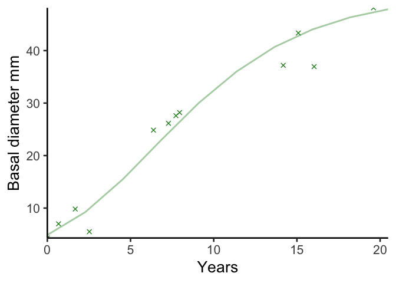
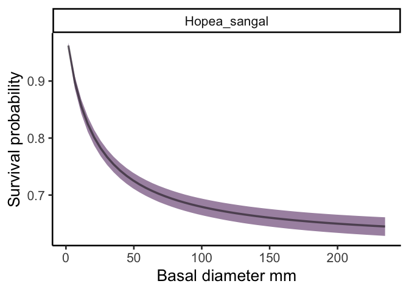
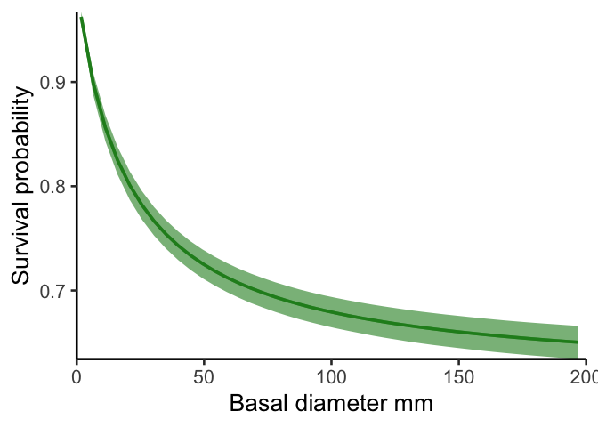

# Create a figure exlaining the analysis?
eleanorjackson
2025-03-27

- [Growth](#growth)
  - [First panel](#first-panel)
    - [Primary forest](#primary-forest)
    - [Secondary forest](#secondary-forest)
  - [Second panel](#second-panel)
    - [Primary forest](#primary-forest-1)
    - [Secondary forest](#secondary-forest-1)
- [Survival](#survival)
  - [Censor data](#censor-data)
  - [Panel three](#panel-three)
- [Combined panels](#combined-panels)

``` r
library("tidyverse")
library("patchwork")
library("tidybayes")
library("modelr")
```

# Growth

``` r
data <-
  readRDS(here::here("data",
                     "derived",
                     "data_cleaned.rds"))

well_sampled_trees <-
  data %>%
  group_by(plant_id) %>%
  summarise(records = sum(!is.na(dbh_mean))) %>%
  filter(records > 2)

growth_data <-
  data %>%
  filter(survival == 1) %>%
  filter(plant_id %in% well_sampled_trees$plant_id)
```

``` r
growth_model <- readRDS(here::here("output",
                                   "models",
                                   "priors3",
                                   "growth_model.rds"))
```

## First panel

``` r
sp_n <- 
  growth_data %>% 
  group_by(genus_species, forest_type) %>% 
  summarise(n = n_distinct(plant_id),
            .groups = "drop") %>% 
  pivot_wider(names_from = forest_type, values_from = n) %>% 
  arrange(-secondary)

sp_n
```

    # A tibble: 15 × 3
       genus_species           primary secondary
       <fct>                     <int>     <int>
     1 Hopea_sangal                 17       156
     2 Shorea_johorensis            16       136
     3 Parashorea_tomentella        16       120
     4 Dryobalanops_lanceolata      14       115
     5 Parashorea_malaanonan        16       115
     6 Shorea_ovalis                13        93
     7 Shorea_leprosula              7        83
     8 Shorea_macrophylla           13        73
     9 Dipterocarpus_conformis      10        66
    10 Shorea_parvifolia            13        61
    11 Shorea_macroptera            14        56
    12 Shorea_beccariana            17        54
    13 Shorea_gibbosa               11        37
    14 Shorea_argentifolia          12        29
    15 Shorea_faguetiana             9        16

``` r
sp_1 <- 
  sp_n %>% 
  pluck(1,1) %>% 
  paste()
```

``` r
keys <- 
  growth_data %>%
  filter(genus_species == sp_1) %>% 
  select(plant_id, forest_type) %>%
  distinct(plant_id, .keep_all = TRUE) %>%
  mutate(plant_id = droplevels(plant_id))

growth_data_sp1 <- 
  growth_data %>% 
  filter(genus_species == sp_1)

sp1_preds <- 
  growth_data_sp1 %>%
  data_grid(years = seq_range(years, n = 20),
            genus_species = sp_1,
            plant_id = droplevels(unique(keys$plant_id))) %>%
  left_join(keys) %>%
  add_epred_draws(growth_model,
                  allow_new_levels = FALSE) 
```

### Primary forest

``` r
growth_data_sp1_p <-
  growth_data_sp1 %>% 
  filter(forest_type == "primary")

sp1_preds_p <-
  sp1_preds %>% 
  filter(forest_type == "primary")

ggplot() +
  stat_lineribbon(data = sp1_preds_p,
                  aes(x = years, y = .epred,
                      group = plant_id),
                  colour = "forestgreen",
                  .width = 0,
                  linewidth = 1,
                  alpha = 0.3) +
  stat_lineribbon(data = sp1_preds_p,
                  aes(x = years, y = .epred),
                  .width = 0,
                  linewidth = 1,
                  alpha = 1,
                  linetype = 2) +
  theme(legend.position = "none") +
  ylab("DBH cm") +
  xlab("Years") +
  scale_x_continuous(expand = c(0, 0)) +
  scale_y_continuous(expand = c(0, 0))
```



### Secondary forest

``` r
growth_data_sp1_s <-
  growth_data_sp1 %>% 
  filter(forest_type == "secondary")

sp1_preds_s <-
  sp1_preds %>% 
  filter(forest_type == "secondary")

p1 <- 
  ggplot() +
  stat_lineribbon(data = sp1_preds_s,
                  aes(x = years, y = .epred,
                      group = plant_id),
                  colour = "forestgreen",
                  .width = 0,
                  linewidth = 1,
                  alpha = 0.3) +
  stat_lineribbon(data = sp1_preds_s,
                  aes(x = years, y = .epred),
                  .width = 0,
                  linewidth = 1,
                  alpha = 1,
                  linetype = 2) +
  theme(legend.position = "none") +
  ylab("DBH cm") +
  xlab("Years") +
  scale_x_continuous(expand = c(0, 0)) +
  scale_y_continuous(expand = c(0, 0))

p1
```


## Second panel

``` r
all_preds <- 
  growth_data %>% 
  drop_na(dbh_mean) %>% 
  data_grid(years = c(0:20),
            forest_type,
            genus_species,
            .model = growth_model) %>% 
  add_epred_draws(object = growth_model, ndraws = NULL,
                  re_formula = ~ (0 + forest_type |genus_species),
                  allow_new_levels = TRUE)


all_gr <- 
  all_preds %>% 
  group_by(forest_type, genus_species, years) %>% 
  point_interval(.epred,
                 .width = 0.95,
                 .point = median,
                 .interval = hdi,
                 na.rm = TRUE) %>%
  group_by(forest_type, genus_species) %>% 
  mutate(lag_epred = lag(.epred, n = 1, order_by = years)) %>% 
  rowwise() %>% 
  mutate(growth_cmyr = .epred - lag_epred) %>% 
  ungroup()

all_gr %>% 
  filter(genus_species == sp_1) %>% 
  ggplot(aes(x = .epred, y = growth_cmyr, 
             xmin = .lower, xmax = .upper)) +
  geom_path(linewidth = 1,
            alpha = 1,
            linetype = 2) +
  xlab("DBH cm") +
  ylab("Growth rate cm/yr") +
  scale_x_continuous(expand = c(0, 0)) +
  scale_y_continuous(expand = c(0, 0))
```


### Primary forest

``` r
sp1_gr_p <- 
  sp1_preds_p %>% 
  group_by(plant_id, years) %>% 
  point_interval(.epred,
                 .width = 0.95,
                 .point = median,
                 .interval = hdi,
                 na.rm = TRUE) %>%
  group_by(plant_id) %>% 
  mutate(lag_dbh_pred = lag(.epred, n = 1, order_by = years)) %>% 
  rowwise() %>% 
  mutate(growth_cmyr = .epred - lag_dbh_pred) %>% 
  ungroup()
```

``` r
sp1_gr_p %>% 
  ggplot(aes(x = .epred, y = growth_cmyr)) +
  geom_line(aes(group = plant_id), 
            stat = "smooth",
            alpha = 0.3,
            colour = "forestgreen",
            linewidth = 1) +
  xlab("DBH/cm") +
  ylab("Growth rate cm/yr") +
  scale_x_continuous(expand = c(0, 0)) +
  scale_y_continuous(limit = c(0, NA), expand = c(0, 0))
```


``` r
all_gr_sp1_p <- 
  all_gr %>% 
  filter(genus_species == sp_1 & forest_type == "primary")

ggplot() +
  geom_line(data = sp1_gr_p,
            aes(x = .epred, y = growth_cmyr,
                group = plant_id), 
            alpha = 0.3,
            stat = "smooth",
            colour = "forestgreen",
            linewidth = 1) +
  geom_path(data = all_gr_sp1_p,
            aes(x = .epred, y = growth_cmyr), 
            linewidth = 1,
            alpha = 1,
            linetype = 2) +
  xlab("DBH cm") +
  ylab("Growth rate cm/yr") +
  scale_x_continuous(expand = c(0, 0)) +
  scale_y_continuous(limit = c(0, NA), expand = c(0, 0))
```


### Secondary forest

``` r
sp1_gr_s <- 
  sp1_preds_s %>% 
  group_by(plant_id, years) %>% 
  point_interval(.epred,
                 .width = 0.95,
                 .point = median,
                 .interval = hdi,
                 na.rm = TRUE) %>%
  group_by(plant_id) %>% 
  mutate(lag_dbh_pred = lag(.epred, n = 1, order_by = years)) %>% 
  rowwise() %>% 
  mutate(growth_cmyr = .epred - lag_dbh_pred) %>% 
  ungroup()
```

``` r
sp1_gr_s %>% 
  ggplot(aes(x = .epred, y = growth_cmyr)) +
  geom_line(aes(group = plant_id), 
            alpha = 0.3,
            colour = "forestgreen",
            linewidth = 1,
            stat = "smooth") +
  xlab("DBH cm") +
  ylab("Growth rate cm/yr") +
  scale_x_continuous(expand = c(0, 0)) +
  scale_y_continuous(limit = c(0, NA), expand = c(0, 0))
```


``` r
all_gr_sp1_s <- 
  all_gr %>% 
  filter(genus_species == sp_1 & forest_type == "secondary")

p2 <- 
  ggplot() +
  geom_line(data = sp1_gr_s,
            aes(x = .epred, y = growth_cmyr,
                group = plant_id), 
            alpha = 0.3,
            stat = "smooth",
            colour = "forestgreen",
            linewidth = 1) +
  geom_path(data = all_gr_sp1_s,
            aes(x = .epred, y = growth_cmyr), 
            linewidth = 1,
            alpha = 1,
            linetype = 2) +
  xlab("DBH cm") +
  ylab("Growth rate cm/yr") +
  scale_x_continuous(expand = c(0, 0)) +
  scale_y_continuous(limit = c(0, NA), expand = c(0, 0))

p2
```


# Survival

``` r
survival_model <- 
  readRDS(here::here("output", "models", 
                     "survival", "survival_model_impute.rds"))
```

## Censor data

``` r
# time to first recorded dead
interval_censored <-
  data %>%
  filter(survival == 0) %>%
  group_by(plant_id) %>%
  slice_min(survey_date, with_ties = FALSE) %>%
  ungroup() %>%
  rename(time_to_dead = years) %>%
  select(plant_id, genus_species, plot, forest_logged, cohort, time_to_dead) %>%
  mutate(censor = "interval")

# time to last recorded alive
interval_censored <-
  data %>%
  filter(plant_id %in% interval_censored$plant_id) %>%
  filter(survival == 1) %>%
  group_by(plant_id) %>%
  slice_max(survey_date, with_ties = FALSE) %>%
  ungroup() %>%
  rename(time_to_last_alive = years) %>%
  select(plant_id, time_to_last_alive, dbh_mean, dbase_mean) %>%
  right_join(interval_censored)

# trees never recorded dead
right_censored <-
  data %>%
  filter(!plant_id %in% interval_censored$plant_id) %>%
  group_by(plant_id) %>%
  slice_max(survey_date, with_ties = FALSE) %>%
  ungroup() %>%
  rename(time_to_last_alive = years) %>%
  select(plant_id, genus_species, plot, forest_logged,
         cohort, time_to_last_alive, dbh_mean, dbase_mean) %>%
  mutate(censor = "right")

survival_data <-
  bind_rows(interval_censored, right_censored) %>%
  filter(time_to_last_alive > 0) %>%
  mutate(dbase_mean_sc = scale(dbase_mean),
         dbh_mean_sc = scale(dbh_mean))
```

## Panel three

``` r
survival_data %>% 
  mutate(survival = 0) %>% 
  filter(genus_species == sp_1) %>%
  ggplot(aes(x = dbh_mean)) +
  geom_dots(aes(y =survival,
                side = ifelse(survival == 0, "top", "bottom")), 
            pch = 19, color = "grey20",
            overlaps = "nudge") +
  scale_x_continuous(expand = c(0, 0)) +
  scale_y_continuous(expand = c(0, 0), breaks = c(0,1)) +
  ylab("Survival") +
  xlab("DBH")
```


``` r
grp_eff_im <- 
  get_variables(survival_model) %>%
  str_subset(pattern = "^r_genus_species")

pred_df_sz_sp <- 
  survival_data %>%
  data_grid(bsp_timetolastalive_midbh_mean_sc = 
              seq(0.1, 200.1, 1)) %>%
  mutate(.chain = NA) %>%
  mutate(shape_timetolastalive = NA) %>%
  mutate(.draw = NA) %>%
  mutate(.iteration = NA) %>%
  mutate(b_timetolastalive_forest_logged0 = NA) %>%
  mutate(b_timetolastalive_forest_logged1 = NA)

pred_df_sz_sp[grp_eff_im] <- NA

mcmc_df_sz_sp <-
  survival_model %>%
  spread_draws(shape_timetolastalive, `r_.*`, 
               b_timetolastalive_forest_logged0,
               b_timetolastalive_forest_logged1,
               bsp_timetolastalive_midbh_mean_sc,
                 regex = TRUE) %>% 
  mutate(bsp_timetolastalive_midbh_mean_sc = NA)  %>% 
  rowwise() %>% 
  mutate(across(contains(",forest_logged0]"),
                 ~ .x + b_timetolastalive_forest_logged0)) %>% 
  mutate(across(contains(",forest_logged1]"),
                 ~ .x + b_timetolastalive_forest_logged1))

curves_df_sz_sp <-
  union(pred_df_sz_sp, mcmc_df_sz_sp) %>%
  expand(
    nesting(
      .chain,
      .iteration,
      .draw,
      b_timetolastalive_forest_logged0,
      b_timetolastalive_forest_logged1,
      shape_timetolastalive,
      `r_genus_species__timetolastalive[Hopea_sangal,forest_logged0]`,
      `r_genus_species__timetolastalive[Hopea_sangal,forest_logged1]`
    ),
    bsp_timetolastalive_midbh_mean_sc
  ) %>%
  filter(!is.na(bsp_timetolastalive_midbh_mean_sc)) %>%
  filter (!is.na(.draw)) %>%
  # survival curves
  mutate(across(contains("r_genus_species__timetolastalive["),
                 ~ exp (-(((bsp_timetolastalive_midbh_mean_sc - 0) / exp (.x))^shape_timetolastalive)))) 
  
plotting_data_sp <- 
  curves_df_sz_sp %>% 
  pivot_longer(contains("r_genus_species__")) %>% 
  mutate(genus_species = str_split_i(string = name, pattern ="\\[", i = 2)) %>% 
  mutate(genus_species = str_split_i(string = genus_species, pattern =",", i = 1)) %>% 
  mutate(forest_type = str_split_i(string = name, pattern =",", i = 2)) %>% 
  mutate(forest_type = ifelse(forest_type== "forest_logged0]", "primary", "secondary")) 
```

``` r
plotting_data_sp %>% 
  ggplot (aes (x = bsp_timetolastalive_midbh_mean_sc, 
               y = value, 
               colour = forest_type, 
               fill = forest_type)) +
  stat_lineribbon (.width = 0.95, alpha = 0.5) +
  ylab("Survival probability")+
  xlab("DBH /cm") +
  facet_wrap(~genus_species, ncol = 3) +
  theme(legend.position = "bottom")
```



``` r
surv_sp1 <-
  survival_data %>% 
  mutate(survival = 0) %>% 
  filter(genus_species == sp_1)

p3 <-
  ggplot() +
  geom_dots(data = filter(surv_sp1, forest_logged == 1),
         aes(x = dbh_mean, y =survival,
                side = ifelse(survival == 0, "top", "bottom")), 
            pch = 19, color = "grey20",
            overlaps = "nudge"
         ) +
  stat_lineribbon(data = filter(plotting_data_sp, forest_type == "secondary"), 
    aes(x = bsp_timetolastalive_midbh_mean_sc, 
               y = value), colour = "forestgreen", fill = "forestgreen",
               .width = 0.95, alpha = 0.6, show.legend = FALSE) +
  stat_lineribbon(data = filter(plotting_data_sp, forest_type == "secondary"), 
    aes(x = bsp_timetolastalive_midbh_mean_sc, 
               y = value), colour = "forestgreen", 
               .width = 0, show.legend = FALSE) +
  ylab("Survival")+
  xlab("DBH cm") +
  theme(legend.position = "bottom") +
  scale_x_continuous(expand = c(0, 0)) +
  scale_y_continuous(expand = c(0, 0), breaks = c(0,1)) 

p3
```



# Combined panels

``` r
p1 + p2 + p3 +
  patchwork::plot_annotation(
    tag_levels = "a",
    title = "Hopea sangal, secondary forest")
```


