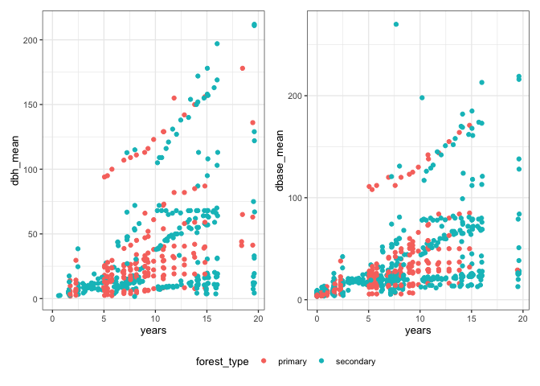
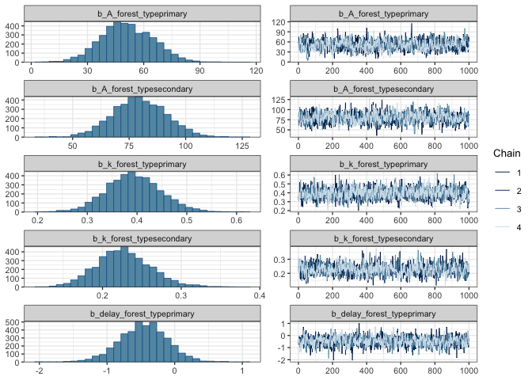
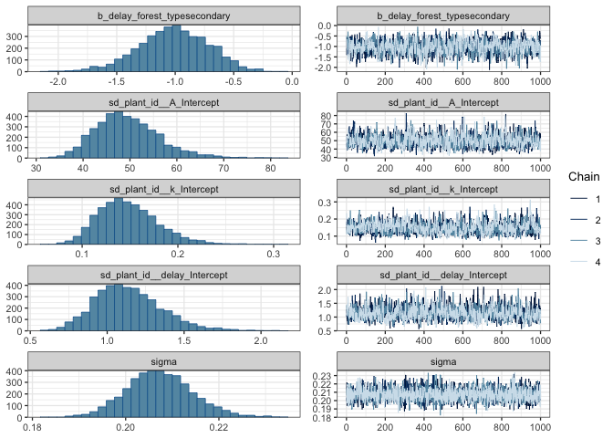
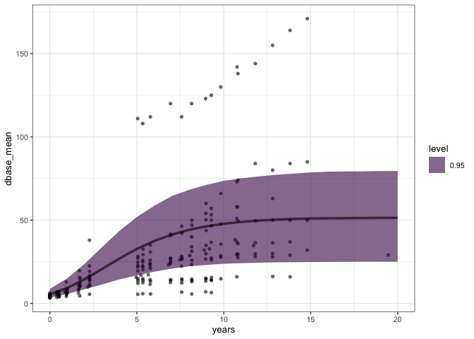
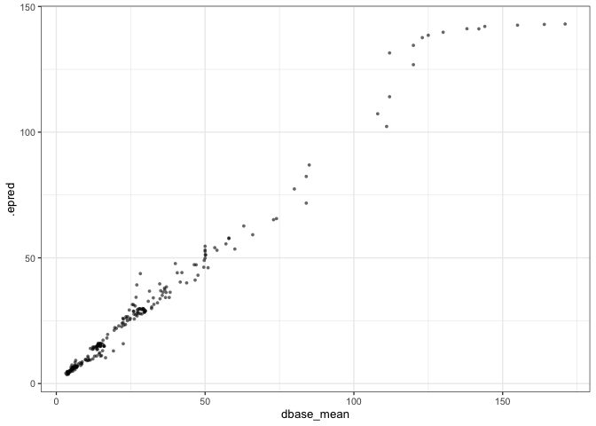
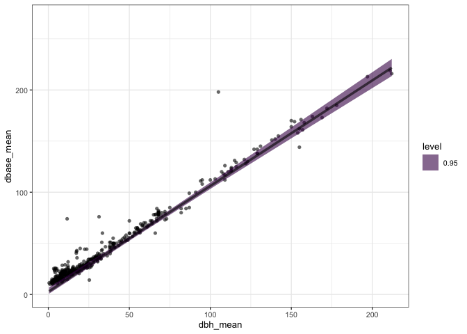

# Test a growth model imputing size
eleanorjackson
2025-04-15

Testing a growth model that imputes missing values of size

``` r
library("tidyverse")
library("brms")
library("tidybayes")
library("modelr")
library("patchwork")
```

``` r
data <-
  readRDS(here::here("data", "derived", "data_cleaned.rds"))
```

``` r
data_sample2 <-
  data %>%
  filter(survival == 1) %>%
  filter(! if_all(c(dbh_mean, dbase_mean), is.na))

well_sampled_trees2 <-
  data_sample2 %>%
  group_by(plant_id) %>%
  summarise(n = sum(!is.na(dbase_mean))) %>%
  filter(n > 10)

data_test_sample <-
  data_sample2 %>%
  filter(plant_id %in% sample(unique(well_sampled_trees2$plant_id), 36))
```

Testing with a random sample of 36 individuals.

``` r
data_test_sample %>% 
  ggplot(aes(x = years, 
             y = dbh_mean, 
             colour = forest_type)) +
  geom_point() +
  
  data_test_sample %>% 
  ggplot(aes(x = years, 
             y = dbase_mean, 
             colour = forest_type)) +
  geom_point() +
  patchwork::plot_layout(guides = "collect") &
  theme(legend.position = "bottom")
```



``` r
data_test_sample %>% 
  summarise(across(c(dbh_mean, dbase_mean), ~ sum(is.na(.x))))
```

    # A tibble: 1 × 2
      dbh_mean dbase_mean
         <int>      <int>
    1      168         13

We’ll be imputing 13 missing values of basal diameter. Basal diameter is
mostly missing for the final 3 surveys of primary forest seedlings.

``` r
bform <-
  bf(dbase_mean | mi() ~ log(A) * exp( -exp( -(k * (years - delay) ) ) ),
     log(A) ~ 0 + forest_type + 
       (1 | plant_id),
     k ~ 0 + forest_type + 
       (1 | plant_id),
     delay ~ 0 + forest_type +
       (1 | plant_id),
     family = brmsfamily("lognormal"),
     nl = TRUE) 
```

``` r
priors <- c(
  prior(lognormal(5, 1.2), nlpar = "A", lb = 0),
  prior(student_t(5, 0, 1), nlpar = "k", lb = 0),
  prior(student_t(5, 0, 10), nlpar = "delay"))
```

``` r
growth_model_impute <-
  brm(bform,
      data = data_test_sample,
      prior = priors,
      cores = 4,
      chains = 4,
      init = 0,
      seed = 123,
      file = here::here("code", "notebooks", "models",
                        "2025-03-27_test-impute-growth", 
                        "growth_model_impute_n36.rds"),
      file_refit = "on_change")
```

``` r
plot(growth_model_impute,
     ask = FALSE)
```





Not bad.

Getting predictions:

``` r
preds <- 
  data_test_sample %>% 
  data_grid(forest_type,
            years = c(0:20),
            .model = growth_model_impute) %>% 
  add_epred_draws(growth_model_impute,
                  re_formula = NA)
```

``` r
ggplot() +
  geom_point(data = filter(data_test_sample, forest_type == "primary"),
             aes(y = dbase_mean, x = years),
             alpha = 0.6, shape = 16) +
  stat_lineribbon(data = filter(preds, forest_type == "primary"),
                  aes(y = .epred, x = years),
                  .width = 0.95, alpha = 0.6) 
```



Predicted basal diameter against real basal:

``` r
data_test_sample %>% 
  filter(forest_type == "primary") %>% 
  add_epred_draws(growth_model_impute,
                  re_formula = NULL, 
                  allow_new_levels = TRUE) %>% 
  point_interval() %>% 
  ggplot() +
  geom_point(aes(x = dbase_mean, y = .epred),
             alpha = 0.6, shape = 16, size = 1)
```



Predicted basal diameter against real DBH where real basal is missing:

``` r
data_test_sample %>% 
  filter(is.na(dbase_mean)) %>% 
  add_epred_draws(growth_model_impute,
                  re_formula = NULL, 
                  allow_new_levels = TRUE) %>% 
  point_interval() %>% 
  ggplot() +
  geom_point(aes(x = dbh_mean, y = .epred),
             alpha = 0.6, shape = 16, size = 2)
```


