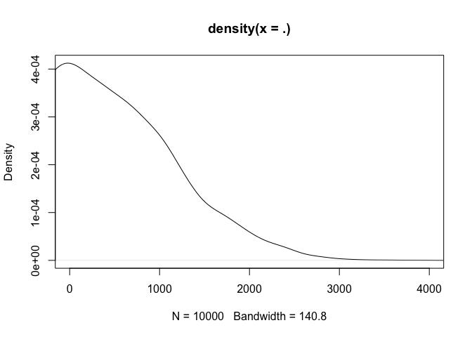
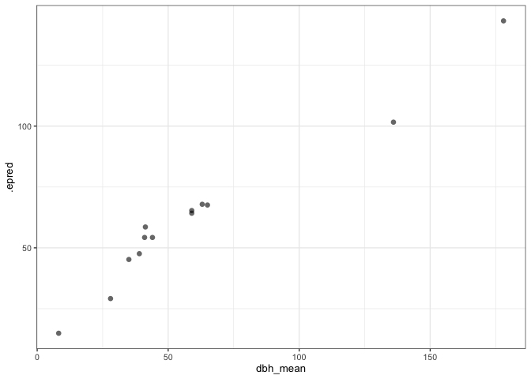

# Test a growth model imputing size
eleanorjackson
2025-03-28

Testing a growth model that imputes missing values of DBH.

``` r
library("tidyverse")
library("brms")
library("tidybayes")
library("modelr")
library("patchwork")
```

``` r
data <-
  readRDS(here::here("data", "derived", "data_cleaned.rds"))
```

``` r
data_sample2 <-
  data %>%
  filter(survival == 1) %>%
  filter(! if_all(c(dbh_mean, dbase_mean), is.na))

well_sampled_trees2 <-
  data_sample2 %>%
  group_by(plant_id) %>%
  summarise(n = n()) %>%
  filter(n > 10)

data_test_sample <-
  data %>%
  filter(plant_id %in% sample(unique(well_sampled_trees2$plant_id), 36))
```

Testing with a random sample of 36 individuals.

``` r
data_test_sample %>% 
  ggplot(aes(x = years, 
             y = dbh_mean, 
             colour = forest_type)) +
  geom_point() +
  
  data_test_sample %>% 
  ggplot(aes(x = years, 
             y = dbase_mean, 
             colour = forest_type)) +
  geom_point() +
  patchwork::plot_layout(guides = "collect") &
  theme(legend.position = "bottom")
```


``` r
data_test_sample %>% 
  summarise(across(c(dbh_mean, dbase_mean), ~ sum(is.na(.x))))
```

    # A tibble: 1 × 2
      dbh_mean dbase_mean
         <int>      <int>
    1      254         85

By imputing DBH we will get 260 extra measurements. DBH is mostly
missing at the start of the experiment when the trees were too small to
take DBH.

``` r
bform <-
  bf(dbh_mean | mi() ~ log(A) * exp( -exp( -(k * (years - delay) ) ) ),
     log(A) ~ 0 + forest_type + mi(dbase_mean) +
       (1 | plant_id),
     k ~ 0 + forest_type + mi(dbase_mean) +
       (1 | plant_id),
     delay ~ 0 + forest_type + mi(dbase_mean) +
       (1 | plant_id),
     family = brmsfamily("lognormal"),
     nl = TRUE) +
  bf(dbase_mean |
       mi() ~ mi(dbh_mean),
     family = brmsfamily("gaussian")) +
  set_rescor(FALSE)
```

DBH over time (incl. missing values) is predicted by forest type and
basal diameter. Missing basal diameter values are predicted by DBH.

``` r
priors2 <- c(
  prior(lognormal(5, 1.2), nlpar = "A", lb = 0, resp = "dbhmean"),
  prior(student_t(5, 0, 0.5), nlpar = "k", lb = 0, resp = "dbhmean"),
  prior(student_t(5, 0, 20), nlpar = "delay", resp = "dbhmean"),
  prior(normal(50, 1000), class = "b", lb = 0, resp = "dbasemean")
  )
```

I’ve given quite a wide prior for basal diameter, it looks like this:

``` r
rnorm(n = 10000, 50, 1000) %>% 
  density() %>% 
  plot(xlim = c(0, 4000)) 
```



``` r
growth_model_impute <-
  brm(bform,
      data = data_test_sample,
      prior = priors2,
      cores = 4,
      chains = 4,
      init = 0,
      seed = 123,
      file = here::here("code", "notebooks", "models",
                        "2025-03-27_test-impute-growth", 
                        "growth_model_impute_n36.rds"),
      file_refit = "on_change")
```

``` r
plot(growth_model_impute,
     ask = FALSE)
```


Bad chains since I didn’t run very long and little data, but ok for
testing.

Getting predictions:

``` r
preds <- 
  data_test_sample %>% 
  data_grid(dbase_mean = seq_range(dbase_mean, n = 5),
            forest_type,
            dbh_mean = seq_range(dbh_mean, n = 5),
            years = c(0:20),
            .model = growth_model_impute) %>% 
  add_epred_draws(growth_model_impute,
                  re_formula = NA)
```

Predicted DBH plotted against basal diameter:

``` r
ggplot() +
  geom_point(data = data_test_sample,
             aes(x = dbase_mean, y = dbh_mean),
             alpha = 0.6, shape = 16) +
  stat_lineribbon(data = filter(preds, .category == "dbhmean"),
                  aes(y = .epred, x = dbase_mean),
                  .width = 0.95, alpha = 0.6) 
```


Not a 1-to-1 fit since DBH is also predicted by time, forest type & tree
ID.

Predicted basal diameter plotted against DBH:

``` r
ggplot() +
  geom_point(data = data_test_sample,
             aes(x = dbh_mean, y = dbase_mean),
             alpha = 0.6, shape = 16) +
  stat_lineribbon(data = filter(preds, .category == "dbasemean"),
                  aes(y = .epred, x = dbh_mean),
                  .width = 0.95, alpha = 0.6) 
```



Nice! Basal diameter is predicted solely by DBH so this looks good.

Prediction of DBH over time:

``` r
preds %>% 
  filter(.category == "dbhmean") %>% 
  ggplot() +
  stat_lineribbon(aes(x = years, y = .epred, 
                      group = forest_type, colour = forest_type),
                  .width = 0,
                  linewidth = 1) +
  theme(legend.position = "bottom") +
  ylab("DBH cm") +
  xlab("Years")
```


