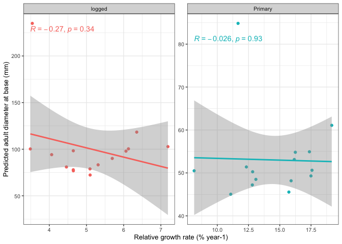

# Look at correlations between estimated parameters
eleanorjackson
2025-06-19

- [Get growth parameters](#get-growth-parameters)
- [Get survival parameters](#get-survival-parameters)
- [RGR vs survival](#rgr-vs-survival)
- [Adult diameter vs survival](#adult-diameter-vs-survival)
- [Adult diameter vs RGR](#adult-diameter-vs-rgr)
- [PCA ?](#pca-)

``` r
library("tidyverse")
library("tidybayes")
library("ggfortify")
```

``` r
mod_gro <-
  readRDS(here::here("output", "models", 
                     "growth_model_base_p3.rds"))


mod_surv <-
  readRDS(here::here("output", "models", "survival",
                     "survival_model_impute.rds"))
```

## Get growth parameters

``` r
pc_data_A <-
  mod_gro %>%
  spread_draws(
    b_A_forest_typeprimary,
    b_A_forest_typelogged,
    `r_genus_species__A.*`, regex = TRUE) %>%
  rowwise() %>%
  mutate(across(contains(",forest_typeprimary]"),
                ~ .x + b_A_forest_typeprimary)) %>%
  mutate(across(contains(",forest_typelogged]"),
                ~ .x + b_A_forest_typelogged)) %>%
  ungroup() %>%
  pivot_longer(cols = contains("r_genus_species__A")) %>%

  mutate(forest_type = case_when(
    grepl("logged", name) ~ "logged",
    grepl("primary", name) ~ "Primary")) %>%
  mutate(Species = str_split_i(string = name, pattern ="\\[", i = 2)) %>%
  mutate(Species = str_split_i(string = Species, pattern =",", i = 1)) %>%
  mutate(Parameter = "A") 

pc_data_k <-
  mod_gro %>%
  spread_draws(
    b_k_forest_typeprimary,
    b_k_forest_typelogged,
    `r_genus_species__k.*`, regex = TRUE) %>%
  rowwise() %>%
  mutate(across(contains(",forest_typeprimary]"),
                ~ .x + b_k_forest_typeprimary)) %>%
  mutate(across(contains(",forest_typelogged]"),
                ~ .x + b_k_forest_typelogged)) %>%
  ungroup() %>%
  pivot_longer(cols = contains("r_genus_species__k")) %>%

  mutate(forest_type = case_when(
    grepl("logged", name) ~ "logged",
    grepl("primary", name) ~ "Primary")) %>%
  mutate(Species = str_split_i(string = name, pattern ="\\[", i = 2)) %>%
  mutate(Species = str_split_i(string = Species, pattern =",", i = 1)) %>%
  mutate(Parameter = "k")

pc_data_delay <-
  mod_gro %>%
  spread_draws(
    b_delay_forest_typeprimary,
    b_delay_forest_typelogged,
    `r_genus_species__delay.*`, regex = TRUE) %>%
  rowwise() %>%
  mutate(across(contains(",forest_typeprimary]"),
                ~ .x + b_delay_forest_typeprimary)) %>%
  mutate(across(contains(",forest_typelogged]"),
                ~ .x + b_delay_forest_typelogged)) %>%
  ungroup() %>%
  pivot_longer(cols = contains("r_genus_species__delay")) %>%

  mutate(forest_type = case_when(
    grepl("logged", name) ~ "logged",
    grepl("primary", name) ~ "Primary")) %>%
  mutate(Species = str_split_i(string = name, pattern ="\\[", i = 2)) %>%
  mutate(Species = str_split_i(string = Species, pattern =",", i = 1)) %>%
  mutate(Parameter = "delay")

growth_params <-
  bind_rows(pc_data_A,
            pc_data_delay,
            pc_data_k) %>% 
  group_by(Species, forest_type, Parameter) %>% 
  mutate(value = case_when(
    Parameter == "k" ~ (value / exp(1))*100,
    .default = value
  )) %>% 
  summarise(median = median(value),
            iqr = median(value)) %>% 
  pivot_wider(names_from = Parameter, values_from = c(median, iqr)) %>% 
  rowwise() %>% 
  mutate(A_q1 = median_A - iqr_A/2,
         A_q3 = median_A + iqr_A/2,
         delay_q1 = median_delay - iqr_delay/2,
         delay_q3 = median_delay + iqr_delay/2,
         k_q1 = median_k - iqr_k/2,
         k_q3 = median_k + iqr_k/2) 
```

## Get survival parameters

``` r
surv_params <-
  mod_surv %>%
  spread_draws(r_genus_species__timetolastalive[genus_species,forest_type],
               b_timetolastalive_forest_typelogged,
               b_timetolastalive_forest_typeprimary, regex=T) %>%
  mutate(value = case_when(forest_type == "forest_typeprimary" ~
                             r_genus_species__timetolastalive + b_timetolastalive_forest_typeprimary,
                           forest_type == "forest_typelogged" ~
                             r_genus_species__timetolastalive + b_timetolastalive_forest_typelogged)) %>%
  mutate(forest_type = case_when(
    forest_type == "forest_typelogged" ~ "logged",
    forest_type == "forest_typeprimary" ~ "Primary")) %>% 
  group_by(genus_species, forest_type) %>% 
  summarise(survival = median(value),
            iqr = IQR(value)) %>% 
  rowwise() %>% 
  mutate(s_q1 = survival - iqr/2,
         s_q3 = survival + iqr/2) %>% 
  rename(Species = genus_species)
```

``` r
all_params <- 
  growth_params %>% 
  full_join(surv_params) 
```

## RGR vs survival

``` r
all_params %>% 
  ggplot(aes(x = median_k, y = survival, colour = forest_type)) +
  geom_point() +
  facet_wrap(~forest_type, scales = "free") +
  theme(legend.position = "none") +
  geom_smooth(method = "lm") +
  ggpubr::stat_cor(label.x.npc = "left", label.y.npc = "bottom") +
  labs(x = "Relative growth rate (% year-1)",
       y = "Survival (time to typical mortality (years))")
```


``` r
all_params %>% 
  ggplot(aes(x = median_k, y = survival, colour = forest_type)) +
  geom_point() +
  geom_errorbar(aes(ymin = s_q1, ymax = s_q3)) +
  geom_errorbar(aes(xmin = k_q1, xmax = k_q3)) +
  facet_wrap(~forest_type) +
  theme(legend.position = "none") +
  labs(x = "Relative growth rate (% year-1)",
       y = "Survival (time to typical mortality (years))")
```


## Adult diameter vs survival

``` r
all_params %>% 
  ggplot(aes(x = median_A, y = survival, colour = forest_type)) +
  geom_point() +
  facet_wrap(~forest_type, scales = "free") +
  theme(legend.position = "none") +
  geom_smooth(method = "lm") +
  ggpubr::stat_cor(label.x.npc = "left", label.y.npc = "bottom") +
  labs(x = "Predicted adult diameter at base (mm)",
       y = "Survival (time to typical mortality (years))")
```


``` r
all_params %>% 
  ggplot(aes(x = median_A, y = survival, colour = forest_type)) +
  geom_point() +
  geom_errorbar(aes(ymin = s_q1, ymax = s_q3)) +
  geom_errorbar(aes(xmin = A_q1, xmax = A_q3)) +
  facet_wrap(~forest_type) +
  theme(legend.position = "none") +
  labs(x = "Predicted adult diameter at base (mm)",
       y = "Survival (time to typical mortality (years))")
```


## Adult diameter vs RGR

``` r
all_params %>% 
  ggplot(aes(x = median_k, y = median_A, colour = forest_type)) +
  geom_point() +
  facet_wrap(~forest_type, scales = "free") +
  theme(legend.position = "none") +
  geom_smooth(method = "lm") +
  ggpubr::stat_cor(label.x.npc = "left", label.y.npc = "top") +
  labs(x = "Relative growth rate (% year-1)",
       y = "Predicted adult diameter at base (mm)")
```



``` r
all_params %>% 
  ggplot(aes(x = median_k, y = median_A, colour = forest_type)) +
  geom_point() +
  geom_errorbar(aes(ymin = A_q1, ymax = A_q3)) +
  geom_errorbar(aes(xmin = k_q1, xmax = k_q3)) +
  facet_wrap(~forest_type) +
  theme(legend.position = "none") +
  labs(x = "Relative growth rate (% year-1)",
       y = "Predicted adult diameter at base (mm)")
```


## PCA ?

``` r
pca_p <- 
  prcomp(
  x = all_params %>% 
    ungroup() %>% 
    filter(forest_type == "Primary") %>% 
    column_to_rownames("Species") %>% 
    select(median_A, median_k, median_delay),
  scale. = TRUE,
  center = TRUE
)

autoplot(pca_p,
         loadings = TRUE, 
         loadings.label = TRUE)
```


``` r
fortify(pca_p) %>% 
  rownames_to_column(var = "Species") %>% 
  left_join(all_params %>% 
    ungroup() %>% 
    filter(forest_type == "Primary"),
    by = "Species") %>% 
  ggplot(aes(x = PC1, y = PC2, colour = survival))+
  geom_point()+
  scale_colour_viridis_c() +
  ggtitle("old-growth forest")
```


``` r
pca_l <- 
  prcomp(
  x = all_params %>% 
    ungroup() %>% 
    filter(forest_type == "logged") %>% 
    column_to_rownames("Species") %>% 
    select(median_A, median_k, median_delay),
  scale. = TRUE,
  center = TRUE
)

autoplot(pca_l,
         loadings = TRUE, 
         loadings.label = TRUE)
```


``` r
fortify(pca_l) %>% 
  rownames_to_column(var = "Species") %>% 
  left_join(all_params %>% 
    ungroup() %>% 
    filter(forest_type == "logged"),
    by = "Species") %>% 
  ggplot(aes(x = PC1, y = PC2, colour = survival)) +
  geom_point()+
  scale_colour_viridis_c() +
  ggtitle("logged forest")
```


