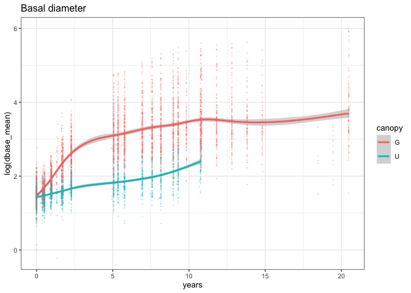
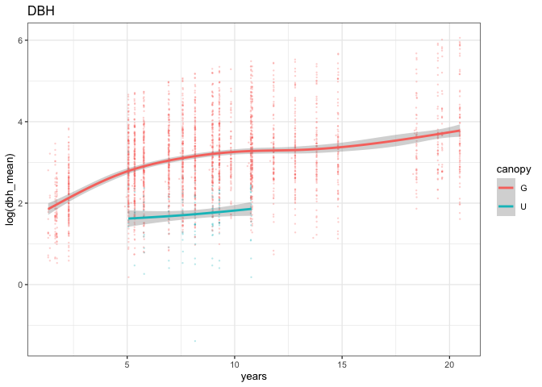
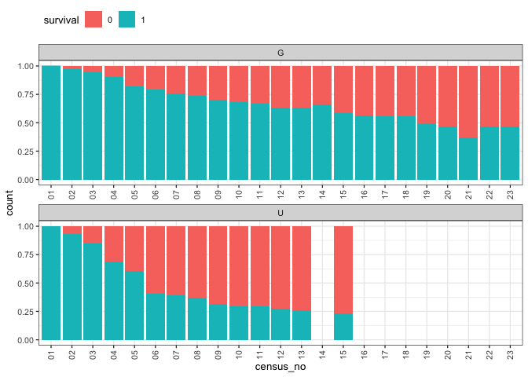
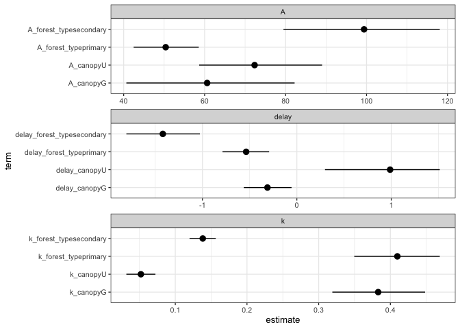

# Should we include understory plots?
eleanorjackson
2025-06-04

- [Growth of seedlings in gap vs understory Danum Valley
  plots](#growth-of-seedlings-in-gap-vs-understory-danum-valley-plots)
- [Survival of seedlings in gap vs understory Danum Valley
  plots](#survival-of-seedlings-in-gap-vs-understory-danum-valley-plots)
- [Modelling growth of seedlings in gap vs
  understory](#modelling-growth-of-seedlings-in-gap-vs-understory)
- [Comparing parameter estimates from the canopy model (primary forest
  only) to the original forest type model (primary vs
  secondary)](#comparing-parameter-estimates-from-the-canopy-model-primary-forest-only-to-the-original-forest-type-model-primary-vs-secondary)

We initially chose to use the Danum Valley (primary forest) gap plots
rather than the understory plots, since the light levels in a canopy gap
are more comparable to logged forest in the Sabah Biodiversity
Experiment, where planting lines were cleared of lianas.

However… possibility that the gaps have more light than the SBE
(secondary forest) and hence perhaps light is responsible for out
preliminary results of faster growth and higher survival in the primary
forest seedlings?

Tommaso:

> If I understood correctly you’ve focused on seedling planted in gaps
> at Danum. I wonder if it might be the case that seedlings at Danum (in
> gaps) actually have more light availability than those at SBE. One of
> the most striking results of the LiDAR data is that the liana cutting
> plots have almost no gaps and higher canopy cover than the primary
> forests.

Mikey:

> I understand using only the SBE intensive plots, but I would include
> all of the Danum plots (both gap and understorey). The light
> measurements do not define the light environment beyond a few years
> and many plots closed or opened during the 15 years of measurement.

``` r
library("tidyverse")
library("tidybayes")
library("brms")
```

``` r
gro_dv <-
  readRDS(here::here("data", "derived", "data_cleaned.rds")) %>% 
  filter(forest_type == "primary")

surv_dv <-
  readRDS(here::here("data", "derived", "data_survival.rds")) %>% 
  filter(forest_type == "primary")
```

## Growth of seedlings in gap vs understory Danum Valley plots

``` r
gro_dv %>% 
  drop_na(dbase_mean) %>% 
  ggplot(aes(x = years, y = log(dbase_mean), colour = canopy)) +
  geom_point(alpha = 0.3, size = 0.5, shape = 16) +
  geom_smooth() +
  ggtitle("Basal diameter")
```



``` r
gro_dv %>% 
  drop_na(dbh_mean) %>% 
  ggplot(aes(x = years, y = log(dbh_mean), colour = canopy)) +
  geom_point(alpha = 0.3, size = 0.5, shape = 16) +
  geom_smooth() +
  ggtitle("DBH")
```



## Survival of seedlings in gap vs understory Danum Valley plots

``` r
gro_dv %>% 
  mutate(survival = as.factor(survival)) %>% 
  ggplot(aes(x = census_no, group = survival, 
             fill = survival)) +
  geom_bar(position = "fill") +
  facet_wrap(~canopy, ncol = 1,
             axis.labels = "all_x", axes = "all_x") +
  guides(x =  guide_axis(angle = 90)) +
  theme(legend.position = "top", legend.justification = "left") 
```



## Modelling growth of seedlings in gap vs understory

``` r
well_sampled_trees <-
  gro_dv %>%
  group_by(plant_id) %>%
  summarise(records = sum(!is.na(dbase_mean))) %>%
  filter(records > 2)

data_sample <-
  gro_dv %>%
  filter(survival == 1) %>%
  filter(plant_id %in% well_sampled_trees$plant_id)
```

``` r
priors1 <- c(
  prior(lognormal(5, 1.2), nlpar = "A", lb = 0),
  prior(student_t(5, 0, 1), nlpar = "k", lb = 0),
  prior(student_t(5, 0, 10), nlpar = "delay"))
```

``` r
gompertz <-
  bf(dbase_mean ~ log(A) * exp( -exp( -(k * (years - delay) ) ) ),
     log(A) ~ 0 + canopy +
       (0 + canopy|genus_species) +
       (1 | plant_id),
     k ~ 0 + canopy +
       (0 + canopy|genus_species) +
       (1 | plant_id),
     delay ~ 0 + canopy +
       (0 + canopy|genus_species) +
       (1 | plant_id),
     nl = TRUE)
```

``` r
growth_model <-
  brm(gompertz,
      data = data_sample,
      family = brmsfamily("lognormal"),
      prior = priors1,
      cores = 4,
      chains = 4,
      init = 0,
      seed = 123,
      iter = 1000,
      file_refit = "never",
      file = here::here("code", 
                        "notebooks", 
                        "models", 
                        "2025-05-28_understory-plots",
                        "growth_canopy"))
```

``` r
growth_model
```

     Family: lognormal 
      Links: mu = identity; sigma = identity 
    Formula: dbase_mean ~ log(A) * exp(-exp(-(k * (years - delay)))) 
             A ~ 0 + canopy + (0 + canopy | genus_species) + (1 | plant_id)
             k ~ 0 + canopy + (0 + canopy | genus_species) + (1 | plant_id)
             delay ~ 0 + canopy + (0 + canopy | genus_species) + (1 | plant_id)
       Data: data_sample (Number of observations: 5715) 
      Draws: 4 chains, each with iter = 1000; warmup = 500; thin = 1;
             total post-warmup draws = 2000

    Multilevel Hyperparameters:
    ~genus_species (Number of levels: 15) 
                                     Estimate Est.Error l-95% CI u-95% CI Rhat
    sd(A_canopyG)                       40.38      9.61    24.20    61.44 1.11
    sd(A_canopyU)                       24.37      7.21    11.07    39.81 1.15
    sd(k_canopyG)                        0.11      0.03     0.07     0.18 1.02
    sd(k_canopyU)                        0.01      0.01     0.00     0.03 1.02
    sd(delay_canopyG)                    0.45      0.11     0.29     0.69 1.00
    sd(delay_canopyU)                    0.51      0.39     0.02     1.33 1.61
    cor(A_canopyG,A_canopyU)             0.79      0.14     0.46     0.98 1.08
    cor(k_canopyG,k_canopyU)            -0.06      0.58    -0.96     0.95 1.01
    cor(delay_canopyG,delay_canopyU)     0.22      0.48    -0.84     0.91 1.09
                                     Bulk_ESS Tail_ESS
    sd(A_canopyG)                          23      256
    sd(A_canopyU)                          19      541
    sd(k_canopyG)                         723     1305
    sd(k_canopyU)                         302      502
    sd(delay_canopyG)                     696     1115
    sd(delay_canopyU)                       7      244
    cor(A_canopyG,A_canopyU)               33      136
    cor(k_canopyG,k_canopyU)              524     1147
    cor(delay_canopyG,delay_canopyU)       81      121

    ~plant_id (Number of levels: 539) 
                        Estimate Est.Error l-95% CI u-95% CI Rhat Bulk_ESS Tail_ESS
    sd(A_Intercept)        30.85      2.07    27.19    35.21 1.34       10       73
    sd(k_Intercept)         0.13      0.01     0.11     0.14 1.09       34      208
    sd(delay_Intercept)     0.51      0.04     0.43     0.59 1.10       28      468

    Regression Coefficients:
                  Estimate Est.Error l-95% CI u-95% CI Rhat Bulk_ESS Tail_ESS
    A_canopyG        60.62     10.64    40.66    82.23 1.01      534      696
    A_canopyU        72.34      7.86    58.65    89.01 1.09       35      780
    k_canopyG         0.38      0.03     0.32     0.45 1.01      645      967
    k_canopyU         0.05      0.01     0.03     0.07 1.04      100      264
    delay_canopyG    -0.31      0.13    -0.56    -0.06 1.00      756     1028
    delay_canopyU     0.99      0.32     0.30     1.51 1.25       13      214

    Further Distributional Parameters:
          Estimate Est.Error l-95% CI u-95% CI Rhat Bulk_ESS Tail_ESS
    sigma     0.18      0.00     0.18     0.19 1.06       44      887

    Draws were sampled using sampling(NUTS). For each parameter, Bulk_ESS
    and Tail_ESS are effective sample size measures, and Rhat is the potential
    scale reduction factor on split chains (at convergence, Rhat = 1).

## Comparing parameter estimates from the canopy model (primary forest only) to the original forest type model (primary vs secondary)

``` r
growth_model_og <-
  readRDS(here::here("output", "models", "priors2",
                     "growth_model_base.rds"))
```

``` r
my_coef_tab <-
  bind_rows(
  list(forest_type_model = broom.mixed::tidy(growth_model_og), 
  canopy_model = broom.mixed::tidy(growth_model)),
  .id = "model"
  ) %>% 
  filter(effect == "fixed")
```

``` r
my_coef_tab %>% 
  rowwise() %>% 
  mutate(parameter = pluck(strsplit(term,"_"),1,1)) %>% 
  ggplot(aes(y = term, x = estimate,
             xmin = conf.low,
             xmax = conf.high)) +
  geom_pointrange() +
  facet_wrap(~parameter, scales = "free",
             ncol = 1)
```


