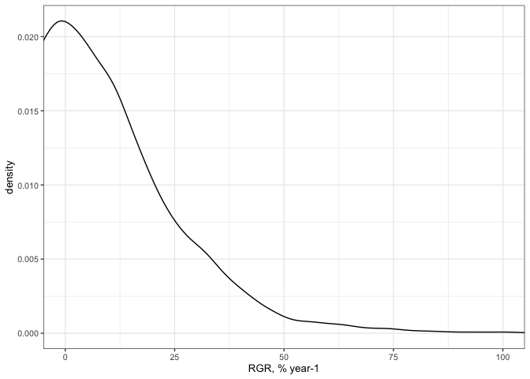
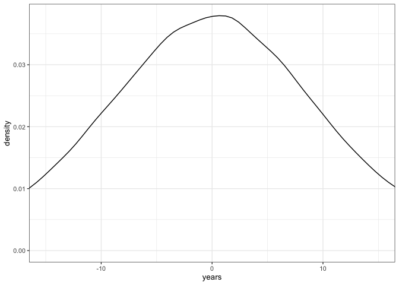

# Adjust growth model priors
eleanorjackson
2025-06-05

- [*k*](#k)
- [*A*](#a)
- [*delay*](#delay)

DBH is mm not cm, so we need to change the prior for *A*. I also think
we can do better with *k* now I know exactly how it translates to
relative growth rate.

``` r
library("tidyverse")
library("brms")
```

``` r
# old
priors2 <- c(
  prior(lognormal(5, 1.2), nlpar = "A", lb = 0),
  prior(student_t(5, 0, 1), nlpar = "k", lb = 0),
  prior(student_t(5, 0, 10), nlpar = "delay"))

# new
priors3 <- c(
  prior(lognormal(6, 1), nlpar = "A", lb = 0),
  prior(student_t(5, 0, 0.5), nlpar = "k", lb = 0),
  prior(student_t(5, 0, 10), nlpar = "delay"))
```

## *k*

Current prior:

``` r
rstudent_t(n = 1000, df = 5, mu = 0, sigma = 1) %>% 
  density() %>% 
  plot() 
```


Convert *k* to RGR

``` r
rstudent_t(n = 10000, df = 5, mu = 0, sigma = 1) %>% 
  as.tibble() %>% 
  mutate(rgr = (value / exp(1))*100) %>% 
  ggplot(aes(x = rgr)) +
  geom_density() +
  coord_cartesian(xlim = c(0,100))+
  xlab("RGR, % year-1")
```



New prior:

``` r
rstudent_t(n = 10000, df = 5, mu = 0, sigma = 0.5) %>% 
  as.tibble() %>% 
  mutate(rgr = (value / exp(1))*100) %>% 
  ggplot(aes(x = rgr)) +
  geom_density() +
  coord_cartesian(xlim = c(0,100)) +
  xlab("RGR, % year-1")
```


## *A*

Current prior:

``` r
rlnorm(n = 10000, meanlog = 5, sdlog = 1.2) %>% 
  as.tibble() %>% 
  ggplot(aes(x = value)) +
    geom_density() +
    coord_cartesian(xlim = c(0,2000))
```


New prior:

``` r
rlnorm(n = 100000, meanlog = 6, sdlog = 1) %>% 
  as.tibble() %>% 
  ggplot(aes(x = value)) +
  geom_density() +
  coord_cartesian(xlim = c(0,2000)) +
  xlab("DBH mm")
```


## *delay*

I don’t think we need to change the prior for *delay*

``` r
rstudent_t(n = 100000, df = 5, mu = 0, sigma = 10) %>% 
  as.tibble() %>% 
  ggplot(aes(x = value)) +
  geom_density() +
  coord_cartesian(xlim = c(-20, 20)) +
  xlab("years")
```


