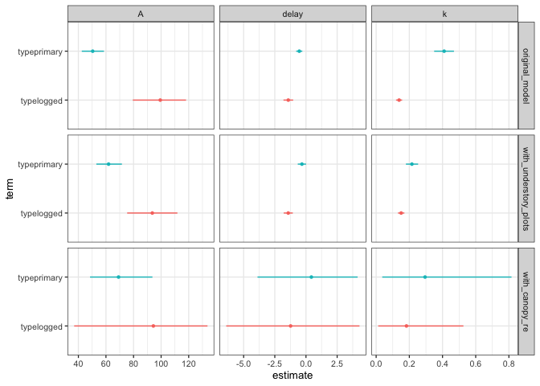
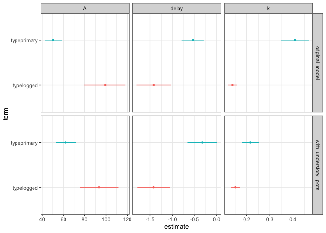
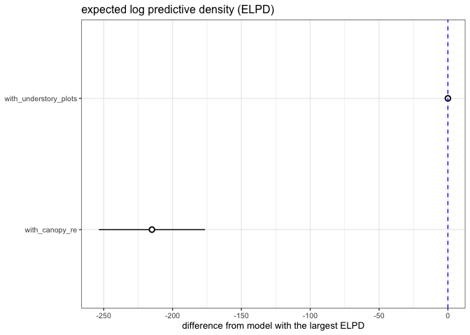

# Should we include understory plots? \#2
eleanorjackson
2025-06-04

- [Compare parameter estimates](#compare-parameter-estimates)
- [Compare fit](#compare-fit)

``` r
library("tidyverse")
library("tidybayes")
library("brms")
```

``` r
original_model <-
  readRDS(here::here("output", "models", "priors2",
                     "growth_model_base.rds"))

formula(original_model)
```

    dbase_mean ~ log(A) * exp(-exp(-(k * (years - delay)))) 
    A ~ 0 + forest_type + (0 + forest_type | genus_species) + (1 | plant_id)
    k ~ 0 + forest_type + (0 + forest_type | genus_species) + (1 | plant_id)
    delay ~ 0 + forest_type + (0 + forest_type | genus_species) + (1 | plant_id)

``` r
with_understory_plots <-
  readRDS(here::here("output", "models", "with_understory",
                     "growth_model_base.rds"))

formula(with_understory_plots)
```

    dbase_mean ~ log(A) * exp(-exp(-(k * (years - delay)))) 
    A ~ 0 + forest_type + (0 + forest_type | genus_species) + (1 | plant_id)
    k ~ 0 + forest_type + (0 + forest_type | genus_species) + (1 | plant_id)
    delay ~ 0 + forest_type + (0 + forest_type | genus_species) + (1 | plant_id)

``` r
with_canopy_re <-
  readRDS(here::here("output", "models", "with_understory",
                     "growth_model_base_canopy.rds"))

formula(with_canopy_re)
```

    dbase_mean ~ log(A) * exp(-exp(-(k * (years - delay)))) 
    A ~ 0 + forest_type + (0 + forest_type | genus_species) + (1 | plant_id) + (1 | canopy)
    k ~ 0 + forest_type + (0 + forest_type | genus_species) + (1 | plant_id) + (1 | canopy)
    delay ~ 0 + forest_type + (0 + forest_type | genus_species) + (1 | plant_id) + (1 | canopy)

## Compare parameter estimates

``` r
my_coef_tab <-
  bind_rows(
  list(
    original_model = broom.mixed::tidy(original_model), 
    with_understory_plots = broom.mixed::tidy(with_understory_plots),
    with_canopy_re = broom.mixed::tidy(with_canopy_re)
    ),
  .id = "model"
  ) %>% 
  filter(effect == "fixed") %>% 
  mutate(model = factor(model,
                        levels = c(
                          "original_model",
                          "with_understory_plots",
                          "with_canopy_re")))
```

``` r
my_coef_tab %>% 
  rowwise() %>% 
  mutate(term = str_replace(term, "secondary", "logged") ) %>% 
  mutate(parameter = pluck(strsplit(term,"_"),1,1)) %>% 
  mutate(term = pluck(strsplit(term,"_"),1,3)) %>% 
  ggplot(aes(y = term, x = estimate,
             xmin = conf.low,
             xmax = conf.high,
             col = ifelse(str_detect(term, "primary"), "pink", "blue"))) +
  geom_pointrange(fatten = 0.5) +
  facet_grid(model~parameter, scales = "free") +
  theme(legend.position = "none")
```



The model with canopy as a random effect did not fit well - might
explain the v wide credible intervals.

Dropping it in the following plot to get a closer look at the other 2.

``` r
my_coef_tab %>% 
  filter(model != "with_canopy_re") %>% 
  rowwise() %>% 
  mutate(term = str_replace(term, "secondary", "logged") ) %>% 
  mutate(parameter = pluck(strsplit(term,"_"),1,1)) %>% 
  mutate(term = pluck(strsplit(term,"_"),1,3)) %>% 
  ggplot(aes(y = term, x = estimate,
             xmin = conf.low,
             xmax = conf.high,
             col = ifelse(str_detect(term, "primary"), "pink", "blue"))) +
  geom_pointrange(fatten = 0.5) +
  facet_grid(model~parameter, scales = "free") +
  theme(legend.position = "none")
```



Comparing the original model to the model with the added understory
plots:

- Parameter estimates for the logged forest (SBE) are very similar
  between models, as expected since no more data was added for these
  seedlings
- Parameter estimates for the primary forest (Danum Valley)
  - *A* (predicted adult size) is reduced and closer to the logged
    forest estimate
  - *delay* (time at inflection of the growth curve) is similar
  - *k* (related to growth rate), is much reduced and closer to the
    logged forest estimate

## Compare fit

``` r
loo_compare(
  with_understory_plots,
  with_canopy_re
) %>% 
  data.frame() %>% 
  rownames_to_column(var = "model_name") %>% 
  ggplot(aes(x    = reorder(model_name, elpd_diff), 
             y    = elpd_diff, 
             ymin = elpd_diff - se_diff, 
             ymax = elpd_diff + se_diff)) +
  geom_pointrange(shape = 21, fill = "white") +
  coord_flip() +
  geom_hline(yintercept = 0, colour = "blue", linetype = 2) +
  labs(x = NULL, y = "difference from model with the largest ELPD", 
       title = "expected log predictive density (ELPD)") 
```



The model without canopy as a random effect has better out-of-sample
predictions.
