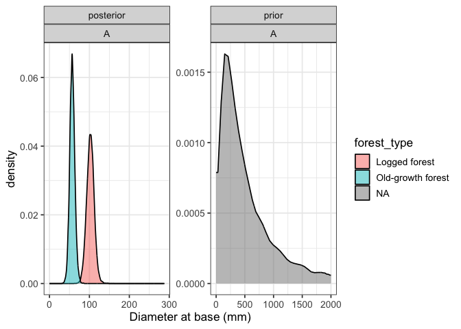

# Plotting priors vs posteriors for our growth model
eleanorjackson
2025-09-11

``` r
library("tidyverse")
library("tidybayes")
library("brms")
library("ggtext")
library("ggh4x")
```

``` r
mod_gro <-
  readRDS(here::here("output", "models", 
                     "growth_model_base_p3_allo.rds"))
```

``` r
prior_draws <- 
  prior_draws(mod_gro) %>% 
  select(contains("b_"))

post_draws <- 
  as_draws_df(mod_gro, variable = "^b_", regex = TRUE)

prior_post <- 
  bind_rows(prior = prior_draws, 
          posterior = post_draws,
          .id = "dist") %>% 
  pivot_longer(cols = contains("b_")) %>% 
  mutate(parameter = str_split_i(string = name, 
                                 pattern ="_", i = 2)) %>% 
  mutate(forest_type = case_when(
    grepl("logged", name) ~ "Logged forest",
    grepl("primary", name) ~ "Old-growth forest")) %>% 
  mutate(parameter = str_remove(string = parameter, 
                                 pattern ="logged")) %>% 
  mutate(parameter = str_remove(string = parameter, 
                                 pattern ="primary"))
```

``` r
pal <-
  c("Logged forest" = "#e69f00", "Old-growth forest" = "#009e73")

prior_post %>% 
  filter(value < 2500) %>% 
  filter(value > -50) %>% 
  mutate(dist = str_to_sentence(dist)) %>%
  mutate(dist = factor(dist, levels = c("Prior", "Posterior"))) %>%
  mutate(name = case_when(
    parameter == "A" ~ "<i>A</i>, Adult basal<br>diameter (mm)",
    parameter == "k" ~ "<i>k / e</i>, Maximum relative<br>growth rate (% year<sup>-1</sup>)",
    parameter == "delay" ~ "<i>delay</i>, Time to reach<br>max RGR (years)"
  )) %>%
  ggplot(aes(x = value, fill = forest_type)) +
  geom_density(alpha = 0.5) +
  ggh4x::facet_grid2(dist~name, scales = "free", independent = "all") +
  scale_fill_manual(values = pal) +
  theme(legend.position = "bottom",
        strip.text = element_markdown(),
        legend.title = element_blank())
```


``` r
prior_post %>% 
  filter(parameter == "A") %>% 
  ggplot(aes(x = value, fill = forest_type)) +
  geom_density(alpha = 0.5, bounds = c(0, 2000)) +
  facet_wrap(dist~parameter, scales = "free") +
  labs(x = "Diameter at base (mm)")
```



``` r
prior_post %>% 
  filter(parameter == "delay") %>% 
  ggplot(aes(x = value, fill = forest_type)) +
  geom_density(alpha = 0.5, bounds = c(-20, 20)) +
  facet_wrap(dist~parameter, scales = "free") +
  xlab("Years")
```


``` r
prior_post %>% 
  filter(parameter == "k") %>% 
  drop_na(value) %>% 
  rowwise() %>% 
  mutate(rgr = (value / exp(1))*100) %>% 
  ggplot(aes(x = rgr, fill = forest_type)) +
  geom_density(alpha = 0.5, bounds = c(0, 100)) +
  facet_wrap(dist~parameter, scales = "free") +
  xlab("Relative growth rate (% year-1)")
```


