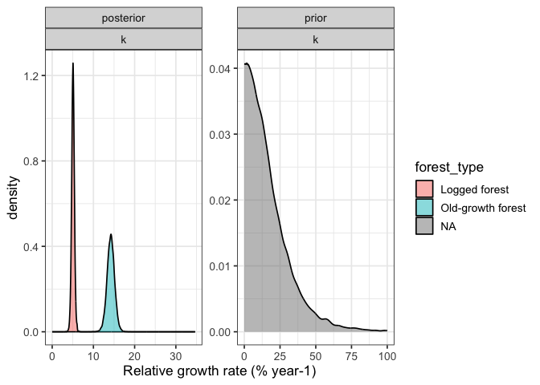

# Plotting priors vs posteriors for our growth model
eleanorjackson
2025-06-13

``` r
library("tidyverse")
library("tidybayes")
library("brms")
```

``` r
mod_gro <-
  readRDS(here::here("output", "models", 
                     "growth_model_base_p3.rds"))
```

``` r
prior_draws <- 
  prior_draws(mod_gro) %>% 
  select(contains("b_"))
  

post_draws <- 
  as_draws_df(mod_gro, variable = "^b_", regex = TRUE)

prior_post <- 
  bind_rows(prior = prior_draws, 
          posterior = post_draws,
          .id = "dist") %>% 
  pivot_longer(cols = contains("b_")) %>% 
  mutate(parameter = str_split_i(string = name, 
                                 pattern ="_", i = 2)) %>% 
  mutate(forest_type = case_when(
    grepl("logged", name) ~ "Logged",
    grepl("primary", name) ~ "Primary")) %>% 
  mutate(parameter = str_remove(string = parameter, 
                                 pattern ="logged")) %>% 
  mutate(parameter = str_remove(string = parameter, 
                                 pattern ="primary")) 
```

``` r
prior_post %>% 
  ggplot(aes(x = value, fill = forest_type)) +
  geom_density(alpha = 0.5) +
  facet_wrap(dist~parameter, scales = "free")
```


``` r
prior_post %>% 
  filter(parameter == "A") %>% 
  ggplot(aes(x = value, fill = forest_type)) +
  geom_density(alpha = 0.5, bounds = c(0, 2000)) +
  facet_wrap(dist~parameter, scales = "free") +
  labs(x = "Diameter at base (mm)")
```


``` r
prior_post %>% 
  filter(parameter == "delay") %>% 
  ggplot(aes(x = value, fill = forest_type)) +
  geom_density(alpha = 0.5, bounds = c(-20, 20)) +
  facet_wrap(dist~parameter, scales = "free") +
  xlab("Years")
```


``` r
prior_post %>% 
  filter(parameter == "k") %>% 
  drop_na(value) %>% 
  rowwise() %>% 
  mutate(rgr = (value / exp(1))*100) %>% 
  ggplot(aes(x = rgr, fill = forest_type)) +
  geom_density(alpha = 0.5, bounds = c(0, 100)) +
  facet_wrap(dist~parameter, scales = "free") +
  xlab("Relative growth rate (% year-1)")
```


