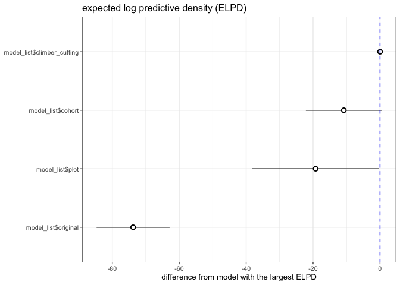

# Compare extra growth models
eleanorjackson
2025-06-17

Here I’m comparing models with added complexity in the model formula.

- Plot was added as a random effect `+ (1 | forest_type:plot)`
- Climber cutting as a fixed effect `+ climber_cut`
  - Can be `0` = no, or `1` = yes
- Cohort as a fixed effect `+ cohort`
  - Cohort is either `1` or `2`
- Canopy as a fixed effect `+ canopy`
  - `canopy` can be either understory `U`, gap `G` or logged `L`

``` r
library("tidyverse")
library("here")
library("patchwork")
library("brms")
library("broom.mixed")
```

``` r
file_names <- as.list(dir(path = here::here("output", "models", "grow-extra"),
                          full.names = TRUE))

file_names <- append(file_names,
                     here::here("output", "models", "growth_model_base_p3.rds"))

model_list <- map(file_names, readRDS, environment())

names(model_list) <- c("canopy",
                       "climber_cutting", 
                       "cohort", 
                       "plot", 
                       "original")
```

Leave-one-out cross-validation (LOO-CV) is a popular method for
comparing Bayesian models based on their estimated predictive
performance on new/unseen data.

Expected log predictive density (ELPD): If new observations are
well-accounted by the posterior predictive distribution, then the
density of the posterior predictive distribution is high and so is its
logarithm. So higher ELPD = better predictive performance.

``` r
comp <- loo_compare(model_list$climber_cutting,
                    model_list$cohort,
                    model_list$plot,
                    model_list$original,
                    criterion = "loo")

print(comp, digits = 3, simplify = FALSE)
```

                               elpd_diff  se_diff    elpd_loo   se_elpd_loo
    model_list$climber_cutting      0.000      0.000 -53728.989    325.844 
    model_list$cohort             -10.814     11.343 -53739.802    325.490 
    model_list$plot               -19.235     18.909 -53748.224    325.183 
    model_list$original           -73.779     10.908 -53802.768    328.750 
                               p_loo      se_p_loo   looic      se_looic  
    model_list$climber_cutting   5255.627    103.769 107457.978    651.689
    model_list$cohort            5253.264    104.431 107479.605    650.979
    model_list$plot              5212.621    104.125 107496.447    650.365
    model_list$original          5362.175    108.224 107605.536    657.500

``` r
loo_compare(model_list$climber_cutting,
            model_list$cohort,
            model_list$plot,
            model_list$original) %>% 
  data.frame() %>% 
  rownames_to_column(var = "model_name") %>% 
  ggplot(aes(x    = reorder(model_name, elpd_diff), 
             y    = elpd_diff, 
             ymin = elpd_diff - se_diff, 
             ymax = elpd_diff + se_diff)) +
  geom_pointrange(shape = 21, fill = "white") +
  coord_flip() +
  geom_hline(yintercept = 0, colour = "blue", linetype = 2) +
  labs(x = NULL, y = "difference from model with the largest ELPD", 
       title = "expected log predictive density (ELPD)") 
```



In the [loo package
documentation](https://mc-stan.org/loo/articles/online-only/faq.html#how-to-use-cross-validation-for-model-selection-)
they say:

> If elpd difference (`elpd_diff` in loo package) is less than 4, the
> difference is small [(Sivula, Magnusson and Vehtari,
> 2020)](https://doi.org/10.48550/arXiv.2008.10296)). If elpd difference
> is larger than 4, then compare that difference to standard error of
> `elpd_diff` (provided e.g. by loo package) [(Sivula, Magnusson and
> Vehtari, 2020)](https://doi.org/10.48550/arXiv.2008.10296).

``` r
loo_compare(model_list$original,
            model_list$cohort,
            model_list$plot,
            model_list$original,
            criterion = "loo") %>% 
  data.frame() %>% 
  rownames_to_column(var = "model_name") %>% 
  mutate(model_name = fct_reorder(model_name, p_loo, .desc = T)) %>% 
  ggplot(aes(y    = model_name, 
             x    = elpd_loo, 
             xmin = elpd_loo - se_elpd_loo, 
             xmax = elpd_loo + se_elpd_loo)) +
  geom_pointrange(shape = 21, fill = "white") +
  labs(y = "model", 
       x = "expected log predictive density (ELPD)") 
```


https://mc-stan.org/loo/reference/loo-glossary.html

## Compare parameter estimates

``` r
my_coef_tab <-
  tibble(fit = model_list,
         model = names(model_list)) %>%
  mutate(tidy = purrr::map(
    fit,
    tidy,
    parameters = c(
      "b_A_forest_typeprimary",
      "b_A_forest_typelogged",
      "b_k_forest_typeprimary",
      "b_k_forest_typelogged",
      "b_delay_forest_typeprimary",
      "b_delay_forest_typelogged"
    )
  )) %>%
  unnest(tidy)
```

``` r
my_coef_tab %>% 
  rowwise() %>% 
  mutate(parameter = pluck(strsplit(term,"_"),1,2)) %>% 
  mutate(forest_type = pluck(strsplit(term,"_"),1,4)) %>% 
  mutate(forest_type = str_remove(forest_type, "type")) %>% 
  ggplot(aes(x = forest_type, 
             y = estimate, 
             ymin = conf.low, ymax = conf.high)) +
  geom_pointrange(shape = 21, fill = "white") +
  labs(x = NULL,
       y = NULL) +
  coord_flip() +
  facet_grid(model~parameter, 
             scales = "free") 
```


These are the estimates of the posterior distribution with 95% credible
intervals based on quantiles.

``` r
my_vars <- c("b_A_forest_typeprimary", "b_A_forest_typelogged",
             "b_delay_forest_typeprimary", "b_delay_forest_typelogged",
             "b_k_forest_typeprimary", "b_k_forest_typelogged")

my_regex <- paste0(my_vars, collapse="|")

draws <-
  map(model_list,
           tidybayes::spread_draws, !!sym(my_regex), regex = TRUE) %>% 
  bind_rows(.id = "model") %>% 
  pivot_longer(cols = all_of(my_vars), 
               names_to = "var") %>% 
  rowwise() %>% 
  mutate(parameter = pluck(strsplit(var,"_"), 1, 2)) %>% 
  mutate(forest_type = pluck(strsplit(var,"_"),1,4)) %>% 
  mutate(forest_type = str_remove(forest_type, "type")) 

draws %>% 
  ggplot(aes(x = value, y = forest_type)) +
  tidybayes::stat_halfeye(normalize = "groups",
               point_interval = "mode_hdi") +
  facet_grid(model~parameter, scales = "free")
```


Here looking at the mode (point) and highest density interval (I think
sometimes preferred since they allow for skewed posterior
distributions).

The canopy model struggles. Kind of makes sense that it is confused, as
only one canopy type in the logged forest.
