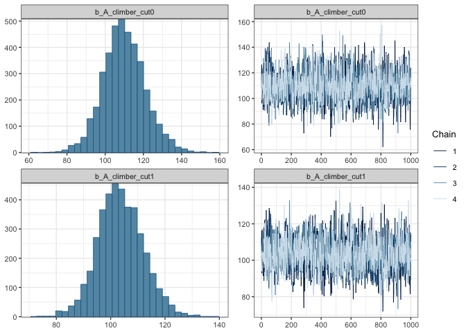
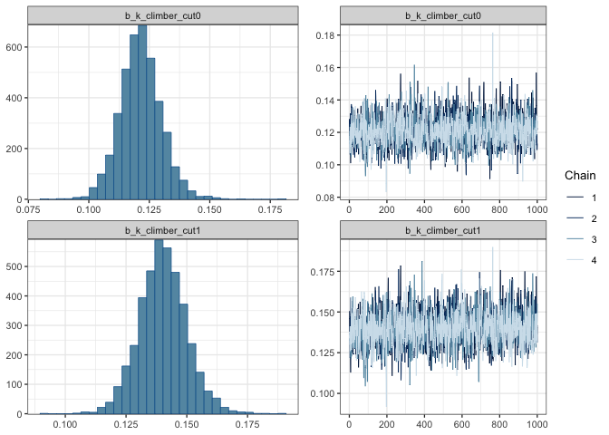
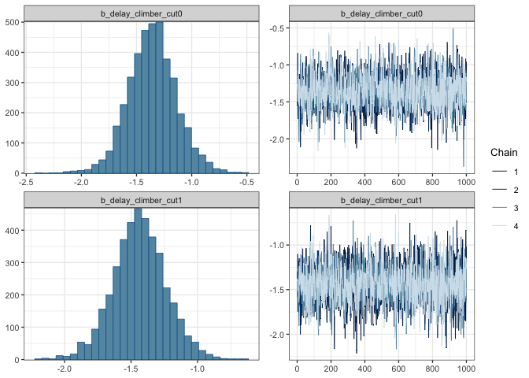
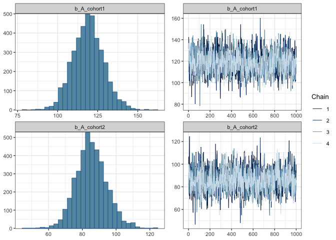
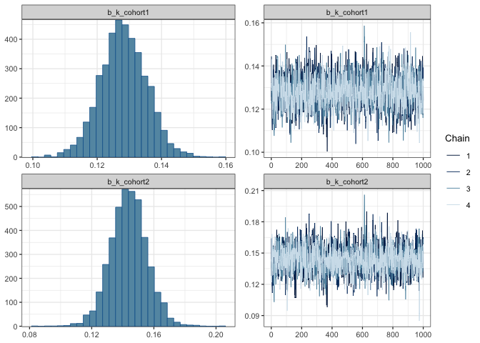
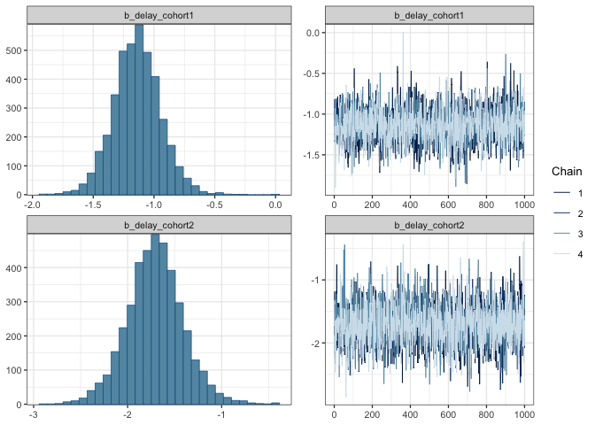
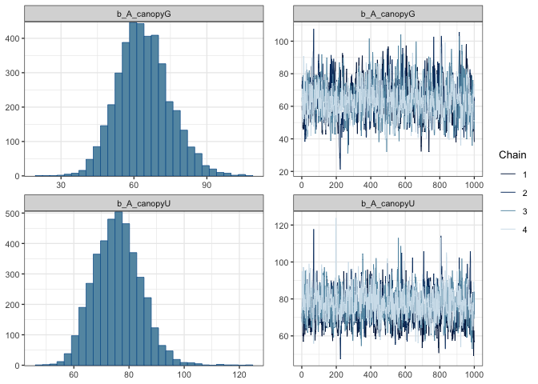
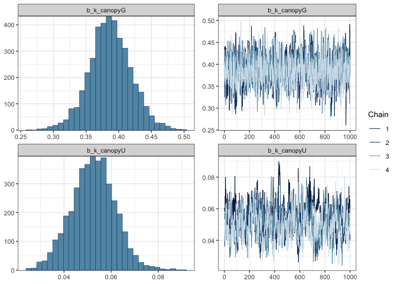
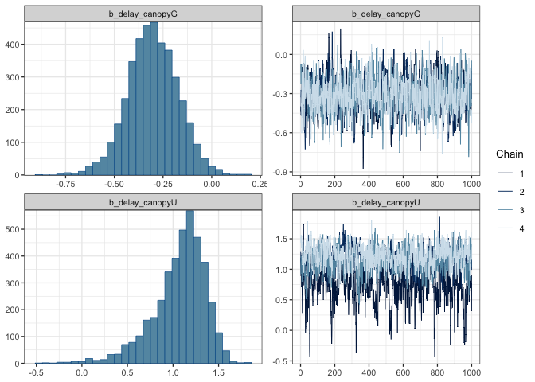

# Single forest growth models
eleanorjackson
2025-06-18

- [SBE - climber cut vs non-climber
  cut](#sbe---climber-cut-vs-non-climber-cut)
- [SBE - cohort one vs cohort two](#sbe---cohort-one-vs-cohort-two)
- [DV - understory vs gap](#dv---understory-vs-gap)

I fit some models with *either* the Danum Valley (old-growth, DV) *or*
Sabah Biodiversity Experiment (logged, SBE) data, in order to look at
how growth might respond to some variables which are only relevant to
one forest type.

``` r
library("tidyverse")
library("tidybayes")
library("brms")
```

``` r
mod_clim <- 
  readRDS(here::here("output", 
          "models", 
          "grow-extra-noft", 
          "growth_model_climber.rds"))

mod_cohort <- 
  readRDS(here::here("output", 
          "models", 
          "grow-extra-noft", 
          "growth_model_cohort.rds"))

mod_canopy <- 
  readRDS(here::here("output", 
          "models", 
          "grow-extra-noft", 
          "growth_model_canopy.rds"))
```

## SBE - climber cut vs non-climber cut

``` r
plot(mod_clim,
     variable = "^b_",
     ask = FALSE,
     regex = TRUE,
     newpage = FALSE,
     nvariables = 2)
```







Half of the six intensively censused SBE plots recieved a climber
cutting treatment (see [O’Brien *et al*
2019](https://doi.org/10.1111/1365-2664.13335)).

Estimated parameters look very similar between groups. Perhaps *k* a
little higher for seedlings in climber-cut plots.

## SBE - cohort one vs cohort two

``` r
plot(mod_cohort,
     variable = "^b_",
     ask = FALSE,
     regex = TRUE,
     newpage = FALSE,
     nvariables = 2)
```







Seedlings in cohort one were allegedly older at the time of planting out
into the forest, but the two groups actually had a similar initial size,
see
[2024-08-07_investigate-initial-size](2024-08-07_investigate-initial-size.md).
Likely however that the first cohort of seedlings were more pot-bound.

*A* is higher for the 1<sup>st</sup> cohort and *k* looks similar
between groups. Seedlings in the 2<sup>nd</sup> cohort reach max RGR a
little faster than seedlings in the 1<sup>st</sup> cohort (*delay*).

## DV - understory vs gap

``` r
plot(mod_canopy,
     variable = "^b_",
     ask = FALSE,
     regex = TRUE,
     newpage = FALSE,
     nvariables = 2)
```







In DV we have paired canopy gap and understory plots. (Although I only
use the gap plots in this project.)

This one did not fit so well. I got some Rhat warnings and you can see
the chains didn’t mix well for *delay*.

*k* and *A* both look higher in the understory, which is
counter-intuitive and not what the data looks like, see
[2025-05-28_understory-plots](2025-05-28_understory-plots.md).
