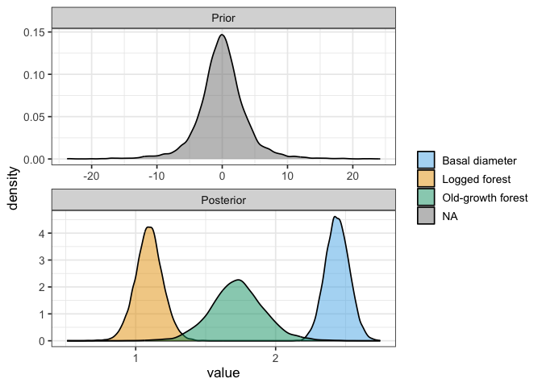

# Plotting priors vs posteriors for our survival model
eleanorjackson
2025-09-11

``` r
library("tidyverse")
library("tidybayes")
library("brms")
```

``` r
mod_surv <-
  readRDS(here::here("output", "models", "survival",
                     "survival_model_allo_nocenter.rds"))
```

``` r
prior_draws <- 
  prior_draws(mod_surv) %>% 
  select(contains("b"))
  
post_draws <- 
  as_draws_df(mod_surv, variable = "^b_", regex = TRUE)

prior_post <- 
  bind_rows(prior = prior_draws, 
          posterior = post_draws,
          .id = "dist") %>% 
  pivot_longer(cols = contains("b")) %>% 
  mutate(parameter = str_split_i(string = name, 
                                 pattern ="_", i = 2)) %>% 
  mutate(type = case_when(
    grepl("logged", name) ~ "Logged forest",
    grepl("primary", name) ~ "Old-growth forest",
    grepl("b_dbase_mean_sc", name) ~ "Basal diameter")) %>% 
  mutate(parameter = str_remove(string = parameter, 
                                 pattern ="logged")) %>% 
  mutate(parameter = str_remove(string = parameter, 
                                 pattern ="primary")) 
```

``` r
pal <-
  c("Logged forest" = "#e69f00", 
    "Old-growth forest" = "#009e73",
    "Basal diameter" = "#56B4E9")

prior_post %>% 
  filter(value > -25) %>% 
  filter(value < 25) %>% 
  mutate(dist = str_to_sentence(dist)) %>%
  mutate(dist = factor(dist, levels = c("Prior", "Posterior"))) %>%
  ggplot(aes(x = value, fill = type)) +
  geom_density(alpha = 0.5) +
  facet_wrap(~dist, scales = "free", ncol = 1) +
  scale_fill_manual(values = pal) +
  theme(legend.title = element_blank())
```


