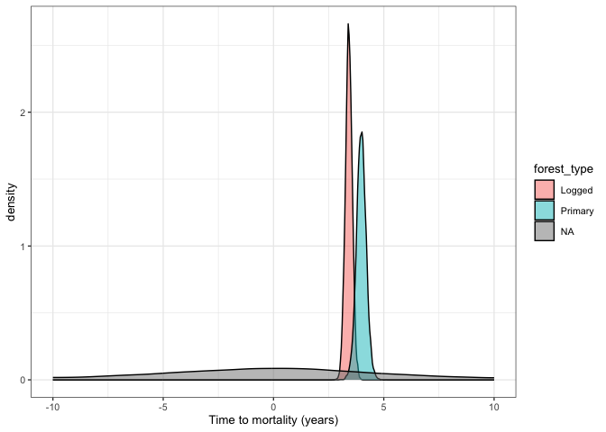
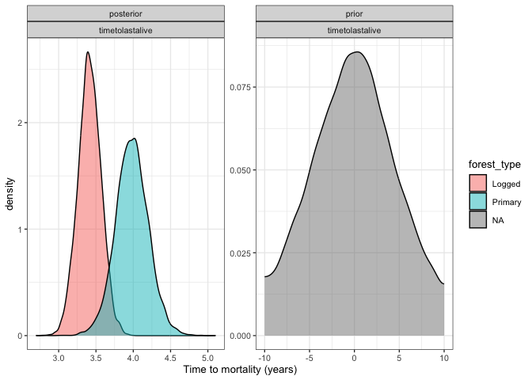

# Plotting priors vs posteriors for our survival model
eleanorjackson
2025-06-18

``` r
library("tidyverse")
library("tidybayes")
library("brms")
```

``` r
mod_surv <-
  readRDS(here::here("output", "models", "survival",
                     "survival_model_impute.rds"))
```

``` r
prior_draws <- 
  prior_draws(mod_surv) %>% 
  select(contains(c("b_", "bsp_")))
  

post_draws <- 
  as_draws_df(mod_surv, variable = "^b_", regex = TRUE)

prior_post <- 
  bind_rows(prior = prior_draws, 
          posterior = post_draws,
          .id = "dist") %>% 
  pivot_longer(cols = contains(c("b_", "bsp_"))) %>% 
  mutate(parameter = str_split_i(string = name, 
                                 pattern ="_", i = 2)) %>% 
  mutate(forest_type = case_when(
    grepl("logged", name) ~ "Logged",
    grepl("primary", name) ~ "Primary")) %>% 
  mutate(parameter = str_remove(string = parameter, 
                                 pattern ="logged")) %>% 
  mutate(parameter = str_remove(string = parameter, 
                                 pattern ="primary")) 
```

``` r
prior_post %>% 
  ggplot(aes(x = value, fill = forest_type)) +
  geom_density(alpha = 0.5) +
  facet_wrap(dist~parameter, scales = "free")
```


``` r
prior_post %>% 
  filter(parameter == "timetolastalive") %>% 
  ggplot(aes(x = value, fill = forest_type)) +
  geom_density(alpha = 0.5, bounds = c(-10, 10)) +
  labs(x = "Time to mortality (years)")
```



``` r
prior_post %>% 
  filter(parameter == "timetolastalive") %>% 
  ggplot(aes(x = value, fill = forest_type)) +
  geom_density(alpha = 0.5, bounds = c(-10, 10)) +
  facet_wrap(dist~parameter, scales = "free") +
  labs(x = "Time to mortality (years)")
```


