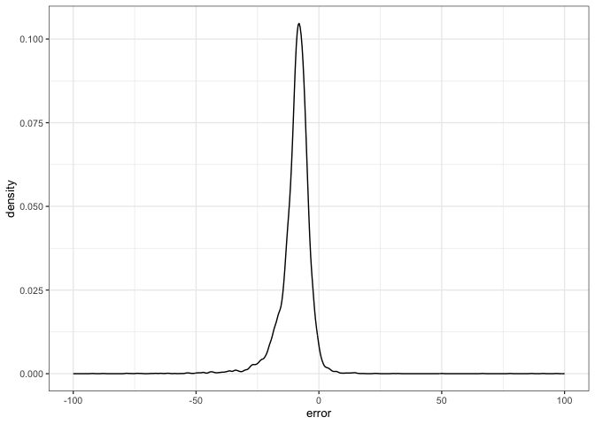

# Estimate basal diameter with allometry
eleanorjackson
2025-07-28

Mikey;

> I think imputing the base from DBH is not a problem, I just question
> the other way for seedlings less than 1.3 m (I agree reviewers will
> likely not like it). Chris Philipson, in his Science paper, has an
> equation based on many many trees for calculating the diameter at one
> height based on another height you can find it in the supplement). I
> used this in my 2022 paper in Proceedings as well. That may be a
> simple (and accepted) way to just get all the diameters at base from a
> known allometric equation, then just do not use the DBH.

``` r
library("tidyverse")
library("tidybayes")
```

``` r
data <- 
  readRDS(here::here("data", "derived", "data_cleaned.rds"))
```

Using the values in [Philipson *et al.*
2020](https://doi.org/10.1126/science.aay4490)

``` r
get_basal <- function(dbh, pom) {
  dbh /
    exp(-0.029 * (pom - 1))
}
```

``` r
data %>% 
  mutate(dbase_est = get_basal(dbh_mean, 1.3)) %>% 
  ggplot(aes(x = dbase_est, dbase_mean)) +
  geom_point(alpha = 0.5, shape = 16) +
  geom_abline(intercept = 0, colour = "red") +
  labs(y = "true basal diameter", 
       x = "estimated basal diameter")
```


``` r
data %>% 
  mutate(dbase_est = get_basal(dbh_mean, 1.3)) %>% 
  mutate(error = dbase_est-dbase_mean) %>% 
  ggplot(aes(x = error)) +
  geom_density() +
  xlim(-100, 100)
```


