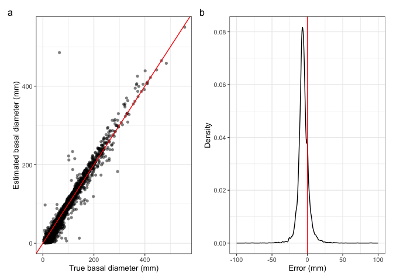
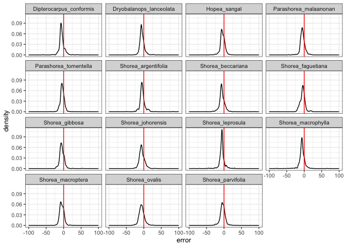

# Estimate basal diameter with allometry
eleanorjackson
2025-09-11

- [Species level optimisation](#species-level-optimisation)

Mikey:

> I think imputing the base from DBH is not a problem, I just question
> the other way for seedlings less than 1.3 m (I agree reviewers will
> likely not like it). Chris Philipson, in his Science paper, has an
> equation based on many many trees for calculating the diameter at one
> height based on another height you can find it in the supplement). I
> used this in my 2022 paper in Proceedings as well. That may be a
> simple (and accepted) way to just get all the diameters at base from a
> known allometric equation, then just do not use the DBH.

``` r
library("tidyverse")
library("patchwork")
```

``` r
data <- 
  readRDS(here::here("data", "derived", "data_cleaned.rds"))
```

The taper model in [Philipson *et al.*
2020](https://doi.org/10.1126/science.aay4490) comes from [Cushman *et
al.* 2014](https://doi.org/10.1111/2041-210X.12187).

For the taper parameter in the equation (*b1*), [Philipson *et al.*
2020](https://doi.org/10.1126/science.aay4490) use -0.029, I assume they
got this value by fitting to their own data.

But, let’s try it on our data:

``` r
get_basal <- function(dbh, pom, b1) {
  dbh /
    exp(b1 * (pom - 1))
}
```

``` r
data %>% 
  mutate(dbase_est = get_basal(dbh_mean, pom = 1.3, b1 = -0.029)) %>% 
  ggplot(aes(y = dbase_est, x = dbase_mean)) +
  geom_point(alpha = 0.5, shape = 16) +
  geom_abline(intercept = 0, colour = "red") +
  labs(x = "true basal diameter", 
       y = "estimated basal diameter") +
  
  data %>% 
  mutate(dbase_est = get_basal(dbh_mean, pom = 1.3, b1 = -0.029)) %>% 
  mutate(error = dbase_est-dbase_mean) %>% 
  ggplot(aes(x = error)) +
  geom_density() +
  geom_vline(xintercept = 0, colour = "red") +
  xlim(-100, 100)
```


Seems to underestimate basal diameter for our seedlings.

We can optimise to find the value which gives the lowest RMSE

``` r
get_rmse <- function(df, b1){
   
  # make predictions for basal diameter
  predictions <- 
    with(df, get_basal(dbh = dbh_mean, pom = 1.3, b1))
   
  # get model errors
  errors <- 
    with(df, dbase_mean - predictions)
   
  # return the rmse
  return( sqrt( sum(errors^2, na.rm = TRUE) / (length(errors)) ) )
   
}

get_rmse(df = data, b1 = -0.029)
```

    [1] 3.911765

``` r
optimiser_results <- 
  optim(
  method = "Brent",
  par = c(0),
  lower = -5,
  upper = 5,
  fn = function(x) {
    get_rmse(df = data, x[1])
  }
)

optimiser_results
```

    $par
    [1] -0.4194395

    $value
    [1] 3.337908

    $counts
    function gradient 
          NA       NA 

    $convergence
    [1] 0

    $message
    NULL

Optimising on our own data reduces RMSE by 0.520274 mm

``` r
data %>% 
  mutate(dbase_est = get_basal(dbh_mean, 
                               pom = 1.3, 
                               b1 = optimiser_results$par)) %>% 
  ggplot(aes(y = dbase_est, x = dbase_mean)) +
  geom_point(alpha = 0.5, shape = 16) +
  geom_abline(intercept = 0, colour = "red") +
  labs(x = "True basal diameter (mm)", 
       y = "Estimated basal diameter (mm)") +
  
  data %>% 
  mutate(dbase_est = get_basal(dbh_mean, 
                               pom = 1.3, 
                               b1 = optimiser_results$par)) %>% 
  mutate(error = dbase_est-dbase_mean) %>% 
  ggplot(aes(x = error)) +
  geom_density() +
  geom_vline(xintercept = 0, colour = "red") +
  xlim(-100, 100) +
  labs(x = "Error (mm)", 
       y = "Density") +
  
  plot_annotation(tag_levels = "a")
```



``` r
data %>% 
  mutate(dbase_est = get_basal(dbh_mean, 
                               pom = 1.3, 
                               b1 = optimiser_results$par)) %>% 
  ggplot(aes(y = dbase_est, x = dbase_mean)) +
  geom_point(alpha = 0.5, shape = 16) +
  geom_abline(intercept = 0, colour = "red") +
  labs(x = "true basal diameter", 
       y = "estimated basal diameter") +
  facet_wrap(~genus_species, scales = "free")
```


## Species level optimisation

``` r
get_optim <- function(data) {
  optimiser_results <- 
    optim(
    method = "Brent",
    par = c(0),
    lower = -2,
    upper = 2,
    fn = function(x) {
      get_rmse(df = data, x[1])
      }
    )
  return(as.data.frame(optimiser_results$par))
}
```

``` r
data_b1 <- 
  data %>% 
  drop_na(dbh_mean) %>%
  group_by(genus_species) %>%
  group_modify(~get_optim(.x)) %>% 
  right_join(data) %>% 
  rename(b1 = `optimiser_results$par`)
```

``` r
data_b1 %>% 
  ungroup() %>% 
  mutate(dbase_est = get_basal(dbh_mean, 
                               pom = 1.3, 
                               b1 = b1)) %>%
  ggplot(aes(y = dbase_est, x = dbase_mean)) +
  geom_point(alpha = 0.5, shape = 16) +
  geom_abline(intercept = 0, colour = "red") +
  labs(x = "true basal diameter", 
       y = "estimated basal diameter") +
  
  data_b1 %>% 
  mutate(dbase_est = get_basal(dbh_mean, 
                               pom = 1.3, 
                               b1 = b1)) %>% 
  mutate(error = dbase_est-dbase_mean) %>% 
  ggplot(aes(x = error)) +
  geom_density() +
  geom_vline(xintercept = 0, colour = "red") +
  xlim(-100, 100)
```


``` r
data_b1 %>% 
  ungroup() %>% 
  mutate(dbase_est = get_basal(dbh_mean, 
                               pom = 1.3, 
                               b1 = b1)) %>%
  ggplot(aes(y = dbase_est, x = dbase_mean)) +
  geom_point(alpha = 0.5, shape = 16) +
  geom_abline(intercept = 0, colour = "red") +
  labs(x = "true basal diameter", 
       y = "estimated basal diameter") +
  facet_wrap(~genus_species, scales = "free")
```


``` r
data_b1 %>% 
  ungroup() %>% 
  mutate(dbase_est = get_basal(dbh_mean, 
                               pom = 1.3, 
                               b1 = b1)) %>% 
  mutate(error = dbase_est-dbase_mean) %>% 
  ggplot(aes(x = error)) +
  geom_density() +
  xlim(-100, 100) +
  geom_vline(xintercept = 0, colour = "red") +
  facet_wrap(~genus_species)
```



RMSE using the species-level *b1* values:

``` r
data_b1 %>% 
  mutate(dbase_est = get_basal(dbh_mean, 
                               pom = 1.3, 
                               b1 = b1)) %>% 
  mutate(error = dbase_est-dbase_mean) %>% 
  ungroup() %>% 
  summarise(rmse_sp = 
              sqrt( sum(error^2, na.rm = TRUE) / (length(data_b1$dbh_mean)) ) )
```

    # A tibble: 1 × 1
      rmse_sp
        <dbl>
    1    3.24

RMSE **without** estimating per-species *b1* values:

``` r
optimiser_results$value
```

    [1] 3.337908

Optimising the taper parameter (*b1*) at the species-level reduces RMSE
by 0.105844.
