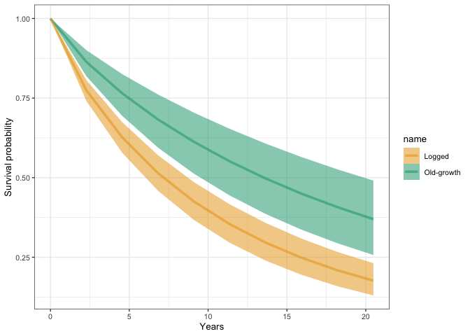
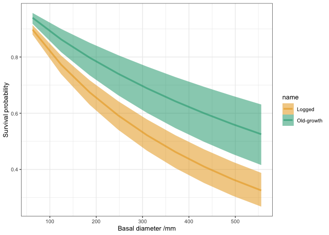
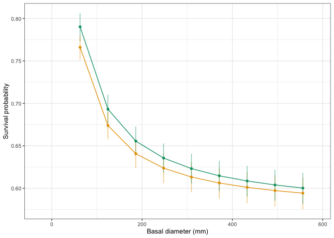
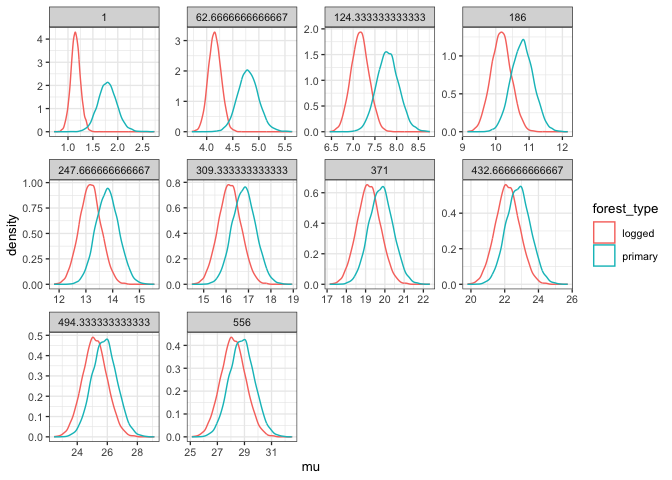
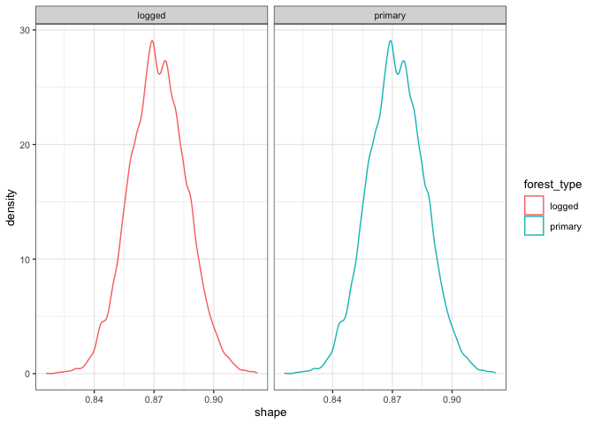
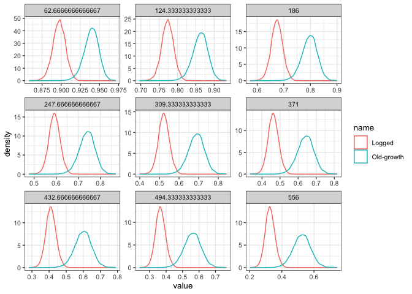
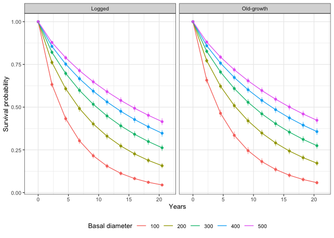

# Checking survival curves
eleanorjackson
2025-08-27

- [predict by time](#predict-by-time)
- [Method 1](#method-1)
- [Method 2](#method-2)
- [Vary time and size](#vary-time-and-size)

``` r
library("tidyverse")
library("patchwork")
library("tidybayes")
library("brms")
library("modelr")
```

``` r
data_surv <-
  readRDS(here::here("data", "derived", "data_survival.rds"))

mod_surv <-
  readRDS(here::here("output", "models", "survival",
                     "survival_model_allo.rds"))
```

``` r
scale_basal <- function(x) {
  (x - attr(data_surv$dbase_mean_sc, "scaled:center")) /
    attr(data_surv$dbase_mean_sc, "scaled:scale")
}

unscale_basal <- function(x) {
  x*attr(data_surv$dbase_mean_sc, "scaled:scale") +
    attr(data_surv$dbase_mean_sc, "scaled:center")
}
```

``` r
pal <-
  c("Logged" = "#e69f00", "Old-growth" = "#009e73")
```

> The Weibull probability density is parametrized in brms in terms of
> shape and scale parameter. Instead of directly modeling the scale (as
> done in many other time to event programs), brms models the mean of
> the Weibull distribution.

https://opensource.nibr.com/bamdd/src/02i_time_to_event.html#sec:tte-model-brms

https://mc-stan.org/docs/stan-users-guide/survival.html

https://cran.r-project.org/web/packages/brms/vignettes/brms_families.html#time-to-event-models

# predict by time

First, predict survival over time with fixed size

``` r
pred_df_sz <-
  data_surv %>%
  data_grid(time_to_last_alive =
              seq_range(time_to_last_alive, n = 10)) %>%
  mutate(.chain = 0) %>%
  mutate(shape = 0) %>%
  mutate(.draw = 0) %>%
  mutate(.iteration = 0) %>%
  mutate(b_forest_typelogged = 0) %>%
  mutate(b_forest_typeprimary = 0) %>% 
  mutate(b_dbase_mean_sc = scale_basal(100)) 
```

``` r
mcmc_df_sz <-
  mod_surv %>%
  spread_draws(b_forest_typelogged,
               b_forest_typeprimary,
               shape) %>%
  mutate(time_to_last_alive = 0) %>% 
  mutate(b_dbase_mean_sc = scale_basal(100)) 
```

``` r
curves_df_sz <-
  union(pred_df_sz, mcmc_df_sz) %>%
  expand(
    nesting(
      .chain,
      .iteration,
      .draw,
      b_forest_typelogged,
      b_forest_typeprimary,
      b_dbase_mean_sc,
      shape
    ),
    time_to_last_alive
  ) %>%
  filter (time_to_last_alive > 0) %>%
  filter (.draw > 0) %>%
  # survival curves
  mutate(`Old-growth` = exp(-(((time_to_last_alive - 0) /
                                 exp (b_forest_typeprimary))^shape))) %>%
  mutate(`Logged` = exp (-(((time_to_last_alive - 0) /
                              exp (b_forest_typelogged))^shape)))
```

``` r
curves_df_sz %>%
  pivot_longer(c(`Old-growth`, `Logged`)) %>%
  ggplot(aes(x = time_to_last_alive,
             y = value,
             colour = name,
             fill = name)) +
  stat_lineribbon (.width= .95, alpha = 0.5) +
  scale_fill_manual(values = pal) +
  scale_colour_manual(values = pal) +
  ylab("Survival probability") +
  xlab("Years")
```



# Method 1

Use the same method to predict over size

``` r
pred_df_sz <-
  data_surv %>%
  data_grid(b_dbase_mean_sc =
              seq_range(dbase_mean_sc, n = 10)) %>%
  mutate(.chain = 0) %>%
  mutate(shape = 0) %>%
  mutate(.draw = 0) %>%
  mutate(.iteration = 0) %>%
  mutate(b_forest_typelogged = 0) %>%
  mutate(b_forest_typeprimary = 0)
```

``` r
mcmc_df_sz <-
  mod_surv %>%
  spread_draws(b_forest_typelogged,
               b_forest_typeprimary,
               shape) %>%
  mutate(b_dbase_mean_sc = 0)
```

``` r
curves_df_sz <-
  union(pred_df_sz, mcmc_df_sz) %>%
  expand(
    nesting(
      .chain,
      .iteration,
      .draw,
      b_forest_typelogged,
      b_forest_typeprimary,
      shape
    ),
    b_dbase_mean_sc
  ) %>%
  filter (b_dbase_mean_sc > 0) %>%
  filter (.draw > 0) %>%
  # survival curves
  mutate(`Old-growth` = exp(-(((b_dbase_mean_sc - 0) /
                                 exp (b_forest_typeprimary))^shape))) %>%
  mutate(`Logged` = exp (-(((b_dbase_mean_sc - 0) /
                              exp (b_forest_typelogged))^shape)))
```

``` r
curves_df_sz %>%
  pivot_longer(c(`Old-growth`, `Logged`)) %>%
  ggplot(aes(x = unscale_basal(b_dbase_mean_sc),
             y = value,
             colour = name,
             fill = name)) +
  stat_lineribbon (.width= .95, alpha = 0.5) +
  scale_fill_manual(values = pal) +
  scale_colour_manual(values = pal) +
  ylab("Survival probability") +
  xlab("Basal diameter /mm")
```



# Method 2

``` r
surv_epred <-
  data_surv %>%
  data_grid(dbase_mean_sc = seq_range(dbase_mean_sc, n = 10),
            forest_type = c("logged", "primary")) %>%
  add_linpred_draws(object = mod_surv, ndraws = NULL, value = ".epred",
                  re_formula = NA, dpar = TRUE
  ) %>%
  rowwise() %>%
  mutate(scale = mu/gamma(1+(1/shape))) %>%
  mutate(surv = exp(-(dbase_mean_sc/scale)^shape)) %>%
  group_by(dbase_mean_sc, forest_type) %>%
  point_interval(surv,
                 .width = 0.95,
                 .point = median,
                 .interval = qi,
                 na.rm = TRUE) %>%
  rename(y_min = .lower,
         y_max = .upper,
         y_value = surv,
         x_value = dbase_mean_sc) %>%
  mutate(type = "survival")
```

``` r
surv_epred %>%
  mutate(x_value = unscale_basal(x_value)) %>%
  mutate(forest_type = case_when(
    grepl("logged", forest_type) ~ "Logged",
    grepl("primary", forest_type) ~ "Old-growth")) %>%
  ggplot(aes(x = x_value, y = y_value,
             ymin = y_min, ymax = y_max,
             colour = forest_type,
             fill = forest_type)) +
  geom_pointinterval(interval_alpha = 0.5, orientation = "x",
                     size = 0.75, show.legend = FALSE) +
  geom_line(show.legend = FALSE) +
  scale_fill_manual(values = pal) +
  scale_colour_manual(values = pal) +
  labs(x = "Basal diameter (mm)",
       y = "Survival probability")
```



mu changes with forest type and with size.

``` r
data_surv %>%
  data_grid(dbase_mean_sc = seq_range(dbase_mean_sc, n = 10),
            forest_type = c("logged", "primary")) %>%
  add_linpred_draws(object = mod_surv, ndraws = NULL, value = ".epred",
                  re_formula = NA, dpar = TRUE
  ) %>%
  ggplot(aes(x = mu, colour = forest_type)) +
  geom_density(alpha = 0.6) +
  facet_wrap(~unscale_basal(dbase_mean_sc), scales = "free")
```



Shape doesn’t change across forest type and size

``` r
data_surv %>%
  data_grid(dbase_mean_sc = seq_range(dbase_mean_sc, n = 10),
            forest_type = c("logged", "primary")) %>%
  add_linpred_draws(object = mod_surv, ndraws = NULL, value = ".epred",
                  re_formula = NA, dpar = TRUE
  ) %>%
  ggplot(aes(x = shape, colour = forest_type)) +
  geom_density(alpha = 0.6) +
  facet_wrap(~forest_type)
```



with the predictions from method 1, the difference between mu in the
different forest types doesn’t change with size.

``` r
curves_df_sz %>%
  pivot_longer(c(`Old-growth`, `Logged`)) %>% 
  ggplot(aes(x = value, colour = name)) +
  geom_density(alpha = 0.6) +
  facet_wrap(~unscale_basal(b_dbase_mean_sc), scales = "free")
```



# Vary time and size

``` r
surv_epred_t <-
  data_surv %>%
  data_grid(dbase_mean_sc = scale_basal(c(100, 200, 300, 400, 500)),
            forest_type = c("logged", "primary"),
            time_to_last_alive = seq_range(time_to_last_alive, n = 10)) %>%
  add_linpred_draws(object = mod_surv, ndraws = NULL, value = ".epred",
                  re_formula = NA, dpar = TRUE
  ) %>%
  rowwise() %>%
  mutate(scale = mu/gamma(1+(1/shape))) %>%
  mutate(surv = exp(-(time_to_last_alive/scale)^shape)) %>%
  group_by(time_to_last_alive, dbase_mean_sc, forest_type) %>%
  point_interval(surv,
                 .width = 0.95,
                 .point = median,
                 .interval = qi,
                 na.rm = TRUE) %>%
  rename(y_min = .lower,
         y_max = .upper,
         y_value = surv,
         x_value = time_to_last_alive) %>%
  mutate(type = "survival")
```

``` r
surv_epred_t %>%
  mutate(`Basal diameter` = as.factor(round(unscale_basal(dbase_mean_sc)))) %>%
  mutate(forest_type = case_when(
    grepl("logged", forest_type) ~ "Logged",
    grepl("primary", forest_type) ~ "Old-growth")) %>%
  ggplot(aes(x = x_value, y = y_value,
             ymin = y_min, ymax = y_max,
             colour = `Basal diameter`,
             fill = `Basal diameter`)) +
  geom_pointinterval(interval_alpha = 0.5, orientation = "x",
                     size = 0.75, show.legend = FALSE) +
  geom_line() +
  labs(x = "Years",
       y = "Survival probability") +
  facet_wrap(~forest_type) +
  theme(legend.position = "bottom")
```


