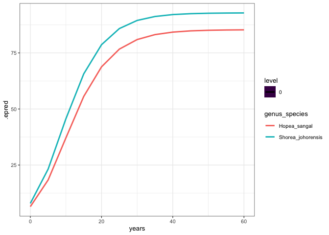

# Visualise growth curves with different trait values
eleanorjackson
2025-09-03

- [SLA](#sla)
- [Wood density](#wood-density)

``` r
library("tidyverse")
library("patchwork")
library("tidybayes")
library("brms")
library("modelr")
```

``` r
growth_model <- readRDS(here::here("output",
                                   "models",
                                   "growth_model_base_p3_allo.rds"))

data <-
  readRDS(here::here("data", "derived", "data_cleaned.rds"))

alive_trees <-
  data %>%
  filter(survival == 1) %>%
  filter(! if_all(c(dbh_mean, dbase_mean), is.na))

well_sampled_alive_trees <-
  alive_trees %>%
  group_by(plant_id) %>%
  summarise(n = n()) %>%
  filter(n > 2)

growth_data <-
  alive_trees %>%
  filter(plant_id %in% well_sampled_alive_trees$plant_id)
```

``` r
traits_both <-
  readxl::read_excel(
    here::here(
      "data",
      "raw",
      "traits",
      "Both_tree_functional_traits_subset RV.xlsx"
    ),
    sheet = 4,
    skip = 6,
    na = c("", " ", "NA")
  ) %>%
  mutate(Species =
           str_replace(species, "\\.", "_")) %>%
  select(tree_id, Species, forest_type, location,
         WD_NB, LA_cm2_mean, dry_weight_mg_mean) %>%
  filter(forest_type == "OG") %>%
  filter(Species %in% data$genus_species) %>%
  mutate(LA_mm2_mean = LA_cm2_mean * 100) %>% # make units match TRY data
  mutate(sla = LA_mm2_mean / dry_weight_mg_mean) %>%
  group_by(Species) %>%
  summarise(sla = median(sla, na.rm = TRUE),
            wood_density = median(WD_NB, na.rm = TRUE))

traits_both
```

    # A tibble: 10 × 3
       Species                   sla wood_density
       <chr>                   <dbl>        <dbl>
     1 Dryobalanops_lanceolata  9.66        0.623
     2 Hopea_sangal             9.40        0.650
     3 Parashorea_malaanonan    8.77        0.478
     4 Parashorea_tomentella    9.87        0.553
     5 Shorea_gibbosa          10.3         0.483
     6 Shorea_johorensis       10.4         0.425
     7 Shorea_leprosula         8.38        0.454
     8 Shorea_macroptera       10.6         0.480
     9 Shorea_ovalis            7.74        0.569
    10 Shorea_parvifolia       10.9         0.506

## SLA

*Shorea ovalis* has the lowest SLA and *Shorea macroptera* the 2nd
highest.

``` r
preds <- 
  data_grid(growth_data,
            genus_species,
            years = seq(0, 60, 5),
            forest_type = "logged") %>%
  filter(genus_species %in% c("Shorea_ovalis", "Shorea_macroptera")) %>% 
  add_epred_draws(growth_model,
                  re_formula = ~ (0 + forest_type | genus_species))

ggplot() +
  stat_lineribbon(data = preds,
                  aes(x = years, y = .epred, colour = genus_species),
                  .width = 0,
                  linewidth = 1) 
```


*Shorea ovalis* (blue) should have high A, low rate, high delay.

## Wood density

*Shorea johorensis* has the lowest wood density and *Hopea sangal* the
highest.

``` r
preds <- 
  data_grid(growth_data,
            genus_species,
            years = seq(0, 60, 5),
            forest_type = "logged") %>%
  filter(genus_species %in% c("Shorea_johorensis", "Hopea_sangal")) %>% 
  add_epred_draws(growth_model,
                  re_formula = ~ (0 + forest_type | genus_species))

ggplot() +
  stat_lineribbon(data = preds,
                  aes(x = years, y = .epred, colour = genus_species),
                  .width = 0,
                  linewidth = 1) 
```



*Shorea johorensis* (blue) should have high A, low rate, low delay
