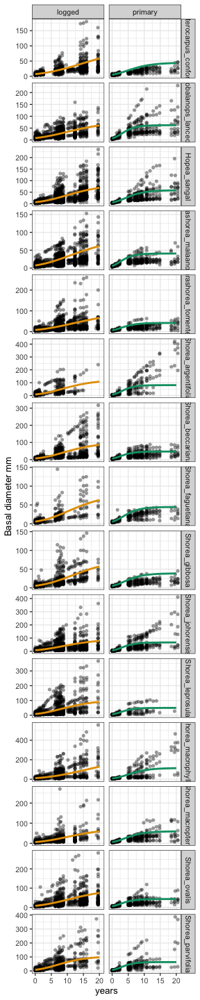
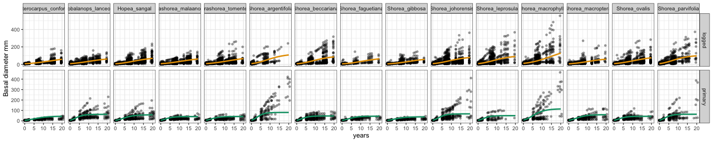
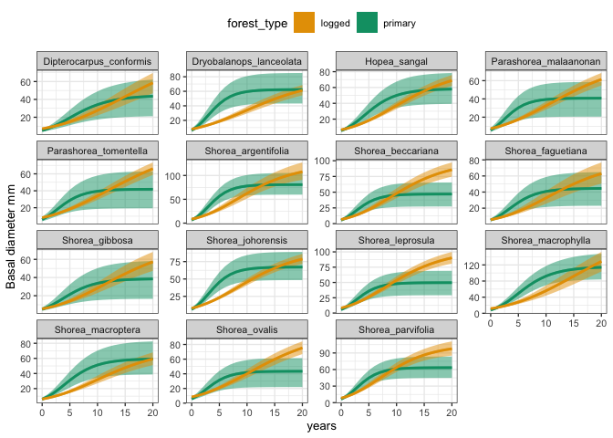

# Visualise growth fits per species
eleanorjackson
2025-09-03

``` r
library("tidyverse")
library("patchwork")
library("tidybayes")
library("brms")
library("modelr")
```

``` r
growth_model <- readRDS(here::here("output",
                                   "models",
                                   "growth_model_base_p3_allo.rds"))

data <-
  readRDS(here::here("data", "derived", "data_cleaned.rds"))

alive_trees <-
  data %>%
  filter(survival == 1) %>%
  filter(! if_all(c(dbh_mean, dbase_mean), is.na))

well_sampled_alive_trees <-
  alive_trees %>%
  group_by(plant_id) %>%
  summarise(n = n()) %>%
  filter(n > 2)

growth_data <-
  alive_trees %>%
  filter(plant_id %in% well_sampled_alive_trees$plant_id)
```

``` r
preds <- 
  data_grid(growth_data,
            genus_species,
            years = 0:20,
            forest_type = c("primary", "logged")) %>%
  add_epred_draws(growth_model,
                  re_formula =
                    `log(A)` ~ 0 + forest_type|genus_species,
                    k ~ 0 + forest_type|genus_species,
                    delay ~ 0 + forest_type|genus_species)
```

``` r
pal <-
  c("logged" = "#e69f00", "primary" = "#009e73")

ggplot() +
  geom_point(data = growth_data, 
             aes(x = years, y = dbase_mean),
             alpha = 0.4,
             shape = 16,
             show.legend = FALSE) +
  stat_lineribbon(data = preds,
                  aes(x = years, y = .epred, colour = forest_type),
                  .width = 0,
                  linewidth = 1,
                  show.legend = FALSE) +
  facet_grid(genus_species~forest_type,
             scale = "free_y") +
  scale_fill_manual(values = pal) +
  scale_colour_manual(values = pal) +
  labs(y = "Basal diameter mm")
```



``` r
ggplot() +
  geom_point(data = growth_data, 
             aes(x = years, y = dbase_mean),
             alpha = 0.4,
             shape = 16,
             show.legend = FALSE) +
  stat_lineribbon(data = preds,
                  aes(x = years, y = .epred, colour = forest_type),
                  .width = 0,
                  linewidth = 1,
                  show.legend = FALSE) +
  facet_grid(forest_type~genus_species,
             scale = "free_y") +
  scale_fill_manual(values = pal) +
  scale_colour_manual(values = pal) +
  labs(y = "Basal diameter mm")
```



``` r
ggplot() +
  stat_lineribbon(data = preds,
                  aes(x = years, y = .epred,
                      colour = forest_type,
                      fill = forest_type),
                  .width = 0.95,
                  linewidth = 1, 
                  alpha = 0.5) +
  stat_lineribbon(data = preds,
                  aes(x = years, y = .epred,
                      colour = forest_type,
                      fill = forest_type),
                  .width = 0,
                  linewidth = 1) +
  facet_wrap(~genus_species,
             scale = "free_y") +
  scale_fill_manual(values = pal) +
  scale_colour_manual(values = pal) +
  labs(y = "Basal diameter mm") +
  theme(legend.position = "top")
```


